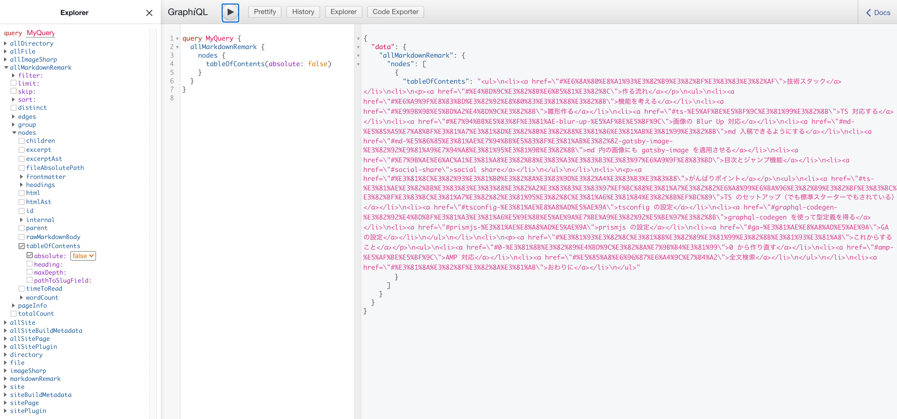

Blog を作りました！！！！！
会社を辞めて 5 ヶ月経とうとしており、ついに堕落しきった生活による危機感が生まれはじめました。
その危機感が結実したものがこの Blog です。

で、Blog を作ってみたものの書く内容が特にないので、まずはこのブログをどうやって作ったかについて書きます。
「こういう記法にちゃんと対応できてる？」を試す目的でもあります。

## 技術スタック

根幹になっているものは、

- [TypeScript](https://www.typescriptlang.org/)
- [Gatsby](https://www.gatsbyjs.org/)

です。

元々は [amdx](https://github.com/mizchi/amdx) + [NextJS](https://nextjs.org/), もしくは完全自作 SSG を考えていたのですが、 **ブログは完璧を目指しているといつまでも完成しない** ということは知っているので、自分にとって自信があるツールとして Gatsby を選びました。

しかし、ただ使うだけなのはチャレンジ性がなかったので、TypeScript を使ってみることにしました。
昔の Gatsby には TypeScript サポートが充実していなかった(特に Page に型を付けるのが大変で、型注釈を書いて信じるしか無かった)のですが、いまは graphql-codegen を活用すればできそうでしたので挑戦しました。

スタイリングは CSS Module を使っています。styled-components も考えたのですが、plugin があるとはいえ静的ビルド時のパフォーマンスに確証を持てないところがあったので、採用しませんでした。そもそも動的な状態によってスタイルが変わる場面があまりなかったので、CSS Module で十分と予想しました。CSS Module は Gatsby の Built in なので環境構築もいらないところも採用理由です。ソースコードのハイライトは [prismjs](https://prismjs.com/) でやってます。

## どのようにして作ったか

Gatsby + TypeScript で ブログを作るときに大事になりそうな箇所をかいつまんで解説します。
Gatsby とはそもそもなんぞやという方は [公式サイト](https://www.gatsbyjs.org/) を見ると良いでしょう。
ドキュメントがとても親切に整備されています。（自分も驚きました・・・）

### 機能を考える

まず Blog の機能を考える上で、以下の 3 つの Blog を参考にしました。

- [mizchi.dev](https://mizchi.dev/)
  - mizchi さんは、技術文書をアウトプットする仕組みについて一番詳しい方だと思っているので、mizchi さんのやりかたに従うことから始めました。
- [blog.uhy.ooo](https://blog.uhy.ooo/)
  - TS + Gatsby の組み合わせで作られていたので、TypeScript 採用で詰まったときのリファレンスとして参考にしていました。実際に TOC コンポーネントの設計や tsconfing の設定時に参考にしました。
- [blog.jxck.io](https://blog.jxck.io/)
  - 長く技術ブログを続けていらっしゃっており、ずっと読まれている方なので、このブログにある機能は揃えた方が良いだろうな考えました。

具体的には、Blog に付ける機能として、

- 目次(ToC)機能
  - 読みやすいように追従
  - 共有可能なリンクを作る
- syntax hilight
- Github 連携
  - 修正を PR で出せるような仕組み
  - 執筆履歴の生成(時間なくていまは諦めている)
- 全文検索(未実装)
  - Google のカスタム検索(1st scope)
  - Algolia を使った全文検索(2nd scope)

などを考えました。

デザインは、

- [AMP templates](https://amp.dev/documentation/templates/simple_blog/?format=websites)
  - 最終的には AMP でブログを作りたいので、AMP Valid な CSS で実現できるデザインとして強く意識しました。
- [Medium](https://medium.com/)
  - Blog としての体験が個人的に好きなため真似ました。とくに 画像を Blur で出す機能が好きです。（これは gatsby-image も提供しており、こちらはパフォーマンス上の利点もあります。)

を参考にしました。

またこだわる点として、

- 入稿は Markdown
  - 今の実装やスタックがベストでないことは最初からわかっていたので、最初からこの Blog を移行する前提で作っています。文章のポータビリティを考えると、Markdown での入稿をできるようにしたしたいです。
- 剥がしやすいか
  - 移行することが前提になっているので、再利用可能性や全体感の掴みやすさを意識しています。TypeScript の採用はその手段の一つでもあります。

を意識しました。

### 雛形を作る

`gatsby new hoge` とすればアプリケーションを作れます。
このときオプションを指定すれば TypeScript 対応の starter なども使えますが、私は使いませんでした。
使わなくても今の Gatsby はデフォルトで TypeScript 対応されています。
ただそのデフォルト機能では、十分な型推論を効かせられないので手作業する部分もあります。

### TypeScript 対応する

これまでの Gatsby は TypeScript との相性が少し悪かったです。
Gatsby はビルド時にファイルシステムや外部 Store にあるリソースを Source として手元に持ってきて、静的ビルドのプロセスに含めることができます。

開発時に開発者と Gatsby のビルドシステム間では GraphQL を使って必要なデータを宣言できるのですが、これまではビルド時に使うデータと、UI に渡されるデータの間で型の連携を図ることができていませんでした。もちろん GraphQL の schema から 型定義を吐ける [GraphQL Code Generator](https://graphql-code-generator.com/)を使えばできていたとは思うのですが、これを Gatsby と連携させる例は見ていなかったです。

それが今では [gatsby-plugin-graphql-codegen](https://github.com/d4rekanguok/gatsby-typescript/tree/master/packages/gatsby-plugin-graphql-codegen) としてお手軽に使えるようになりました。config に挿せば 自動で Pages の`props.data` や useStaticQuery の返り値の型をを得られます。積極的に使って行きましょう。

```javascript:title=gatsby-config.js
module.exports = {
  ...,
  plugins: [
  ...,
    {
      resolve: "gatsby-plugin-graphql-codegen",
      options: {
        fileName: `types/graphql-types.d.ts`,
      },
    },
  ],
}
```

```javascript:title=layout.tsx
import * as React from "react"
import { useStaticQuery, graphql } from "gatsby"
import { SiteTitleQuery } from "../../types/graphql-types"

const Layout: React.FC<{ data: SiteTitleQuery }> = ({ children }) => {
  // ビルド時に SiteTitleQuery という型が生成される
  const data = useStaticQuery(graphql`
    query SiteTitle {
      site {
        siteMetadata {
          title
        }
      }
    }
  `)

  return (
    <>
      <Header siteTitle={data.site.siteMetadata.title} />
      ...
    </>
  )
}

export default Layout
```

### 画像の Blur Up 対応

Medium が一番分かりやすいと思うのですが、画像が「ぶわぁっ」って出るサイト見たことありませんか？


例)

- https://medium.com/workshop-me/traced-svg-images-for-excellent-ux-d75a6bb4caed
- https://using-gatsby-image.gatsbyjs.org/

Gatsby が提供するライブラリの [gatsby-image](https://www.gatsbyjs.org/packages/gatsby-image/) にもそれを実現する機能があり、しかもパフォーマンス面で有利になるため採用します。
gatsby-image のそれは **Traced SVG** と呼ばれており、画像のロードがされるまではサイズが小さい SVG を表示させておき、それを本体の画像が load されたときに切り替えることで初回ロードを早められます。
gatsby-image はその trace される SVG を Build 時に作ります。
それが [sharp](https://github.com/lovell/sharp) です。
おそらく Gatsby を経験されたことは sharp という文字で「あぁ！あれ！」となったかもしれません。
そうです、開発ビルドが急に落ちたときのエラーメッセージに書かれているアレです。

gatsby-image は他にも様々な画像最適化機能を提供しており、たとえば

- サイズ・解像度を最適化
- デバイスサイズにあった画像を複数種類生成
- meta data の削除
- Traced SVG

を行います。

もちろん Traced SVG 以外の機能は人間が手運用で頑張れば解決できる問題ですが、この仕組みのおかげで Gatsby は大きい画像を不用意に利用しても最適な画像を吐き出してくれます。
画像を扱うのなら入れておいた方が良いと私は考えており、この Blog でも画像を使っているので採用しています。
（ただあまりにも記事が多くでビルド時間が長くなるなら採用しない方が良い場合もあります。）

```javascript:title=gatsby-config.js
module.exports = {
  ...,
  plugins: [
    ...
    `gatsby-transformer-sharp`,
    `gatsby-plugin-sharp`,
    ...
  ],
}
```

```javascript:title=blogTemplate.tsx
import * as React from "react"
import { graphql } from "gatsby"
import Image from "gatsby-image"
import { BlogTemplateQuery } from "../../types/graphql-types"

interface IProps {
  data: BlogTemplateQuery;
}

export default function Template({ data }: IProps) {
  return (
    <Layout>
      <>
        ...
        {markdownRemark.frontmatter.visual?.childImageSharp?.fluid && (
          <Image
            fluid={markdownRemark.frontmatter.visual.childImageSharp.fluid}
          />
        )}
        ...
      </>
    </Layout>
  )
}
export const pageQuery = graphql`
  query BlogTemplate($path: String!) {
    markdownRemark(frontmatter: { path: { eq: $path } }) {
      html
      frontmatter {
        visual {
          childImageSharp {
            fluid(maxWidth: 800) {
              ...GatsbyImageSharpFluid
            }
          }
        }
      }
    }
  }
`
```

### md 入稿できるようにする

入稿は Markdown で行います。
Markdown processor である [remark](https://remark.js.org/) を parser に持つ、 [gatsby-transformer-remark](https://github.com/gatsbyjs/gatsby/tree/master/packages/gatsby-transformer-remark)を使います。
このツールによって parse された Markdown は GraphQL によって html や hast として取り出せるようになります。


これを使うためには `gatsby-transformer-remark` の設定を gatsby-config.js に書けばいいのですが、私の `gatsby-transformer-remark` は plugin が盛り盛りでそう単純な話でもないです。
**※ Gatsby Plugin に Plugin を指していることに注意**

```javascript:title=gatsby-config.js
module.exports = {
  ...,
  plugins: [
  ...,
    {
      resolve: `gatsby-transformer-remark`,
      options: {
        plugins: [
          // NOTE: title を前におく必要あり
          {
            resolve: "gatsby-remark-code-titles",
            options: {},
          },
          {
            resolve: `gatsby-remark-prismjs`,
            options: {
              classPrefix: "language-",
              inlineCodeMarker: null,
              aliases: {},
              showLineNumbers: true,
              noInlineHighlight: false,
              languageExtensions: [
                {
                  language: "superscript",
                  extend: "javascript",
                  definition: {
                    superscript_types: /(SuperType)/,
                  },
                  insertBefore: {
                    function: {
                      superscript_keywords: /(superif|superelse)/,
                    },
                  },
                },
              ],
              prompt: {
                user: "root",
                host: "localhost",
                global: false,
              },
            },
          },
          `gatsby-remark-autolink-headers`,
          {
            resolve: `gatsby-remark-images`,
            options: {
              maxWidth: 590,
            },
          },
        ],
      },
    },
  ],
}
```

これらプラグインについては以下で解説します。

#### Markdown 内の画像にも gatsby-image を適用させる

gatsby-transformer-remark に gatsby-remark-images を使えば gatsby-image の効果を Markdown 内の画像にも適用させられます。
これまで gatsby-image を使う上で 指定していた GraphQL のクエリオプションの一部はこの config でセットできます。

```javascript:title=gatsby-config.js
module.exports = {
  ...,
  plugins: [
  ...,
    {
      resolve: `gatsby-transformer-remark`,
      options: {
        plugins: [
          ...
          {
            resolve: `gatsby-remark-images`,
            options: {
              maxWidth: 590,
            },
          },
        ],
      },
    },
  ],
}
```

#### 目次とジャンプ機能

目次は少しこだわりました。
構造化されている文章は読みやすい文章です。
文章が読むのが苦手な私にとってはその文自体が良い文章だったとしても、全体の構造が見えないとなかなか文意が掴めなかったりします。
そのため**文の構成をいつでも確認できるインターフェース**にしたいと思って色々と考えました。
なので、PC では目次を sticky, Mobile では opener を hover させるなどの工夫をしています。

目次自体は [gatsby-transformer-remark](https://www.gatsbyjs.org/packages/gatsby-transformer-remark/)から生成可能です。
取得可能な GraphQL Scheme が提供されています。



また目次にジャンプ（リンク）機能も付けました。
これは比較的長い文章をシェアされたときの使い勝手を向上させるためです。
だれかに文章を共有したいときにその読んで欲しいところをマークできる機能でもあります。
目次をクリックしたときに URL に#がついていると思います。
この#を付ける機能も plugin で実現可能で、 gatsby-transformer-remark に [gatsby-remark-autolink-headers](https://www.gatsbyjs.org/packages/gatsby-remark-autolink-headers/) を使います。

```javascript:title=gatsby-config.js
module.exports = {
  ...,
  plugins: [
  ...,
    {
      resolve: `gatsby-transformer-remark`,
      options: {
        plugins: [
          ...,
          `gatsby-remark-autolink-headers`,
          ...
        ],
      },
    },
  ],
}
```

## がんばりポイント

作る上で時間を溶かした場所を解説します。

### tsconfig の設定

デフォルトでの Gatsby は、 [babel-plugin-transform-typescript](https://babeljs.io/docs/en/babel-plugin-transform-typescript) を利用して Transpile します。
そのため 型検査はされないので、こちらで行う必要があります。
つまり tsc でビルドしないため、tsconfig は型検査目的で書いていきます。

私の設定はこれです。

```json:title=tsconfig.json
{
  "compilerOptions": {
    "target": "ESNext",
    "strict": true,
    "skipLibCheck": true,
    "forceConsistentCasingInFileNames": true,
    "jsx": "preserve",
    "allowSyntheticDefaultImports": true,
    "moduleResolution": "node"
  },
  "include": ["src/**/*.ts", "src/**/*.tsx"]
}
```

target に ESNext を指定している理由は、Gatsby それ自体の設定がそうなっているからで、この tsconfig で型検査に通ったソースコードは、Gatsby の中の Babel も解釈してくれるであろうと思っているからです。
この設定次第で lib の default 値も変わってくるので、使っているライブラリによっては型検査に失敗します。
型検査に影響しそうなものは全部公式の設定に揃えておこうと思い、公式とお揃いの ESNext にしました。

jsx に preserve を指定しているのは Gatsby が Babel を使っているということは多段ビルドをするはずで、実際 Gatsby 自体の設定もそうなっていたので、揃えておこうかというくらいの気持ちです。
ここは何に設定しても、型検査**は**動くと思います。

skipLibCheck は true にしています。
Library 側で型エラーがあったときにそこでなにか対応したり、型定義ファイルを継ぎ足すのがめんどくさいのでそうしています。
これはどっちに設定するのが正解なのかイマイチわかっていないのですが、個人ブログだし厳密にやらなくてもいっかという気持ちで true にしました。

**moduleResolution は "node" にしてください。**
そうしないとおそらく gatsby や gatsby-image などの import でエラーが出るはずです。
target が ESNext だと、module のデフォルト設定が ES6 になり、moduleResolution のデフォルト設定が classic になります。gatsby は本体に型定義ファイルが含まれるので、clasic だと module を見つけることができません。
TypeScript の module 解決の仕組みを完全に正しく説明しようとすると長くなるので、こちらを参照してください。

- https://www.typescriptlang.org/docs/handbook/module-resolution.html
- https://www.typescriptlang.org/docs/handbook/compiler-options.html

### SEO 対策

GoogleAnalytics などの Tracking もそうなのですが、Gatsby の SEO や Marketing 対策の情報があまり出てこないので、すこし手間取りました。
GA に関しては 色々書きたいことが多いので別の記事に切り出しますが、Search Console 周りについては書きます。
クロール用にサイトマップや個別 URL を送信するために行うことです。

#### Sitemap

[gatsby-plugin-sitemap](https://www.gatsbyjs.org/packages/gatsby-plugin-sitemap/) でビルド時にサイトマップを生成できます。
生成したらそれを Search Console から送信してください。

```javascript:title=gatsby-config.js
module.exports = {
  ...,
  plugins: [
  ...,
    {
      resolve: `gatsby-plugin-sitemap`,
      ...
    },
  ],
}
```

#### Robots.txt

Search Console でのカバレッジがもし悪ければ、robots.txt で改善できる可能性もあります。
そのための robots.txt も Gatsby で生成できます。
それは [gatsby-plugin-robots-txt](https://www.gatsbyjs.org/packages/gatsby-plugin-robots-txt/) で生成できます。

```javascript:title=gatsby-config.js
module.exports = {
  ...,
  plugins: [
  ...,
    {
      {
        resolve: "gatsby-plugin-robots-txt",
        options: {
          host: "https://blog.ojisan.io",
          sitemap: "https://blog.ojisan.io/sitemap.xml",
          env: {
            development: {
              policy: [{ userAgent: "*", disallow: ["/"] }],
            },
            production: {
              policy: [{ userAgent: "*", allow: "/" }],
            },
          },
        },
      },
      ...
    },
  ],
}
```

Gatsby は元になる HTML を拡張する場所がないので既存の設定方法をどうしたらいいかで悩みがちですが、大抵のことは Plugin が行ってくれます。

もしくは、gatsby-browser.js を使うのも手です。
gatsby-browser.js は respond to actions within the browser, and wrap your site in additional components. とあり、Client Side での実行時に何かしらの hook を書けるファイルです。
Next.js の \_app.js みたいなものです。

### prismjs の設定

ソースコードに syntax hilight を付ける機能です。
Gatsby では plugin を入れる

```javascript:title=gatsby-config.js
module.exports = {
  ...,
  plugins: [
    {
      resolve: `gatsby-transformer-remark`,
      options: {
        plugins: [
          ...,
          {
            resolve: `gatsby-remark-prismjs`,
            options: {
              classPrefix: "language-",
              inlineCodeMarker: null,
              aliases: {},
              showLineNumbers: true,
              noInlineHighlight: false,
              languageExtensions: [
                {
                  language: "superscript",
                  extend: "javascript",
                  definition: {
                    superscript_types: /(SuperType)/,
                  },
                  insertBefore: {
                    function: {
                      superscript_keywords: /(superif|superelse)/,
                    },
                  },
                },
              ],
              prompt: {
                user: "root",
                host: "localhost",
                global: false,
              },
            },
          },
        ],
      },
    },
  ],
}
```

だけでは済まないという話を今からします。

prismjs にはいくつかテーマがあるので、その CSS を import する必要があります。

```javascript:title=gatsby-browser.js
require("prismjs/themes/prism-coy.css")
require("prismjs/plugins/line-numbers/prism-line-numbers.css")
```

僕は青色が好きなので coy を入れました。
また、行数表示もしたいので、その行数用の CSS を入れます。
しかしこの行数用の CSS は何か size がずれていたり、prism 自体が Mobile 対応されていないので、いくつかユーザー側で書き換える必要があります。
そこでユーザー定義の CSS も作り、独自で読み込みます。

```javascript:title=gatsby-browser.js
require("prismjs/themes/prism-coy.css")
require("prismjs/plugins/line-numbers/prism-line-numbers.css")
require("./src/vendor/css/code.css")
```

私が足した CSS はこのようなものです。

```css:title=code.css
.gatsby-code-title {
  color: #ffffff;
  background: #368ccb;
  font-size: 0.75rem;
  font-family: SFMono-Regular, Menlo, Monaco, Consolas, "Liberation Mono",
    "Courier New", monospace;
  letter-spacing: 0.075em;
  line-height: 1;
  text-align: left;
  border-radius: 4px 4px 0px 0px;
  padding: 0.25rem 0.5rem;
  display: inline-block;
  margin-left: 1em;
  margin-bottom: 0px !important;
}

.line-numbers-rows {
  width: 3.6em !important;
  background-color: white;
}

pre[class*="language-"] {
  margin: 0;
}
```

無理やりスタイルを合わせるために `!importatnt` を使っています。（まあ個人ブログだしいっかというあきらめでそうしているだけです。推奨される行為ではない。）
どのような CSS が良いかわかっておらず、最適なものを解説できる自信がないのでここでは触れませんが、このようにユーザー側で CSS を書き換えて頑張って対応しましょう。
その読み取り口は gatsby-browser.js です。

### Deploy

Netlify にデプロイしています。
カスタムドメインも 1click, HTTPS 対応も 1click でとても楽でした。
ただ CNAME 設定の時に www を付けるべきかという話で、どういう時に www を付けないといけないかがよくわかっておらず、この辺はあとで勉強しようとおもいます。
まずは動けばいいということで一旦デプロイしています。

FYI: https://www.netlify.com/blog/2017/02/28/to-www-or-not-www/

## これからすること

### 0 から作り直す

ほらーっやっぱりそんなことする！一生ブログが完成しないやつ！！😡😡😡😡

頑張ったものの、 やってることは md を HTML に変換しているだけなので、「Gatsby 使う必要ないじゃん」っていうのが今のお気持ちです。
もっと薄く作れるのではないかと思っています。

ただ Gatsby を剥がそうと勉強すればするほど、その利便性に気付き、特に gatsby-image は強力で、やらかしがちなボトルネックを取り除いてくれるので、そこまでの実力がない自分にとっては G
atsby が最速になるのかなと思っています。

**Gatsby は 最適化がとても難しい [Compiler](https://www.gatsbyjs.org/blog/2017-09-13-why-is-gatsby-so-fast/) だといういうのが自分の認識です。**

### AMP 対応

可能な限りいろんなものに対応させたいので AMP 対応はやりたいです。
~~AMP は無料で使える CDN なので~~、PWAMP(PWA + AMP)構成 で初回はエッジから返して、二回目からは Cache から返して爆速みたいなことをやりたいです。

AMP 対応を考えると、Gatsby が吐く HTML は amp valid ではなく、一方で Next.js は [AMP Optimizer](https://github.com/ampproject/amp-toolbox/tree/master/packages/optimizer) が使えるので乗り換え先としてみています。
もちろん Amp Optimizer を埋め込んだ Gatsby Plugin を書くという手もあるのですが、これはかなり大変そうなので乗り気ではないです。

### 全文検索

Algolia でシャッと実装します。

## おわりに

Blog を作ったところなので、これからはゲームばっかりせずに頑張って修行します！！！
しばらくはこのブログを改善しつつ、就活用のアウトプット記事をたくさん書いて行きます。
[Civ6](https://www.epicgames.com/store/ja/product/sid-meiers-civilization-vi/home) も [Factorio](https://store.steampowered.com/app/427520/Factorio/?l=japanese) もやりません！！！
