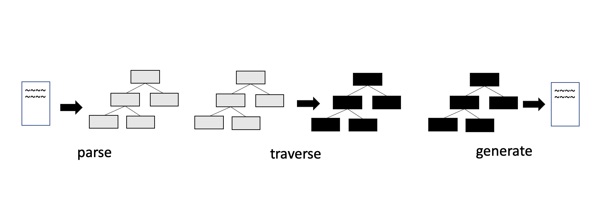

Babel のソースコード変換において、「ソースコードを AST に変換した後に、AST から AST へ変換し、その AST をコードに戻している」という話は聞いたことがあるでしょうか？
どうやら公式ドキュメントからはそのような説明を見つけられないのですが、識者的にはそうらしいです。

とはいえ自分としてはあまり信じられなく、というのも Babel はソースコードを入れたら ES5 を吐く魔法の箱という認識が強いからです。
そこで Babel を読んでみて、そのような変換をしているのか確かめてみたいと思います。
