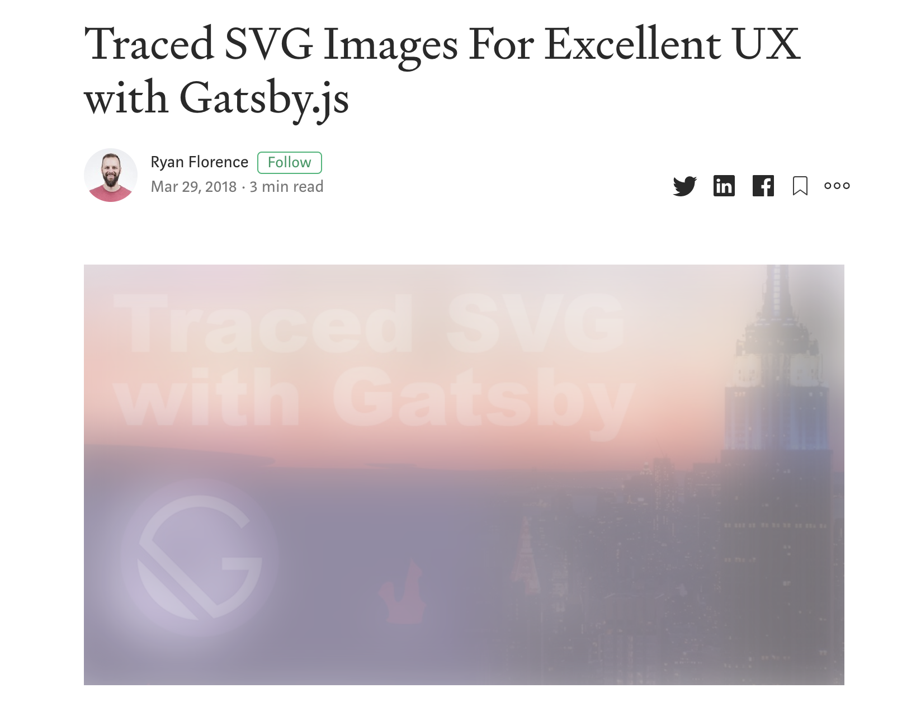
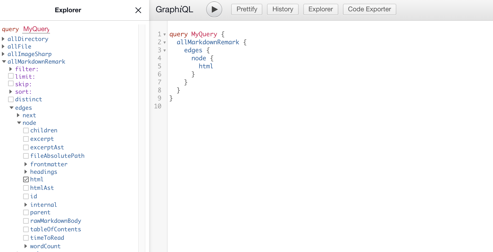
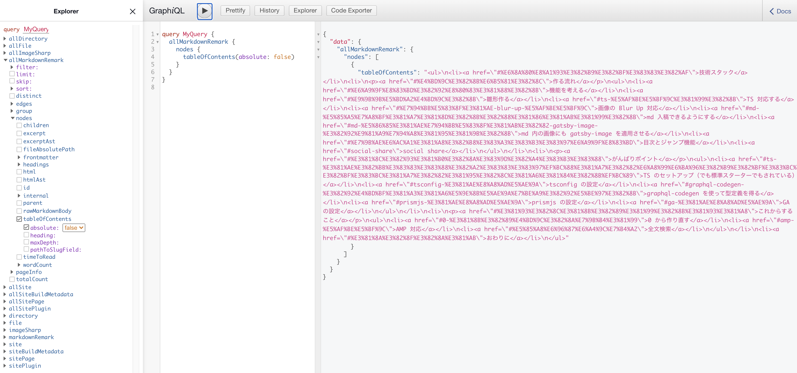

Blog を作りました！！！！！
もうすぐ会社を辞めて 5 ヶ月経つのですが、「空白期間に修行して圧倒的成長 💪」とか言ってたのに、いまでは堕落しきって何もやれていなくて、その危機感がすごいです。
そしてその危機感が結実してこの Blog が誕生しました。

で、Blog を作ってみたものの書く内容が特にないので、まずはこのブログをどうやって作ったかについて書きます。
「こういう記法にちゃんと対応できてる？」を試す目的でもあります。

## 技術スタック

根幹になっているものは、

- [TypeScript](https://www.typescriptlang.org/)
- [Gatsby](https://www.gatsbyjs.org/)

です。

元々は [amdx](https://github.com/mizchi/amdx) + [NextJS](https://nextjs.org/), もしくは完全自作 SSG を考えていたのですが、 **ブログは完璧を目指しているといつまでも完成しない** ということは知っているので、自分にとって自信があるツールとして Gatsby を選びました。

しかし、ただ使うだけなのはチャレンジ性がなかったので、TypeScript を使ってみることにしました。
昔は Gatsby には TS サポートが全然なかった(特に page に型を付けるのが型注釈を書いて信じるしか無かった)のですが、いまは頑張ればできます。キービジュアルにネタバレがあるのですが、codegen を使います。

スタイリングは CSS Modules でやっています。styled-components も考えたのですが、静的ビルド時のパフォーマンスチューニングに確証を持てないところがあったので、採用しませんでした。ソースコードのハイライトは [prismjs](https://prismjs.com/) でやってます。

## どのようにして作ったか

ブログを作るときに大事になりそうな箇所をかいつまんで解説します。
Gatsby とはそもそもなんぞやという方は [公式サイト](https://www.gatsbyjs.org/) を見ると良いでしょう。
ドキュメントがとても親切に整備されています。（自分も驚きました・・・）

### 機能を考える

以下の 3 つの blog を参考にしました。

- [mizchi.dev](https://mizchi.dev/)
  - 技術文書をアウトプットする仕組みに一番詳しい方だと思っているので、mizchi さんのやりかたに従うことから始めました。
- [blog.uhy.ooo](https://blog.uhy.ooo/)
  - TS + Gatsby の組み合わせで作られています。TOC コンポーネントの設計や型エラーがあったときの正解例として参考にしました。
- [blog.jxck.io](https://blog.jxck.io/)
  - 長く技術ブログを続けていらっしゃる方なので、ブログに必要な機能を洗い出すときに参考にしました。

Blog に付ける機能としては、

- 目次(ToC)機能
  - 読みやすいように追従
  - 共有可能なリンクを作る
- syntax hilight
- Github 連携
  - 修正を PR で出せるような仕組み
  - 執筆履歴の生成(時間なくていまは諦めている)
- 全文検索(未実装)
  - Google のカスタム検索(1st scope)
  - Algolia を使った全文検索(2nd scope)

などを考えました。

デザインは,

- [amp starters](https://amp.dev/documentation/templates/simple_blog/?format=websites)
  - 当初は Pure な AMP でブログを作る予定で、いまの段階では諦めているものの最終的には AMP へと移行させたいので AMP Valid な CSS で実現できるデザインとして強く意識しました。
- [Medium](https://medium.com/)
  - Blog としての体験が個人的に好きだから真似ました。とくに 画像を Blur で出す機能が好きです。（これは gatsby-image も提供しており、こちらはパフォーマンス上の利点もあります。)

を参考にしました。

またこだわる点として、

- 入稿は Markdown
  - この構成がベストでないことは最初からわかっていたので、移行する前提で作っています。文章のポータビリティを考えて、Markdown での入稿を前提にしました。
- 剥がしやすいか
  - 移行するときに、再利用可能なものは再利用したいので、全体感が掴みやすく剥がしやすいかということを意識しています。TypeScript の採用はその手段の一つでもありました。

を意識しました。

### 雛形作る

`gatsby new hoge` とすればアプリケーションを作れます。
このときオプションを指定すれば TS 対応の starter なども使えますが、使っていません。
使わなくても今の Gatsby はデフォルトで対応されていそうな雰囲気があります。
ただそのデフォルト機能や starter 機能では、十分な型推論を効かせられないので手作業で作業していきます。

### TS 対応する

これまでの Gatsby は TypeScript との相性がちょっと悪かったです。
Gatsby はビルド時にファイルシステムや外部 Store にあるリソースを Source として手元に持ってきて、静的ビルドのプロセスに含めることができます。

> Data in Gatsby sites can come from anywhere: APIs, databases, CMSs, local files, etc.

FYI: https://www.gatsbyjs.org/tutorial/part-five/#source-plugins

このときデータの取得は開発者と Gatsby のビルドシステム間では GraphQL を使って、必要なデータを宣言できるのですが、ビルド時に使うデータと、UI に渡されるデータの間で型の連携を図ることができていませんでした。

もちろん GraphQL の schema から 型定義を吐ける [GraphQL Code Generator](https://graphql-code-generator.com/)を使えばできていたとは思うのですが、これを Gatsby と連携させる例は見ていなかったです。

でも、それが今では [gatsby-plugin-graphql-codegen](https://github.com/d4rekanguok/gatsby-typescript/tree/master/packages/gatsby-plugin-graphql-codegen) としてお手軽に使えるようになりました。config に挿せば 自動で Pages の`props.data` や useStaticQuery の返り値の型をを得られます。積極的に使って行きましょう。

```javascript:title=gatsby-config.js
module.exports = {
  ...,
  plugins: [
  ...,
    {
      resolve: `gatsby-transformer-remark`,
      options: {
        plugins: [
          ...,
          {
            resolve: "gatsby-plugin-graphql-codegen",
            options: {
              fileName: `types/graphql-types.d.ts`,
            },
          }
        ],
      },
    },
  ],
}
```

```javascript:title=layout.tsx
import * as React from "react"
import { useStaticQuery, graphql } from "gatsby"
import { SiteTitleQuery } from "../../types/graphql-types"

const Layout: React.FC<{ data: SiteTitleQuery }> = ({ children }) => {
  const data = useStaticQuery(graphql`
    // ビルド時に SiteTitleQuery という型が生成される
    query SiteTitle {
      site {
        siteMetadata {
          title
        }
      }
    }
  `)

  return (
    <>
      <Header siteTitle={data.site.siteMetadata.title} />
      ...
    </>
  )
}

export default Layout
```

### 画像の Blur Up 対応

Medium が一番分かりやすいと思うのですが、画像が「ぶわぁっ」って出るサイト見たことありませんか？



例)

- https://medium.com/workshop-me/traced-svg-images-for-excellent-ux-d75a6bb4caed
- https://using-gatsby-image.gatsbyjs.org/

Gatsby もそれをやる機能があり、しかもパフォーマンス目的でやっています。
Gatsby のそれは traced svg と呼ばれており、画像のロードがされるまではサイズが小さい SVG を表示させておき、それを本体の画像が load されたときに切り替える機能です。
gatsby-image はその trace される SVG を Build 時に作ります。
それが [sharp](https://github.com/lovell/sharp) です。
おそらく Gatsby を経験されたことは sharp という文字で　「あぁ！あれ！」となったことでしょう。
そうです、開発ビルドが急に落ちるときに出てくるエラーメッセージに書かれているアレです。

Gatsby は [gatsby-image](https://www.gatsbyjs.org/packages/gatsby-image/) としてその機能が提供されています。gatsby-image は他にも様々な画像最適化機能を定期ようしており、たとえば

- サイズ・解像度を最適化
- デバイスサイズにあった画像を複数種類生成
- meta data の削除
- traced svg

です。

もちろん traced svg 以外は人間が手運用で頑張れば解決できる問題ですが、Gatsby は大きい画像を突っ込んでもそのような手作業せずに最適な画像を吐き出してくれます。画像を扱うのなら入れておいた方が良いです。この Blog でも画像を使っているので採用しています。

```javascript:title=gatsby-config.js
module.exports = {
  ...,
  plugins: [
    ...
    `gatsby-transformer-sharp`,
    `gatsby-plugin-sharp`,
    ...
  ],
}
```

```javascript:title=blogTemplate.tsx
import * as React from "react"
import { graphql } from "gatsby"
import Image from "gatsby-image"
import { BlogTemplateQuery } from "../../types/graphql-types"

interface IProps {
  data: BlogTemplateQuery;
}

export default function Template({ data }: IProps) {
  return (
    <Layout>
      <>
        ...
        {markdownRemark.frontmatter.visual?.childImageSharp?.fluid && (
          <Image
            fluid={markdownRemark.frontmatter.visual.childImageSharp.fluid}
          />
        )}
        ...
      </>
    </Layout>
  )
}
export const pageQuery = graphql`
  query BlogTemplate($path: String!) {
    markdownRemark(frontmatter: { path: { eq: $path } }) {
      html
      frontmatter {
        visual {
          childImageSharp {
            fluid(maxWidth: 800) {
              ...GatsbyImageSharpFluid
            }
          }
        }
      }
    }
  }
`
```

### md 入稿できるようにする

入稿は Markdown で行います。
Markdown processor である [remark](https://remark.js.org/) を parser に持つ、 [gatsby-transformer-remark](https://github.com/gatsbyjs/gatsby/tree/master/packages/gatsby-transformer-remark)を使います。
このツールによって parse された Markdown は GraphQL によって html や hast として取り出せるようになります。



そのためには `gatsby-transformer-remark` を使えばいいのですが、私の `gatsby-transformer-remark` は plugin がもりもりです。
**※ Gatsby Plugin に Plugin を指していることに注意**
その plugin についても解説して行きたいと思います。

```javascript:title=gatsby-config.js
module.exports = {
  ...,
  plugins: [
  ...,
    {
      resolve: `gatsby-transformer-remark`,
      options: {
        plugins: [
          // NOTE: title を前におく必要あり
          {
            resolve: "gatsby-remark-code-titles",
            options: {},
          },
          {
            resolve: `gatsby-remark-prismjs`,
            options: {
              classPrefix: "language-",
              inlineCodeMarker: null,
              aliases: {},
              showLineNumbers: true,
              noInlineHighlight: false,
              languageExtensions: [
                {
                  language: "superscript",
                  extend: "javascript",
                  definition: {
                    superscript_types: /(SuperType)/,
                  },
                  insertBefore: {
                    function: {
                      superscript_keywords: /(superif|superelse)/,
                    },
                  },
                },
              ],
              prompt: {
                user: "root",
                host: "localhost",
                global: false,
              },
            },
          },
          `gatsby-remark-autolink-headers`,
          {
            resolve: `gatsby-remark-images`,
            options: {
              maxWidth: 590,
            },
          },
        ],
      },
    },
  ],
}
```

これらプラグインについては以下で解説します。

### md 内の画像にも gatsby-image を適用させる

gatsby-transformer-remark に gatsby-remark-images を使えば gatsby-image の効果を md 内の画像にも適用させられます。
GraphQL で指定していたオプションの一部はこの config でセットできます。

```javascript:title=gatsby-config.js
module.exports = {
  ...,
  plugins: [
  ...,
    {
      resolve: `gatsby-transformer-remark`,
      options: {
        plugins: [
          ...
          {
            resolve: `gatsby-remark-images`,
            options: {
              maxWidth: 590,
            },
          },
        ],
      },
    },
  ],
}
```

### 目次とジャンプ機能

目次はちょっとこだわりました。
構造化されている文章は読みやすい文章です。
文章が読むのが苦手な私にとっては、その文自体が良い文章だったとしても全体の構造が見えないとなかなか文意が掴めなかったりします。
そのため**文の構成をいつでも確認できるインターフェース**にしたいと思って色々と考えました。
なので、PC では目次を sticky, Mobile では opener を hover させるなどの工夫をしました。

目次自体は gatsby-transformer-remark に [gatsby-transformer-remark](https://www.gatsbyjs.org/packages/gatsby-transformer-remark/) を使えば実現可能です。
これにより、GraphQL 上から目次を取得できます。



また目次にジャンプ（リンク）機能も付けました。
これは比較的長い文章をシェアされたときの使い勝手を向上させるためです。
だれかに文章を共有したいときにその読んで欲しいところを指摘できる機能です。
きっと目次をクリックしたときに URL に#がついていると思います。
この#を付ける機能も plugin で実現可能で、 gatsby-transformer-remark に [gatsby-remark-autolink-headers](https://www.gatsbyjs.org/packages/gatsby-remark-autolink-headers/) を使います。

```javascript:title=gatsby-config.js
module.exports = {
  ...,
  plugins: [
  ...,
    {
      resolve: `gatsby-transformer-remark`,
      options: {
        plugins: [
          ...,
          {
            resolve: "gatsby-remark-code-titles",
            options: {},
          },
          `gatsby-remark-autolink-headers`,
          ...
        ],
      },
    },
  ],
}
```

## がんばりポイント

作る上で時間を溶かした場所を解説します。

### tsconfig の設定

デフォルトでの Gatsby は、 [babel-plugin-transform-typescript]() を利用して Transpile します。
そのため 型検査はされないので、こちらで行う必要があります。
そのため tsc でビルドするわけではなく、tsconfig は適当に書いても大丈夫なので、こちらが検査したい内容を元に設定ファイルを書きましょう。

私の設定はこれです。

```javascript:title=tsconfig.json
{
  "compilerOptions": {
    "target": "ESNext",
    "strict": true,
    "skipLibCheck": true,
    "forceConsistentCasingInFileNames": true,
    "jsx": "preserve",
    "allowSyntheticDefaultImports": true,
    "moduleResolution": "node"
  },
  "include": ["src/**/*.ts", "src/**/*.tsx"]
}
```

target に ESNext を指定している理由は、Gatsby それ自体の設定がそうなっているからで、Gatsby の
中の Babel が解釈できるであろうと思っているからです。
この設定次第で lib の default 値も変わってくるので、使っているライブラリによっては型検査に失敗します。
型検査に影響しそうなものは全部公式の設定に揃えておこうと思い、公式とお揃いの ESNext にしました。

jsx に preserve を指定しているのは Gatsby が Babel を使っているということは多段ビルドをやるはずで、Gatsby 自体の設定もそうなっていたので、揃えておこうかというくらいの気持ちです。
別に何に設定しても、**型検査は**動くと思います。

skipLibCheck は true にしています。Library 側で何か型エラーがあったときにそこでなにか対応したり、型定義ファイルを継ぎ足すのがめんどくさいのでそうしています。
これはどっちに設定したらイマイチわかっていないのですが、個人ブログだし厳密にやらなくてもいっかという気持ちで true にしました。

moduleResolution は "node" にしてください。
そうしないとおそらく gatsby や gatsby-image などの import でエラーが出るはずです。
target が ESNext だと、module のデフォルト設定が ES6 になり、moduleResolution のデフォルト設定が classic になります。gatsby は本体に型定義ファイルが含まれるので、clasic だと module を見つけることができません。
TypeScript の module 解決の仕組みを完全に正しく説明しようとすると長くなるので、こちらを参照してください。

- https://www.typescriptlang.org/docs/handbook/module-resolution.html
- https://www.typescriptlang.org/docs/handbook/compiler-options.html

### SEO 対策

GA もそうなのですが、Gatsby の SEO 対策の情報が全然出てこないので、結構困りました。
いわゆる Search Console 周りの問題です。
クロール用にサイトマップや個別 URL を送信するためにやることです。

#### Sitemap

[gatsby-plugin-sitemap]() でビルド時にサイトマップを生成できます。
生成したらそれを Search Console から送信してください。

```javascript:title=gatsby-config.js
module.exports = {
  ...,
  plugins: [
  ...,
    {
      resolve: `gatsby-plugin-sitemap`,
      ...
    },
  ],
}
```

#### Robots.txt

Search Console でのカバレッジがもし悪ければ、robots.txt で改善できる可能性もあります。
そのための robots.txt も Gatsby で生成できます。
それは [gatsby-plugin-robots-txt]() で生成できます。

```javascript:title=gatsby-config.js
module.exports = {
  ...,
  plugins: [
  ...,
    {
      {
        resolve: "gatsby-plugin-robots-txt",
        options: {
          host: "https://blog.ojisan.io",
          sitemap: "https://blog.ojisan.io/sitemap.xml",
          env: {
            development: {
              policy: [{ userAgent: "*", disallow: ["/"] }],
            },
            production: {
              policy: [{ userAgent: "*", allow: "/" }],
            },
          },
        },
      },
      ...
    },
  ],
}
```

### prismjs の設定

ソースコードに syntax hilight を付ける機能です。
Gatsby では plugin を入れるだけで、実現できます。

```javascript:title=gatsby-config.js
module.exports = {
  ...,
  plugins: [
    {
      resolve: `gatsby-transformer-remark`,
      options: {
        plugins: [
          ...,
          {
            resolve: `gatsby-remark-prismjs`,
            options: {
              classPrefix: "language-",
              inlineCodeMarker: null,
              aliases: {},
              showLineNumbers: true,
              noInlineHighlight: false,
              languageExtensions: [
                {
                  language: "superscript",
                  extend: "javascript",
                  definition: {
                    superscript_types: /(SuperType)/,
                  },
                  insertBefore: {
                    function: {
                      superscript_keywords: /(superif|superelse)/,
                    },
                  },
                },
              ],
              prompt: {
                user: "root",
                host: "localhost",
                global: false,
              },
            },
          },
        ],
      },
    },
  ],
}
```

だけでは済まないという話を今からします。

prismjs にはいくつかテーマがあるので、その CSS を import する必要があります。

```javascript:title=gatsby-browser.js
require("prismjs/themes/prism-coy.css")
require("prismjs/plugins/line-numbers/prism-line-numbers.css")
```

僕は青色が好きなので coy を入れました。
また、行数表示もしたいので、その行数用の CSS を入れます。
しかしこの行数用の CSS は何か size がずれていたり、prism 自体が Mobile 対応されていないので、いくつかユーザー側で書き換える必要があります。
そこでユーザー定義の CSS も作り、独自で読み込みます。

```javascript:title=gatsby-browser.js
require("prismjs/themes/prism-coy.css")
require("prismjs/plugins/line-numbers/prism-line-numbers.css")
require("./src/vendor/css/code.css")
```

私が足した CSS はこのようなものです。

```css:title=code.css
.gatsby-code-title {
  color: #ffffff;
  background: #368ccb;
  font-size: 0.75rem;
  font-family: SFMono-Regular, Menlo, Monaco, Consolas, "Liberation Mono",
    "Courier New", monospace;
  letter-spacing: 0.075em;
  line-height: 1;
  text-align: left;
  border-radius: 4px 4px 0px 0px;
  padding: 0.25rem 0.5rem;
  display: inline-block;
  margin-left: 1em;
  margin-bottom: 0px !important;
}

.line-numbers-rows {
  width: 3.6em !important;
  background-color: white;
}

pre[class*="language-"] {
  margin: 0;
}
```

無理やりスタイルを合わせるために `!importatnt` を使っています。
どのような CSS が良いかわかっておらず、最適なものを解説できる自信がないのでここでは触れませんが、このようにユーザー側で CSS を書き換えて頑張って対応しましょう。

## これからすること

### 0 から作り直す

ほらーっやっぱりそんなことする！一生ブログが完成しないやつ！！😡😡😡😡

頑張ったものの、 やってることって結局は md を HTML に変換しているだけなので、「Gatsby 使う必要ないじゃん」っていうのが今のお気持ちです。
もっと薄く作れるのではないかと思っています。

どうせなら国内最速・・・いや都内最速・・・いや区内最速くらいのブログにはしたいです。
最速にするためにも余計なものは削ぎ落としたく、そうなると Gatsby に頼るのはよくなさそうです。

ただ gatsby を剥がそうと勉強すればするほど、その利便性に気付き、特に gatsby-image は強力で、やらかしがちなボトルネックを取り除いてくれるので、そこまでの実力者でない自分にとってはやっぱり Gatsby が最速になるのかなと思っています。

**Gatsby は 最適化がとても難しい [Compiler](https://www.gatsbyjs.org/blog/2017-09-13-why-is-gatsby-so-fast/) だといういうのが自分の認識です。**

### AMP 対応

可能な限りいろんなものに対応させたいので AMP 対応はやりたいです。
自分にとって AMP はタダで使える CDN ともみていて、PWAMP(PWA + AMP)構成 にして、お金をかけなくても初回はエッジサーバーから返して、二回目からはキャッシュから描画みたいなことをやりたいです。

AMP 対応を考えると、Gatsby が吐く HTML は amp valid ではなく、一方で Next.js は Amp Optimizer が使えるので乗り換え先としてみています。
amdx + Next.js はその辺りを解決しているので乗り換え先候補です。
もしかすると amp optimizer を埋め込んだ transform plugin を書くという手もあるのですが、なんか大変そうなので乗り気にはならないです。

### 全文検索

Algolia でシャッと実装します。

## おわりに

Blog を作ったことなので、ゲームばっかりせずに頑張って修行します！！！
しばらくはこのブログをパフォーマンスチューニングしていき、就活用のアウトプット記事もたくさん書いて行きます。
[Civ6](https://www.epicgames.com/store/ja/product/sid-meiers-civilization-vi/home) も [Factorio](https://store.steampowered.com/app/427520/Factorio/?l=japanese) もやりません！！！
