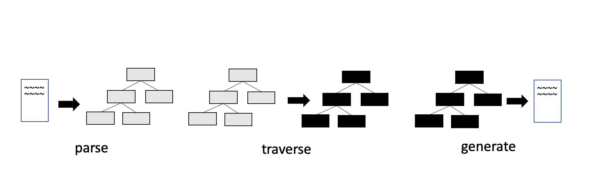

そういえば Babel をちゃんと勉強したことなかったなと思ってちゃんと勉強してみたって言う話です。
つまり Babel をノリで使ってたことになるのですが、自分がプログラミングを始めたときは [@babel/preset-env](https://babeljs.io/docs/en/babel-preset-env) がすでに存在しており、それを使っているだけで全てを倒せていたので勉強する必要がなかったという事情があります。

ただ、流石に知らないと言ってもネットサーフィンしているとなんらかの情報のインプットはされるので、

- Babel は ES6 -> ES5 に変換する（これは間違った理解）
- Babel は AST 操作によって変換する
- Babel は parse -> traverse -> generate して変換する

みたいな順番で少しずつ解像度を上げながら理解はしていました。
最後の、「Babel が parse -> traverse -> generate して変換している」と言うことに関しては、 [Step-by-step guide for writing a custom babel transformation](https://lihautan.com/step-by-step-guide-for-writing-a-babel-transformation/) などで知っていました。
しかし「ほんとうにそうなのだろうか？」と確証が持てませんでした。
なぜなら**公式ドキュメントから parse -> traverse -> generate している解説を見つけられなかった**からです。
というわけで、とりあえずコードを読んでみることにしました。

何かの正解と照らし合わせられた訳ではないのでもし間違っているところがありましたら Issue や Twitter でご指摘いただけると幸いです。

## Babel のエントリポイント

@babel/cli から実行する babel コマンドは

```javascript:title=index.js
import parseArgv from "./options"
import dirCommand from "./dir"
import fileCommand from "./file"

const opts = parseArgv(process.argv)

if (opts) {
  // 注目: ここから先に進んでいく
  const fn = opts.cliOptions.outDir ? dirCommand : fileCommand
  fn(opts).catch(err => {
    console.error(err)
    process.exitCode = 1
  })
} else {
  process.exitCode = 2
}
```

を実行します。
便宜上 bin/babel のトランスパイル前のファイルを選んでいますが、実際にはトランスパイルされたファイルが実行されます。
これは src/babel/index.js に入っています。

引数にファイルを指定したと仮定して、fileCommand を読んでいきます。
そしてその関数は次の通りです。

```javascript:title=file.js
export default async function({
  cliOptions,
  babelOptions,
}: CmdOptions): Promise<void> {
  // トランスパイル後の結果を出力
  function output(fileResults: Array<string>): void {
    ...
    if (cliOptions.outFile) {
      ...
      fs.writeFileSync(mapLoc, JSON.stringify(result.map));
      ...
    } else {
      ...
      process.stdout.write(result.code + "\n");
    }
  }

  async function walk(filenames: Array<string>): Promise<void> {
    ...
    const results = await Promise.all(
      _filenames.map(async function(filename: string): Promise<Object> {
        ...

        try {
          // 注目: ここから先に進んでいく
          return await util.compile(
            filename,
            defaults(
              {
                sourceFileName: sourceFilename,
                sourceMaps:
                  babelOptions.sourceMaps === "inline"
                    ? true
                    : babelOptions.sourceMaps,
              },
              babelOptions,
            ),
          );
        } catch (err) {
          ...
      }),
    );

    output(results);
  }


  async function files(filenames: Array<string>): Promise<void> {
    ...
    await walk(filenames);
    ...
  }

  // 実行される処理
  if (cliOptions.filenames.length) {
    await files(cliOptions.filenames);
  } else {
    await stdin();
  }
}

```

つまりは 各ファイルを walk して compile した結果を出力しています。
その compile を担当している関数が `util.compile(fileName, ...)` です。
変換処理を追いたいのでこの関数を見てみます。

```javascript:title=util.js
import * as babel from "@babel/core";

export function compile(
  filename: string,
  opts: Object | Function,
): Promise<Object> {
  ...
  return new Promise((resolve, reject) => {
    // 注目: ここから先に進んでいく、@babel/core側に処理が移る
    babel.transformFile(filename, opts, (err, result) => {
      ...
    });
  });
}
```

[@babel/core](https://www.npmjs.com/package/@babel/core) の `babel.transformFile()` を実行しています。
どうやら@babel/core の transformFile が変換処理のエントリポイントにになるようです。

## babel/core の transformFile の全体像

[@babel/core](https://www.npmjs.com/package/@babel/core) の transformFile を読み進めると **run** と言う関数に出会います。

```javascript:title=transform-file.js
// @flow
import {
  run,
  type FileResult,
  type FileResultCallback,
} from "./transformation";
...

const transformFileRunner = gensync<[string, ?InputOptions], FileResult | null>(
  function*(filename, opts) {
    const options = { ...opts, filename };

    const config: ResolvedConfig | null = yield* loadConfig(options);
    if (config === null) return null;

    const code = yield* fs.readFile(filename, "utf8");
    // 注目: ここから先に進んでいく
    return yield* run(config, code);
  },
);

export const transformFile: TransformFile = transformFileRunner.errback;
...
```

この run を読んでみましょう。
ここには、normalizeFile と transformFile と generateCode という処理があります。

```javascript:title=index.js
export function* run(
  config: ResolvedConfig,
  code: string,
  ast: ?(BabelNodeFile | BabelNodeProgram)
): Handler<FileResult> {
  // 注目
  const file = yield* normalizeFile(
    config.passes,
    normalizeOptions(config),
    code,
    ast
  )

  try {
    // 注目
    yield* transformFile(file, config.passes)
  } catch (e) {
    ...
  }

  try {
    if (opts.code !== false) {
      // 注目
      ;({ outputCode, outputMap } = generateCode(config.passes, file))
    }
  } catch (e) {
    ...
  }

  return result // ast や code
}
```

結果から言うと、これがそれぞれ parse, traverse, generate にあたります。

### parse

normalizeFile を覗くと File を返しています。

```javascript:title=index.js
export default function* normalizeFile(
  pluginPasses: PluginPasses,
  options: Object,
  code: string,
  ast: ?(BabelNodeFile | BabelNodeProgram)
): Handler<File> {
  code = `${code || ""}`

  if (ast) {
    if (ast.type === "Program") {
      ast = t.file(ast, [], [])
    }
    ...
  } else {
    // 注目
    ast = yield* parser(pluginPasses, options, code)
  }

  ...

  // 注目
  return new File(options, {
    code,
    ast,
    inputMap,
  })
}
```

ここで返される File は次のようなフィールドを持つ class です。

```js
export default class File {
  _map: Map<any, any> = new Map();
  opts: Object;
  declarations: Object = {};
  path: NodePath = null;
  ast: Object = {};
  scope: Scope;
  metadata: {} = {};
  code: string = "";
  inputMap: Object | null = null;

  ...
}
```

ast 情報を含めて返しています。
つまり parse をしています。
実際 normalize の中にある parser 関数は次の通りです。

```js
...
import { parse } from "@babel/parser"

...

export default function* parser(
  pluginPasses: PluginPasses,
  { parserOpts, highlightCode = true, filename = "unknown" }: Object,
  code: string
): Handler<ParseResult> {
  try {
    ...
    const ast = parserOverride(code, parserOpts, parse)
    ...
    if (results.length === 0) {
      // 注目
      return parse(code, parserOpts)
    } else if (results.length === 1) {
      ...
  } catch (err) {
    ...
  }
}
```

[@babel/parser](https://github.com/babel/babel/tree/master/packages/babel-parser) を使って parse していることが分かります。

### traverse

さらに run を読み進めていくと, `yield* transformFile(file, config.passes)` というコードがあります。
traverse してそうな雰囲気があるので読んでみましょう。
transformFile はこのような関数です。

```javascript:title=transformation/index.js
function* transformFile(file: File, pluginPasses: PluginPasses): Handler<void> {
  ...
  const visitors = [];
  for (const plugin of pluginPairs.concat([loadBlockHoistPlugin()])) {
    ...
    visitors.push(plugin.visitor);
  }
  ...

  const visitor = traverse.visitors.merge(
    visitors,
    passes,
    file.opts.wrapPluginVisitorMethod
  )
  traverse(file.ast, visitor, file.scope)

  for (const [plugin, pass] of passPairs) {
    const fn = plugin.post
    if (fn) {
      const result = fn.call(pass, file)
      ...
    }
  }
}
```

いました `traverse(file.ast, visitor, file.scope);`.
先ほど作った File クラスのインスタンスの ast を使っています。
この traverse の関数は [@babel/traverse](https://babeljs.io/docs/en/babel-traverse) から import した関数です。
traverse 関数に ast と plugin(visitors という配列に詰め込まれている)を渡して実行していることがわかりました。
つまり Babel が traverse していることを確認できました。

### generate

さらに run を読み進めていくと, `generateCode(config.passes, file))` というコードがあります。

```javascript:title=transformation/file/generate.js
import generate from "@babel/generator";

export default function generateCode(
  pluginPasses: PluginPasses,
  file: File
): {
  outputCode: string,
  outputMap: SourceMap | null,
} {
  ...
  let result;
  if (results.length === 0) {
    result = generate(ast, opts.generatorOpts, code);
  } else if (results.length === 1) {
    ...
  }

  return { outputCode, outputMap };
}
```

generate は [@babel/generator](https://github.com/babel/babel/tree/master/packages/babel-generator) の関数です。
これは 'Turns an AST into code.' とあり、AST を Code に戻す関数です。
つまり AST -> Code をしていることを確認できました。

## 検証結果

いかがでしたか。噂通り parse => traverse => generate していました。
Babel は各パッケージに分けてそれらの処理を行っているようです。
[@babel/cli](https://babeljs.io/docs/en/babel-cli) -> [@babel/core](https://www.npmjs.com/package/@babel/core) -> [@babel/parser](https://github.com/babel/babel/tree/master/packages/babel-parser) -> [@babel/traverse](https://babeljs.io/docs/en/babel-traverse) -> [@babel/generator](https://github.com/babel/babel/tree/master/packages/babel-generator) という順番で呼び出しています。
そのため Babel は parse -> traverse -> generate して変換していると言えることがわかりました。



## 小さいコードで検証してみる

それぞれライブラリを使って parse -> traverse -> generate していることが確認できました。
しかしこれだとイマイチ実感が湧かないと思いますので、より詳細に小さいコードで実践したいと思います。

このようなコードを用意します。

```js
const parser = require("@babel/parser")
const traverse = require("@babel/traverse")
const generate = require("@babel/generator")

const code = "const n = 1"

// parse the code -> ast
const ast = parser.parse(code)

// transform the ast
traverse.default(ast, {
  enter(path) {
    // in this example change all the variable `n` to `x`
    if (path.isIdentifier({ name: "n" })) {
      path.node.name = "x"
    }
  },
})

// generate code <- ast
const output = generate.default(ast, code)
console.log(output.code) // 'const x = 1;'
```

このコードは序盤で紹介した [Step-by-step guide for writing a custom babel transformation](https://lihautan.com/step-by-step-guide-for-writing-a-babel-transformation/) にあるものです。
これは n を x で置き換える処理を babel で実行したものです。
いわば @babel/core の中を小さく切り出してきたものです。
この処理をライブラリの中を追いながら確認してみましょう。

### parse

`parser.parse` の中身はこのような関数です。

```javascript:title=index.js
export function parse(input: string, options?: Options): File {
  if (options?.sourceType === "unambiguous") {
    ...
    try {
      options.sourceType = "module";
      const parser = getParser(options, input);
      const ast = parser.parse();
      ...
      return ast;
    } catch (moduleError) {
      ...
  } else {
    return getParser(options, input).parse();
  }
}
```

getParser の先を追っていくと nextToken や lookahead といった処理がみられると思います。

```javascript:title=tokenizer/index.js
lookahead(): State {
  const old = this.state;
  this.state = old.clone(true);

  this.isLookahead = true;
  this.next();
  this.isLookahead = false;

  const curr = this.state;
  this.state = old;
  return curr;
}

nextTokenStart(): number {
  const thisTokEnd = this.state.pos;
  skipWhiteSpace.lastIndex = thisTokEnd;
  const skip = skipWhiteSpace.exec(this.input);
  // $FlowIgnore: The skipWhiteSpace ensures to match any string
  return thisTokEnd + skip[0].length;
}
```

現在トークンを読み進めている位置、次のトークンの位置、先読みした文字を管理しながら実行といった処理が見えるので、字句解析している雰囲気が確認できます。

また

```js
parseBlockOrModuleBlockBody(body, directives, topLevel, end, afterBlockParse) {
  ...
  const stmt = this.parseStatement(null, topLevel);
  ...
  body.push(stmt);
}
```

などのように文を parse して構築対象に push するなど構文解析している雰囲気も感じられます。

実際 このように logger をしかけて

```js
const ast = parser.parse(code)
console.log(ast)
```

parse の結果を出力すると

```sh
> node index.js
Node {
  type: 'File',
  start: 0,
  end: 11,
  loc: SourceLocation {
    start: Position { line: 1, column: 0 },
    end: Position { line: 1, column: 11 }
  },
  errors: [],
  program: Node {
    type: 'Program',
    start: 0,
    end: 11,
    loc: SourceLocation { start: [Position], end: [Position] },
    sourceType: 'script',
    interpreter: null,
    body: [ [Node] ],
    directives: []
  },
  comments: []
}
```

と言う風に AST が構築されているのがわかります。

### traverse

@babel/traverse はこのように説明されています。

> The Babel Traverse module maintains the overall tree state, and is responsible for replacing, removing, and adding nodes.
>
> FYI: https://github.com/jamiebuilds/babel-handbook/blob/master/translations/en/plugin-handbook.md#babel-traverse

言わば AST ノードを操作するパッケージです。
この traverse 関数がどのように実行されるかみていきましょう。

```js
export default function traverse(
  parent: Object | Array<Object>,
  opts?: Object,
  scope?: Object,
  state: Object,
  parentPath: Object,
) {
  ...
  traverse.node(parent, opts, scope, state, parentPath);
}

...

traverse.node = function(
  node: Object,
  opts: Object,
  scope: Object,
  state: Object,
  parentPath: Object,
  skipKeys?,
) {
  ...
  const context = new TraversalContext(scope, opts, state, parentPath);
  for (const key of keys) {
    if (skipKeys && skipKeys[key]) continue;
    // NOTE: ここから読み進める
    if (context.visit(node, key)) return;
  }
};
```

explode と node という関数を実行しています。

この `context.visit(node, key)` が AST を辿って処理をする本体です。
さらにそこから追っていくと context を実行しています。

```js
visitQueue(queue: Array<NodePath>) {
    ...

    // visit the queue
    for (const path of queue) {
      ...

      // NOTE: ここから読み進める
      if (path.visit()) {
        stop = true;
        break;
      }
      ...
    }

    return stop;
  }
```

実際には AST を辿りながら NodePath という形式に変換したオブジェクトを queue に詰め込んでいき、その queue を管理しながら AST を辿ります。

この `path.visit()` は Mixin された NodePath_context の持ち物です。
**Editor のコードジャンプでは見つけられないので注意しましょう。**

```js
Object.assign(
  NodePath.prototype,
  NodePath_ancestry,
  NodePath_inference,
  NodePath_replacement,
  NodePath_evaluation,
  NodePath_conversion,
  NodePath_introspection,
  NodePath_context,
  NodePath_removal,
  NodePath_modification,
  NodePath_family,
  NodePath_comments
)
```

さあゴールは近づいてきました。
visit の中はこうなっています。

```javascript:title=lib/context.js
export function visit(): boolean {
  ...

  // NOTE: ここから読み進める
  if (this.shouldSkip || this.call("enter") || this.shouldSkip) {
    this.debug("Skip...");
    return this.shouldStop;
  }

  ...

  this.call("exit");

  return this.shouldStop;
}
```

`this.call("enter")` と `this.call("exit")` は enter と exit 関数を call している雰囲気があります。
まるで AST ノードに入った時と出ていく時に実行する関数のように・・・
追ってみましょう！

```js
export function call(key): boolean {
  ...
  if (this.node) {
    // NOTE: ここから読み進める
    if (this._call(opts[key])) return true;
  }
 ...
  return false;
}

export function _call(fns?: Array<Function>): boolean {
  ...
  const ret = fn.call(this.state, this, this.state);
  ...
}
```

はい呼んでいました。

ここで検証に使ったコードに注目してください。

```javascript:title=index.js
// transform the ast
traverse.default(ast, {
  enter(path) {
    // in this example change all the variable `n` to `x`
    if (path.isIdentifier({ name: "n" })) {
      path.node.name = "x"
    }
  },
})
```

call される関数は `this._call(opts[key])`として呼ばれていたわけですが、この opts には検証コード上だと `enter(path) {}`に該当します。

そしてこれは `babel-plugin` の処理を流し込める仕組みでもあります。
実は `traverse` 関数の第二引数はこの plugin に書いた処理の塊です。
この中で AST を書き換える処理を入れます。
先の例だと `path.node.name = "x"` という風に変数名を x に書き換えています。
つまり **traverse は AST を操作しているのではなく、AST を操作する関数を実行していた**訳です。
@babel/traverse を全部読みきったわけではないので確証は持てないところもあるのですが、今のところはそのような理解です。

### generate

@babel/generate のエントリポイントはこのように実装されています。

```js
import SourceMap from "./source-map";
import Printer, { type Format } from "./printer";

class Generator extends Printer {
  ...

  constructor(ast, opts = {}, code) {
    ...
    this.ast = ast;
  }

  generate() {
    return super.generate(this.ast);
  }
}

...

export default function(ast: Object, opts: Object, code: string): Object {
  const gen = new Generator(ast, opts, code);
  return gen.generate();
}
```

`return super.generate(this.ast);` とあるので super class である Printer を確認してみましょう。

```javascript:title=printer.js
generate(ast) {
  this.print(ast);
  this._maybeAddAuxComment();

  return this._buf.get();
}
```

この print `token` や `printMethod` などを実行しています。

```js
print(node, parent) {
    ...
    if (needsParens) this.token("(");

    this._printLeadingComments(node);

    const loc = t.isProgram(node) || t.isFile(node) ? null : node.loc;
    this.withSource("start", loc, () => {
      printMethod.call(this, node, parent);
    });

    this._printTrailingComments(node);

    if (needsParens) this.token(")");

    ...
  }

   token(str: string): void {
   ...
    this._append(str);
  }
```

printMethod は、AST Node の種類に応じて、indent, dedent, semicolon, rightBrace, ... といった処理を実行していきます。
どういう処理がされるかは Printer クラスのメソッドとして定義されています。

```js
indent(): void {
  if (this.format.compact || this.format.concise) return;
  this._indent++;
}

dedent(): void {
  if (this.format.compact || this.format.concise) return;
  this._indent--;
}
```

そしてこれらの関数は \_append という処理を呼び出し、処理結果を `this._buf.append(str);` で buffer に 入れていきます。
そしてこの buffer が printer.js で `return this._buf.get();` されて出力されます。

実験用のコードでは、generate に AST 以外にも code を渡していますが、

```javascript:title=index.js
const code = "const n = 1"

...

// generate code <- ast
const output = generate.default(ast, code)
```

これは source map 用に渡しているだけで、code の生成は AST の情報だけあれば可能です。
この時点で traverse によって AST を変換しているはずなので、AST だけ渡せば変換後のコードを出力できます。

## Babel は ES6 => ES5 に変換するという誤解

さてさて、最初に僕は ES6 => ES5 に変換する魔法の箱と勘違いしていると書いていました。
僕の周りにも同じ勘違いしている人に出会ったことがあるのでついでに言及したいなと思います。

例えば

```javascript:title=index.js
const hoge = () => {}
```

という関数を babel で変換してみましょう。

```sh
npm i @babel/core @babel/cli
```

この変換結果はどうなるでしょうか？
ES5 になるはずですよね！・・・なりません 😭

```bash
$ npx babel index.js
> const hoge = () => {};
```

こうなります。

つまり何も AST 操作がされていません。ここで traverse を思い出してください。
traverse のためには enter と exit が定義された何かが必要なんですよね。
それは自作関数だったり babel-plugin だったりします。

例えば、[@babel/plugin-transform-arrow-functions](https://github.com/babel/babel/tree/master/packages/babel-plugin-transform-arrow-functions)などが必要です。

試しにこの plugin を入れて babel を実行してみましょう。

```bash
$ npm i -D @babel/plugin-transform-arrow-functions

$ echo '{ "plugins": ["@babel/plugin-transform-arrow-functions"] }' > .babelrc

$ > npx babel index.js
const hoge = function () {};
```

きちんと function に変換されていることが確認できました。

@babel/plugin-transform-arrow-functions の中はこうなっています。

```javascript:title=index.js
import { declare } from "@babel/helper-plugin-utils"
import type NodePath from "@babel/traverse"

export default declare((api, options) => {
  api.assertVersion(7)

  const { spec } = options
  return {
    name: "transform-arrow-functions",

    visitor: {
      ArrowFunctionExpression(
        path: NodePath<BabelNodeArrowFunctionExpression>
      ) {
        if (!path.isArrowFunctionExpression()) return

        path.arrowFunctionToExpression({
          allowInsertArrow: false,
          specCompliant: !!spec,
        })
      },
    },
  }
})
```

ここでは visitor とあり enter も exit も出てきてないのですが、@babel/traverse が内部で enter などを持つように変換しているため大丈夫です。
enter と exit を持つことは travese の explode が確証してくれて、その中には ensureEntranceObjects(visitor) という関数があります。

この関数は

```javascript:title=visitors.js
function ensureEntranceObjects(obj) {
  for (const key of Object.keys(obj)) {
    if (shouldIgnoreKey(key)) continue

    const fns = obj[key]
    if (typeof fns === "function") {
      obj[key] = { enter: fns }
    }
  }
}
```

とあり、visitor 関数を `obj[key] = { enter: fns }` と定義し直してくれます。
explode 関数は他にもいろんな形のオブジェクトを traverse 内で扱えるような正規化をしてくれています。
関数にはこのようにドキュメンテーションされています。

```
/**
 * explode() will take a visitor object with all of the various shorthands
 * that we support, and validates & normalizes it into a common format, ready
 * to be used in traversal
 *
 * The various shorthands are:
 * * `Identifier() { ... }` -> `Identifier: { enter() { ... } }`
 * * `"Identifier|NumericLiteral": { ... }` -> `Identifier: { ... }, NumericLiteral: { ... }`
 * * Aliases in `@babel/types`: e.g. `Property: { ... }` -> `ObjectProperty: { ... }, ClassProperty: { ... }`
 *
 * Other normalizations are:
 * * Visitors of virtual types are wrapped, so that they are only visited when
 *   their dynamic check passes
 * * `enter` and `exit` functions are wrapped in arrays, to ease merging of
 *   visitors
 */
```

つまり plugin に visitor を書いておけば、enter として traverse が実行してくれます。

@babel/plugin-transform-arrow-functions を使えば traverse できることがわかりました。
実際のところ@babel/plugin-transform-arrow-functions を先に読み進めていくと

```javascript:title=conversion.js
export function arrowFunctionToExpression({
  allowInsertArrow = true,
  specCompliant = false,
} = {}) {
  ..

  const thisBinding = hoistFunctionEnvironment(
    this,
    specCompliant,
    allowInsertArrow
  )

  this.ensureBlock()
  this.node.type = "FunctionExpression"
  ...
    this.get("body").unshiftContainer(
      "body",
      t.expressionStatement(
        t.callExpression(this.hub.addHelper("newArrowCheck"), [
          t.thisExpression(),
          checkBinding
            ? t.identifier(checkBinding.name)
            : t.identifier(thisBinding),
        ])
      )
    )

    this.replaceWith(
      t.callExpression(
        t.memberExpression(
          nameFunction(this, true) || this.node,
          t.identifier("bind")
        ),
        [checkBinding ? t.identifier(checkBinding.name) : t.thisExpression()]
      )
    )
  }
}
```

が呼ばれており、arrow 関数の特徴である this の bind を変換している雰囲気は感じられます。
つまりこのプラグインを入れておくと arrow 関数の変換ができるわけです。

**このように traverse は plugin を適用しており、逆にこの plugin がなければ何も AST 操作がされないということであり、ただ babel を実行するだけでは ES6 の構文を ES5 の構文にすることはできないということです。**
