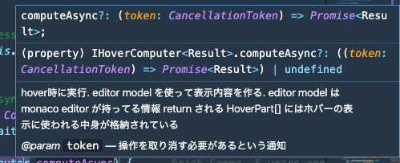
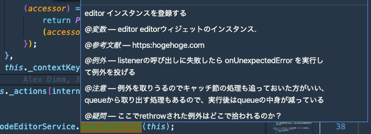

半年くらい前からライブラリを読むっていうトレーニングをやりはじめたのですが、続けているうちにだんだん読み方がわかってきたので、やり始めた頃に知っておきたかったことをまとめました。
これから JavaScript/TypeScript で書かれたライブラリを読んでみようと思っている方の助けになれば嬉しいです。

「俺はこういう道具を使うぜ」みたいな感じの内容ですので、もし「もっといい読み方があるよ」みたいなのがありましたら[Issue](https://github.com/sadnessOjisan/blog.ojisan.io/issues)などで教えていただけると嬉しいです。

ライブラリを読むにあたって、ブラウザの話と NodeJS の話があると思うのですが、似てる点がほとんどなのでごった煮して書きます。

## ドキュメントを読む

ライブラリによっては、開発者ドキュメントが提供されています。
README や公式 HP に Developper Guide や How to Contribute のような名前であります。
もしあれば、そこには全体感を掴める解説があるはずなのでそれを読みましょう。
ただし、ほとんどの場合は、私が求める情報はなかったです。

## エントリポイントを探す

私のライブラリを読む動機は、

- そのライブラリが持つ module がどう協調して全体が作られるのか知りたい
- その関数は正確にはどういう挙動をするのか知りたい

です。

それを理解しようとすると、ユーザーから渡された入力や呼び出しがどう変化していくかを追っていくことになります。
そこで、**logger や debugger を入れる**ことが一つの読み方になってきます。
ただ、それらをどこに入れるかは処理の呼び出しを辿っていくことになります。
それらの関数はエントリポイントから export されて私たちの手元に来ているので、エントリポイントを探します。

### pakage.json

ライブラリのエントリポイントは package.json の main に書かれています。
hogeLib ライブラリが main: 'lib/index.js' を持つなら、`require("hogeLib")` としたときは lib/index.js が呼ばれます。

```javascript:title=package.json
{
  "name": "hogeLib",
  "description": "hogeなライブラリ",
  "version": "1.0.0",
  "author": "sadnessOjisan",
  "main": "lib/index.js"
}
```

そして大体エントリポイントはこういうファイルになっています。

```javascript:title=index.js
"use strict";
function __export(m) {
    for (var p in m) if (!exports.hasOwnProperty(p)) exports[p] = m[p];
}
Object.defineProperty(exports, "__esModule", { value: true });
var application_1 = require("./lib/application");
...
exports.TypeDocReader = options_1.TypeDocReader;
exports.ArgumentsReader = options_1.ArgumentsReader;
var serialization_1 = require("./lib/serialization");
exports.JSONOutput = serialization_1.JSONOutput;
const TypeScript = require("typescript");
exports.TypeScript = TypeScript;
//# sourceMappingURL=index.js.map
```

ぐええ読みにくい。

ライブラリはトランスパイルされた状態で配布されるので、こういったちょっと読みにくいコードになっています。
これはまだ読みやすいのですが、minify や ugilify されているコードは本当に読めないので、トランスパイル前のコードを読みましょう。
**logger や debugger はライブラリそのものに仕込みますが、読むときはトランスパイル前のコードを読むようにしましょう**

先ほどのトランスパイル前のコードはこのようなものです。

```javascript:title=index.ts
export { Application } from './lib/application';
export { CliApplication } from './lib/cli';

export { EventDispatcher, Event } from './lib/utils/events';
export { resetReflectionID } from './lib/models/reflections/abstract';
export { normalizePath } from './lib/utils/fs';
export * from './lib/models/reflections';
export * from './lib/output/plugins';
export { Renderer } from './lib/output/renderer';
export { DefaultTheme, NavigationBuilder } from './lib/output/themes/DefaultTheme';
export { NavigationItem } from './lib/output/models/NavigationItem';
export { UrlMapping } from './lib/output/models/UrlMapping';

...

export { JSONOutput } from './lib/serialization';

import * as TypeScript from 'typescript';
export { TypeScript };
```

読みやすいですね。
トランスパイル前のコードは**src の中に、package.json の main で指定しているファイル名と同じ名前で作られている**ことが多いので、そこから探しましょう。
**ただし node_modules の中にあるライブラリは配布用に build されたものなので、build 前のものは GitHub などから探す必要があります。**
GitHub のリンクは、node_modules の中には必ず package.json と README.md が入っているので、そこに書かれているであろうリンクから辿れます。
ライブラリのエントリポイントはこのように他の関数を import してそれをまとめて export していることが多いです。
基本的にはここから code jump で辿ると目的の処理を見つけられます。

### bin

これは CLI からエントリポイントを辿るときに必要な知識です。
たとえば `npx babel` や `npx webpack` としたときの処理をどう辿るかという話です。

当然、babel や webpack を実行しているのですが、これらは package.json で指定されている main を実行していません。
ここでの babel や webpack といったコマンドはある関数を実行しています。
その関数は node_modules/.bin に入ってる関数です。
`npx babel` は node_modules/.bin/babel を実行し、`npx webpack` は node_modules/.bin/webpack を実行しています。
そして例えば babel だと、

```javascript:title=babel
#!/usr/bin/env node

require("../lib/babel")
```

を実行しています。

この `"../lib/babel"` を辿ると、

```javascript:title=index.js
#!/usr/bin/env node
"use strict"

var _options = _interopRequireDefault(require("./options"))
var _dir = _interopRequireDefault(require("./dir"))
var _file = _interopRequireDefault(require("./file"))

function _interopRequireDefault(obj) {
  return obj && obj.__esModule ? obj : { default: obj }
}

const opts = (0, _options.default)(process.argv)

if (opts) {
  const fn = opts.cliOptions.outDir ? _dir.default : _file.default
  fn(opts).catch(err => {
      ...
```

といった関数を実行しています。
この場合 `const fn = opts.cliOptions.outDir ? _dir.default : _file.default` の先を読んでいくことで、そのコマンドが何をしているのかを追っていけます。
ここが babel コマンドのエントリポイントです。

どういうときに.bin があるかというと、ライブラリを作ったときの package.json の bin フィールドを書いたときです。
node_modules は package.json に bin を登録することで、コマンド名と処理を symbolic link として登録できます。
ライブラリを作らないとイメージできないところだとは思いますが、bin の最小構成を用意したのでよければご覧ください。

FYI: https://github.com/ojisan-toybox/node-bin-bin

## 読み進める

### print debug

その処理が何をやっているかを理解するためには、関数単位で実行したり、関数の返り値を覗くと分かることもあります。
そのためには print debug が有効な手立てになります。

#### console.log の引数を活用してマークを入れていく

print debug といえば console.\* です。

ただし無闇に出力すると、何の log かわからないのでマークを入れています。
console.log() は複数の引数を取れるので、

```js
console.log("[class名]<関数名> x: ", x)
```

といった loggaer を仕込んでいます。こうすると

```sh
> [class名]<関数名> x: 10
```

といった出力を得ることができます。
こうすることでどのファイルのどの関数がどの順番でよばれてそのときの x の値はこれだったということがわかるようになります。

console 系は log 以外にもいろんなメソッドがあります。
筆者は使っていませんが、特にブラウザ上での動作確認時に役立ちそうなのがたくさんあります。

FYI: https://qiita.com/mtoyopet/items/7274761af5424cee342a

#### console.Console

logger を使った print debug の場合、出力したものが長すぎるとコンソールからはみでます。
クライアントサイドの開発ならブラウザがオブジェクトを折りたたんでくれるので問題にはならないのですが、NodeJS の開発だとそうはいきません。
そこでファイルに全部吐き出します。

```js
const fs = require("fs")
const log = fs.createWriteStream("result.log")
const logger = new console.Console(log)

logger.log(x)
```

NodeJS の Console は writableStream を引数に取り、出力先を指定した logger を作れます。
上の例では result.log というファイルに出力する logger を作っています。
これで x の内容が result.log というファイルに出力されます。

https://nodejs.org/api/console.html

```sh
[path.js]<node> node Node {
  type: 'File',
  start: 0,
  end: 11,
  loc: SourceLocation {
    start: Position { line: 1, column: 0 },
    end: Position { line: 1, column: 11 }
  },
  errors: [],
  program: Node {
    type: 'Program',
    start: 0,
    end: 11,
    loc: SourceLocation { start: [Position], end: [Position] },
    sourceType: 'script',
    interpreter: null,
    body: [ [Node] ],
    directives: []
  },
  comments: []
}
[path.js]<node> node Node {
  type: 'Program',
  start: 0,
  end: 11,
  loc: SourceLocation {
    start: Position { line: 1, column: 0 },
    end: Position { line: 1, column: 11 }
  },
  sourceType: 'script',
  interpreter: null,
  body: [
    Node {
      type: 'VariableDeclaration',
      start: 0,
      end: 11,
      loc: [SourceLocation],
      declarations: [Array],
      kind: 'const'
    }
  ],
  directives: []
}
...
```

これの便利なところは、ファイルに出力したい log は自作した logger, そのままコンソールに出力させたいものは組み込みの console.log を使うといった使い分けができることです。
自分の関心があるものだけを出力させられるので、この変数の挙動だけを追いたいといったときに使いやすいです。

#### debugger と node-inspect

ファイル出力したログがあまりにも大きいときは node-inspect や debugger を使います。
これは処理を Step 実行して、その Step での状態を探索できます。

[node-inspect](https://github.com/nodejs/node-inspect)は NodeJS にが付随しています。
debugger は break point を作るコードです。
break point をセットすればそのポイントまで関数を実行してそこで止めるといったことができます。

```js
$ node inspect index.js
```

実行すると debugger にコンソールが切り替わり、1step ずつコードが実行されます。
その中で `c` と入力すると debugger を仕込んだところまで実行されます。
debugger の中にいるときは `repl` と打てば repl を起動できます。
repl の中ではそのステップ時の変数にアクセスできます。
また console.log(), typeof, Object.keys() などのコマンドも使えるので、調べたい変数が複雑で巨大でも掘っていくことができます。

```sh
> XXX
{ type: 'Program',
  start: 0,
  end: 11,
  loc: SourceLocation,
  sourceType: 'script',
  ... }

> console.log(XXX)
< XXX {
<   type: 'Program',
<   start: 0,
<   end: 11,
<   loc: SourceLocation {
<     start: Position { line: 1, column: 0 },
<     end: Position { line: 1, column: 11 }
<   },
<   sourceType: 'script',
<   interpreter: null,
<   body: [
<     Node {
<       type: 'VariableDeclaration',
<       start: 0,
<       end: 11,
<       loc: [SourceLocation],
<       declarations: [Array],
<       kind: 'const'
<     }
<   ],
<   directives: []
< }
> undefined

> Object.keys(XXX)
[ 'type',
  'start',
  'end',
  'loc',
  'sourceType',
  'interpreter',
  'body',
  'directives' ]

> XXX.type
'Program'
```

(※ XXX は本当は Node なのですが、名前から変数名と分かりにくいので XXX に置き換えています. )

上の例は [@babel/traverse](https://babeljs.io/docs/en/babel-traverse)を読んだ際の、AST の解析中の debug log です。
AST のような出力が長くてどのような key を持つかの想像がつかないようなものに対して `Object.keys()` で持ってるキーを調べてアクセスしています。
（FlowType の型定義が見えなくなっていたので、このように出力するしかなかった背景があります）

### 定義ジャンプのために LSP クライアントになるエディタを使う

エディタ何が良いか論争はしたくないのであまり言及をしたくないのですが、コードを読むとき私は VSCode を使っています。
**定義先と定義元への Jump** ができるので処理の流れを追うのに便利です。
後述するドキュメンテーションのためにも役立つので、LSP クライアントになるエディタを使います。

### わかったことは documentation 文字列で残す

読み進めるうちに分かった処理は documentation を書くようにしています。
そうすることでエディタでカーソルを合わせたときに、その呼び出している処理が何だったかすぐ見つけることができます。



ライブラリを読むときは設定を埋め込んで返す関数を何個も追っていくことになります。
余程慣れていない限り、各モジュールがどう連携しているかという全体感を掴むことができません。
そのときにわかった情報は適宜ドキュメントにして即時に参照可能にしておくと、記憶力や経験がなくても読める手がかりになるので、私はそうしています。

このとき tsdoc 準拠の文字列で documentation すると、変数や型や戻り値や注意事項などの情報を出せます。

#### tsdoc のおすすめ使い方

tsdoc 準拠の `@param` , `@return` が tsdoc で解析されます。
また tsdoc は jsdoc 準拠の文字列も使えるため、 @see や @throws も使えます。
see は参考になるサイトなどの情報をメモするのに便利で、throws はその関数が例外を投げることを知れるので有益な情報です。
（やる意味はないと思いますが）typedoc を使えばそれらを出力もできてしまいます。

この annotation は Language Server(tsserver) 的には meta 情報として扱われます。

```sh
{"type": "response", "seq": 2, "command": "quickinfo", "arguments": {"file": "test/src/Error.ts", "line":9, "offset":14}}
```

```sh
{
    "seq":0,
    ...,
    "tags":[
        {"name":"param","text":"hoge"},
        {"name":"returns","text":"hogehgoehoge"},
        {"name":"throws","text":"fewfwe"}
        ]
}
```

その meta 情報は@で始まっていれば何でもいいので正直なんでも入れることができます。
typedoc で出力しないなら自分の見やすい annotation を使ってもいいかもしれません。
例えばこんなこともできます。



### テストを読む

挙動がわからないときはテストも読みます。
テストには入力と期待する動作が書かれているのでその処理の概略は掴めます。

ただ大きい処理だといわゆる in と out がしっかりしている unit テストではなく、mock した値の中をたくさん検査するといったテストが多く、読んでもよくわからないみたいなことになっています。
それでもテストも `test("XXX関数にこういうinputを与えるとこういう挙動になる", ()=>{})` といった表記で behavior が書かれているので、その関数が何をしているかという雰囲気は掴みやすいです。

behavior については[こちら](https://ja.javascript.info/testing-mocha#ref-108)

```js
test("get returns the last registration", () => {
  const registration1: Registration = {
    options: { lifecycle: Lifecycle.Singleton },
    provider: { useValue: "provider" },
  }
  const registration2: Registration = {
    options: { lifecycle: Lifecycle.Singleton },
    provider: { useValue: "provider" },
  }

  registry.set("Bar", registration1)
  registry.set("Bar", registration2)

  expect(registry.has("Bar")).toBeTruthy()
  expect(registry.get("Bar")).toStrictEqual(registration2)
})
```

経験上、OSS はコメントがほとんど書かれていないので、コードを読むしかないのですが、テストには自然言語があるので、コードを読めなくてもそこからヒントを掴めたりします。

## 経験として学んだ読み方

### 1 ファイルに 1 クラスファイルと思わない

普段アプリケーションコードを書くときは 1 ファイルに 1 機能のコードです。
フロントであれば UI コンポーネント一つが 1 ファイルだし、バックエンドなら関心事一つが 1 ファイルとして作ることが多いと思います。（もちろん InnerClass を使ったパターンなどもあるとは思いますが、数としては少ないはずです。）
しかしどうもライブラリのコードはそうはいかず、1 ファイルに複数クラスが入っていることがあります。
ファイル名だけを見て処理を予測して読んでいると、その該当処理を見つけられなかったりもするので、もし該当処理を見つけられないときはファイル内に複数のクラスがあったりしないかなと疑うと良いでしょう。

### new でインスタンスが作られるとは限らない

大規模なライブラリはよく クラスが使われています。
そして DI されてることが多いです。
なので基本的には new () を探せばいいのですが、そんな簡単にはいきません。

#### static factory patern

ライブラリによっては constructor が private になっていて代わりに of() などが使われています。
これは static factory method と呼ばれており [こういう](https://maku77.github.io/java/effective/01.html)メリットがあります。

```js
class Coordinate {
  // ...
  private constructor(x: number, y: number) {
    this.x = x;
    this.y = y;
  }
  static doubledCoordinate(x: number, y: number) {
    return new Coordinate(x * 2, y * 2)
  }
}
const coordinate = Coordinate.doubleCoordinate(1, 5)
```

FYI: https://dev.to/adtm/static-factory-methods-nnb

new で検索しても出てこないので注意しましょう。
new がなくて static factory method 使ってそうと思ったら、 of/valueOf のようなコードで検索するか、 static で検索をかけています。

#### instance を作る関数の存在

```js
class A {
  ...
  private _createInstance<T>(ctor: any, args: any[] = [], _trace: Trace): T {
    let serviceDependencies = _util.getServiceDependencies(ctor).sort((a, b) => a.index - b.index);
    ...
    return <T>new ctor(...[...args, ...serviceArgs]);
  }
}
```

といった感じで、constructor を受け取って instance を生成する関数といった風に、呼び出し元が new を使わずに instance を作ることもあります。
new だけを追いかけると依存を見落とすので注意しましょう。
(こういった関数を最後まで追いかけると new に行き当たったりするが、Jump が途切れたり、何度も Jump することになって迷子になるので見切りを new まで探す必要はないと思っています。)

こういうケースは生成済みのインスタンスのキャッシュを使って injection するといったときに出てきます。
ライブラリのコードはパフォーマンスに気が遣われていることがほとんどで、なるべくキャッシュを再利用してやろうといった意思が感じられます。

### module import で instance 化

上の例で紹介したような instance を生成する関数を class の外で実行しているものもあります。
そういった関数が書かれたファイルは、**呼び出されなくても module として import されたら実行**されます。

```javascript:title=index.ts
import "./module"
import { instances } from "./data"

console.log(instances)
```

```javascript:title=data.ts
export const instances = []
```

```javascript:title=module.ts
import { instances } from "./data";

class Hoge {
  private constructor() {}

  static of() {
    return new Hoge();
  }
}

const registerModule = () => {
  instances.push(Hoge.of());
};

registerModule();
```

このコードの index.ts は処理としては`console.log(instances)`をしているだけですが、出力した instances には値が入っています。

```sh
$ npx tsc src/*.ts --outDir dist

$ node dist/index.js
[ Hoge {} ]
```

そのときに instance 化がされて保持されることがあります。
巨大なライブラリの関数の**呼び出し順**を探るときにはこの罠にひっかかることがあるので注意しましょう。
**インスタンスやオブジェクトのできる順番を追っているときに、気付いたらインスタンスができていた**といったとき、この module 読み込み時にインスタンスが生成されてどこかに登録されていたみたいなことを疑うとよいです。

### code jump できないときに mixin を疑う

JS では mixin ができます。

それは Object.assign を使います。

それは code j

### 些末な関数は無視する

わからない処理があっても大事そうでないところは全部飛ばしています。
ライブラリを作る知識を学ぶという点では学べるところが多いと思いますが、ライブラリが内部のエッセンスみたいなのをみるだけなら飛ばしていいと思います。
目的意識をもって読むことが大事です。

ただ個人的にはライブラリは高階関数の使い方が上手いなといういつも関心します。
設定を返す関数を作るパターンというのがよく出てきます。
慣れないうちは読みにくいものなのでこれも飛ばすと良いでしょう。

## 最後に

OSS のコードは日常無業務でのお作法と違っているところが多くて混乱します

ただ、気合を出すと意外といけます。
ライブラリを読むって最初はすごい難しそうなイメージがあったのですが、いざやってみると意外といけました。
読み進めていくと OSS のコードのパターンや落とし穴みたいなのが見つかるので、そういうのを経験するともっと効率よく読めるようになるのだろうなと思ってこれからも読むモチベーションになっています。
ライブラリは魔法の箱と思わずに、私たちが書くコードと同じものだという意識と、読み方のコツみたいなのを知っていると意外とすいすい読めたりします。
