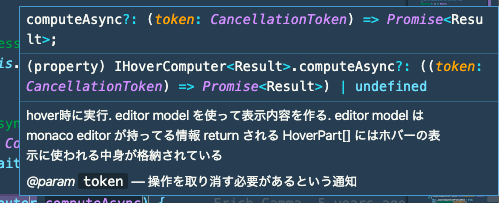

少し前からライブラリを読むトレーニングを始めたのですが、最近ようやく読み方がわかってきたので、やり始めた頃に知っておきたかったことをまとめます。
これから JavaScript/TypeScript で書かれたライブラリを読んでみようと思っている方の助けになれば嬉しいです。

「私はこういう道具を使ったり、こういう工夫をしています」みたいな感じの内容ですので、もし「もっといい読み方があるよ」みたいなのがありましたら[Issue](https://github.com/sadnessOjisan/blog.ojisan.io/issues)などで教えていただきたいです。

（※ライブラリを読むにあたって、ブラウザの話と NodeJS の話があるのですが、似てる点がほとんどなのでごった煮します。）

## エントリポイントを探す

ライブラリを読むにあたって

- そのライブラリが持つ module がどう協調して全体が作られるのか
- その関数は正確にはどういう挙動をするのか

などを考えると、ユーザーから渡された入力や呼び出しがどう変化していくかを追っていくことになります。
そこで、**logger や debugger を入れる**ことが一つの読み方になってきます。
ただ、それらをどこに入れるかは、処理の呼び出しを辿らないと分かりません。
そこで、その処理を辿るためのエントリポイントを探しましょう。

### package.json の main

ライブラリのエントリポイントは package.json の main に書かれています。
hogeLib ライブラリが `main: 'lib/index.js'` を持つなら、`require("hogeLib")` としたときは lib/index.js が呼ばれます。

```javascript:title=package.json
{
  "name": "hogeLib",
  "description": "hogeなライブラリ",
  "version": "1.0.0",
  "author": "sadnessOjisan",
  "main": "lib/index.js"
}
```

そして大体エントリポイントはこういうファイルになっています。

```javascript:title=index.js
"use strict";
function __export(m) {
    for (var p in m) if (!exports.hasOwnProperty(p)) exports[p] = m[p];
}
Object.defineProperty(exports, "__esModule", { value: true });
var application_1 = require("./lib/application");

...

exports.TypeDocReader = options_1.TypeDocReader;
exports.ArgumentsReader = options_1.ArgumentsReader;
var serialization_1 = require("./lib/serialization");
exports.JSONOutput = serialization_1.JSONOutput;
const TypeScript = require("typescript");
exports.TypeScript = TypeScript;
//# sourceMappingURL=index.js.map
```

ぐええ読みにくいですね。

ライブラリはビルドされた状態で配布されるので、minify などされており読みにくいです。
そこで、どのファイルがエントリポイントかわかれば、そのファイルのビルド前のコードを探して読みましょう。

先ほどのトランスパイル前のコードはこのようなものです。

```javascript:title=index.ts
export { Application } from './lib/application';
export { CliApplication } from './lib/cli';

export { EventDispatcher, Event } from './lib/utils/events';
export { resetReflectionID } from './lib/models/reflections/abstract';
export { normalizePath } from './lib/utils/fs';
export * from './lib/models/reflections';
export * from './lib/output/plugins';
export { Renderer } from './lib/output/renderer';
export { DefaultTheme, NavigationBuilder } from './lib/output/themes/DefaultTheme';
export { NavigationItem } from './lib/output/models/NavigationItem';
export { UrlMapping } from './lib/output/models/UrlMapping';

...

export { JSONOutput } from './lib/serialization';

import * as TypeScript from 'typescript';
export { TypeScript };
```

読みやすいですね。

トランスパイル前のコードは**src/などといった名前のディレクトリに、package.json の main で指定しているファイル名と同じ名前で作られている**ことが多いので、そこから探しましょう。
**ただし node_modules の中にあるライブラリは配布用に build されたものなので、build 前のものは GitHub などから探す必要があります。**
GitHub のリンクは、node_modules の中に package.json と README.md が入っているので、そこに書かれているであろうリンクから辿れます。
**ライブラリのエントリポイントは上の例のように、他の関数を import してそれをまとめて export していることが多いです。**
**基本的にはここから code jump で辿ると目的の処理を見つけられます。**

### bin に登録されているコマンド

これは CLI からエントリポイントを辿るときのやり方です。
たとえば `npx babel` や `npx webpack` としたときの処理をどう辿るかという話です。

当然、babel や webpack を実行しているのですが、これらは package.json で指定されている main を実行していません。
ここでの babel や webpack といったコマンドはある関数を実行しています。
その関数は `node_modules/.bin` に入ってる関数です。
`npx babel` は `node_modules/.bin/babel` を実行し、`npx webpack` は `node_modules/.bin/webpack` を実行しています。

そして例えば babel だと、

```javascript:title=babel
#!/usr/bin/env node

require("../lib/babel")
```

を実行しています。

この `"../lib/babel"` を辿ると、

```javascript:title=index.js
#!/usr/bin/env node
"use strict"

var _options = _interopRequireDefault(require("./options"))
var _dir = _interopRequireDefault(require("./dir"))
var _file = _interopRequireDefault(require("./file"))

function _interopRequireDefault(obj) {
  return obj && obj.__esModule ? obj : { default: obj }
}

const opts = (0, _options.default)(process.argv)

if (opts) {
  const fn = opts.cliOptions.outDir ? _dir.default : _file.default
  fn(opts).catch(err => {
      ...
```

といった関数を実行しています。
この場合 `const fn = opts.cliOptions.outDir ? _dir.default : _file.default` の先を読んでいくことで、そのコマンドが何をしているのかを追っていけます。

どういうときに.bin があるかというと、**ライブラリを作ったときの package.json の bin フィールドを書いたとき**です。
node_modules は package.json に `bin` を登録することで、コマンド名を実行関数への link として登録できます。

```javascript:title=package.json
{
  ...
  "bin": {
    "main": "main.js",
    "sub": "sub.js"
  },
}
```

```javascript:title=main.js
#!/usr/bin/env node

console.log("i am main")
```

ライブラリを作らないとイメージできないところだとは思いますが、bin の最小構成を用意したのでよければ参考にしてください。

FYI: https://github.com/ojisan-toybox/node-bin-bin

## コードを読み進める

エントリポイントから辿ったり検索して、読みたい処理を見つけたら、その処理がなにをしているかを知るべく、周辺にあるコードを読んでいきましょう。
イメージとしては少しずつ実験してヒントを集めていく感じです。

### print debug

その処理が何をやっているかを理解するためには、関数単位で実行したり、関数の返り値を覗くと分かることもあります。
そのためには print debug が有効な手立てになります。

コードリーディングは GitHub にあるきれいなコードを使っていましたが、print debug は

- node_modules の中のコードに logger を仕掛ける
- library に example が含まれていたらそこに logger を仕掛ける
- library を clone してきて実験用の最小構成の動作コードを作る

必要があります。

#### console.log の引数を活用してマークを入れていく

print debug といえば console.\* です。

ただし無闇に出力すると、何の log かわからないのでマークを入れています。
**console.log() は複数の引数を取れる**ので、

```js
console.log("[class名]<関数名> x: ", x)
```

といった **マーク付きの loggaer を仕込めます**。
こうすると

```sh
> [class名]<関数名> x: 10
```

といった出力を得ることができます。
こうすることでどのファイルのどの関数がどの順番でよばれてそのときの x の値はこれだったということがわかるようになります。

ブラウザで debug する場合は関数名やファイルは出力されますが、NodeJS をコンソールに吐き出しているときはそういった情報が見えないので、こういうマークを入れています。

またブラウザで debug している場合も sourcemap などがなければどのファイルで何が起きたか追えなかったりするので、こういった mark をしかけた logger をよく書いています。

console 系は log 以外にもいろんなメソッドがあります。
筆者は使っていませんが、特にブラウザ上での動作確認時に役立ちそうなのがたくさんあるので使ってもいいかもしれません。

FYI: https://qiita.com/mtoyopet/items/7274761af5424cee342a

#### console.Console

logger を使った print debug の場合、出力したものが長すぎるとコンソールからはみでて見えなくなります。
クライアントサイドの開発ならブラウザがオブジェクトを折りたたんでくれるので問題にはなりづらいですが、NodeJS の開発だとそうはいきません。
そこで logger の出力をファイルに吐き出します。

```js
const fs = require("fs")
const log = fs.createWriteStream("result.log")
const logger = new console.Console(log)

logger.log(x)
```

普段何気なく使っている `console.log()` も [Console](https://nodejs.org/api/console.html#console_class_console) クラスの instance method です。
この instance を作るときにどこに出力するかを決めることができます。

NodeJS の [Console](https://nodejs.org/api/console.html#console_class_console) は [writableStream](https://nodejs.org/api/stream.html#stream_class_stream_writable) を引数に取り、出力先を指定した logger を作れます。
上の例では result.log というファイルに出力する logger を作っています。
これで x の内容が result.log というファイルに出力されます。

```sh
[path.js]<node> node Node {
  type: 'File',
  start: 0,
  end: 11,
  loc: SourceLocation {
    start: Position { line: 1, column: 0 },
    end: Position { line: 1, column: 11 }
  },
  errors: [],
  program: Node {
    type: 'Program',
    start: 0,
    end: 11,
    loc: SourceLocation { start: [Position], end: [Position] },
    sourceType: 'script',
    interpreter: null,
    body: [ [Node] ],
    directives: []
  },
  comments: []
}
[path.js]<node> node Node {
  type: 'Program',
  start: 0,
  end: 11,
  loc: SourceLocation {
    start: Position { line: 1, column: 0 },
    end: Position { line: 1, column: 11 }
  },
  sourceType: 'script',
  interpreter: null,
  body: [
    Node {
      type: 'VariableDeclaration',
      start: 0,
      end: 11,
      loc: [SourceLocation],
      declarations: [Array],
      kind: 'const'
    }
  ],
  directives: []
}
...
```

これの便利なところは、ファイルに出力したい log は自作した logger, そのままコンソールに出力させたいものは組み込みの console.log を使うといった使い分けができることです。
**自分の関心があるものだけをファイルに出力させられる**ので、この変数の挙動だけを追いたいといったときに使いやすいです。
logger を仕込みすぎてどれがどれかわからないといったときにも活躍します。

### debugger と node-inspect

ファイル出力したログがあまりにも大きいときは node-inspect や debugger を使います。
これにより処理を Step 実行し、その Step での状態を探索できるようになります。
つまり調べたい挙動のところでコードの実行を止めて、その時点での変数へのアクセスを可能にします。

[node-inspect](https://github.com/nodejs/node-inspect)は NodeJS に最初から付随しています。
debugger 文 は break point を作れます。
break point をセットすればそのポイントまで関数を実行してそこで止めることができます。

```js
$ node inspect index.js
```

inspector の起動 は inspect をつけて実行するだけで、 デバッガが立ち上がり 1step ずつコードが実行されます。
その中で `c` と入力すると debugger 文 を仕込んだところまで実行されます。
デバッガ の中にいるときは `repl` と打てば repl を起動できます。
repl の中ではそのステップ時の変数にアクセスできます。
また console.log(), typeof, Object.keys() などのコマンドも使えるので、調べたい変数が複雑で巨大でも掘っていくことができます。

```sh
> XXX
{ type: 'Program',
  start: 0,
  end: 11,
  loc: SourceLocation,
  sourceType: 'script',
  ... }

> console.log(XXX)
< XXX {
<   type: 'Program',
<   start: 0,
<   end: 11,
<   loc: SourceLocation {
<     start: Position { line: 1, column: 0 },
<     end: Position { line: 1, column: 11 }
<   },
<   sourceType: 'script',
<   interpreter: null,
<   body: [
<     Node {
<       type: 'VariableDeclaration',
<       start: 0,
<       end: 11,
<       loc: [SourceLocation],
<       declarations: [Array],
<       kind: 'const'
<     }
<   ],
<   directives: []
< }
> undefined

> Object.keys(XXX)
[ 'type',
  'start',
  'end',
  'loc',
  'sourceType',
  'interpreter',
  'body',
  'directives' ]

> XXX.type
'Program'
```

(※ XXX は本当は node なのですが、名前から変数名と分かりにくいので XXX に置き換えています. )

上の例は AST のような出力が長くてどのような key を持つかの想像がつかないようなものに対して `Object.keys()` で持ってるキーを調べてアクセスしています。
（key の種類を調べるのは型を見ればいいのですが、FlowType の型定義が見えなくなっていたので、このように出力するしかなかったという事情があります）

### 定義ジャンプのために LSP クライアントになるエディタを使う

エディタは何が良いかという論争はしたくないのであまり言及をしたくないのですが、コードを読むとき私は VSCode を使っています。
**定義先と定義元への Jump** ができるので処理の流れを追うのに便利です。
後述する**ドキュメンテーション**のためにも役立つので、LSP クライアントになるエディタを使いたいです。

### わかったことは tsdoc で残す

読み進めるうちに分かった処理は [tsdoc](https://github.com/microsoft/tsdoc) を書くようにしています。
そうすることでエディタでカーソルを合わせたときに、その呼び出している処理が何だったかすぐ見つけることができます。



ライブラリを読むときは関数やクラスを何個も追っていくことになります。
余程慣れていない限り、各処理がどう連携しているかという全体感を掴むことができません。
そのときにわかった情報は適宜ドキュメントにして即時に参照可能にしておくと、記憶力や経験がなくても読める手がかりになるので、私はそうしています。

このとき **tsdoc 準拠の文字列で書いておくと、変数や型や戻り値や注意事項などの情報を出せます**。

#### tsdoc のおすすめ使い方

tsdoc 準拠の `@param` , `@return` はもちろん、jsdoc 準拠の文字列も使えるため、 `@see` や `@throws` も使えます。
see は参考になるサイトなどの情報をメモするのに便利で、throws はその関数が例外を投げることを知れるので有益な情報です。
tsdoc に準拠して書いていると、（やる意味はないと思いますが）[typedoc](https://typedoc.org/) を使えばそれらをページとして出力もできます。

この annotation は Language Server(tsserver) 的には tag 情報として扱われます。
その tag 情報は@で始まっていれば何でもいいので正直なんでも入れることができます。

```js
/**
 * なんかhogeする関数
 * @param input 入力される数
 * @今日のご飯 カレーライス
 * @いきたい場所 横浜
 * @ラーメンといえば とんこつ
 * @returns number
 */
const hoge = (input: number): number => {
  return input
}
```

```sh
$ tsserver

# 標準入力
{
    "command": "open",
    "arguments": {
        "file": "./index.ts"
    }
}

{
    "type": "response",
    "seq": 2,
    "command": "quickinfo",
    "arguments": {
        "file": "./index.ts",
        "line": 9,
        "offset": 7
    }
}

# 標準出力
{
    "seq": 0,
    "type": "response",
    "command": "quickinfo",
    "request_seq": 2,
    "success": true,
    "body": {
        "kind": "const",
        "kindModifiers": "",
        "start": {
            "line": 9,
            "offset": 7
        },
        "end": {
            "line": 9,
            "offset": 11
        },
        "displayString": "const hoge: (input: number) => number",
        "documentation": "なんかhogeする関数",
        "tags": [
            {
                "name": "param",
                "text": "input 入力される数"
            },
            {
                "name": "今日のご飯",
                "text": "カレーライス"
            },
            {
                "name": "いきたい場所",
                "text": "横浜"
            },
            {
                "name": "ラーメンといえば",
                "text": "とんこつ"
            },
            {
                "name": "returns",
                "text": "number"
            }
        ]
    }
}
```

**typedoc で出力しないなら自分の見やすい annotation を使ってもいい**かもしれません。
例えばこんな風に tsdoc のスキーマにないものを好き放題日本語で埋め込むこともできます。


私は、例外・注意事項・疑問をまとめておくと格段に読みやすくなりました。

### テストを読む

挙動がわからないときはテストも読みます。
テストには入力と期待する動作が書かれているのでその処理の概略は掴めます。

ただ大きい処理だといわゆる in と out がしっかりしている unit テストではなく、mock した値の中をたくさん検査するといったテストで、読んでもよくわからないときもあるので、期待のしすぎはしない方が良いです。
それでも JavaScript のテストは `test("XXX関数にこういうinputを与えるとこういう挙動になる", ()=>{})` といった [spec](https://ja.javascript.info/testing-mocha#ref-108) が書かれていることが多いので、その関数が何をしているかという雰囲気は掴みやすいです。

```js
test("get returns the last registration", () => {
  const registration1: Registration = {
    options: { lifecycle: Lifecycle.Singleton },
    provider: { useValue: "provider" },
  }
  const registration2: Registration = {
    options: { lifecycle: Lifecycle.Singleton },
    provider: { useValue: "provider" },
  }

  registry.set("Bar", registration1)
  registry.set("Bar", registration2)

  expect(registry.has("Bar")).toBeTruthy()
  expect(registry.get("Bar")).toStrictEqual(registration2)
})
```

経験上、OSS はコメントがほとんど書かれていないので、コードを読むしかないのですが、テストには自然言語があるので、コードを読めなくてもそこからヒントを掴めたりします。

## 経験として学んだ読み方

これらはこれまで読み進めていく中で「あ〜そいういうこと！」ってなったようなことをまとめています。

### new でインスタンスが作られるとは限らない

大規模なライブラリはよく クラスが使われています。
そして DI もよく見ます。
なので依存の関係や、呼び出しの順序を辿るときは、基本的には new () を探せばいいのですが、そんな簡単にはいきませんでした。

#### static factory method

ライブラリによっては constructor が private になっていて代わりに `static of(){}` などでインスタンス生成がされています。
これは static factory method と呼ばれており [こういう](https://maku77.github.io/java/effective/01.html)インスタンス生成のメソッドに具体名を付けれるといったメリットがあります。

```js
class Coordinate {
  // ...
  private constructor(x: number, y: number) {
    this.x = x;
    this.y = y;
  }
  static doubledCoordinate(x: number, y: number) {
    return new Coordinate(x * 2, y * 2)
  }
}
const coordinate = Coordinate.doubleCoordinate(1, 5)
```

FYI: https://dev.to/adtm/static-factory-methods-nnb

static factory method を使うことが推奨されている場合もあり、そういうコードに出会うこともあります。
そのとき、インスタンス生成の順番を追おうとしても、new で検索しても出てこないので注意しましょう。
new がなくて static factory method 使ってそうと思ったら、 `of` / `valueOf` のようなコードで検索するか、 `static` で検索をかけると見つかりやすいです。

#### instance を作る専用関数の存在

```js
class InstantiationService {
  ...
  private _createInstance<T>(ctor: any, args: any[] = [], _trace: Trace): T {
    let serviceDependencies = _util.getServiceDependencies(ctor).sort((a, b) => a.index - b.index);
    ...
    return <T>new ctor(...[...args, ...serviceArgs]);
  }
}
```

といった感じで、constructor を受け取って instance を生成する関数といった風に、呼び出し元が new を使わずに instance を作ることもあります。
new だけを追いかけると依存を見落とすので注意しましょう。
(こういった関数を最後まで追いかけると new に行き当たったりするが、Jump が途切れたり、何度も Jump することになって迷子になるので見切りを new まで探す必要はないと思っています。)

こういうケースは生成済みのインスタンスのキャッシュを使って injection するといったときに出てきます。
ライブラリのコードはパフォーマンスに気が遣われていることがほとんどで、なるべくキャッシュを再利用してやろうといった意思が感じられます。

#### module import で instance 化

上の例で紹介したような instance を生成する関数を class の外で実行しているものもあります。
そういった関数が書かれたファイルは、**呼び出されなくても module として import されたら実行**されてインスタンスが出来上がります。

```javascript:title=index.ts
import "./module"
import { instances } from "./data"

console.log(instances)
```

```javascript:title=data.ts
export const instances = []
```

```javascript:title=module.ts
import { instances } from "./data";

class Hoge {
  private constructor() {}

  static of() {
    return new Hoge();
  }
}

const registerModule = () => {
  instances.push(Hoge.of());
};

registerModule();
```

このコードの index.ts は処理としては`console.log(instances)`をしているだけですが、出力した instances には値が入っています。

```sh
$ npx tsc src/*.ts --outDir dist

$ node dist/index.js
[ Hoge {} ]
```

巨大なライブラリの関数の**呼び出し順**を探るときにはこの罠にひっかかることがあるので注意しましょう。
**インスタンスやオブジェクトのできる順番を追っているときに、気付いたらインスタンスができていた**といったとき、この module 読み込み時にインスタンスが生成されてどこかに登録されていたみたいなことを疑うとよいです。

### code jump できないときに mixin を疑う

JS では `prototype` と `Object.assign` を使って mixin ができます。

```javascript:title=index.ts
class Base {
  returnOne() {
    return 1
  }
}

const mixin = {
  returnTwo() {
    return 2
  },
}

Object.assign(Base.prototype, mixin)

const base = new Base()

console.log(base.returnOne())
console.log(base.returnTwo())
```

これを実行すると、もともと Base クラスになかった `returnTwo` を呼び出すことができ、

```sh
$ npx tsc index.ts

$ node index.js
1
2
```

となります。

ただし、`console.log(base.returnTwo())`の returnTwo が jump できません。
というより実は npx の時点でエラーは出ていました。（ビルドはできる）

```sh
$ npx tsc index.ts
index.ts:18:15 - error TS2339: Property 'returnTwo' does not exist on type 'Base'.

18 console.log(b.returnTwo());
                 ~~~~~~~~~


Found 1 errors.
```

(※ Object.assign の declare を上書いたり、target を ES6 にしています)

`Object.assign(a, b)` は a に b をコピーできるのですが、このとき prototype にコピーすることで method を混ぜることができます。

ちなみに Object.assign の型定義は

```js
assign<T, U>(target: T, source: U): T & U;
```

なので、戻り値を使うと `returnTwo` にもアクセスできます。

```js
class Base {
  returnOne() {
    return 1
  }
}

const mixin = {
  returnTwo() {
    return 2
  },
}

const mixed = Object.assign(Base.prototype, mixin)
const base = new Base()

// NG
console.log(base.returnOne())
console.log(base.returnTwo())

// OK
console.log(mixed.returnOne())
console.log(mixed.returnTwo())
```

ただ クラスに対する mixin だと 戻り値は使わないので、そのようなコードだと Jump できないインスタンスに出会う可能性はあります。
古いコードや TS が使われていないコードでは Object.assign での mixin に出会うかもしれません。
**もしコードリーディング中に Jump できない関数にであったら mixin の可能性があります。しれっと mixin されているみたいなこともありました。**

FYI: https://github.com/babel/babel/blob/master/packages/babel-traverse/src/path/index.js#L211

ちなみに TypeScript を使っていると、クラスを引数でとり、それを extends して return する関数を作ることで実現できます。
この場合は code jump が可能です。

```js
function Timestamped<TBase extends Constructor>(Base: TBase) {
  return class extends Base {
    timestamp = Date.now();
  };
}
```

FYI: https://typescript-jp.gitbook.io/deep-dive/type-system/mixins

### 些末な関数は無視する

わからない処理があっても大事そうでないところは全部飛ばしています。
ライブラリを作る知識を学ぶという点では学べるところが多いと思いますが、ライブラリ内部の気になるところをみたいだけなら飛ばしていいと思います。
実際に OSS を読むと設定を返す関数を何個も踏んで、ようやく核心に迫るという感じでした。
設定を返す関数はちょっとしたテクニックぽいものもあったりしてよく理解できないので、僕は読み飛ばしています。
多分理解できなくてもライブラリを作る側に回らない限りは困らないと思います。
目的意識をもって読むことが大事です。

## 最後に

ライブラリを読むって最初はすごい難しそうなイメージがあり実際難しかったのですが、続けていくとパターンやコツみたいなのが見えてきて意外といけるようになってきました。
読み進めていくと OSS 特有 のパターンや落とし穴みたいなのが見つかるので、そういうのを経験するともっと効率よく読めるようになるのだろうなと思ってこれからも読むモチベーションになっています。
これからも頑張っていきます。
