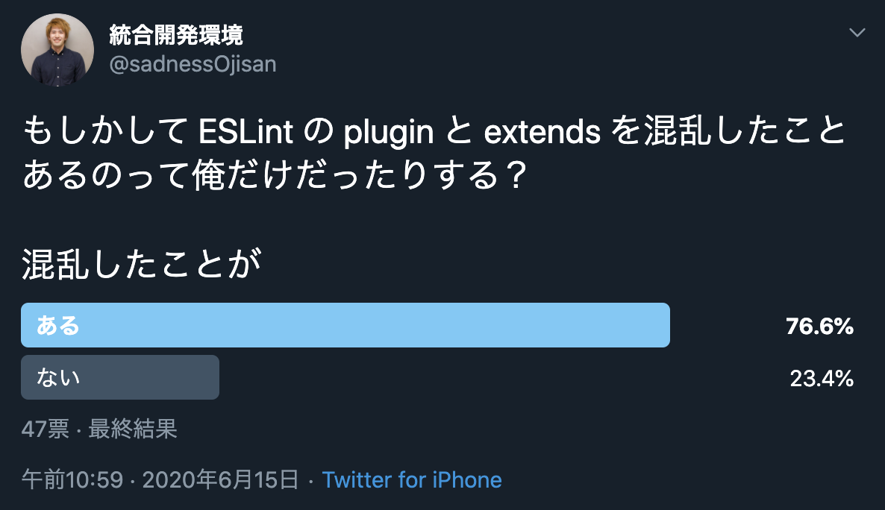

以前, [ESLint の plugin と extend について解説した記事](https://blog.ojisan.io/eslint-plugin-and-extend)を書いた時に、prettier と eslint の共存設定について触れました。
いま Google で検索すると、間違った情報や根拠に欠ける情報が上の方に出てきておりまして、混乱を助長していると思いましたので、根拠を示した記事を書きたいと思います。
この情報は 2020 年 6 月 23 日における公式ドキュメントやライブラリの実装を根拠に解説した記事です。

おそらく共存設定に悩んだことがある方は

- [eslint-config-prettier](https://github.com/prettier/eslint-config-prettier) と [eslint-plugin-prettier](https://github.com/prettier/eslint-plugin-prettier) の設定は両方必要？
- 公式 Doc みたら 2 つのプラグインを入れるのに、どうして ESLint の設定は extends だけでいいの？心配だし plugin にも設定書いていい？
- prettier は自分で入れる必要がある？

に悩むと思います。この記事ではそれらの疑問を解消していきます。

## 結論

ESLint と Prettier を共存させる場合、**「「「ESLint のスタイル設定を全部 OFF にし ESLint の中から Prettier を実行」」」**する。

> Whatever linting tool you wish to integrate with, the steps are broadly similar. First disable any existing formatting rules in your linter that may conflict with how Prettier wishes to format your code. Then you can either add an extension to your linting tool to format your file with Prettier - so that you only need a single command for format a file, or run your linter then Prettier as separate steps.

FYI: https://prettier.io/docs/en/integrating-with-linters.html

**具体的にやる作業は、 [eslint-config-prettier](https://github.com/prettier/eslint-config-prettier) と [eslint-plugin-prettier](https://github.com/prettier/eslint-plugin-prettier)を install して、eslint の設定ファイルに `{"extends": ["plugin:prettier/recommended"]}` を書くだけです。**この手順についても[公式](https://prettier.io/docs/en/integrating-with-linters.html#recommended-configuration)に書かれています。

では、

- なぜこの設定で ESLint のスタイル設定を全部 OFF にし ESLint の中から Prettier が実行できるのか
- どうして混乱しやすくなっていたのか

といった、公式ドキュメントには書かれていないことについて説明します。

## ESLint の plugin と extend

その説明を始める前に前提知識として、ESLint の plugin と extend の違いと関係について知る必要があります。
それは以前に書いた[ESLint の Plugin と Extend の違い](https://blog.ojisan.io/eslint-plugin-and-extend)にまとめてありますが、この記事を読むに当たっての前提だけをささっと書きます。
もし既にご存知でしたらこの章は飛ばしても大丈夫です。

ESLint は

```javascript:title=.eslintrc.js
module.exports = {
  extends: [
    "eslint:recommended",
    "plugin:react/recommended",
    "plugin:@typescript-eslint/recommended",
  ],
  plugins: ["react", "@typescript-eslint"],
  rules: {},
}
```

といった設定ファイルを持ちます。(これは `npx eslint --init` で生成したコードを適当に見やすく切り取ったもので、これ自体は設定としては不十分なものです。)

上の設定では `extends: [...]` の 中に `plugins:hoge` が入っていて、plugin と extends の関係が気になります。

extends は shareable config 読み込めます。
この sharable config には rule の設定以外に、plugin, env などの設定を含められます。
つまり、他のファイルに書かれている rules の記述や、plugin の記述を持ち込めます。
そしてこの sharable config は plugin の中にも定義できます。

そのため、 sharable config を extends に設定することで plugin を設定すると言ったことが可能になります。

## eslint-config-prettier の責務

[eslint-config-prettier](https://github.com/prettier/eslint-config-prettier) は

> Turns off all rules that are unnecessary or might conflict with Prettier.

とあり、ESLint と Prettier の競合設定における、ESLint 側の設定を全部 OFF にしてくれます。
具体的には style に関する設定を OFF にしくてれ、どのような設定がスタイルに関するものかどうかは eslint-config-prettier が管理しています。

公式サイトによると、

- @typescript-eslint/eslint-plugin
- eslint-plugin-babel
- eslint-plugin-flowtype
- eslint-plugin-react
- eslint-plugin-standard
- eslint-plugin-unicorn
- eslint-plugin-vue

で設定されるルールにおける、スタイルに関するものを OFF にできる config を**持ちます**。

ここで「持ちます」と書いたのは、この config を入れただけだと設定されたわけではないからです。
**どの plugin が入れた style のルールを OFF にするかはユーザーが自分で eslint の設定ファイルに書く必要があります。**

例えば、eslint 標準のルールにおける style に関する設定を OFF にする場合は、

```javascript:title=.eslintrc.js
module.exports = {
  extends: ["prettier"],
}
```

と書きます。

もし、TypeScript や React の設定を読み込んでいる場合は、

```javascript:title=.eslintrc.js
module.exports = {
  extends: ["prettier", "prettier/@typescript-eslint", "prettier/react"],
}
```

と書きます。

この "prettier/@typescript-eslint" という設定は、[@typescript-eslint/eslint-plugin](https://github.com/typescript-eslint/typescript-eslint/tree/master/packages/eslint-plugin) が注入する rule のうち style に関するものを OFF にし、"prettier/react" という設定は、[eslint-plugin-react](https://github.com/yannickcr/eslint-plugin-react) が注入する rule のうち style に関するものを OFF にします。

実装を見てみると、例えば eslint 組み込みの rule に対しては

```js
...

module.exports = {
  rules: Object.assign(
    {
      "arrow-body-style": 0,
      curly: 0,
      "lines-around-comment": 0,
      "max-len": 0,
      "no-confusing-arrow": 0,

      ...

      "operator-linebreak": "off",
      "padded-blocks": "off",
      "quote-props": "off",
      "rest-spread-spacing": "off",
      semi: "off",
      "semi-spacing": "off",
      "semi-style": "off",

      ...

  ),
}
```

といった sharable config が定義され export されています。

FYI: https://github.com/prettier/eslint-config-prettier/blob/master/index.js

他にも TypeScript の [@typescript-eslint/eslint-plugin](https://github.com/typescript-eslint/typescript-eslint/tree/master/packages/eslint-plugin)ルール に対しては

```js
"use strict"

module.exports = {
  rules: {
    "@typescript-eslint/quotes": 0,
    "@typescript-eslint/brace-style": "off",
    "@typescript-eslint/comma-spacing": "off",
    "@typescript-eslint/func-call-spacing": "off",
    "@typescript-eslint/indent": "off",
    "@typescript-eslint/keyword-spacing": "off",
    "@typescript-eslint/member-delimiter-style": "off",
    "@typescript-eslint/no-extra-parens": "off",
    "@typescript-eslint/no-extra-semi": "off",
    "@typescript-eslint/semi": "off",
    "@typescript-eslint/space-before-function-paren": "off",
    "@typescript-eslint/type-annotation-spacing": "off",
  },
}
```

FYI: https://github.com/prettier/eslint-config-prettier/blob/master/%40typescript-eslint.js

といった sharable config が定義され export されています。

もちろん、extends には他の設定を書かれていると思います。
たとえば最初の例では、

```javascript:title=.eslintrc.js
module.exports = {
  extends: [
    "eslint:recommended",
    "plugin:react/recommended",
    "plugin:@typescript-eslint/recommended",
  ],
  plugins: ["react", "@typescript-eslint"],
  rules: {},
}
```

のような設定を書きました。

この場合、style に関する rule を off にする extend の設定は、 **extends の最後**に書いてください。
[公式](https://prettier.io/docs/en/integrating-with-linters.html)でも

> Make sure to put it last in the extends array, so it gets the chance to override other configs.

と言及されています。
後から足された config によって style の設定が ON になるかもしれないため、このようなやり方になっています。

## eslint-plugin-prettier の責務

一方で [eslint-plugin-prettier](https://github.com/prettier/eslint-plugin-prettier) は何をしているでしょうか。
これが prettier の実行をになっています。(本当はそれだけではないのですが、そのことが混乱の元凶でもあるので説明は後で詳しくします。)

この plugin は公式には

> Runs Prettier as an ESLint rule and reports differences as individual ESLint issues.

と説明されており、**ESLint の世界から prettier を実行し、そこで見つけた format のエラーを ESLint 上でのエラーとして報告してくれる**ライブラリです。

ライブラリの実装も 1 ファイルだけでとてもシンプルなものです。

FYI: https://github.com/prettier/eslint-plugin-prettier/blob/master/eslint-plugin-prettier.js

```js
...

// ここで prettier を読み込んで
if (!prettier) {
  prettier = require('prettier');
}

...

let prettierSource;
try {
    // ここで 整形して
  prettierSource = prettier.format(source, prettierOptions);
} catch (err) {
  if (!(err instanceof SyntaxError)) {
    throw err;
}

...

// ここで ESLintのエラーとして報告する
context.report({ message, loc: err.loc });
return;
```

ところで、 ESLint と Prettier の共通設定をする時は、あらかじめ prettier はユーザー側で読み込んでおく必要があるといった話を聞いたことがあるかもしれません。
その理由がまさしく、 `prettier = require('prettier');` です。

実際、eslint-plugin-prettier の package.json は

```json
{
  ...
  "dependencies": {
    "prettier-linter-helpers": "^1.0.0"
  },
  "peerDependencies": {
    "eslint": ">=5.0.0",
    "prettier": ">=1.13.0"
  },
  "devDependencies": {
    ...
    "vue-eslint-parser": "^6.0.0"
  },
  ...
}
```

FYI: https://github.com/prettier/eslint-plugin-prettier/blob/master/package.json

となっており、peerDependencies に prettier が指定されています。
prettier は各自で入れておきましょう。

そのため行うべき設定は

```sh
npm install -D eslint-plugin-prettier prettier
```

をした上で、

```js
module.exports = {
  plugins: ["prettier"],
  rules: {
    "prettier/prettier": "error",
  },
}
```

という設定ファイルを書くことです。

## なぜ extend の設定だけでいいか

ここまでで 2 つの plugin の設定について書きました。

情報を総合すると

```js
module.exports = {
  extends: ["prettier"],
  plugins: ["prettier"],
  rules: {
    "prettier/prettier": "error",
  },
}
```

と書けば良さそうです。

しかし、実際には

```js
module.exports = {
  extends: ["plugin:prettier/recommended"],
}
```

が正解です。

どういうことでしょうか。

それは**eslint-plugin-prettier に含まれる sharable config が全て設定してくれる**ためです。

`extends: ["plugin:prettier/recommended"]` の実体も [ここ](https://github.com/prettier/eslint-plugin-prettier/blob/master/eslint-plugin-prettier.js)に含まれており、

```js
module.exports = {
  configs: {
    recommended: {
      extends: ['prettier'],
      plugins: ['prettier'],
      rules: {
        'prettier/prettier': 'error'
      }
    }
  },
  rules: {
      ...
  },
}
```

として定義されています。

そのため不要でした。

また extends に prettier が指定されていることは、[eslint-config-prettier](https://github.com/prettier/eslint-config-prettier) における ESLint 標準ルールのスタイル OFF 設定も含まれています。

そのため

```sh
$ npm i -D eslint-plugin-prettier eslint-config-prettier prettier
```

を実行し、

```js
module.exports = {
  extends: ["plugin:prettier/recommended"],
}
```

とすれば、

```js
module.exports = {
  extends: ["prettier"],
  plugins: ["prettier"],
  rules: {
    "prettier/prettier": "error",
  },
}
```

が設定されたとことと同義であり、

- 衝突の原因である ESLint 側のスタイル設定が OFF になる
- ESLint の実行で prettier が実行される
- style の崩れを prettier が検知すれば、それは ESLint のエラーとして報告される

となります。

もちろん ESLint 組み込みのルール以外(TS, React の設定など)を使っている場合は、その config は自分で入れる必要があります。

例)

```sh
$ npm i -D eslint-plugin-prettier eslint-config-prettier @typescript-eslint/eslint-plugin @typescript-eslint/eslint-plugin eslint-plugin-react prettier
```

```javascript:title=.eslintrc.js
module.exports = {
  extends: [
    "eslint:recommended",
    "plugin:react/recommended",
    "plugin:@typescript-eslint/recommended",
    "plugin:prettier/recommended",
    "prettier/@typescript-eslint",
    "prettier/react",
  ],
  plugins: ["react", "@typescript-eslint"],
  rules: {},
}
```

検証コード: https://github.com/ojisan-toybox/eslint-prettier-angry

## 混乱の原因は何だったか

結論からして、共存設定は **[eslint-config-prettier](https://github.com/prettier/eslint-config-prettier) と [eslint-plugin-prettier](https://prettier.io/docs/en/integrating-with-linters.html)を install して、eslint の設定ファイルに `{"extends": ["plugin:prettier/recommended"]}` を書くだけです。**(※ TS, React などの plugin を書いているなら他にも eslint-config-prettier に含まれている sharable config を書く必要がある。)

こんなに単純なのにどうして混乱するのでしょうか。
おそらく次の 3 つだと思っています。

### eslint の設定ファイルの extends に config を書くだけでいいのに、config と plugin 両方の install が必要

設定ファイルとしては

```javascript:title=.eslintrc.js
module.exports = {
  extends: ["plugin:prettier/recommended"],
}
```

ですが、これは sharable config なので、その config の実態は

```javascript:title=.eslintrc.js
module.exports = {
  extends: ["prettier"],
  plugins: ["prettier"],
  rules: {
    "prettier/prettier": "error",
  },
}
```

です。

plugin の設定はされるものの、その plugin 自体は手元に必要なので、config と plugin 双方の install が必要です。
またその plugin は prettier の実行を担うので、prettier 本体も手元に必要です。

```sh
$ npm i -D eslint-plugin-prettier eslint-config-prettier prettier
```

### plugin の sharable config で extends の設定を補えることに気づけない

eslint-plugin-prettier を　 eslint で使うための config がそれ本体に含まれていることを知る必要がありました。
これに気付くためには ESLint の extend の plugin の違いや関係を理解する必要があり、特に plugin に sharable config という仕組みを知っておく必要がありました。
実際のところ Twitter で extend の plugin の違い についてアンケートを取ったところ大勢の方が混乱していそうです。
（私のフォロワーはフロントエンドの方がほとんどなので、その方ですら混乱しているので非常に難しい分野なのだと思います）



FYI: https://twitter.com/sadnessOjisan/status/1272347998370975744

### prettier/\*\* という extends の実体が名前からでは見えづらい

```javascript:title=.eslintrc.js
module.exports = {
  extends: [
    ...
    "plugin:prettier/recommended",
    "prettier/@typescript-eslint",
    "prettier/react",
  ],
  ...
}
```

とあったとして、これらが何かが名前からでは見えづらいです。
ましてや[eslint-config-prettier](https://github.com/prettier/eslint-config-prettier) と [eslint-plugin-prettier](https://github.com/prettier/eslint-plugin-prettier)といった似たような名前があるので、混乱もしやすいです。

**これらは eslint-config-prettier に含まれる sharable config で、各 plugin が注入するルールのうちスタイルに関するルールの設定を OFF にするもの**と覚えておきましょう。

## 改めて結論

必要なパッケージを install

```sh
npm install -D eslint-plugin-prettier prettier
```

共存設定はこれだけ

```javascript:title=.eslintrc.js
module.exports = {
  extends: ["plugin:prettier/recommended"],
}
```

もし、他の ESLint plugin を使っているなら、その plugin が ON にできるスタイルを OFF にする config を追加する。
その config はすでに eslint-config-prettier が持っているので npm から DL する必要はない。
たとえば、TS と React の plugin を使っているのならば、

```javascript:title=.eslintrc.js
module.exports = {
  extends: [
    "plugin:prettier/recommended",
    "prettier/@typescript-eslint",
    "prettier/react",
  ],
  plugins: ["react", "@typescript-eslint"],
  rules: {},
}
```

となる。
