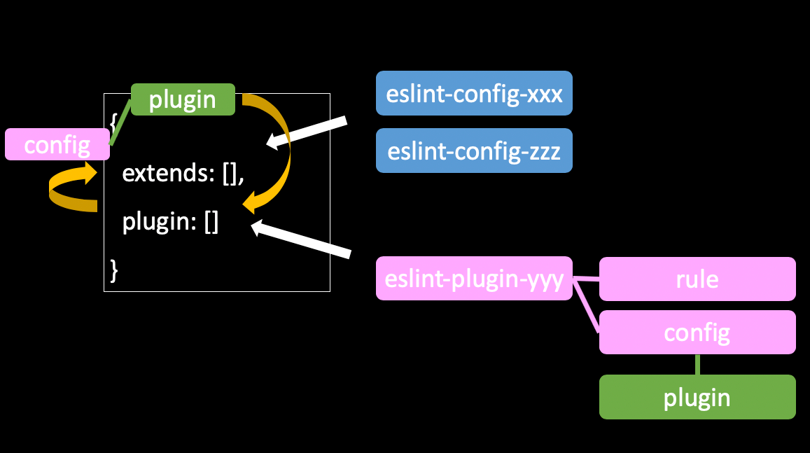
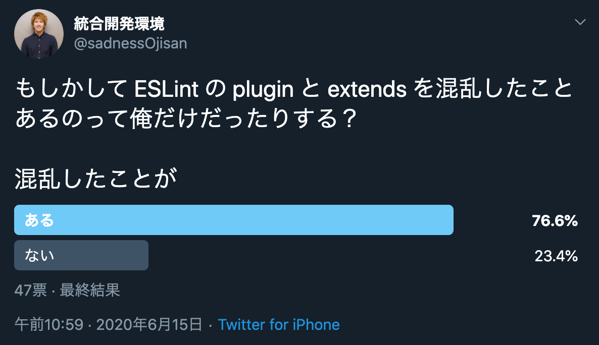

# 注意

この記事は 2020 年 09 月 24 日現在、古い情報となりました。
[eslint-plugin-prettier](https://github.com/prettier/eslint-plugin-prettier) の利用は非推奨であると公式がアナウンスを出しています。
そのことについては [Prettier と ESLint の組み合わせの公式推奨が変わった](/prettier-eslint-cli) にてまとめましたので、こちらもご覧ください。

また eslint-plugin-prettier は公式推奨ではなくなりましたが、それは Editor などの外部環境の進化によるものでこのプラグイン自体に何か問題が起きたわけではありません。
そして eslint-plugin-prettier を利用した設定方法、特に eslint-plugin-prettier と eslint-config-prettier が何を解決していたかを知らないと、prettier-eslint が何をどう解決したかを理解できないはずなのでこの記事はそのまま残します。そう言う意味では 2020 年 09 月 24 日現在もこの情報は有用なので興味がある方は一読すると良いでしょう。
ESLint の仕組みについて詳しくなれると思います。

# 本文

以前, [ESLint の plugin と extend について解説した記事](https://blog.ojisan.io/eslint-plugin-and-extend)を書いた際に、[Prettier](https://github.com/prettier) と [ESLint](https://eslint.org/) の共存設定について触れました。
いま Google で「Prettier ESLint」などで検索すると、最善とは言えない情報（重複した設定をしている）や根拠に欠ける情報が上の方に出てきており、混乱を助長していると思いましたので、根拠を示した記事を書きたいと思います。
この情報は 2020 年 6 月 24 日における公式ドキュメントやライブラリの実装を根拠に解説した記事です。

(追記) https://dackdive.hateblo.jp/entry/2019/03/15/100000 が日本語の文献だと正しく簡潔にまとまっています。
これから始める解説は少々分量があり読みにくいところもあるかと思いますので、正しく簡潔に理解したい方はこちらの記事を参照すると良いです。
私も執筆時に参考にしていました。

おそらく共存設定に悩んだことがある方、もしくはこれから悩む方は

- [eslint-config-prettier](https://github.com/prettier/eslint-config-prettier) と [eslint-plugin-prettier](https://github.com/prettier/eslint-plugin-prettier) の設定は両方必要？
- 公式 Doc みたら 2 つのライブラリを入れるのに、どうして ESLint の設定は extends だけでいいの？心配だし plugin にも設定書いていい？
- prettier は自分で入れる必要がある？

に悩むと思います。この記事ではそれらの疑問を根拠を持って解消していきます。

## 結論

ESLint と Prettier を共存させる場合、**「「「ESLint のスタイル設定を全部 OFF にし ESLint の中から Prettier を実行」」」** します。
公式ドキュメントにも明記されています。

> Whatever linting tool you wish to integrate with, the steps are broadly similar. First disable any existing formatting rules in your linter that may conflict with how Prettier wishes to format your code. Then you can either add an extension to your linting tool to format your file with Prettier - so that you only need a single command for format a file, or run your linter then Prettier as separate steps.

FYI: https://prettier.io/docs/en/integrating-with-linters.html

**具体的にやる作業は、 [eslint-config-prettier](https://github.com/prettier/eslint-config-prettier) と [eslint-plugin-prettier](https://github.com/prettier/eslint-plugin-prettier)を install して、eslint の設定ファイルに `{"extends": ["plugin:prettier/recommended"]}` を書くだけです。**この手順についても[公式](https://prettier.io/docs/en/integrating-with-linters.html#recommended-configuration)に書かれています。

では、

- なぜこの設定で実現できるのか
- どうして混乱しやすくなっていたのか

といった、そのドキュメントには書かれていないことについて、ドキュメントの断片・実装・サンプルコードから説明します。

## ESLint の plugin と extend

その説明を始める前に前提知識として、ESLint の plugin と extend の違いと関係について知る必要があります。
それは以前に書いた[ESLint の Plugin と Extend の違い](https://blog.ojisan.io/eslint-plugin-and-extend)にまとめてありますが、この記事を読むに当たっての前提だけをささっと書きます。
もし既にご存知でしたらこの章は飛ばしても大丈夫です。
このイメージがあれば大丈夫です。



ESLint は

```javascript:title=.eslintrc.js
module.exports = {
  extends: [
    "eslint:recommended",
    "plugin:react/recommended",
    "plugin:@typescript-eslint/recommended",
  ],
  plugins: ["react", "@typescript-eslint"],
  rules: {},
}
```

といった設定ファイルを持ちます。
上の設定では `extends: [...]` の 中に `plugins:hoge` が入っていて、plugin と extends の関係が気になります。

### extends は config を読み込める

**extends では shareable config 読み込めます。**
この sharable config には rule の設定以外に、plugin, env などの設定を含められます。
つまり、他のファイルに書かれている rules の記述や、plugin の記述を持ち込めます。
sharable config とはこのファイルではない .eslintrc と捉えると良いかもしれません。
他の人が書いた(自分が書いたものでもいいのですが) .eslintrc で 自分の .eslintrc を拡張できるイメージです。

### plugin の中に sharable config を定義できる

一方で plugin は config の実装を提供します。
つまり config が rule の ON/OFF を設定するのに対して、その rule 自体の実装を提供します。
ただそれだけではなく、ここが一番ややこしいポイントなのですが、plugin は sharable config も提供できます。

```javascript:title=eslint-plugin-myPlugin.js
module.exports = {
  configs: {
    myConfig: {
      plugins: [""],
      env: [""],
      rules: {
    }
  },
}
```

FYI: https://eslint.org/docs/developer-guide/working-with-plugins

その Plugin に含まれた config は eslint の設定ファイル上で

```javascript:title=.eslintrc.js
module.exports = {
  extends: ["plugin:myPlugin/myConfig"],
}
```

として読み込めます。

### config の中に plugin の読み込み設定を書ける

先ほどの eslint-plugin-myPlugin.js では

```javascript:title=eslint-plugin-myPlugin.js
module.exports = {
  configs: {
    myConfig: {
      plugins: [""],
      env: [""],
      rules: {
    }
  },
}
```

とあるように、config の中で plugin を指定できます。
これは、 **plugin に定義されている config を extends に指定するだけで、その config に plugin の読み込み設定が書かれていれば、 plugin の設定を書かずとも plugin の設定をできる**ということです。
これは ESLint と Prettier の設定の混乱の原因の一つでもあるので覚えておきましょう。

それでは Prettier が提供している plugin や config についてみていきましょう。

## eslint-config-prettier の責務

[eslint-config-prettier](https://github.com/prettier/eslint-config-prettier) は

> Turns off all rules that are unnecessary or might conflict with Prettier.

とあり、**ESLint と Prettier の競合設定における、ESLint 側の設定を全部 OFF** にしてくれます。
具体的には style に関する設定を OFF にしくてれ、どのような設定がスタイルに関するものかどうかは eslint-config-prettier が管理しています。

### 各 plugin が持つスタイル設定を OFF にできる

公式サイトによると、

- @typescript-eslint/eslint-plugin
- eslint-plugin-babel
- eslint-plugin-flowtype
- eslint-plugin-react
- eslint-plugin-standard
- eslint-plugin-unicorn
- eslint-plugin-vue

で設定されるルールにおける、スタイルに関するものを OFF にできる config を**持ちます**。

ここで「持ちます」と書いたのは、この config を入れただけだと設定されたわけではないからです。
**どの plugin が入れた style のルールを OFF にするかはユーザーが自分で eslint の設定ファイルに書く必要があります。**

例えば、eslint 標準のルールにおける style に関する設定を OFF にする場合は、

```javascript:title=.eslintrc.js
module.exports = {
  extends: ["prettier"],
}
```

と書きます。

もし、TypeScript や React の設定を読み込んでいる場合は、

```javascript:title=.eslintrc.js
module.exports = {
  extends: ["prettier", "prettier/@typescript-eslint", "prettier/react"],
}
```

と書きます。

この "prettier/@typescript-eslint" という設定は、[@typescript-eslint/eslint-plugin](https://github.com/typescript-eslint/typescript-eslint/tree/master/packages/eslint-plugin) が注入する rule のうち style に関するものを OFF にし、"prettier/react" という設定は、[eslint-plugin-react](https://github.com/yannickcr/eslint-plugin-react) が注入する rule のうち style に関するものを OFF にします。

### スタイル設定を OFF にする config の実装

実装を見てみると、例えば eslint 組み込みの rule に対しては

```javascript:title=index.js
...

module.exports = {
  rules: Object.assign(
    {
      "arrow-body-style": 0,
      "lines-around-comment": 0,
      "max-len": 0,
      "no-confusing-arrow": 0,

      ...

      "operator-linebreak": "off",
      "padded-blocks": "off",
      "quote-props": "off",
      "rest-spread-spacing": "off",
      "semi-spacing": "off",
      "semi-style": "off",

      ...

  ),
}
```

といった 特定のルールを OFF にする sharable config が定義され export されています。

FYI: https://github.com/prettier/eslint-config-prettier/blob/master/index.js

他にも TypeScript の [@typescript-eslint/eslint-plugin](https://github.com/typescript-eslint/typescript-eslint/tree/master/packages/eslint-plugin)ルール に対しては

```javascript:title=@typescript-eslint.js
"use strict"

module.exports = {
  rules: {
    "@typescript-eslint/quotes": 0,
    "@typescript-eslint/brace-style": "off",
    "@typescript-eslint/comma-spacing": "off",
    "@typescript-eslint/func-call-spacing": "off",
    "@typescript-eslint/indent": "off",
    "@typescript-eslint/keyword-spacing": "off",
    "@typescript-eslint/member-delimiter-style": "off",
    "@typescript-eslint/no-extra-parens": "off",
    "@typescript-eslint/no-extra-semi": "off",
    "@typescript-eslint/semi": "off",
    "@typescript-eslint/space-before-function-paren": "off",
    "@typescript-eslint/type-annotation-spacing": "off",
  },
}
```

FYI: https://github.com/prettier/eslint-config-prettier/blob/master/%40typescript-eslint.js

といった 特定のルールを OFF にする sharable config が定義され export されています。

### extends のどこに設定を書くか

もちろん、extends には prettier の競合回避設定以外の設定も書かれていると思います。
たとえば最初の例では、

```javascript:title=.eslintrc.js
module.exports = {
  extends: [
    "eslint:recommended",
    "plugin:react/recommended",
    "plugin:@typescript-eslint/recommended",
  ],
  plugins: ["react", "@typescript-eslint"],
  rules: {},
}
```

のような設定を書きました。

この場合、style に関する rule を off にする extend の設定は、 **extends の最後**に書いてください。
[公式](https://prettier.io/docs/en/integrating-with-linters.html)でも

> Make sure to put it last in the extends array, so it gets the chance to override other configs.

と言及されています。
後から足された config によって style の設定が ON になるかもしれないため、このようなやり方になっています。

## eslint-plugin-prettier の責務

一方で [eslint-plugin-prettier](https://github.com/prettier/eslint-plugin-prettier) は何をしているでしょうか。
これが prettier の実行をになっています。

この plugin は公式には

> Runs Prettier as an ESLint rule and reports differences as individual ESLint issues.

と説明されており、**ESLint の世界から prettier を実行し、そこで見つけた format のエラーを ESLint 上でのエラーとして報告してくれる**ライブラリです。

### 1 ファイルだけのシンプルな実装

ライブラリの本体も 1 ファイルだけでとてもシンプルなものです。

```javascript:title=eslint-plugin-prettier.js
...

rules: {
    prettier: {

...

// ここで prettier を読み込んで
if (!prettier) {
  prettier = require('prettier');
}

...

let prettierSource;
try {
    // ここで 整形して
  prettierSource = prettier.format(source, prettierOptions);
} catch (err) {
  if (!(err instanceof SyntaxError)) {
    throw err;
}

...

// ここで ESLintのエラーとして報告する
context.report({ message, loc: err.loc });
return;
```

FYI: https://github.com/prettier/eslint-plugin-prettier/blob/master/eslint-plugin-prettier.js

### prettier の実行エラーをエラーとして報告する

ESLint の rule は `0, 1, 2` や `off, warn, error` といった値で、その rule の違反をどう扱うかを決められます。
いわゆる rule field に書く プロパティとその設定をどう設定するかという話です。
ここでは ESLint で起きた Prettier のエラーをエラーとして扱いたいので、そのことを rule に記述します。

実装では

```javascript:title=eslint-plugin-prettier.js
module.exports = {
  configs: {
    ...
  },
  rules: {
    prettier: {
      ...
```

と定義されているので、ルール名は prettier です。

```javascript:title=.eslintrc.js
module.exports = {
  rules: {
    "prettier/prettier": "error",
  },
}
```

と書けば良さそうです。
rules の プロパティは `${plugin名}/${ルール名}` です。
plugin 名は、eslint-plugin-foo だと foo を指し、ここでは prettier が plugin 名です。
そのため、 `"prettier/prettier": "error",` と指定します。

FYI: https://eslint.org/docs/user-guide/configuring#use-a-plugin

### prettier はユーザーが install しておく必要がある

ところで、 ESLint と Prettier の共通設定をする時は、あらかじめ prettier はユーザー側で読み込んでおく必要があるといった話を聞いたことがあるかもしれません。
その理由がまさしく、先ほどのコード内にあった `prettier = require('prettier');` です。

実際、eslint-plugin-prettier の package.json は

```json:title=package.json
{
  ...
  "dependencies": {
    "prettier-linter-helpers": "^1.0.0"
  },
  "peerDependencies": {
    "eslint": ">=5.0.0",
    "prettier": ">=1.13.0"
  },
  "devDependencies": {
    ...
    "vue-eslint-parser": "^6.0.0"
  },
  ...
}
```

FYI: https://github.com/prettier/eslint-plugin-prettier/blob/master/package.json

となっており、peerDependencies に prettier が指定されています。
つまり prettier は開発者側にあらかじめ必要です。
prettier は各自で入れておきましょう。

そのため、行うべき設定とは

```sh
$ npm install -D eslint-plugin-prettier prettier
```

と必要パッケージを install した上で、

```javascript:title=.eslintrc.js
module.exports = {
  plugins: ["prettier"],
  rules: {
    "prettier/prettier": "error",
  },
}
```

という eslint の設定ファイルを書くことです。

## なぜ extend の設定だけでいいか

ここまでの情報を総合すると、[eslint-config-prettier](https://github.com/prettier/eslint-config-prettier) と [eslint-plugin-prettier](https://github.com/prettier/eslint-plugin-prettier) を使う設定は、

```javascript:title=.eslintrc.js
module.exports = {
  extends: ["prettier"],
  plugins: ["prettier"],
  rules: {
    "prettier/prettier": "error",
  },
}
```

となりそうです。
しかし、実際には

```javascript:title=.eslintrc.js
module.exports = {
  extends: ["plugin:prettier/recommended"],
}
```

という設定が正解です。
これは**eslint-plugin-prettier に含まれる sharable config が全て設定してくれる**ためです。
この`extends: ["plugin:prettier/recommended"]` の実体を見てみましょう。
その実装は [ここ](https://github.com/prettier/eslint-plugin-prettier/blob/master/eslint-plugin-prettier.js)に含まれており、

```javascript:title=eslint-plugin-prettier.js
module.exports = {
  configs: {
    recommended: {
      extends: ['prettier'],
      plugins: ['prettier'],
      rules: {
        'prettier/prettier': 'error'
      }
    }
  },
  rules: {
      ...
  },
}
```

として定義されています。
そのため extends や rules の設定を書かずとも、eslint-plugin-prettier で定義されている sharable cofnig を読み込むと、extends や rules の設定が自動で行われるというカラクリがあります。
また extends に prettier が指定されていることは、[eslint-config-prettier](https://github.com/prettier/eslint-config-prettier) における ESLint 標準ルールのスタイル OFF 設定も含まれています。
そのため

```sh
$ npm i -D eslint-plugin-prettier eslint-config-prettier prettier
```

を実行し、

```javascript:title=.eslintrc.js
module.exports = {
  extends: ["plugin:prettier/recommended"],
}
```

とすれば、

```javascript:title=.eslintrc.js
module.exports = {
  extends: ["prettier"],
  plugins: ["prettier"],
  rules: {
    "prettier/prettier": "error",
  },
}
```

が設定されたとことと同義であり、

- 衝突の原因である ESLint 側のスタイル設定が OFF になる
- ESLint の実行で prettier が実行される
- style の崩れを prettier が検知すれば、それは ESLint のエラーとして報告される

となります。
もちろん ESLint 組み込みのルール以外(TS, React の設定など)を使っている場合は、その config は自分で入れる必要があります。

### TS, React などを併用するときの設定

TS, React などを併用するときの設定は、こういった TS, React 用の ESLint plugin が入っているとして、

```sh
$ npm i -D @typescript-eslint/eslint-plugin eslint-plugin-react
```

prettier 用の plugin, config を install して、

```sh
$ npm i -D eslint-plugin-prettier eslint-config-prettier prettier
```

config の中にある TS, React 用の設定を入れることで実現できます。

```javascript:title=.eslintrc.js
module.exports = {
  extends: [
    "eslint:recommended",
    "plugin:react/recommended",
    "plugin:@typescript-eslint/recommended",
    "plugin:prettier/recommended",
    "prettier/@typescript-eslint",
    "prettier/react",
  ],
  plugins: ["react", "@typescript-eslint"],
  rules: {},
}
```

検証コード: https://github.com/ojisan-toybox/eslint-prettier-angry

## 混乱の原因は何だったか

結論からして、共存設定は **[eslint-config-prettier](https://github.com/prettier/eslint-config-prettier) と [eslint-plugin-prettier](https://prettier.io/docs/en/integrating-with-linters.html)を install して、eslint の設定ファイルに `{"extends": ["plugin:prettier/recommended"]}` を書くだけです。**(※ TS, React などの plugin を書いているなら他にも eslint-config-prettier に含まれている sharable config を書く必要がある。)

こんなに単純なのにどうして混乱するのでしょうか。
おそらく次の 3 つだと思っています。

### eslint の設定ファイルの extends に config を書くだけでいいのに、config と plugin 両方の install が必要

設定ファイルとしては

```javascript:title=.eslintrc.js
module.exports = {
  extends: ["plugin:prettier/recommended"],
}
```

ですが、これは sharable config なので、その config の実態は

```javascript:title=.eslintrc.js
module.exports = {
  extends: ["prettier"],
  plugins: ["prettier"],
  rules: {
    "prettier/prettier": "error",
  },
}
```

です。

plugin の設定はされるものの、その plugin 自体は手元に必要なので、config と plugin 双方の install が必要です。
またその plugin は prettier の実行を担うので、prettier 本体も手元に必要です。

```sh
$ npm i -D eslint-plugin-prettier eslint-config-prettier prettier
```

**設定ファイルに `eslint-config-prettier` は出てこないのに、 それを入れる必要があるのが混乱の原因**になっています。
一般的には その sharable config は plugin の実装も中に含まれるはずなので、plugin を入れるだけで済むはずなのに、Prettier は sharable config を cofig としてライブラリを分離しているのでそのようなことが起きています。

### plugin の sharable config で extends の設定を補えることに気づけない

eslint-plugin-prettier を eslint で使うための config は、eslint-plugin-prettier それ本体に recommended config として含まれていることを知る必要もあります。
これに気付くためには ESLint の extend の plugin の違いや関係を理解する必要があり、特に plugin に sharable config という仕組みを知っておく必要がありました。
実際のところ Twitter で extend の plugin の違い についてアンケートを取ったところ大勢の方が混乱していそうです。



FYI: https://twitter.com/sadnessOjisan/status/1272347998370975744

### prettier/\*\* という extends の実体が名前からでは見えづらい

```javascript:title=.eslintrc.js
module.exports = {
  extends: [
    ...
    "plugin:prettier/recommended",
    "prettier/@typescript-eslint",
    "prettier/react",
  ],
  ...
}
```

とあったとして、これらが何かが名前からでは見えづらいです。
この設定から**これらは eslint-config-prettier に含まれる sharable config で、各 plugin が注入するルールのうちスタイルに関するルールの設定を OFF にする**とは読み取れないです。
ましてや[eslint-config-prettier](https://github.com/prettier/eslint-config-prettier) と [eslint-plugin-prettier](https://github.com/prettier/eslint-plugin-prettier)といった似たような名前があるので、混乱もしやすいです。
prettier/@typescript-eslint も prettier/react もそれ用のライブラリがあるかのような設定名で、eslint-config-prettier にそれらの config が含まれていることは気付きにくいです。

## 改めて結論

やることはたったのこれだけです。

必要なパッケージを install します。

```sh
npm install -D eslint-plugin-prettier eslint-config-prettier prettier
```

共存設定として eslint-plugin-prettier に含まれている sharable config を書きます。

```javascript:title=.eslintrc.js
module.exports = {
  extends: ["plugin:prettier/recommended"],
}
```

もし、他の ESLint plugin を使っているなら、その plugin が ON にできるスタイルを OFF にする config を追加します。
それらは eslint-config-prettier に含まれています。
たとえば、TS と React の plugin を使っているのならば、

```javascript:title=.eslintrc.js
module.exports = {
  extends: [
    "plugin:prettier/recommended",
    "prettier/@typescript-eslint",
    "prettier/react",
  ],
  plugins: ["react", "@typescript-eslint"],
  rules: {},
}
```

となります。

実際に plugin のルールにスタイル関連で怒られてみて、それを prettier の config を入れることで解消されるかどうかという実験は [こちら](https://github.com/ojisan-toybox/eslint-prettier-angry)で行いましたので、もしまだ実感が持てないという方はお手元でお試しください。
