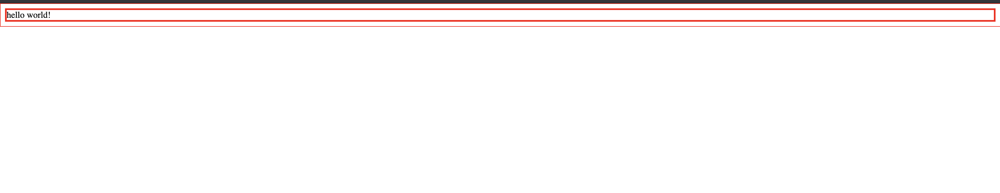

css-loader と style-loader どっちがどっちかってたまになるので、そうならないための備忘です。
これらは webpack の loader であり、JS で構築されるアプリケーション内で CSS を扱うために利用されます。
最近は CSS in JS の利用も増え、CSS ファイルを読み込む機会は減ってはきているものの、reset.css を読み込んだり、UI ライブラリが提供するグローバルな CSS を読み込んだりと CSS を直接 JS に import する機会はまだまだ多いと思います。
そして 1 ファイルでも CSS を読み込むなら loader にその設定が必要となるので、まだまだお世話になり続けるでしょう。

そんな利用機会の多い css-loader & style-loader ですが、呪文のように使われ続けてる印象があります。
そのせいかどっちがどっちか理解されていない印象もあります。
事実 [Stack overflow](https://stackoverflow.com/questions/34039826/webpack-style-loader-vs-css-loader) では vote も集まっています。
そんな **css-loader と style-loader を取り違えてしまう大きな原因は、これらが同時に出現することにあると思うので、片方だけ使ってみる**ということに挑戦して、「この 2 つはこういう違いがあるよ」と言う説明を試みます。

## css-loader とは

[css-loader](https://github.com/webpack-contrib/css-loader)は,

> The css-loader interprets @import and url() like import/require() and will resolve them.

とあり、JS の世界にある CSS のファイルを解決できる loader です。
JS ファイル内で読み込まれる CSS を文字列として JS の世界に持ち込めます。

JS 内で CSS を扱うための便利な機能が含まれており、たとえば modules option を使えば CSS Modules も実現できます。

```javascript:title=webpack.config.js
module.exports = {
  module: {
    rules: [
      {
        test: /\.css$/i,
        loader: "css-loader",
        options: {
          // いろいろなオプションを使って、CSSをJSで扱うための便利な機能をONにできる！！！！
          modules: true,
        },
      },
    ],
  },
}
```

## style-loader とは

[style-loader](https://github.com/webpack-contrib/style-loader) は,

> Inject CSS into the DOM.

とあり、JS の中にある CSS 文字列を DOM に挿入する役割を担います。
そのため、CSS をページに反映させるために必要になってくる loader です。

DOM への挿入方法は、injectType option で指定できます。
大きくは styleTag か linkTag のどちらかに挿入します。
default では styleTag に挿入し、そのまま CSS を展開します。

一方で linkTag オプションを使えば、file を import するための別の loader が必要になるものの、CSS ファイルへの path を埋め込むことができます。
（HTML ファイルに CSS を展開しない）

```js
module.exports = {
  module: {
    rules: [
      {
        test: /\.link\.css$/i,
        use: [
          { loader: "style-loader", options: { injectType: "linkTag" } },
          { loader: "file-loader" },
        ],
      },
    ],
  },
}
```

## なぜ取り違えるのか

なぜかこの 2 つは同時に出現します。

css-loader の公式は、

```javascript:title=webpack.config.js
module.exports = {
  module: {
    rules: [
      {
        test: /\.css$/i,
        use: ["style-loader", "css-loader"],
      },
    ],
  },
}
```

というサンプルコードを提供し、style-loader も

```javascript:title=webpack.config.js
module.exports = {
  module: {
    rules: [
      {
        test: /\.css$/i,
        use: ["style-loader", "css-loader"],
      },
    ],
  },
}
```

というサンプルコードを提供しています。

まるでこれらは単品で使えないかのようにも見えますので、単品で使うことに挑戦してみましょう。

## style-loader だけを使ってみよう

css-loader は CSS を JS の世界に import できるようにしているだけと考えると、これは別のライブラリでも代用できそうです。
それをシンプルに実現できる[raw-loader](https://github.com/webpack-contrib/raw-loader)を使います。

raw-loader は,

> A loader for webpack that allows importing files as a String.

とあり、import したファイルを文字列にして JS の世界に入れます。

raw-loader 本体の実装は

```javascript:title=index.js
import { getOptions } from "loader-utils"
import validateOptions from "schema-utils"

import schema from "./options.json"

export default function rawLoader(source) {
  const options = getOptions(this)

  validateOptions(schema, options, {
    name: "Raw Loader",
    baseDataPath: "options",
  })

  const json = JSON.stringify(source)
    .replace(/\u2028/g, "\\u2028")
    .replace(/\u2029/g, "\\u2029")

  const esModule =
    typeof options.esModule !== "undefined" ? options.esModule : true

  return `${esModule ? "export default" : "module.exports ="} ${json};`
}
```

と、非常にシンプルです。
これがやっていることは、import したコードを文字列に変換して、そのまま後続の loader に渡しているだけです。

なぜ return する文字列が `export default` や `module.export=`しているかはそれこそが loader と webpack の仕組みだからです。
bundle された文字列は最終的に eval されます。
そのため loader で export しておくと、他のファイルの import を評価してそのコードが読み取れるようになります。
この記事は loader の仕組みについて解説するものではないので説明は端折りますが、詳しくは [ミニマムな webpack loader](https://naoty.dev/posts/80.html)という記事を読むと良いでしょう。
最小構成の webpack loader を自作することを通して loader の仕組みを学べて面白いです。

この raw-loader は JS の世界に CSS を持ち込む責務を担えるので、その役割に関しては css-loader の代わりに使えます。

実際、

```javascript:title=webpack.config.js
const HtmlWebpackPlugin = require("html-webpack-plugin")
const path = require("path")

module.exports = {
  ...
  module: {
    rules: [
      ...,
      {
        test: /\.css$/i,
        use: ["style-loader", "raw-loader"],
      },
    ],
  },
  ...
}
```

という wepack.config.js を用意して、

```javascript:title=index.tsx
import * as React from "react"
import * as ReactDOM from "react-dom"
import "./style.css"

const App = () => {
  return <div>hello world!</div>
}

ReactDOM.render(<App></App>, document.getElementById("root"))
```

と

```javascript:title=style.css
* {
  border: solid 1px red;
}
```

を用意すると、



と CSS を読み込むことができました。
（※ただし `use: ["style-loader", "raw-loader"]` という順番であることに注意、loader は後ろから読まれるので、style-loader より先に raw-loader を実行する必要がある。(CSS ファイルを先に読み込まないと style を当てれないため)）

このように **style-loader は必ずしも css-loader と併用する必要はありません。**
style-loader が JS の世界から style 文字列を DOM に style として差し込んでくれるので、style が書かれたファイルを JS の世界に読み込む何かさえこちらで用意してしまえばいいのです。
この例ではそれを raw-loader で担いましたが、css-loader を使うと他の CSS を扱いやすくするための utility が付属してくるという利点はあります。
つまり **style-loader さえ入れとけば、css-loader はなくても、style の適用だけならばどうにかなります**。
実際のところ、CSS in JS が流行りつつあるので、もしかすると CSS ファイルをシンプルに import するだけで済むならば raw-loader で置き換えてしまっても問題ないかもしれません。

## まとめ

- css-loader は、CSS ファイルを文字列に変換して JS の世界に持ち込む。
- style-loader は JS の世界にある CSS 文字列を HTML の style として挿入し、style を当てる。

検証に使ったコードは[こちら](https://github.com/ojisan-toybox/without-css-loader)
