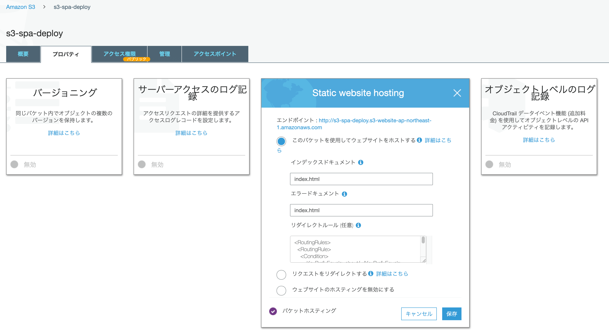

できる場合とできない場合があります。
SSR(つまり NodeJS での実行)するなら、当然 S3 単体ではできません。
Lambda@Edge が必要で、さらに Lambda をルーティングごとに実行させる口として CloudFront も必要です。

Static HTML Export での運用であれば、少し工夫をすれば CloudFront を使わずに S3 だけでもデプロイできるのでその解説をします。

## NextJS は Static HTML Export 機能がある

NextJS は SSR を容易にしてくれる FW という印象がありますが、Static HTML Export 機能も備わっており、SSR の対象を事前に Rendering して静的ページを吐き出すことができます。
このページをホスティングすれば NodeJS 以外の環境でも NextJS を動かすことができます。

## Static HTML Export 機能と S3 の相性が悪い

ただし、Static HTML Export ができるものの、NextJS の機能を使ってページ遷移をしていると、遷移の挙動は SPA 的なものになります。
つまり、 /about に遷移した時、HTML は静的ページですが URL のヘッダは /about.html になりません。
遷移先の URL は/about です。
その結果そのページでリダイレクトすると 404 Not Found となります。
この問題に出会った際、 SPA の場合はクライアントサイドに埋め込まれた routing ライブラリを呼べばいいので、エラーページとしてルードドキュメントにリダイレクトさせれば良かったです。
それが今朝公開した [S3 に NextJS 製 App をデプロイできるか](https://blog.ojisan.io/s3-spa-deploy)に書いたことです。
ただし Static HTML Export 時にエラーページをセットしても本当に見たいリソースはサーバー上の/about.html にあるので、うまく動きません。

## 地道な Redirect で解決する

「じゃあ 静的サイトだけどルーティングが SPA(お尻に.html がつかない)のような挙動のページは S3 にホスティングできないのか」と疑問に思うわけですが、可能です。
S3 単体にも CloudFront と同じようなリダイレクト機能があるため、遷移することができます。



コンソール上にリダイレクト設定をするところがあります。
ただし[記法は独特](https://docs.aws.amazon.com/AmazonS3/latest/dev/how-to-page-redirect.html)で、

```xml
<RoutingRules>
  <RoutingRule>
    <Condition>
      <KeyPrefixEquals>about/</KeyPrefixEquals>
    </Condition>
    <Redirect>
      <ReplaceKeyPrefixWith>about.html</ReplaceKeyPrefixWith>
    </Redirect>
  </RoutingRule>
</RoutingRules>
```

といった XML 形式で書く必要はあります。
これは about/ と遷移がきたら, about.html にリダイレクトするように書いています。
こうすることで、about.html を表示させることができます。

ただ注意点としては S3 の KeyPrefixEquals の制約で、Redirect ルールはオブジェクトを指定するか / をつける必要がありそうです。

```js
This is a Root Page. aboutページは<Link href="about/">こちら〜</Link>
```

そのため遷移先は about ではなく about/ になるように NextJS を書く必要があり、ルールも/付きにする必要がありそうです。
（ほんまか？ ← リンク先を about してルールにも about を書いて遷移したら、about.html.html....html みたいなところに遷移した ）

この手のやり方だと routing ごとにリダイレクトルールを書かないといけないため手間であり、実際には CloudFront + Lambda@Edge でリクエストごとに html をつけたページに遷移するという関数を実行して解決するとは思いますが、S3 単体でもできないことはないよという備忘録でした。

サンプルコードは[こちら](https://github.com/ojisan-toybox/s3-next-js)です。
