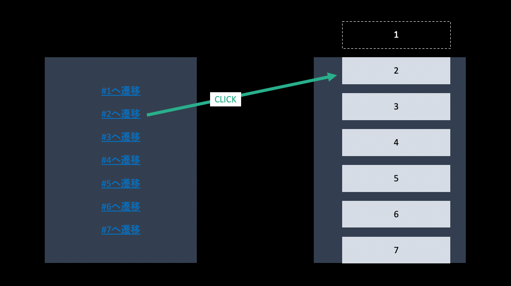
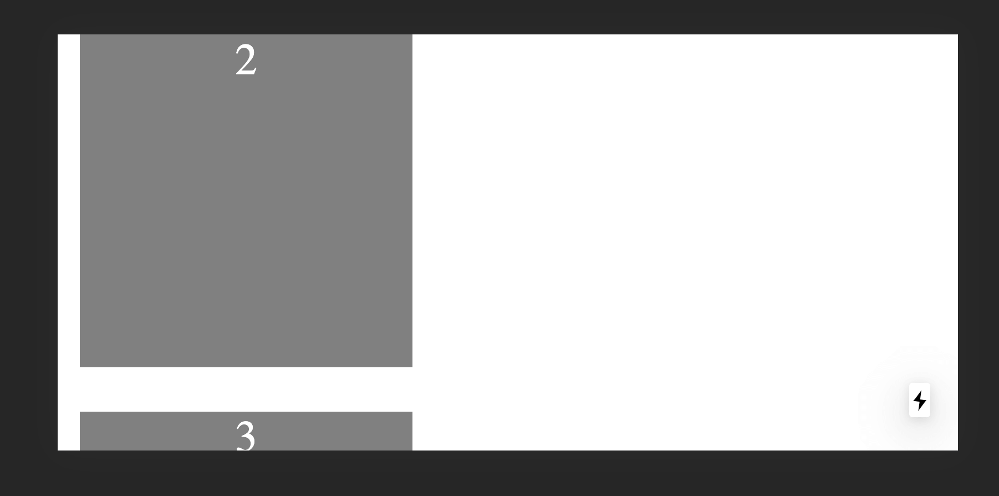
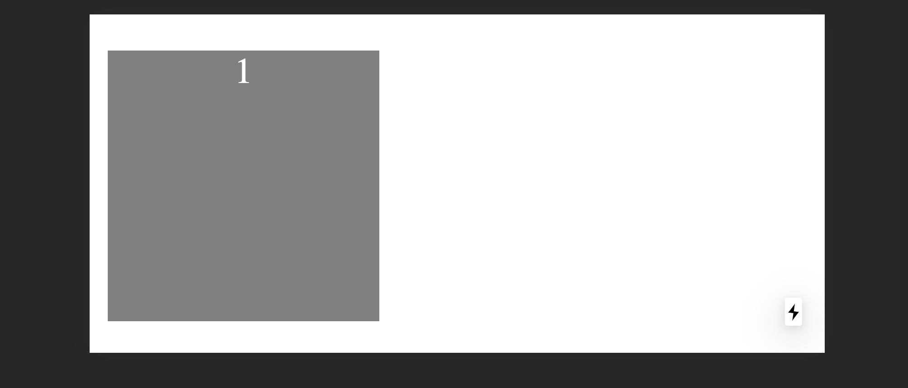

HTML の a タグではページ内リンクが使えます。
このブログでも右についてるタイトル（SP だと右下についてるオープナー）をクリックすると、その記事の該当箇所にジャンプできます。
これは、遷移先に id を付けて 遷移先 URL に #{id} をつけると実現できます。(昔は id の代わりに name でもよかった！)

ただ、それが NextJS では動かないという状況に陥ったのでそのときに行ったデバッグの記録を下に書いていきます。

**結論から言うと動かなかった理由は Ajax でコンテンツを取得していたから**です。
React・Next が原因ではなかったのですが、それらの技術スタックを採用していると **取得したデータで SSR しない限りは出会う問題**なのでそれ前提の解決策を書いていきます。

また、解決した方法はかなり泥臭いやり方なので、もしもっと良い方法がありましたら Issue や PR などでご教示いただきたいです。

デバッグ用に作ったサイトはこれです。
https://next-link-id.vercel.app/

## 考える要件

いまこのような要件を考えます。



該当の id をもった要素をクリックしたら、遷移後のページでその要素が一番上にくるように遷移させます。

これを

- `<a></a>`(NextJS 上では`<Link></Link>`)で遷移した場合
- `router.push()`など JS で遷移した場合
- 遷移後のページが Ajax でデータを取得していた場合

でどういう挙動になるのかみていきます。

ちなみに動かなかったときのコードはこのようなコードです。

```js:title=遷移元
import React, { useState } from "react"
import Link from "next/link"
import { useRouter } from "next/router"

export default () => {
  const [ids] = useState([1, 2, 3, 4, 5, 6, 7, 8])
  const router = useRouter()
  return (
    <div>
      {ids.map(id => {
        return (
          <div
            onClick={() => {
              router.push(`/遷移先#${id}`)
            }}
          >
            {id}へJUMP
          </div>
        )
      })}
    </div>
  )
}
```

```js:title=遷移先
import React, { useState, useEffect } from "react"

export default () => {
  const [cards, setCards] = useState([])

  useEffect(() => {
    fetch("/api")
      .then(res => res.json())
      .then(d => setCards(d))
  }, [])

  return cards ? (
    <div>
      {cards.map(id => (
        <div
          id={id}
          style={{
            width: "300px",
            height: "300px",
            background: "gray",
            margin: "12px",
          }}
        ></div>
      ))}
    </div>
  ) : (
    "loading"
  )
}
```

## a タグで遷移した場合(Ajax 使っていない)

a タグで遷移した場合、動きました。

```js:title=遷移元
import React, { useState } from "react"
import Link from "next/link"

export default () => {
  const [ids] = useState([1, 2, 3, 4, 5, 6, 7, 8])
  return (
    <div>
      {ids.map(id => {
        return (
          <Link href={`cards#${id}`}>
            <a>{id}へJUMP</a>
          </Link>
        )
      })}
    </div>
  )
}
```

```js:title=遷移先
import React, { useState } from "react"

export default () => {
  const [ids] = useState([1, 2, 3, 4, 5, 6, 7, 8])
  return (
    <div>
      {ids.map(id => (
        <div
          id={id}
          style={{
            width: "300px",
            height: "300px",
            background: "gray",
            margin: "12px",
          }}
        ></div>
      ))}
    </div>
  )
}
```



これが動いたということは、動かない原因は、a タグではなく`router.push()` などで JS を使って遷移したからかもしれないと考えました。
そこで検証してみました。
(NextJS を使っている以上は Link でラップした a タグの遷移も JS の実行なのですが、ちょっとだけ目を瞑って欲しいです...)

## router.push() で遷移した場合(Ajax 使っていない)

`router` は NextJS の useRouter Hooks から作れます。
その `router`を使って `router.push(/cards#${id})` を実行して遷移します。

```js:title=遷移元
import React, { useState } from "react"
import { useRouter } from "next/router"

export default () => {
  const [ids] = useState([1, 2, 3, 4, 5, 6, 7, 8])
  const router = useRouter()
  return (
    <div>
      {ids.map(id => {
        return (
          <div
            onClick={() => {
              // aタグの代わりにrouter.push
              router.push(`/cards#${id}`)
            }}
          >
            {id}へJUMP
          </div>
        )
      })}
    </div>
  )
}
```

```js:title=遷移先
import React, { useState } from "react"

export default () => {
  const [ids] = useState([1, 2, 3, 4, 5, 6, 7, 8])
  return (
    <div>
      {ids.map(id => (
        <div
          id={id}
          style={{
            width: "300px",
            height: "300px",
            background: "gray",
            margin: "12px",
          }}
        ></div>
      ))}
    </div>
  )
}
```


この例でも成功しました。
`router.push()` は 第二引数、第三引数にいろいろオプションを取れるので、それを使って解決するのかなとも考えていたのですが、どうやら違ったようです。

## 遷移後のページが Ajax でデータを取得していた場合

それだと、もしかして動かなかった理由は、遷移後のページが Ajax でデータを取得していたことにあるのかもしれません。

それが最初の例にあったこのようなコードです。

```js:title=遷移元
import React, { useState } from "react"
import Link from "next/link"
import { useRouter } from "next/router"

export default () => {
  const [ids] = useState([1, 2, 3, 4, 5, 6, 7, 8])
  const router = useRouter()
  return (
    <div>
      {ids.map(id => {
        return (
          <div
            onClick={() => {
              router.push(`/遷移先#${id}`)
            }}
          >
            {id}へJUMP
          </div>
        )
      })}
    </div>
  )
}
```

```js:title=遷移先
import React, { useState, useEffect } from "react"

export default () => {
  const [cards, setCards] = useState([])

  // もしかしてこれが犯人？？？
  useEffect(() => {
    fetch("/api")
      .then(res => res.json())
      .then(d => setCards(d))
  }, [])

  return cards ? (
    <div>
      {cards.map(id => (
        <div
          id={id}
          style={{
            width: "300px",
            height: "300px",
            background: "gray",
            margin: "12px",
          }}
        ></div>
      ))}
    </div>
  ) : (
    // もしかしてこれが犯人？？？
    "loading"
  )
}
```

遷移先が叩いている API はこのようなものです

```js
export default (req, res) => {
  res.statusCode = 200
  res.setHeader("Content-Type", "application/json")
  res.end(JSON.stringify([1, 2, 3, 4, 5, 6, 7, 8]))
}
```

失敗しました。



このコードが失敗するのはよくよく考えたらそんな気もするのですが、**遷移時はコンテンツがないのでその場所に遷移することはできません**。
**SPA だからだとか、NextJS だからだとか、JS を使った遷移をしたからだとかとかではありません。**
**ただ、Ajax でデータを取得すると遷移直後はデータがないからそこにページ内遷移ができない**ということです。

そのため Ajax を使ってデータを動的に追加するようなサイトであれば、ページ内スクロールができないのかと思いました。
仮にそうだとすれば、SSR しない限りは React を採用するとページ内スクロールができないことになるわけですが、果たしてそうでしょうか。
さすがにそんなわけはないと思うのでいろいろ試行錯誤してみました。

## ref を割り振り hash と一致する component 上で ref 経由の scrollIntoView を実行する

先ほどの問題を解決するためには、**API からのデータを取得しそれに対応するコンポーネントを描画した後に hash で指定された id へジャンプする**必要があります。

そのために、**スクロールする処理は各コンポーネントに任せ、そのコンポーネントが自分がスクロール対象かどうかを判定しスクロールする**という戦略を取ります。

### window.locasion.hash

自分がスクロール対象かどうかを判定するために URL からスクロール対象の id を取り出します。
http://hogehoge.com#99999 のような URL から 99999 を取り出すためには window.locasion.hash が使えます。
ただこれが抽出するものは #99999 です。
そのため、`window.locasion.hash.replace("#","")` などして取り出してください。
また、NextJS 下では関数内トップレベルでは window が使えない（SSR されるかどうかわからない）ので、`useEffect(()=>{},[])`などの window が必ずある環境下で実行してください。

たとえばこのようなコードになります。

```js
useEffect(() => {
  setId(window.location.hash.replace("#", ""))
}, [])
```

そして各コンポーネントに

```js
<div>
  {cards.map(id => (
    <Child id={id} isScroll={id === hashId}></Child>
  ))}
</div>
```

といった `isScroll` という props を渡し、そのコンポーネント自体がスクロール対象かどうかを教えてあげる仕組みを作ります。

### scrollIntoView

そのコンポーネント自体がスクロール対象かどうかわかれば、その対象が自分がマウントされたときにそこまでスクロールする仕組みを作ります。
そのために `scrollIntoView` を利用します。

MDN の説明を借りると、[scrollIntoView](https://developer.mozilla.org/ja/docs/Web/API/Element/scrollIntoView)は、**scrollIntoView() が呼び出された要素がユーザーに見えるところまで、要素の親コンテナーをスクロールします。**

これは Element インターフェースの持ち物なので ref から呼び出すことができます。

```js
const Child = ({ id, isScroll }) => {
  const ref = useRef()
  useEffect(() => {
    if (isScroll) {
      ref.current.scrollIntoView()
    }
  }, [])
  return <div ref={ref} id={id}></div>
}
```

各カードコンポーネントに、もし自分がスクロール対象であれば `scrollIntoView()`を呼び出すようにしています。
これを呼び出すことで、このコンテンツが見える箇所まで自動でスクロールがされます。
つまりデータを読み込みコンポーネントをマウントしたときに呼び出せば、そこまでスクロールができます。

## 完成したコード

遷移後のページのコードはこうなります。

```jsx
import React, { useState, useEffect, useRef } from "react"

export default () => {
  const [cards, setCards] = useState([])

  // useEffectの中でhashIdがわかるのでそれを保存しておく変数を作る
  const [hashId, setId] = useState(null)

  useEffect(() => {
    // NextJSだと/apiにバックエンドを生やせ、同じホストからアクセスできる
    fetch("/api")
      .then(res => res.json())
      .then(d => setCards(d))

    // URLの#hogeを取り出す
    setId(window.location.hash.replace("#", ""))
  }, [])

  return cards ? (
    <div>
      {cards.map(id => (
        // componentがスクロール対象かどうかを子コンポーネントは知る必要がある
        // また各子コンポーネントがrefを持つ必要があるので別コンポーネントに切り出している
        <Child id={id} isScroll={id === hashId}></Child>
      ))}
    </div>
  ) : (
    "loading"
  )
}

const Child = ({ id, isScroll }) => {
  const ref = useRef()
  useEffect(() => {
    if (isScroll) {
      // 自分がスクロール対象であればスクロールする
      ref.current.scrollIntoView()
    }
  }, [])
  return (
    <div
      ref={ref}
      id={id}
      style={{
        width: "300px",
        height: "300px",
        background: "gray",
        margin: "12px",
      }}
    ></div>
  )
}
```

これで遷移することができました。


## あとがき

デバッグ用に作ったサイトは Next + Vercel で構築しているのですが、 /api というフォルダ作るだけで バックエンド立てれるので、こういう簡単なデモを作るときがめちゃくちゃ楽で最高でした。
ソースコードは[こちら](https://github.com/ojisan-toybox/next-link-id)です。
