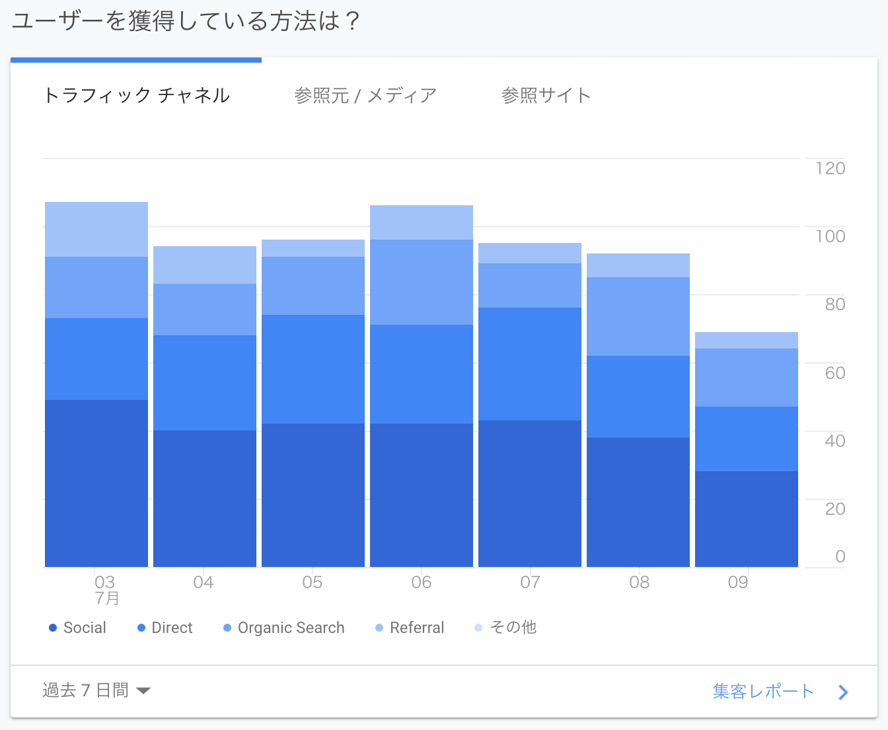

ちょうどこのブログを初めて 1 ヶ月たったので、

- なんでこのブログをやっているか
- どういう意識でやっているか
- 読者の反応
- これからどうするか

みたいなことを書きます。

## ブログを始めた理由

### 開発のサンドボックス

好き放題に開発できる場所が欲しかったのが一番の理由です。
エッジな技術を採用したり、パフォーマンスを追求したりするためのサンドボックスを持っておきたかったです。
結果としては Gatsby + TypeScript + graphql-codegen という王道パターンを突き進んだわけですが、元々は gulp と AMP Toolbox を使って AMP Valid なコードを吐き出す SSG を自作しようとしていたり、色々チャレンジをしていました。
現に今ある実装でも lighthouse のスコアを緑にしたり、記事の読みやすさにこだわりを持って実装しているところもあり、チャレンジしている箇所はいくらかあります。
そういったチャレンジをできるコードベースとしてブログを運営しています。

### 就活用のポートフォリオ

半年前に会社をやめていまして今はフリーランスとして働いています。
ただフリーランスと書くとかっこいいのですが、その実態は週 1.5 しか働かない人（なんでそれで生活をできているかというと完全栄養食生活で食事を捨てるという技を使っているからなのですが）なので、いつか社会復帰するときの職務経歴書を心配しています。
そこで職務経歴書以外の方法で自分の経歴や実績を残せるものが必要になってきて、その一つとしてこういうブログを始めたわけです。(※ 経歴にできるほどの OSS 活動をできる力はまだないという背景があります。)

きっと「私は〜ができます」ということは言えると思うのですが、如何せん経歴も実績も無いので説得力に欠けるだろうなという心配をしていました。
ブログ上でやたらレポジトリや動くコードを提供しているのは、口だけではなくて私は本当にやれているのですよということを証明したいという意図もあります。

### その他

他にもいいね数に左右されずにアウトプットできる場所、チラシの裏が欲しかった(結局ブックマークサービスを見てしまっているオチはあるのですが・・・)、mizchi さんや uhyo さんが自作したことで自作ブログブーム的なのが始まっていた(僕と同時期に作り始めた人は 10 人くらい居そう。)といった理由もあります。何気に自作ブログブームがきているので楽しいです。相互リンクや毎日ランキングクリックお願いしますみたいな文化もそのうち生まれるかもしれません。

## 記事を書く時の意識

私はこれまで個人ブログに助けられる経験が多かったので、自分の記事を読んだ誰かの助けになれればなと思っています。
その上で助ける精度の最大化を定性的な執筆指標においていました。
その結果、

- 基本的にはソースコードやレポジトリを出して記事を書く
- 出典を必ず示す
- 過度に説明的でありすぎる

というスタイルで書くようにしています。その背景には次の考え方がありました。

### 間違った情報を書かないように務める

どうも技術的アウトプットは間違った情報を書くとひどい目に合う（はてブ、Twitter でよく見る）らしく、間違った情報を書かない努力や仕組み作りに励んでいました。
動く実例を作ることや、出典を持ってくるのはそれを実現するための方法だったという側面もあります。

出典をなるべく示す点に関しては、はっきりいって自分の自信のなさの現れでもあります。
「公式がこう言ってるのだから私は間違っていないのですよ」という excuse が目的でした。
でもこれが良い縛りになって、公式 Doc に目を通すことはもちろん、開発者ドキュメント、Issue、実装まで見るきっかけとなり、自分の実力アップにも寄与しました。
この縛りははっきり言ってコストもすごいのですが、実力は伸びるのでブログを書くときはこの縛りを入れてみることをおすすめします。

### 想定読者は俺

また、過度に説明的でありすぎることに関しては、読まれていた方は感じていたとは思います。
自分でも「これ逆に説明が多すぎて分かりづらくなっていないか？」とは思っていましたが、自分を思い返すと**目的がはっきりして記事を読むときは読み飛ばしながら読む**ので、まあいいかと思っています。
きっと皆さんも知りたいことは ctrl + f で検索しながら読んでいると思っています。
丁寧じゃない記事よりかは丁寧すぎる記事の方が良いと考えました。

たまに出会う記事で「○○ というライブラリを入れます」や「設定ファイルに xxx を書きます」といった説明をみることがあり、これはこれで今自分が当面ぶち当たっている問題を解決するためにとても有用なものなのですが、「なんで？」「これ本当に入れて大丈夫？」といった疑問をよく持っていました。
そのため自分がブログを書くときは、そのようなことを思わなくて済むように、

- いま何に困っているのか
- その解決策は何か
- どうしてそれが解決策になるのか

といったことを伝えるように意識を向けています。

自分は普段、何かに詰まるとドキュメントを読むよりも Google に頼っているので、自分がググってきたときにどういう情報が書かれていたら嬉しいかということを考えていました。
等身大の記事を書き続けることで、自分と似た境遇にあった人の助けになれたら良いなと思っています。

## 読者の反応

### 1 日の流入は 100 人

大体 1 日の流入は 100 人程度です。

そのうちの 1/4 は検索エンジンからの流入です。
この層はおそらく何かに困って調べている人たちのはずなので、そういった方に記事を読まれているのは嬉しいです。（役に立ったかは知りませんが、この層に読まれたくてやっているところがあります。）

一方で直流入でも 30 人くらいいます。
これは流石にスクショは貼れないのですが、referer を見る限り社内のイントラネットからというケースもありました。
きっと社内 wiki に僕のブログが貼られているのですね、ありがとうございます!

### はてぶホットエントリに乗ると 3000 人

これまで書いたブログの半分くらいがホットエントリに乗りました。（ブクマが無いものもあるので他にもブログの記事はあります。）

ホットエントリの効果を舐めていたのですが、一気に跳ね上がりました。

正直言って、グラフの上振れが激しくてアクセス解析の参考にならなくなります。

はてブに乗ったら嬉しいのですが、**まさかりに備えるためにブコメ監視をし初めてその日の進捗が 0 になるので、手放しで喜べるもので無い**ことが最近わかりました。

### セッション時間は 1-2 分、だけどはてブでバズると 10 秒

セッション時間は週によるのですが 1-2 分ほどあります。
また直帰率は 70-80%です。
そのため、記事は一応読まれているのだろうなと思いました。
おそらく検索流入で来られた方が読んでいるからだとは思うのですが、直帰している方達は満足しているのか不満を抱えているのかがわからないのが悩みどころです。

ちなみにはてブでバズった日のセッション時間は 10-30 秒とかです。

読んでほしい 😭😭😭😭😭😭😭😭

### 取り違える系の流入が多い

検索キーワードを見てみましょう。
ESLint と Prettier, css-loader と style-loader, plugin と config を混乱している人が多そうです。

それらの記事を書いたのは、自分がそれらで混乱していてそれを解決できたのをアウトプットしたかったからなので、この検索キーワードで流入があるのは本当に嬉しいことです。ありがとうございます。

### PR が届いた！Fork されてる！

このブログは GitHub で公開されています。
そのため誰でも PR を投げることができます。
もともとは Issue をコメント欄とすることが目的でしたが、今では誤字脱字などを PR で直してもらえる窓口になっています。

また Gatsby + TS でやり切っている例はそれほど出回っていないとも思いますので、これから自作ブログを始める人の参考にもなれば嬉しいと思います。

## 運用することによる学び

これまで自分は何かを運用するという経験を持っていませんでした。
なのでブログという個人的で小さいものを運用するといっただけでも、いろんな気づきはありました。

### アクセス解析 + マーケティングが面白い

ぼくはフロントエンドエンジニアという職業で、マーケティング的な要件に振り回されることが多く、彼ら彼女らに対して好意は持っていませんでした。

しかし自分でブログを作ってみて、「あれやこれやどう改善しようか」「読者は何を期待しているのだろうか」みたいなことを 46 時中考えることになり、GA や Search Console とにらめっこしていました。
なにか少しでも改善にできそうなところがあれば改善したりしていたのですが、そうやって改善提案を作ることがマーケターがやっていたことだったんだなと気づいて、ちょっと好意と興味が芽生えました。

自作ブログを始めるというのは、エンジニアにとってビジネス意識やマーケティングの思考を身に着ける上で、楽しくやれる題材なのでは無いでしょうか。知らんけど。

### 自分のブランドを育てる楽しさ

ojisan.io というドメインを買ったのですが、このドメインに対して SEO パワーや評判がちょっと付いてきているのを確認できて楽しいです。
それは自分で検索してるときに自分のブログにひっかかったり（でも自分のブログに自分で Google でひっかかるのは自分が成長していない証左な気もして辛い）、「今日会社の MTG で sadnessOjisan の話が出たよ」と言われたりなんてことがありました。
ブログを書くことで少しずつ自分のドメインや自分に value が付いている感覚があり、ちょっと照れています。
これをこのままずっと育てていくモチベーションにもなっているので 3 日坊主は回避できて継続のサイクルに上手く乗れたと思っています。
ドメインを育てるという感覚を持つことで、最近よく言われる「エンジニアもプロダクトのオーナーシップを持て」みたいな意見もわかるようになりました。

たった 1 ヶ月の運用でもそういう気づきがあり、やってみてよかったというのが率直な感想です。

## これからどうするか

### コメント機能をつけたい

はてブ、Twitter 全部みていて、可能な限り返信しています。
その中で自分の知らない情報が述べられていて新しく勉強になることが多く、そういった学びをブログに反映させられたら良いなと思っています。
そこでコメント機能がどうしても欲しいです。
ただその場合は SSG を捨てる必要が生まれるので、どうしようかなというのが悩みです。
(NextJS + Firestore みたいな設計になるんだろうなーとは思っています。)

### もっと記事を書きたい

書きたいことがたくさんあります。
今月は Firebase, monaco-editor, 動的 OGP 生成についての記事を書こうと思っています。
ただ [人の時間を無限に吸い取るゲーム](https://ec.nintendo.com/JP/ja/titles/70010000012390)を始めてしまったせいで書けていないです・・・
このゲームについてもいつか記事を書こうと思っています。

ブログをしばらく書き続けるので、これからもよろしくお願いします！
