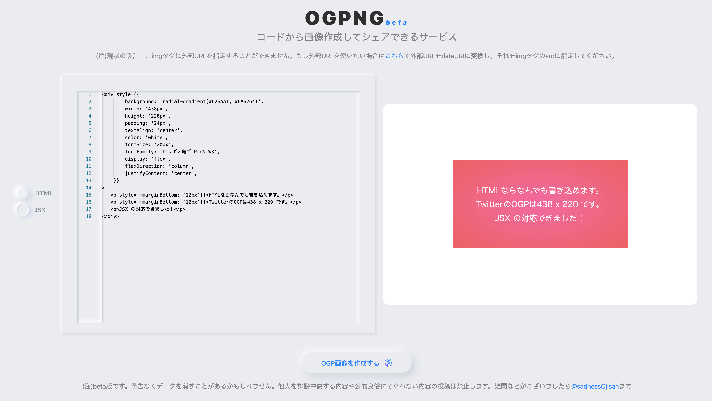
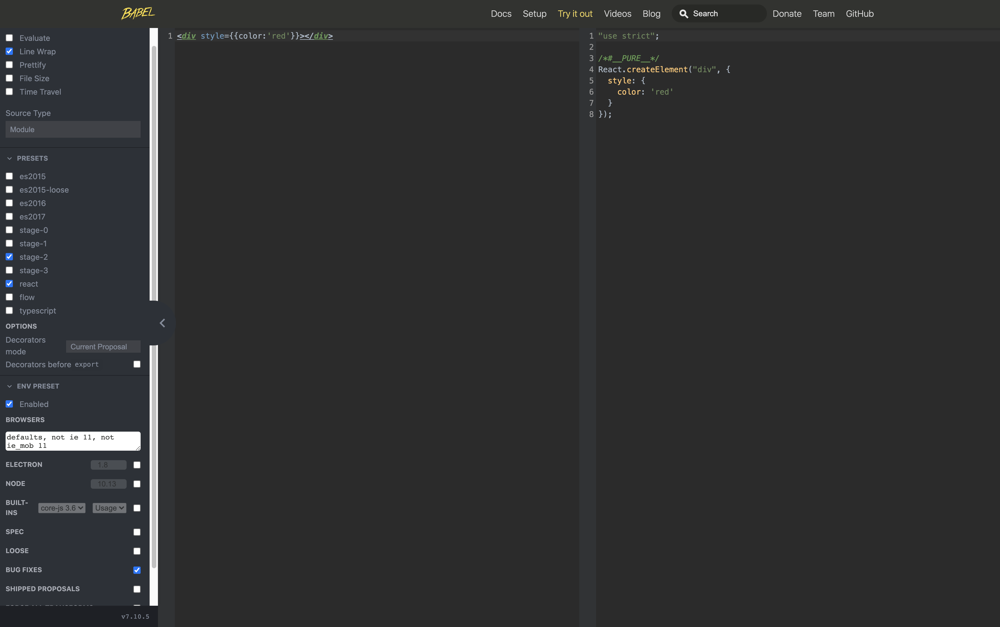

少し前に [ogpng](https://ogpng.vercel.app) というサービスを作りました。
これは HTML や JSX を使って OGP 画像を生成しシェアできるサービスです。

こういうエディタで OGP 画像を作り、



そこで発行された URL をシェアすると、OGP が展開されます。


告知画像のカスタマイズを簡単にしたいというニーズに答えるためのものです。

これは HTML 要素を canvas 経由で画像化してそれをオブジェクトストレージで永続化し、その画像 URL を SSR 時に meta タグに展開することで OGP 画像のシェアができるようになっています。
そのため HTML を生成できれば様々な形式から OGP 画像を作ることができます。
ogpng では JSX からの OGP 画像をサポートしたのですが、それが意外と苦戦したのでそのときのメモを書きます。

## そもそもどうやって HTML を画像化していたか

ogpng では左がエディタ(monaco-editor を使っています)、右が preview です。
具体的には、React + NextJS + react-monaco-editor を使っています。

HTML のプレビューは、monaco-editor に入力した HTML を React の dangerouslySetInnerHTML を使ってレンダリングすることで実現しています。
そしてその プレビューの DOM を [dom-to-image](https://github.com/tsayen/dom-to-image) で画像として出力しています。
画像生成ボタンを押した時にこのライブラリを呼び出して画像化、出力されたバイナリを直接オブジェクトストレージにアップロードすることで OGP 画像の URL を生成しています。
一般的な OGP 生成とは違ったやり方になっているとは思うのですが、このように一度クライアントで生成することでユーザーからすればかなり自由度の高い OGP 生成が可能となります。(node-canvas + OGP 生成 API でやるならあらかじめテンプレートを用意したりすることになるので自由度が下がると思いました。)

このプレビュー用の HTML を生成するのがとても苦労したのでそのことについて書きます。

## 説明の前に寄り道(用語の説明と注意事項)

- React.Element
  - React elements are the building blocks of React applications.
  - https://reactjs.org/docs/glossary.html#elements
- JSX
  - JSX is a syntax extension to JavaScript.
  - https://reactjs.org/docs/glossary.html#jsx

[Introducing JSX](https://reactjs.org/docs/introducing-jsx.html)の説明を借りると、JSX は React.Element を生成できる syntax です。
JSX ファイル内に React.Element を return しているわけだから当然なのですが、そういう関係性があります。
本書は JSX から HTML を作ると書いていますが、厳密には React.Element から HTML を作っています。
しかし React.Element という言葉は JSX と比較して馴染みがなく、わかりにくいと思いましたので 意図的に JSX という言葉を使っている場面があります。

## HTML を生成する

HTML から画像を作る仕組みはあるので、JSX から HTML に変換することを目指しましょう。

ゴールとしては、

```jsx
<div style={{ color: "red" }}>Hello, World!</div>
```

を

```html
<div style="color: red;">
  Hello, World!
</div>
```

に変換できたら勝ちです。

### 文字列を React.Element に変換する

React.Element を HTML を変換する処理は ReactDOMServer.renderToHtml を使うことで実現できます。
この関数は React.Element を引数にとります。
monaco エディタで `<div>hoge</div>`のような React.Elemet を打ってもらってもそれを取り出すとそれはただの文字列です。
そのため HTML の生成には React.Element 文字列から React.Element を作る必要があります。

React のドキュメントを探しても見つけられず、この方法に私はずいぶんと頭を悩ませたのですが、たまたま Babel にその例があったことを思い出して使ってみることにしました。
[Babel Try it out](https://babeljs.io/repl#?browsers=defaults%2C%20not%20ie%2011%2C%20not%20ie_mob%2011&build=&builtIns=false&spec=false&loose=false&code_lz=DwEwlgbgBAzgLgTwDYFMC8BvDBjA9k3AJwC4ByQlEUgX2oD5gB6cCOoA&debug=false&forceAllTransforms=false&shippedProposals=false&circleciRepo=&evaluate=false&fileSize=false&timeTravel=false&sourceType=module&lineWrap=true&presets=env%2Creact%2Cstage-2%2Cenv&prettier=false&targets=&version=7.10.5&externalPlugins=)では react の preset が使えます。
つまりこれはソースコード文字列から React.Element の生成をしている例です。（※実際には出力コードを eval する必要があります。）



で、babel-preset-react と babel-core を使って JSX 文字列を食わせてみたのですが、どうやら babel-core はブラウザで動かないらしく、どうして Try it out は動いているのかコードを読んでみました。
すると、[babel-standalone](https://babeljs.io/docs/en/babel-standalone)というのを使っていることがわかりました。

これは

> @babel/standalone provides a standalone build of Babel for use in browsers and other non-Node.js environments.

とあり、ブラウザでも動く Babel のようです。
ドキュメントには、

> Load babel.js or babel.min.js in your environment. This will expose Babel's API in a Babel object:

とあり、babel-core が持っている API はそのまま使えそうです。
そのためこの transform 関数に React.Element 文字列と JSX をコンパイルする plugin 名([transform-react-jsx](https://babeljs.io/docs/en/babel-plugin-transform-react-jsx/))を渡せば良いです。

```js
const res = babel.transform(reactElStr, {
  plugins: ["transform-react-jsx"],
})
```

この`babel.transform`が何をしているかは**めちゃくちゃ頑張って**書いたので、気になる方は参照してください。
=> [Babel の変換処理と向き合う](/babel-parse-traverse-generate) (めちゃくちゃ気合入れて書いたのに全然注目されなくて悲しんでます 😭😭😭😭😭😭)

### React.Element から HTML を生成する

monaco エディタに入力された文字列から React.Element を生成できるようになりました。
あとは ここから HTML を生成するだけですが、これは react-dom/server にある [renderToString](https://reactjs.org/docs/react-dom-server.html#rendertostring) を使うと良いです。
これは、

> Render a React element to its initial HTML.

とあり、ReactElement を HTML に変換できます。

```js
const newHtml = ReactDOMServer.renderToString(el)
```

とすれば HTML を取得できます。

これで HTML を dangerouslySetInnerHTML に流せば JSX を HTML としてプレビューできる機能が完成します。

## ライブラリとして提供しました

ここまでで ReactElement 文字列から HTML を出力できるようになりました。
その処理をまとめて、ライブラリとして [reactel-to-html](https://github.com/sadnessOjisan/reactel-to-html) を作りました。
そしてそれをサーバーで実行・ **JSX as a Service** として利用できる[reactel-to-html-server](https://github.com/sadnessOjisan/reactel-to-html-server)を作りました。
https://reactel-to-html-server.vercel.app/api/ に POST で {html:React.Element} という body を送ると、 それを評価した HTML を返します。
是非利用してみてください。

## あとがき

ReactElement 文字列 => ReactElement の変換は babel がブラウザ上で使えないから stand alone モードを使ったわけですが、これは worker 使えば stand alone 入れなくてもよかったかもと思い始めています。
改修はめんどうくさいのでやらないですが、次何かこういうの作るときは worker に compiler を埋め込む方式みたいなのを考えて設計しようと思います。
(worker なんもわーからん！w)
