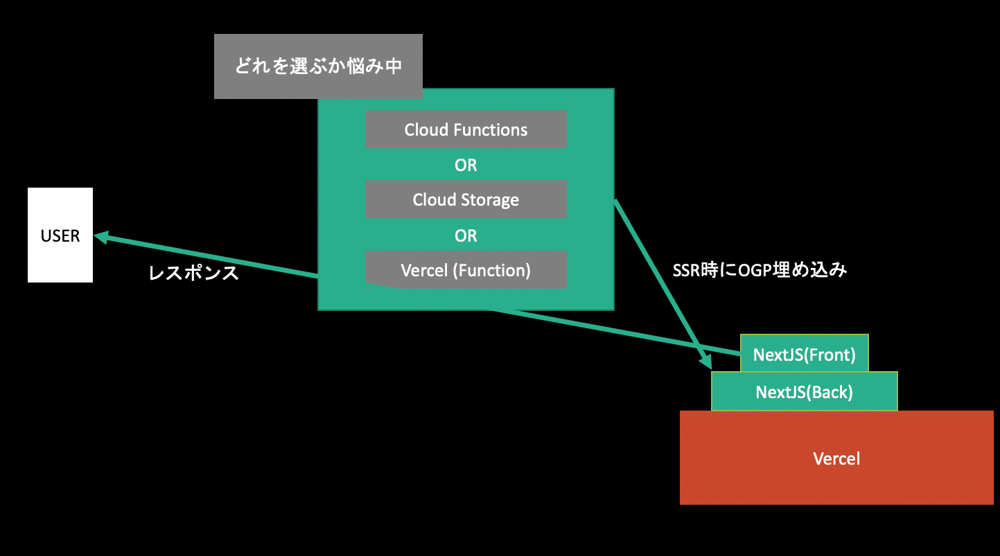
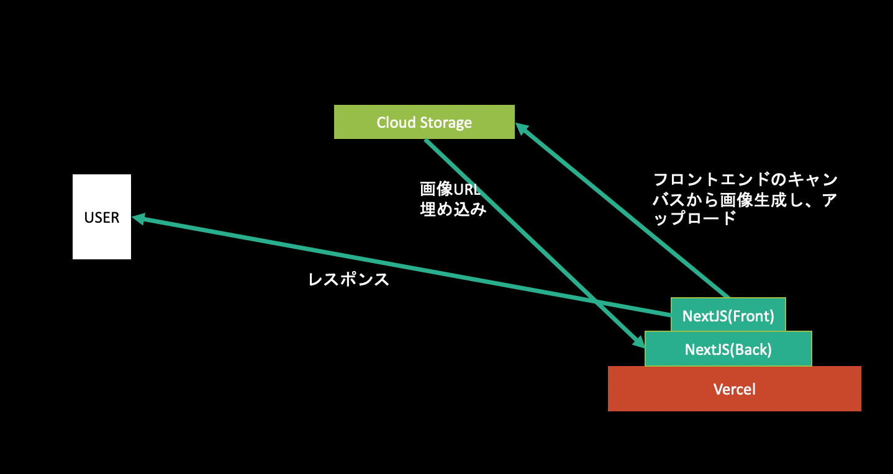
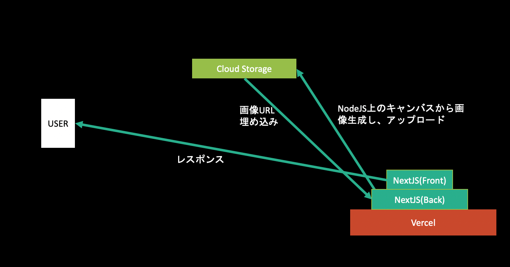

OGP 生成をタダでやろうとするとそのデプロイに意外と苦労したという話です。
アプリケーションの技術スタックは React/NextJS、クラウドサービスとして [Cloud Storage](https://firebase.google.com/products/storage?hl=ja), [Cloud Functions](https://cloud.google.com/functions?hl=ja), [Vercel](https://vercel.com/) での検証です。
こういう設計で、クラウドサービスの選定をどうするかで頭を悩まします。
ただし 無料にこだわるため GCP の基盤は全部 Firebase から利用しています(Firebase の Spark プランでの運用)。



NextJS での SSR 時に meta タグを展開して OGP 画像を作ることが要件で、その OGP 画像はコンテンツに応じて動的に変化するものです。
ここでは動的 OGP をタダで実現するためのサービス選定について扱い、動的 OGP それ自体のやり方は扱いません。
もし気になる場合は[mizchi さんの記事](https://mizchi.dev/202006211925-support-ogp)や、コードの全体像を知りたいなら[れとるときゃりーさんの実装](https://github.com/retoruto-carry/shindan-chart-maker-ogp)を参照してみると良いでしょう。
僕も助けられました。

○ がタダで実装できる方法、× がタダで実装できない方法です。

## (案 1: ○) クライアントサイドで、OGP 画像を生成しその画像をオブジェクトストレージに保存しその公開用 URL を展開する

[ogpng](https://ogpng.vercel.app/)というサービスを作ったときのやり方です。
OGP 画像をクライアントサイドの canvas 上で生成して、それを画像化してクラウドストレージにアップロードします。
その後、ストレージの公開用 URL の一部でクライアントサイドの詳細ページを作り、そのページの meta tag の`og:image`に OGP 画像の公開用 URL をセットすれば、その詳細ページの OGP 画像がセットされたこととなります。
ただしこれは詳細ページへの遷移時にオブジェクトストレージへのアップロードを含むため遷移にかかる時間があり、**また画像生成はクライアントでの実行コストにもなるためあまりパフォーマンス的にはよろしくありません**。
しかし、OGP 画像生成においては何もバックエンドサービスに頼らず実行可能なため敷居は低いやり方です。



このサービスがどうやって OGP を作っているかは[ブラウザ上で JSX をコンパイルしてプレビュー環境を作る](https://blog.ojisan.io/jsx-preview)という記事にまとめていますので、気になる方は是非こちらもご覧ください。

## (案 2: ×) NodeJS 上で OGP 画像を生成し、オブジェクトストレージに保存しその公開用 URL を展開する

クライアント側で生成するのが嫌ならバックエンドで生成すればいいじゃないというのがこの案です。
ストレージには Cloud Storage を使うので、Cloud Function を利用します。
同じ Firebase プロダクトであれば、認証に使う環境変数が不要なため開発は楽になります。

OGP 画像の生成は [node-canvas](https://github.com/Automattic/node-canvas) で行います。

node-canvas は

> node-canvas is a Cairo-backed Canvas implementation for Node.js.

とあり、Canvas 要素でできることが NodeJS 上でもできるようになると考えると良いでしょう。
よくある動的 OGP のパターンは、node-canvas を使って背景画像をレンダリング、その上に文字を被せるというものです。

例えば、

```js
import { join } from "path"
import { createCanvas, loadImage, registerFont } from "canvas"

const baseImagePath = join(__dirname, "../..", "imagesForFunction", "base.png")

const createOGP = async title => {
  const W = 1200
  const H = 630

  const canvas = createCanvas(W, H)
  const ctx = canvas.getContext("2d")

  // 背景画像の描画
  const baseImage = await loadImage(baseImagePath)
  ctx.drawImage(baseImage, 0, 0, W, H)

  return canvas.toBuffer()
}
```

のようなコードを書けば OGP 画像を作れます。

（実際には背景画像にタイトルとかを埋め込んだりしたいと思うのですが、今は API の話について書きたいので、文字を埋め込んだ画像の作り方については割愛します。詳しく知りたい方は冒頭で紹介した記事と実装を参考にしてください。）

このようにして画像を生成してしまえばあとはこれを Cloud Storage に上げてしまえば OK です。


その時に使っていたコードはこういうものです。

```js
import * as fs from "fs"
import * as functions from "firebase-functions"
import * as admin from "firebase-admin"
import { createCanvas, loadImage } from "canvas"

/**
 * API
 * @param title OGPを作る文字列
 * @param questionId questionID
 */
export const createOgpImageAndSave = functions.https.onRequest(
  (request, response) => {
    response.set("Access-Control-Allow-Origin", "*")

    if (request.method === "OPTIONS") {
      // Send response to OPTIONS requests
      response.set("Access-Control-Allow-Methods", "GET")
      response.set("Access-Control-Allow-Headers", "Content-Type")
      response.set("Access-Control-Max-Age", "3600")
      response.status(204).send("")
    } else {
      const body = request.body
      const image = await _createOgp(body.title)
      await upload(image)
      response.send("ok")
    }
  }
)

const createOGP = async title => {
  const W = 1200
  const H = 630

  const canvas = createCanvas(W, H)
  const ctx = canvas.getContext("2d")

  // 背景画像の描画
  const baseImage = await loadImage(baseImagePath)
  ctx.drawImage(baseImage, 0, 0, W, H)

  return canvas.toBuffer()
}

const upload = async (image: Buffer): Promise<void> => {
  const loaclTargetPath = `/tmp/target.png`
  const localBasePath = "/tmp/base.png"
  const targetPath = `${CLOUD_STORAGE_KEYS.QUESTION}/ogp.png`
  const basePath = `${CLOUD_STORAGE_KEYS.QUESTION}/base.png`

  // （Syncはやめといた方が良いよ）
  fs.writeFileSync(loaclTargetPath, image)

  // Storageにアップロード
  await bucket.upload(loaclTargetPath, { destination: targetPath })

  // tmpファイルの削除
  fs.unlinkSync(localBasePath)
  fs.unlinkSync(loaclTargetPath)

  return
}
```

### ソースコードの解説

長いコードなので各処理が何を行っているかの解説をします。

#### preflight

NextJS を使っていると別のホスティングサービスから叩いているはずなので(なぜなら Firebase に NextJS 向けのサービスがないから)、別ドメインからのリクエストに対する対応、つまり CORS の許可が必要になります。
[公式](https://cloud.google.com/functions/docs/writing/http?hl=ja#handling_cors_requests)でも解説されている通り、次のコードが必要になります。

```js
response.set("Access-Control-Allow-Origin", "*")

if (request.method === "OPTIONS") {
  // Send response to OPTIONS requests
  response.set("Access-Control-Allow-Methods", "GET")
  response.set("Access-Control-Allow-Headers", "Content-Type")
  response.set("Access-Control-Max-Age", "3600")
  response.status(204).send("")
} else {
  const body = request.body
  const image = await _createOgp(body.title)
  await upload(image)
  response.send("ok")
}
```

`response.set("Access-Control-Allow-Origin", "*")` で CORS の許可をします。
さらに飛んできたリクエストメソッドが preflight かどうかを Request Method が OPTIONS かどうかで判断し、preflight であれば適切なヘッダを返しています。
もしリクエストが期待する POST であれば else 節で画像のアップロードを行っています。

#### アップロード前の書き込み

画像のアップロード関数では、

```js
const upload = async (image: Buffer): Promise<void> => {
  const loaclTargetPath = `/tmp/target.png`
  const targetPath = `${CLOUD_STORAGE_KEYS.QUESTION}/ogp.png`

  // （Syncはやめといた方が良いよ）
  fs.writeFileSync(loaclTargetPath, image)

  // Storageにアップロード
  await bucket.upload(loaclTargetPath, { destination: targetPath })

  // tmpファイルの削除
  fs.unlinkSync(loaclTargetPath)

  return
}
```

とあるようにファイルに画像を書き込んでいます。
これは Cloud Storage の SDK が画像パスを要求するためです。

Cloud Functions では `/tmp` 配下に限ってはファイルの書き込み権限があるので、そこに書き込んでいます。
それが `loaclTargetPath` がやっていることです。

#### 公開用 URL を取得していないのではないか

はい、その通りです。
このコードでは公開用 URL は取得していません。
しかし Cloud Storage ではバケットを公開設定にすれば 'https://firebasestorage.googleapis.com/v0/b/${bucketName}/o/${encodeURIComponent(filePath)}?alt=media' として取得できます。

ただし、Firebase の裏側にある GCP での Cloud Storage でバケット設定をする必要があります。

FYI: https://qiita.com/mako0715/items/a2049d31915f10f40681

個人的には Firebase が GCS の存在を隠蔽してくれているのにそれをわざわざカスタマイズするのは依存を増やすことになり、**あまりやりたくないことです。**
それにハックしている感も強いのでやりたくないのが本音です。

### これ無料で動くの？

やりたくないとは言ってもこのコードは動きます。
ただし無料で動くのでしょうか。
**確実に無料で動くかわからないと言うのがいまのところの感想です。**
まず、Cloud Function は、v10 の利用を推奨しています。
そして[料金プラン](https://firebase.google.com/pricing?hl=ja)を見ると、

> \*Node.js 10 runtime requires Blaze plan

とあります。v10 は 無料プラン(Spark プラン)では動かないようです。
だったら v8 を使えばいいじゃんという話なのですが、

> 2021/02/15 より、Node.js 8 関数の新たなデプロイや更新はサポートされなくなります。
> 2021/03/15 より、既存の Node.js 8 関数の実行はサポートされなくなります。

と公式からはアナウンスされており推奨はされていなさそうです


ただ、とりあえず 2021 年までは大丈夫そうなので、V8 で無料運用しようとするのですが、**なぜか v8 でデプロイすると表示されません**。


本来であれば、ここに関数一覧が表示されているはずですが表示されていません。
ここを version10 にすれば表示されるのですが、その場合は課金を ON にする必要がありました。

ということは、どうやら無料で Firebase Functions を使うことができなくなったようです。
仮にできても、これからできなくなるので、無料にこだわるならこの案 2 は技術的な要件には答えられるもののやめたくなりました。

## (案 3: ×) NodeJS 上で OGP 画像を生成し、オブジェクトストレージに保存しその DL URL を取得して展開する

ところで案 2 では OGP を毎回、動的生成して Cloud Storage の URL を取っていましたが、正直それはやめたいですよね。
Firebase の SDK には Storage の DL パスを取得できる機能があるのでこれを活用して URL を作れないでしょうか。

どうやらドキュメントの[URL 経由でデータをダウンロードする](https://firebase.google.com/docs/storage/web/download-files?hl=ja#download_data_via_url)を見ると、`getDownloadURL` で可能なようです。

```js
var storageRef = firebase.storage().ref()
storageRef
  .child("images/stars.jpg")
  .getDownloadURL()
  .then(function (url) {
    // `url` is the download URL for 'images/stars.jpg'

    // This can be downloaded directly:
    var xhr = new XMLHttpRequest()
    xhr.responseType = "blob"
    xhr.onload = function (event) {
      var blob = xhr.response
    }
    xhr.open("GET", url)
    xhr.send()

    // Or inserted into an  element:
    var img = document.getElementById("myimg")
    img.src = url
  })
  .catch(function (error) {
    // Handle any errors
  })
```

ここで取得したい URL は SSR 時に必要なので、`getServerSideProps` を使って記述しましょう。

```js
export async function getServerSideProps() {
  ...
  const url = await storageRef.child("images/stars.jpg").getDownloadURL()
  return {url}
}
```

としたいのですが、実はこれは動きません。
NextJS の getServerSideProps は SSR 時の処理でいままさしく SSR 時に URL を取得する必要があるのですが、storage の SDK の内部実装は`XMLHttpRequest` で実装されており、NodeJS の環境からでは利用することができません。

## (案 4: ×) NodeJS 上で OGP 画像を生成し、オブジェクトストレージに保存し、署名付き URL を発行してクライアントに返す

そこで、Admin 系ライブラリを利用しましょう。

```js
export const getOgpImagePath = functions
  .region("asia-northeast1")
  .https.onRequest(async (request, response) => {
    const signedUrl: any[] = await bucket
      .file(`${CLOUD_STORAGE_KEYS.QUESTION}/${request.query.questionId as string}.png`)
      .getSignedUrl({
        action: "read",
        expires: "2099-12-31",
      });
    response.json(signedUrl[0]);
  });
```

パスを指定して`getDownloadURL` で公開用 URL を作れる便利なメソッドはないですが、`getSignedUrl` という署名付き URL を作ることができます。
これはそのパスに対しての権限とその期限を許可し URL を生成できるメソッドです。

これを Cloud Functions 上で作れば `/getOgpImagePath` を叩くだけで OGP 画像が作れてしまいます。
Cloud Functions を使うので**無料では動かない**ですが・・・
ただし**技術的にはこれを一番採用したいです**。

（補足: これは案 2 とほとんど同じやり方です。画像 URL を生成できるかどうかという違いしかないです。）

## (案 5: ×) Vercel 上で OGP を生成し、オブジェクトストレージに保存し、署名付き URL を発行してクライアントに返す

そこで、Vercel 上で Firebase の Admin 系ライブラリを利用して、画像を保存しましょう。
**Vercvel はタダです！**



案 2 と同じく画像を作った後にこの upload 関数を実行すればいいです。

```js
const upload = async (image: Buffer): Promise<void> => {
  const loaclTargetPath = `/tmp/target.png`
  const localBasePath = "/tmp/base.png"
  const targetPath = `${CLOUD_STORAGE_KEYS.QUESTION}/ogp.png`
  const basePath = `${CLOUD_STORAGE_KEYS.QUESTION}/base.png`

  // （Syncはやめといた方が良いよ）
  fs.writeFileSync(loaclTargetPath, image)

  // Storageにアップロード
  await bucket.upload(loaclTargetPath, { destination: targetPath })

  // tmpファイルの削除
  fs.unlinkSync(localBasePath)
  fs.unlinkSync(loaclTargetPath)

  return
}
```

と言いたいのですが、これは vercel では**動きません。**

vercel の裏側は lambda らしいのですが、どうやら書き込み権限は僕たちには与えられていないようです。
そして、Admin 用の storage SDK での画像アップロードは画像パスの指定が必要です。
つまり一度何処かに書き込む必要があるのです。（Client 側のライブラリと同じようにバイナリのまま送りたい！）

## (案 6: ○) Vercel 上で OGP を生成し、バイナリを返す

ということで最終兵器、というか最初に戻ってきた感もあるのですが、直接 vercel からバイナリを返しましょう。


OGP 画像をバイナリで返す API を持っておけば、この API 自体を meta tag に埋め込めば OGP の展開ができます。
つまり先ほどの API を、

```js
import { join } from "path"
import { createCanvas, loadImage } from "canvas"
import { NextApiRequest, NextApiResponse } from "next"

export default async (
  request: NextApiRequest,
  response: NextApiResponse
): Promise<void> => {
  const buf = await createOGP()

  response.writeHead(200, {
    "Content-Type": "image/png",
    "Content-Length": buf.length,
  })
  response.end(buf, "binary")
}

const baseImagePath = join(__dirname, "../..", "imagesForFunction", "base.png")

const createOGP = async (): Promise<Buffer> => {
  const W = 1200
  const H = 630

  const canvas = createCanvas(W, H)
  const ctx = canvas.getContext("2d")
  // 背景画像の描画
  const baseImage = await loadImage(baseImagePath)

  ctx.drawImage(baseImage, 0, 0, W, H)

  return canvas.toBuffer()
}
```

とします。

`response.end(buf, "binary")` で作った画像を binary で返してしまえばいいのです。
そうするとこれを展開する側は、

```jsx
import * as React from "react"
import Head from "next/head"

export default function Post(props: IProps): JSX.Element {
  return (
    <div>
      <Head>
        <meta
          property="og:image"
          content={`${getHostEndpoint(getEnv())}/api/ogp/create_and_get_ogp`}
        />
        <meta
          name="twitter:image"
          content={`${getHostEndpoint(getEnv())}/api/ogp/create_and_get_ogp`}
        />
      </Head>
    </div>
  )
}
```

とするだけでよいです。

「でもこれ静的じゃん、どうやって動的にするの？」というのはありますが、それは OGP 生成のエンドポイントに GET で文字を送り、その文字を埋め込んだ画像を node-canvas で作成し、それをクライアントに生成すれば良いです。

簡易的な例としてはこんな感じです。

```jsx
import * as React from "react"
import Head from "next/head"

interface IProps {
  title?: string;
}

export default function Post(props: IProps): JSX.Element {
  // SSR時に取得したタイトルを流し込む
  const { title } = props

  return (
    <div>
      <Head>
        <meta
          property="og:image"
          content={`${getHostEndpoint(
            getEnv()
          )}/api/ogp/create_and_get_ogp?title=${title}`} // titleをクエリに含める
        />
        <meta
          name="twitter:image"
          content={`${getHostEndpoint(
            getEnv()
          )}/api/ogp/create_and_get_ogp?title=${title}`}
        />
      </Head>
    </div>
  )
}

// SSR時にtitleを取得
export const getServerSideProps: GetServerSideProps = async context => {
  let title
  const qid = context.query.id
  try {
    if (!qid || typeof qid !== "string") {
      throw new Error("you should select id")
    }
    const res = await QuestionRepository.get(qid)
    title = res.data.title
  } catch (e) {
    title = undefined
  }

  return { props: { title } }
}
```

そして後は vercel 上に作った function が create_and_get_ogp への GET で OGP を生成してバイナリで返せばきれいに作れます。

[おじさん箱](http://q.ojisan.io/)の実装はこれでやりました。
実際のところこの方法が、個人開発者の間では一番やられている気がします。

## で、どれを選ぶよ？

### 絶対にタダで使いたい場合

6 の 「Vercel 上で OGP を生成し、バイナリを返す」一択になっています。
node-canvas の都合上、NodeJS をタダで運用する必要があるのですが、それが可能なのは Heroku か Vercel でしか知りません。（他にあったら教えてください）
Heroku はダウンタイムみたいなのがあったはずなので安定した運用は難しそうなので Vercel を選んでいます。
ただし、Vercel からオブジェクトの永続化はファイルへの書き込みの観点から難しそうなので、直接バイナリを返しています。

### タダじゃなくてもいい場合

4 がおすすめです。
永続化に CloudStorage を使うなら、その前段の Serverless Function も Google 製品に乗っかりたいです。

案 6 は、ユーザーごとに毎回 OGP を生成するのでサーバーへの負荷がかかり、あまりやりたくないです。
僕はまだ経験していませんが帯域制限かかって OGP が表示されなくなると言うこともあるみたいです。
また、いくらお金を気にしなくていいと言ったって、**地球環境への負荷を考える**と案 6 はやりたくないです。
OGP を誰かが生成するたびに Function が実行されて電気を消費している気がしています。

### sadnessOjisan はどうしてるの？

ogpng の実装は 1, それ以外は 6 でやってます。
両方とも完全に無料で動的な OGP を作れます。
個人開発やちょっとした実験に対してはお金を払いたくないため課金回避しています。
**しかし、もし私がお金持ちならばきっと案 4 を選んでいることでしょう。**（そろそろ働かなきゃ・・・）
