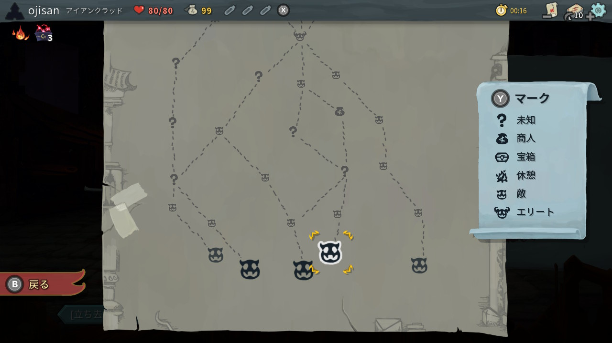

明日から 4 連休だけど 東京都民は Go To トラベルができないらしいので、ちょっとした暇つぶしな情報を共有しようと思います。
最近まで Slay the Spire というゲームにハマっていたのですが、一応クリアをしたので感想 + オススメ的なものを書いていきます。
なおストーリーが(ほぼ)ないゲームなのでネタバレ全開で書いていきます。
読んでしまっても問題ないとは思いますが自己責任でお願いします。

ちなみにこのゲームはとんでもない中毒性を持っていて、平日の昼間は別のことをやりながらも、購入して一週間でプレイ時間は大体 90 時間、2 週間で 130 時間（**他の人に比べると圧倒的に少ない**）くらい行きました。
熱中するあまりご飯を食べながら片手間にやろうと思ってやってたら、気付いたら 2 時間後に何も食べておらず全部冷めていたなんてこともあり、それくらい入れ込んでしまうゲームでした。

（スプラや FE といった他のやり込みゲームのプレイ時間を 2 週間で超えてしまったのはちょっと驚きました。（もっともプレイ時間自体が少なすぎると言う点はありますが））

## Slay the Spire ってなに

[Slay the Spire](https://store.steampowered.com/app/646570/Slay_the_Spire/?l=japanese)は公式の説明を借りると '''デッキ構築 × ローグライクの新感覚カードゲーム''' です。
Mega Crit Games が Steam で発売した PC 向けゲームですが、昨年 Switch や iPhone に移植されました。

- https://ec.nintendo.com/JP/ja/titles/70010000012390
- https://apps.apple.com/jp/app/slay-the-spire/id1491530147

Switch 版の説明では

> 『Slay the Spire』は、デッキ構築にローグライク要素を組み合わせた新感覚の 1 人用カードゲームだ。自分自身の選択で作り上げるカードデッキと、不思議なレリックの力を組み合わせて数々の試練が待ち受ける塔へと挑め！

とあり、要約すると **「ダンジョンを進んでカードとレリック（特殊なアイテム）を手に入れてデッキを作り、次々と強敵が出てくるダンジョンを攻略しよう」**という内容です。

<iframe width="560" height="315" src="https://www.youtube.com/embed/vlX2uG8pZJc" frameborder="0" allow="accelerometer; autoplay; encrypted-media; gyroscope; picture-in-picture" allowfullscreen></iframe>

戦闘はターン&コスト制で、決められたコスト内でカードをプレイし、攻撃や相手ターンでの攻撃に備えるといったものです。
そしてデッキは開始時は同じものですが、マップを進み敵を倒したりイベントをこなしながらカードを手に入れることでデッキを強化していきます。

ランダムに生成された地図でスタート地点や分岐を選ぶことで地図を進んでいきます。
進むたびにバトルやイベントが発生し、それらをこなすことでカードやレリックを手に入れて自身を強化していきます。
もちろんイベントは良いイベントだけではないのでどう進むかも深く考える必要があります。

これだけだと単調なゲームなのですが、Slay the Spire では

- ダンジョンは進むだけ、戻って育成とかはできない
- ダンジョンは全てランダム、マップや敵や発生イベントや獲得カードが全部ランダムの中でデッキを強化していく
- ただしデッキ圧縮のためにはカードを取らない選択も大事（キーカードを引きやすくするため）
- セーブがない(スリープはできる)

という要素があります。

そのため実際はとても深みのあるゲームで、**戦闘は常に全力で思考しなければいけなく、思考力や戦略性が非常に問われるゲーム**です。
特にカードやレリックの組み合わせによってデッキの戦術は変わってくるのでどのタイミングで何を手に入れるかによってデッキの中身や目指す方向性は大幅に変わってきます。

たとえば使用枚数で恩恵を得られるレリックを手に入れたら 0 コストカードやドローソースをたくさん確保することでコンボを考えたり、

たとえば一見したら弱いカードでも、0 コスト主軸のデッキで複数枚組み合わせることで火力にできるカードもあります。

他にもパワーアップカードと組み合わせることでコスト以上のカードを運用できるようになる組み合わせがあったり、

手に入れるカードやレリックによってデッキの戦術は大きく変わってきます。
そのため、そのとき手に入れたレリックによってデッキの方向性を決め、デッキの方向が決まるとそのキーカードを手に入れるための戦略を考えたりなど、**運をどう制御するか**を考えなければいけません。
もちろん、そのレリックやカードが手に入るかは完全に運でもあるので、運を制御できず簡単に死んでしまうことも多々あります。
常にデッキビルディングと戦闘で全力で思考してランダムネスを制御しないといけないのがこのゲームの面白さです。

## Slay the Spire の魅力(=沼の要因)

このゲーム、楽しいのですが同時にとんでもない中毒性を持っています。
**特になにかやり込み要素があるわけではないのですが、普通にクリアするだけでも気付いたらのめりこんでしまう恐ろしさがあります。**
それはランダム要素が多すぎるということと、プレイ時間が長くても 2 時間くらいで済むゲームのシステムそれ自体に理由があります。
そして何よりも普通のクリアが難しすぎます！

### 全てがランダムであること

Slay the Spire の楽しさの源はこのランダム性にあると思っています。
ランダムがゆえに考え続ける必要があり、運の要素もあり、その運を読む必要もあったりと、面白さの源泉であり飽きが全くこない理由になっています。

#### トライアンドエラーせざるを得ない

得られるカードやレリックは全てランダムです。
マップもランダムです。
敵も発生するイベントもランダムです。
ボスも、ラスボス以外はランダムです。

どの組み合わせでデッキを作ると有効かは、プレイのたびに毎回変わってきます。

そしてこのゲームの最悪なところなのですが、**死んでも苦じゃありません**。
セーブの概念がないので死ぬとはじめからになるのですが、死ぬと「あーやらかした、よし次こそは！」となります。
自分のどういった行動で死んだか大体予想がつくのでそれを回避しようとする意識が働いて、それをやり遂げようとゲームを止めることを忘れてしまいます。
そして全てがランダムであることから単調さもなく**何度も繰り返してしまう**ことになります。

死んだときは「また挑戦する？」と聞かれ、結局また挑戦してしまいます。

キャラクター選択画面ももう見飽きました。
親の顔と同じくらいの回数この画面をみた気がします。

何回もやり直します！

#### 最適な戦略が分かっても安定行動が取れない（なぜなら全てランダムだから）

プレイのたびに作るべきデッキが変わってくるということは、前回のプレイで学んだ教訓も生かしづらいです。
なぜならそのときに出来上がるデッキは別なものだし、出てくる敵も違うからです。
そのため安定行動を取れるようになるためには、とにかく死にまくるしかないです。

(な〜〜〜にが「明日もう一度挑戦だ」だ。今から挑戦するんだよ！)

どんなデッキが作れるか、どんな敵にどんな戦法が有効かを全部頭の中に入れて、ようやくスタート地点に立てます。（まれに何も知らなくても偶然初見のキャラでも勝てたりしますが本当に偶然です）

そのためこのゲームではとにかく施行回数を稼いでいきます。
前回のプレイで学んだ教訓も生かしづらいとはいえ何十回も繰り返してくると、だんだんと運を制御できるようになってきて自分の成長を実感できてきます。
そうなると死んでも「次こそは！」となり、それが前述の死んでも苦じゃないことと相まって、何度もこのゲームをプレイしてしまう原因になっています。

#### 安全圏なんて存在しない、死ぬときは死ぬし、詰むときは詰む

このゲームはゲームを通して回復できるポイントが非常に少ないです。
休憩場所みたいなのはあるのですが、最大 HP の 30%しか回復できず HP 管理が非常に難しいです。

そのため基本的にはカードを使ったブロックで被ダメを減らす戦略を取ります。

他のゲームだといわゆる雑魚敵は瞬殺するといったことができますが、このゲームはそもそもレベルをあげるといったことができないので、その都度出てくる敵と全力で戦います。
仮に強いデッキを作っていても引きが悪いといっきに HP を削られたり、最悪の場合負けることもあるので、油断できません。

この最善の手をとっても死んでしまうのがまた**ドキドキ要素**で飽きがこない原因となっています。

#### リスクを取らないと死ぬ

ボス以外の敵でも死ぬのがこのゲームですが、ラスボスが強すぎるのでそれまでに最強のデッキを作らなければいけません。
強いカードやレリックはエリートと呼ばれる中ボス的な存在が持っているので、ランダムなマップからそいつらを探して狩り、強いカードを手に入れて行く必要が生まれてきます。
このちょっと強そうな敵のマークがエリートです。

特に作るデッキにおけるキーカードやシナジーとなるレリックが不足している場合はそれを取らないと絶対にボスに勝てないのでそういったリスクをとる必要があります。

そしてゲーム後半でも中ボスを狩りやすくするべく序盤から強いカードは揃えておきたく、そうなると序盤から強い的に挑んでいくと言った戦略をとって行かなければいけません。
そういったリスクテイクをどこまで行うか、どのタイミングでやるべきかといったゲームの進め方自体の戦略を考えないといけないところも面白いところです。
そして **リスクテイクの結果良いデッキができあがってくると読みが当たった嬉しさが強まり、快感が増していきます**。

まあ大体はリスクテイクの途中で死ぬんですけどね。

### ゲーム自体はカジュアル

その 1 回のプレイでラスボスの手前まででだいたい 2 時間もあればたどり着けます。
（右上のプレイ時間に注目）

そのため死んで何回も繰り返していくタイプのゲームです。
ローグライクで死んだらまた最初からなのですが、プレイ時間そのものはあまりかからないので、何度でも繰り返せます。
それがランダム要素といい感じに絡まって、何度挑戦しても飽きがこない設計になっていて、カジュアル要素混ぜるなよという気持ちになっていました。

### クリアしたと思ったらそれはまだスタート地点だった

私は全キャラクターでラスボスの解禁と、そのラスボスの撃破をしています。
まあ全クリしたと思っていたのですが、どうやらそうではないようです。

#### 登塔モード

クリアすると登塔モードというのが出てきました。
これは 20 レベルまであるらしいです。
自分がクリアしたのは一番低いレベルのレベル 1 だったようです。
急にレベルが上がるとかではないようなのですが、何かしらの縛りを受けてゲームをするので大変そうと思いました。
何よりもこれまでの作業をあと 20 回繰り返すのかよという絶望感はあります。
ただ全部やらないと見れない演出があるらしくやらねばという気持ちになっています。

(下にある登塔というチェックを入れるとそのモードでプレイができる。)

#### RTA やランキング

僕は 130 時間かけて 4 キャラを攻略しました。
結果を見たら 90 回ほど挑戦しているらしいです。
そしてラスボスの討伐まで 2 時間かかっています。

このゲーム、クリア時間や連続クリア回数をランキングできる機能があるのでそれを見てみると、クリア時間のランキングは、7m~11m とのことです。

そして連続クリア回数のランキングは 120~15 とのことです。

1 位の 120 ってなんだよという感じです。
自分は 90 回の挑戦で 4 回クリア(4 キャラ)なので、23 回挑戦してやっとラスボスを倒せるくらいの間隔です。
そもそも連続でクリアできることもすごいのにこんな 100 回っておかしいだろという気持ちがあります。
ただ同時に上位ランカーでも 15 回ほどで途切れ連続クリアが難しいようで、特段自分のプレイが下手ではないのだなとも思いました。

**このゲーム普通に面白いだけでなく終わりも見えない！沼！！！**

### よくわかんないけど愛着が湧くキャラ

敵のキャラがいいです。

#### 狂信者

お面がかわいい、たまに喋る「クェエクェエ！」ってセリフも可愛い。
イベントで彼らのアジトに行く回があって、ちょっと面白かった。

ただし毎ターン攻撃力が 3 ずつ上がっていくので生やさしいものではないです。

#### デカ＆ドヌー

デカとドヌーが名前からして可愛い。
このぬるぬる動く感じが可愛すぎる。

<iframe width="560" height="315" src="https://www.youtube.com/embed/4d-vG724HVU" frameborder="0" allow="accelerometer; autoplay; encrypted-media; gyroscope; picture-in-picture" allowfullscreen></iframe>

ただその可愛さとは裏腹に、お互いに攻撃と防御のバフをかけあうので速攻で倒さないと厄介な敵です。
死体爆破を使えば楽に倒せたりします。

#### スライムボス

一番好きなキャラクターです。
このやる気のない顔といい、ちょこんと載せた帽子が可愛いんですよね。

<iframe width="560" height="315" src="https://www.youtube.com/embed/6dM-E16lZMA" frameborder="0" allow="accelerometer; autoplay; encrypted-media; gyroscope; picture-in-picture" allowfullscreen></iframe>

たまに喋るのも可愛い！「すらいむ...くらっしゅ！！！」
ステージ 1 のボスなので苦労せずに倒せる敵です。（デッキや状況によってはたまに負けます。）

ストーリーがほぼないのですが、何百回とエンカウントする敵なので自然と敵キャラへ愛着が湧いてくるのもこのゲームの魅力です。
そうなってくるとなんかストーリーがありそうな気もしてきます。
（ストーリーは見えてきませんがキャラたちの生活様式みたいなのは見えてくる）

## クリアした感想

と、まあ見事にハマり倒しました。
レベル 20 までクリアできていないとはいえ、一応はクリアはしているので僕はここでやめようと思います。
本当に生活が破壊されてしまいます。

この記事では「このゲームはマジで沼だよ」という宣伝（=警告）をしたわけなのですが、実際のところはターン制ゲームなので **ちょっとした隙間時間にやったりするのにぴったりなゲーム** だとも思います。
世間もリモートワークが徐々に解禁されているとのことで、時間の融通がつきやすくなっていることでしょう。
ちょっとした息抜きなカジュアルゲームとして、このゲームはおすすめです！
お値段も 2500 円/1200 円とお求めやすいので、やってみてはいかがでしょう！

- https://ec.nintendo.com/JP/ja/titles/70010000012390
- https://apps.apple.com/jp/app/slay-the-spire/id1491530147
