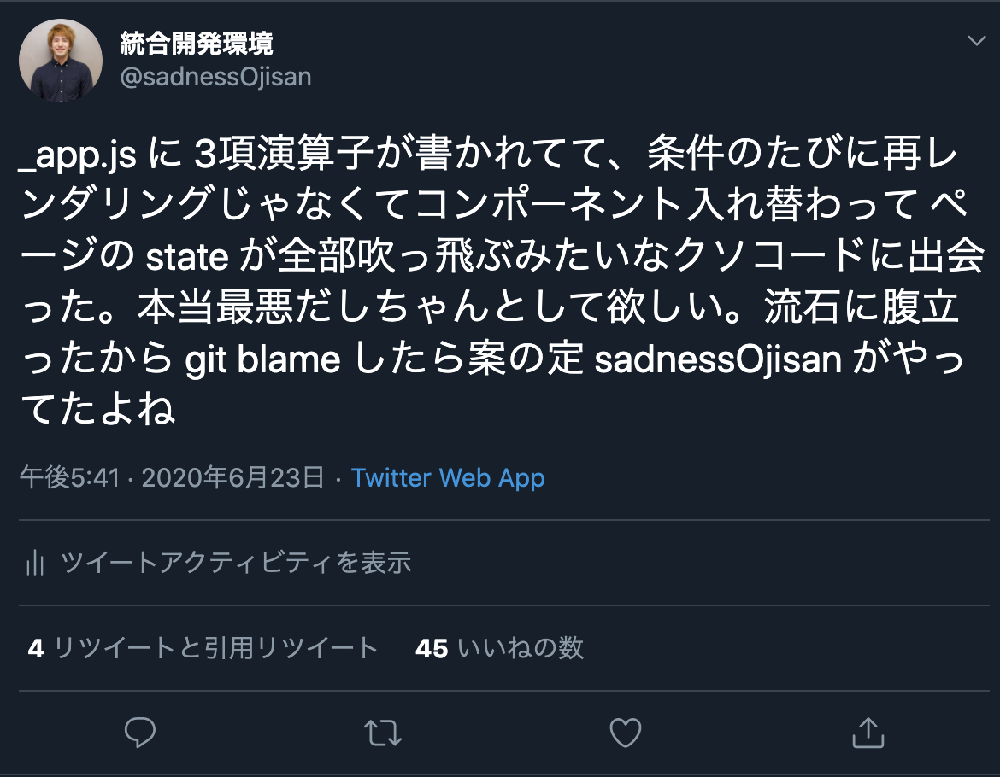
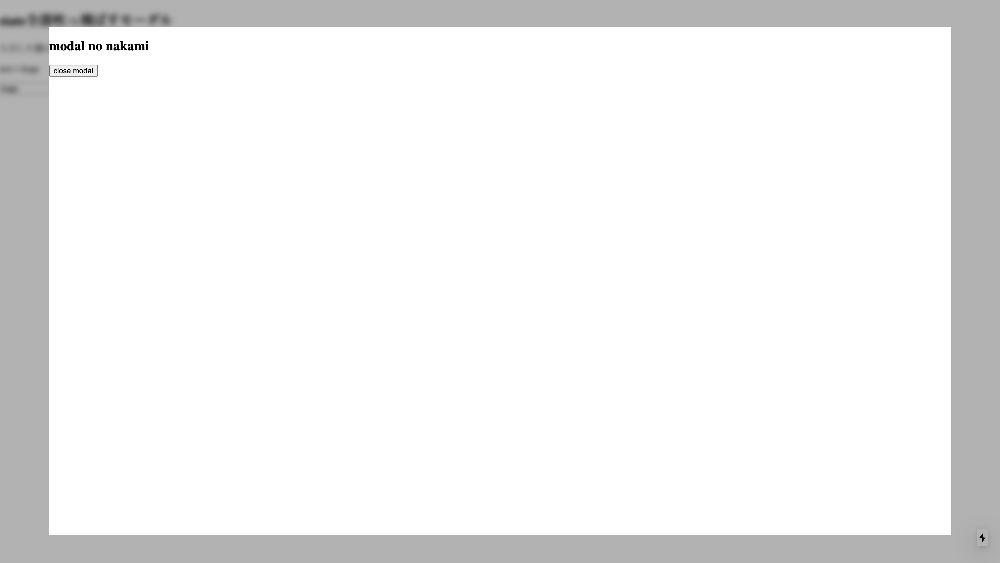
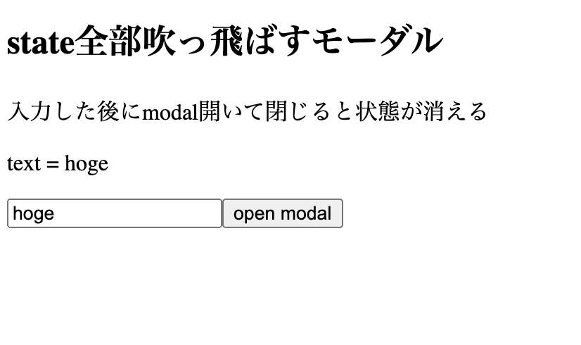
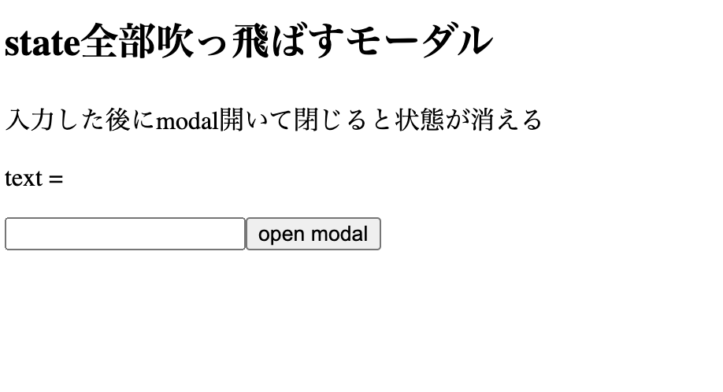
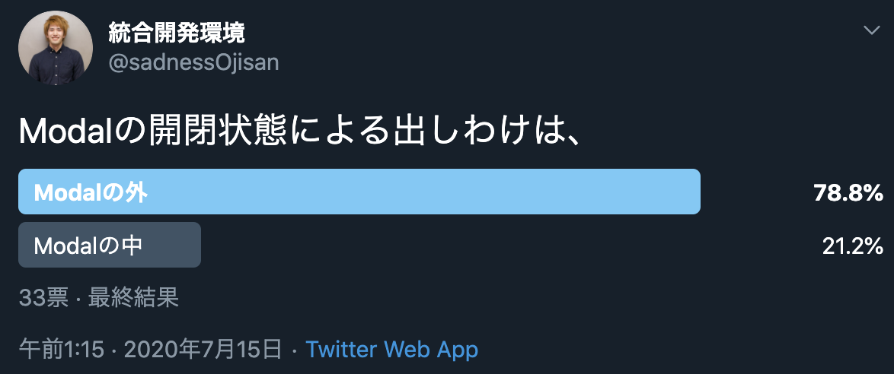

今からお話しすることは本当にしょうもないことである...

たとえば、フォームの入力画面があって、送信前に確認画面(Confirm)を挟むとしよう。
そしてそれはいろんなフォームでやる操作なので、共通レイアウトファイルに書いてしまおう。
たとえば NextJS の例でいくと、\_app.tsx のような全ページの基準となるようなファイルにて

```tsx:title=_app.tsx
export default function App({ Component, pageProps }: AppProps) {
  const [isOpen, setOpen] = React.useState(false)
  return (
      {isOpen ? <div><Children></Children><Confrim></Confirm></div> : <Children></Children>}
  )
}
```

みたいなファイルを作ります。

そして Children に何か状態を持っていたとして、この confirm を閉じるとなんと**その状態が全部消えてしまいます**。
例えばフォームで最後に送った状態なんかを管理していたとしてもそのデータは消えます。

それもそのはず、条件が true の節から false の節に切り替わり、`<Children></Children>`コンポーネントそのものが消えて再度作り直されたからです。
再レンダリングではなく、コンポーネントそのものが作り直されたため state も初期化されてしまいます。

## さすがにその実装はひどすぎでは・・・

聡明な方々は「そもそもその Confrim の使い方や三項演算子の使い方がおかしいのでは！？」って思うかもしれません。
実際のところ僕はこう書くと思います。

```tsx:title=_app.tsx
export default function App({ Component, pageProps }: AppProps) {
  const [isOpen, setOpen] = React.useState(false)
  return (
    <div>
      <Children></Children>
      {isOpen && <Confrim></Confirm>}
    </div>
  )
}
```

と、言ってもそういうコードに出会うかもしれないし、そんなコードを誰かから引き継ぐかもしれません。
実際、**僕のコードを引き継ぐと出会えます**。



なので、**もし何らかの処理をして state が全部吹っ飛んでしまうといったコードに出会った時は、このような三項演算子がどこかに挟まっていないか**という観点で調査すると解決するかもよというアドバイスでした。
案外 \_app.tsx や layouts.tsx のような全ページの共通レイアウトファイルに含まれているかもしれません。

## 三項演算子でそのような書き方をする場面

ちなみにそんな「三項演算子を書くことあるかい！？」と思われた方もいると思いますので、どういうときに書いちゃうかという例をお見せします。
世の中には**正常な判断力を失う仕様**なんてものが存在し、そのようなときに三項演算子を書きたくなってしまう場面がありますし、思い当たる節もあります。

### div を一つ多く被せたい場合（Safari, IE 対応）

代表的なので言うと、Safari の Bounce 対応（慣性スクロールを許した時にスクロールがびよーんて伸びるやつです）と IE 対応(たとえば flex-box に min-height を効かないときの対応)、[backdrop-filter](https://developer.mozilla.org/ja/docs/Web/CSS/backdrop-filter) が使えない環境下ですりガラスのようなフィルター効果を実装する場面に代表される **無意味な div ラッパーで囲わないといけない場面**です。

もしブラウザ上のイベントによって、それらの対応が必要となる UI が呼び出されるなら、三項演算子を使いたくなってしまいます。

ここではすりガラスモーダルを例としてあげます。
iPhone の通知画面にあるような背景がモザイクのようにボカされるモーダルです。



これはモーダルの背景に `backdrop-filter` を使えば解決するのですが、Chrome で使えるようになったのもここ 1 年といった話で、古いブラウザではそれに対応できません。
そこで backdrop-filter が使えない場合の実装方法として、モーダル以外のコンポーネントに直接 filter を使ってぼかすというやり方があります。

いまこういうモーダルを開く画面があるとします。

```tsx:title=index.tsx
import * as React from "react"
import { BlurContext } from "../pages/_app"

export default () => {
  const context = React.useContext(BlurContext)
  const [text, setText] = React.useState("")
  return (
    <div>
      <h2>state全部吹っ飛ばすモーダル</h2>
      <p>入力した後にmodal開いて閉じると状態が消える</p>
      <p>text = {text}</p>
      <input onChange={e => setText(e.target.value)}></input>
      <button
        onClick={() =>
          context.action(
            <div className="modalWrapper">
              <h2>modal no nakami</h2>
              <button onClick={() => context.action(null)}>close modal</button>
            </div>
          )
        }
      >
        open modal
      </button>
    </div>
  )
}
```

そこで、テキスト入力フォームとそれの値が bind された文字列と、モーダルを開くボタンを用意します。
状態を吹っ飛ばす例をお見せする為に、適当に hoge か何か書いておきます。



そしてモーダルやブラーの共通管理を\_app.tsx でやるとします。
「そもそもそんなことするのが間違いでは」といいたくなる気持ちもあるかとは思いますが、**全モーダルをすりガラス化するのであれば共通処理として書きたくなるはず**です。

```tsx:title=_app.tsx
import * as React from "react"
import { AppProps } from "next/app"

export const BlurContext = React.createContext<{
  state: React.ReactNode | null
  action: React.Dispatch<React.SetStateAction<React.ReactNode | null>>
}>(null)

export default function App({ Component, pageProps }: AppProps) {
  const [modalContents, setOpen] = React.useState<React.ReactNode | null>(null)
  return (
    <div>
      <BlurContext.Provider value={{ state: modalContents, action: setOpen }}>
        <div>
          {!modalContents ? (
            <Component {...pageProps} />
          ) : (
            <>
              <div className="blurWrapper">
                <Component {...pageProps} />
              </div>
              <div className="modalWrapper">{modalContents}</div>
            </>
          )}
        </div>
      </BlurContext.Provider>
      <style jsx>
        {`
          .blurWrapper {
            filter: blur(5px);
            background-color: rgba(0, 0, 0, 0.3);
            position: fixed;
            width: 100vw;
            height: 100vh;
            // ここで位置を左に固定しなければ白背景色とblurが混じって黒半透明のデザインが滲んで崩れる。
            top: 0;
            left: 0;
          }
          .modalWrapper {
            position: fixed;
            top: 5vh;
            left: 5vw;
            width: 90vw;
            height: 90vh;
            background-color: white;
          }
        `}
      </style>
    </div>
  )
}
```

ここでは modal の表出に応じて、

```tsx
<div>
  {!modalContents ? (
    <Component {...pageProps} />
  ) : (
    <>
      <div className="blurWrapper">
        <Component {...pageProps} />
      </div>
      <div className="modalWrapper">{modalContents}</div>
    </>
  )}
</div>
```

として分岐させています。

ここでモーダルを開いてみます。


そして閉じます。



`text=`の続きが消えてしまいました。

このように三項演算子をつかってコンポーネントを切り替えることで状態が消えてしまいました。

#### && を使うことで回避できるのか

これも && を使ってそもそも三項演算子を使わなければいいのかもしれませんが、このような div を余計にかぶせるパターンだと単純には && で制御できません。
もちろん、div が不要な時も div で被せてしまい、blur の制御を CSS in JS で行えば && が使えないことはないです。

```tsx:title=index.tsx
<div>
  <div className="blurWrapper">
    <Component {...pageProps} />
  </div>
  {modalContents && <div className="modalWrapper">{modalContents}</div>}
</div>
<style jsx>
  {`
    .blurWrapper {
      filter: ${modalContents && `blur(5px)`};
      background-color: rgba(0, 0, 0, 0.3);
      position: fixed;
      width: 100vw;
      height: 100vh;
      // ここで位置を左に固定しなければ白背景色とblurが混じって黒半透明のデザインが滲んで崩れる。
      top: 0;
      left: 0;
    }
  `}
</style>
```

しかし不要な div があるのは嫌に感じる人もいるでしょう。
そのようなことをしたくなければ三項演算子を使うしかないのが現状です。

これに対する解決策はそもそも IE 対応や Safari のバウンス対応やブラウザですりガラスを作るような仕事に近づかないことですが、そうもいかないと思いますので現実的な解決策を述べると、 **三項演算子のスコープを狭めて、その外のレイヤーで状態を管理する** です。
三項演算子によって三項演算子の内側(子コンポーネント)の状態が飛んでいるので、その状態を三項演算子の外で管理しておけば大丈夫です。
そたのめにも三項演算子によって切り替わる範囲はなるべく小さくしておきましょう。

このモーダルの例だと、モーダルが出てくるたびにそのページコンポーネントに開閉状態管理の処理を書くことになるので冗長にはなりますが、 \_app.tsx ですりガラス効果を実現するのではなく各ページの一番外側のコンポーネントにブラー効果を与え\_app.tsx に分岐を書くのをやめるとよいです。

実装例は[こちら](https://github.com/ojisan-toybox/bomb-state)です。

### レスポンシブデザインにおけるコンポーネント切り替え

あと、これはたまに出会うコードなのですが、

```tsx:title=index.tsx
import * as React from "react"
import useMedia from "use-media"

export default props => {
  const isPC = useMedia({ minWidth: "1000px" })
  return <div>{isPC ? <SideBar /> : <Header />}</div>
}
```

といった、いわゆるツールバーみたいなものを提供していて、PC は画面幅が広いから横につけるが SP だと画面幅がないから上につけるというようなケースでも三項演算子による切り替えをみます。
もしここでこのツールバーがたとえば何らかの状態を持っていれば、ユーザーが画面サイズを変えた時にコンポーネントが切り替わってしまい状態が吹っ飛んでしまいます。

ツールバーでクリティカルな状態管理はしないはずですが、コンポーネントを切り替えたときに状態が吹っ飛んでしまう実装なので、注意はしておきましょう。

## &&も同様の問題がある

何かをしようとしているときに条件分岐によって強制的に状態が切り替わる問題は && でも起き得ます。

### 条件分岐によってモーダルの閉アニメーションが飛ばされる

いま `isOpen` というフラグでモーダルの開閉を管理しているとします。

```tsx:title=index.tsx
import * as React from "react"

export default () => {
  const [isOpen, setOpen] = React.useState(false)
  return (
    <div>
      <button onClick={() => setOpen(true)}>open modal</button>
      {isOpen && (
        <div className="modalWrapper">
          <div className="modalContent">
            <h2>modal no nakami</h2>
            <button onClick={() => setOpen(false)}>close modal</button>
          </div>
        </div>
      )}
    </div>
  )
}
```

たとえばこの modalWrapper コンポーネントですが、開閉のアニメーションを付けて欲しいと言われたらどうしますか。

それは簡単で、Confrim の CSS に transition を付けたらいいです。
**ただそれは開くときはアニメーションが付きますが閉じるときは付きません。**
閉じるアニメーションが走る前に、isOpenConfirm が false になると modalWrapper それ自体が消えてしまうからです。

これを解決する為には、コンポーネントを JS で切り替えないようにすること、**つまり&&を使わずに CSS in JS で開閉処理を実現すること**です。
たとえば、

```tsx:title=index.tsx
import * as React from "react"

export default () => {
  const [isOpen, setOpen] = React.useState(false)
  return (
    <div>
      <button onClick={() => setOpen(true)}>open modal</button>
      <div className="modalWrapper">
        <div className="modalContent">
          <h2>modal no nakami</h2>
          <button onClick={() => setOpen(false)}>close modal</button>
        </div>
      </div>
      <style jsx>
        {`
          .modalWrapper {
            transition: opacity 0.5s, visibility 0.5s;
            opacity: ${!isOpen ? 0 : 1};
            visibility: ${!isOpen ? "hidden" : "initial"};
            position: fixed;
            top: 0;
            left: 0;
            width: 100vw;
            height: 100vh;
            background-color: ${isOpen && "rgba(0, 0, 0, 0.3)"};
          }
          .modalContent {
            position: fixed;
            top: 5vh;
            left: 5vw;
            width: 90vw;
            height: 90vh;
            background-color: white;
          }
        `}
      </style>
    </div>
  )
}
```

などとして、modalWrapper に対して CSS in JS を使って アニメーションをつけると良いでしょう。

### 有名ライブラリのモーダル I/F

ちなみに、有名ところのモーダルコンポーネントはモーダルのフラグを外で管理する I/F ではなく、(flg を渡すのはライブラリとしての I/F の体をなさせるためだけかもしれませんが、)フラグをモーダルに渡す実装になっています。

#### [material-ui](https://material-ui.com/components/modal/)

```jsx
<Modal
  open={open}
  onClose={handleClose}
  aria-labelledby="simple-modal-title"
  aria-describedby="simple-modal-description"
>
  {body}
</Modal>
```

#### [ant-design](https://ant.design/components/modal/)

```jsx
<Modal
  title="Basic Modal"
  visible={this.state.visible}
  onOk={this.handleOk}
  onCancel={this.handleCancel}
>
  <p>Some contents...</p>
  <p>Some contents...</p>
  <p>Some contents...</p>
</Modal>
```

#### [chakra-ui](https://chakra-ui.com/modal)

これはアニメーションの要件はないが Modal に flg を渡している

```jsx
<Modal isOpen={isOpen} onClose={onClose}>
  <ModalOverlay />
  <ModalContent>
    <ModalHeader>Modal Title</ModalHeader>
    <ModalCloseButton />
    <ModalBody>
      <Lorem count={2} />
    </ModalBody>

    <ModalFooter>
      <Button variantColor="blue" mr={3} onClick={onClose}>
        Close
      </Button>
      <Button variant="ghost">Secondary Action</Button>
    </ModalFooter>
  </ModalContent>
</Modal>
```

### 実際どうすべき？

とまあモーダルの中に開閉処理を押し込んだ方が良いと思うのですが、実際は外で管理したい人の方が多いようです。



外で管理するモチベーションとしては「外で管理した方が可読性がある」、「CSS で見えなくしても実際に DOM があるのは気持ち悪い」があるとは思うのですが、モーダルはアニメーション入れたいといった話がよく出てくるので、最初からアニメーションに対応できるように入れ込んでおいた方が、後々の**自衛として**もよいと思います。

## おわりに

落ち着いて考えてみたらしょうもない話なのですが、条件切り替えによって状態が吹っ飛ぶことはある話です。
実際このようなコード書きたくなる場面はあるし、また初学者にとってはコンポーネントそれ自体が入れ替わる場合と再レンダリングの区別がつかなかったりして、「なんで状態が消えたんや」となるのかなと思っています。
「なにか状態が飛ぶコードに出会ったら、どこかで三項演算子がいるのかもしれない」ということをデバッグに備えて頭の片隅に入れておくと救われるかもしれませんね。
