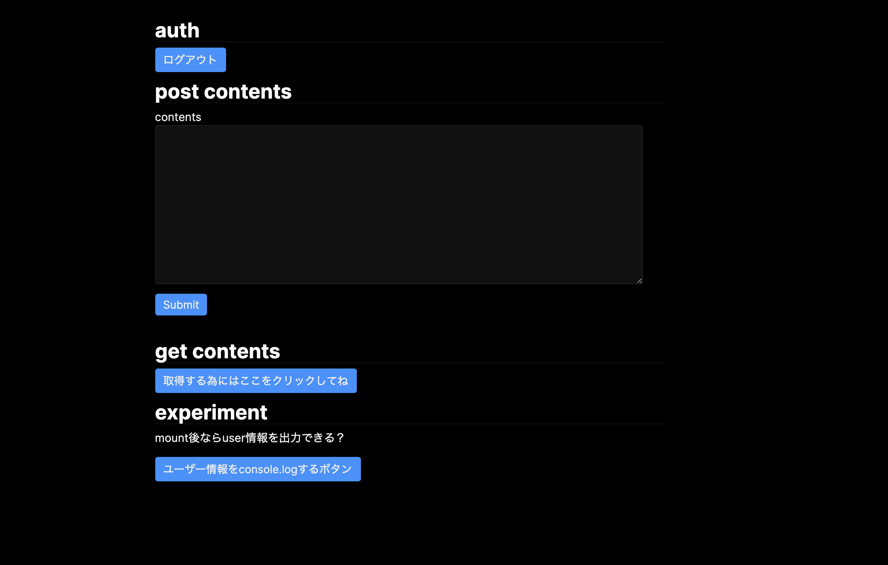
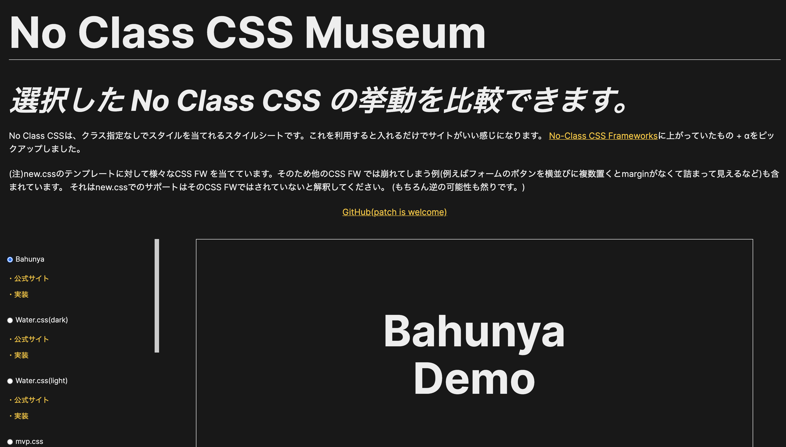
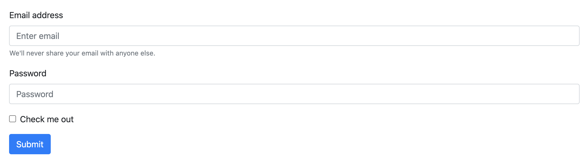
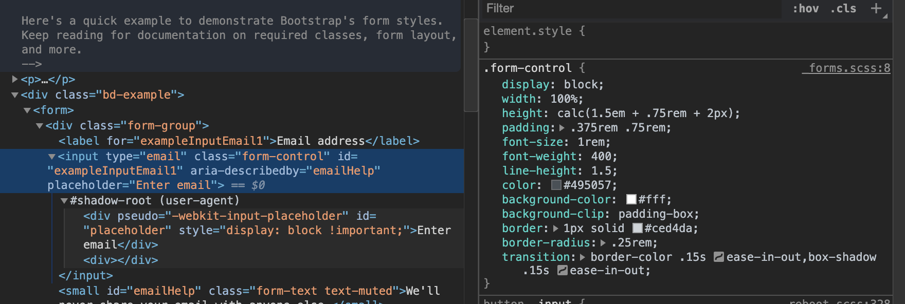
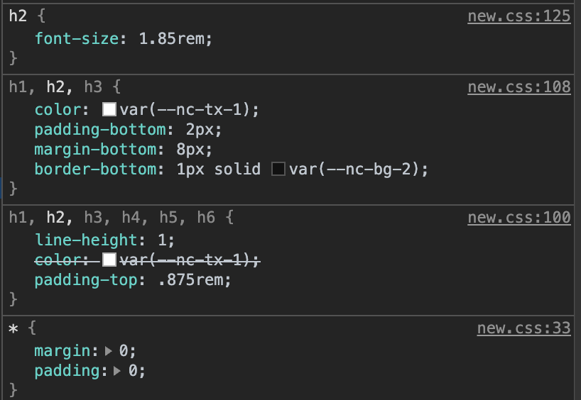
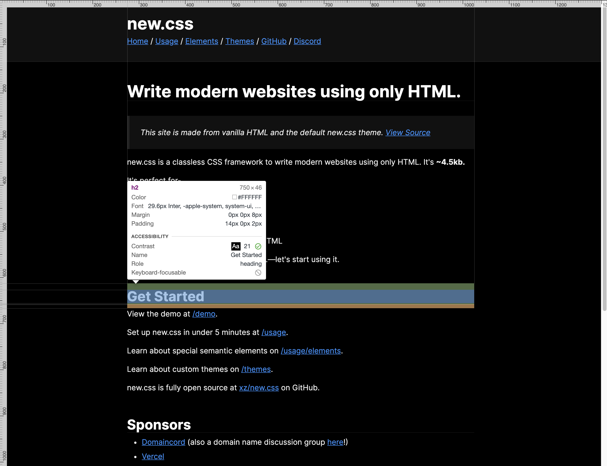
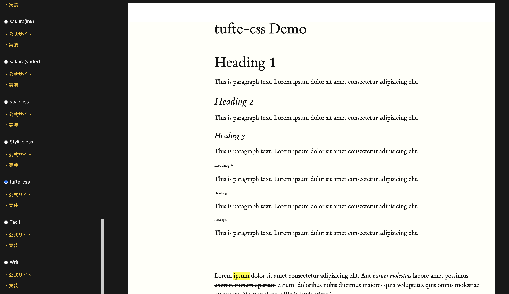
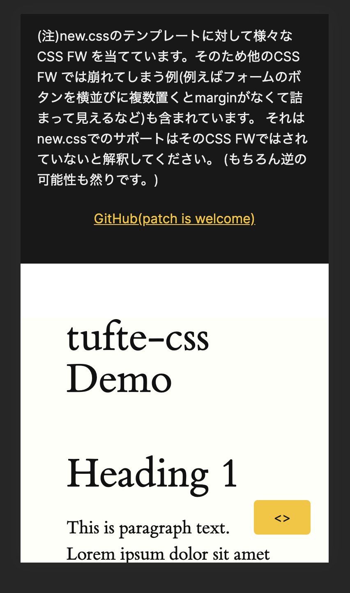
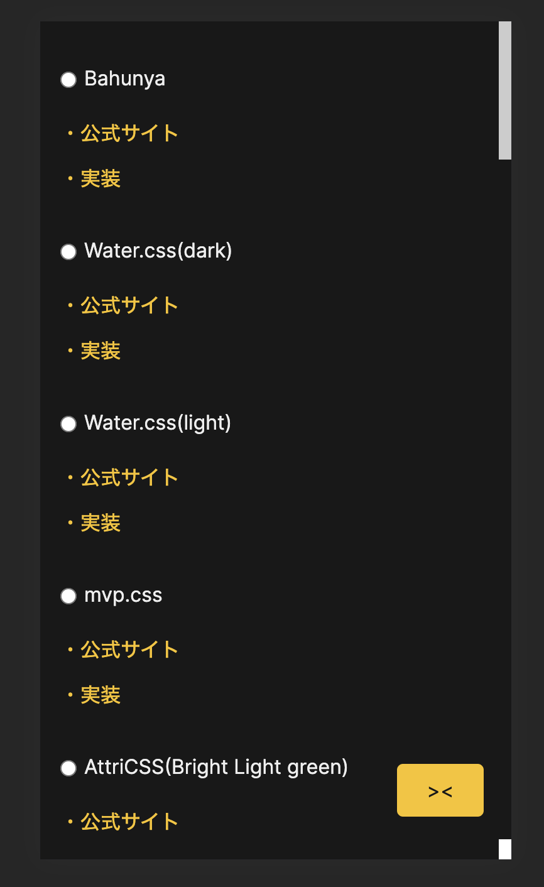

[No Class CSS Museum](https://sadnessojisan.github.io/no-class-css-museum/index.html)という No-Class CSS フレームワーク比較サイトを作りました。

簡単な demo 用のコードに何かスタイル当てたいけど、そんなに時間かけたくないしそもそもデザインセンスないしどうしようかなってときに No-Class CSS フレームワークが便利です。
たとえば昨日公開した[Firebase の存在をフロントエンドから隠蔽するために](https://blog.ojisan.io/fb-nukeru)のデモサイトもそういった No-Class CSS フレームワークである[new.css](https://newcss.net/)を使いました。



これは **CSS ファイルを読み込んだだけ**(タグにクラスを割り振ったりしていない)なのですが、それだけでいい感じにスタイルが当たってちょっと感動しました。

以前の記事である[ブログの 1 ヶ月を振り返る](https://blog.ojisan.io/blog-one-month#%E5%B0%B1%E6%B4%BB%E7%94%A8%E3%81%AE%E3%83%9D%E3%83%BC%E3%83%88%E3%83%95%E3%82%A9%E3%83%AA%E3%82%AA)に書いた通り、このブログは書いた内容のサンプルコードやデモをどんどん公開していく方針で運営しています。
ただ、なにもスタイルを当てずに公開するのは殺風景だし、スタイルを頑張るのはそれを目的にしているわけではないのであまりやりたくないしという悩みがありました。
そこでこの No-Class CSS フレームワークがちょうど自分のニーズにマッチし、採用していくことにしました。

とはいえいろんな CSS FW があるのでそのときの気分に合わせて一覧して比較して選びたいなと思い、それができるサイトを作ってみました。
それが [No Class CSS Museum](https://sadnessojisan.github.io/no-class-css-museum/index.html)です。



ここでは次の CSS フレームワークのスタイルの当たり方を比較できます。

- Water.css
- MVP.css
- AttriCSS
- awsm.css
- Bahunya
- holiday.css
- Markdown CSS
- Marx
- Sakura
- style.css
- Stylize.css
- Tufte CSS
- Tacit
- Writ
- new.css
- bullframe.css

これらは[No-Class CSS Frameworks](https://css-tricks.com/no-class-css-frameworks/)で紹介されていたもの をベースにしており、実際に比較サイトに掲載したのはここで紹介されたもの + α + それぞれのカラーテーマという形です。そのため他にも良い CSS FW を見落としているかもしれませんので、もしご存知でしたら [Issues](https://github.com/sadnessOjisan/no-class-css-museum/issues)に報告していただけると嬉しいです。

このサイトを作ってみて No-Class CSS フレームワークの扱い方みたいなのがちょっとわかったので以下まとめていこうと思います。
ちなみにそのサイト自体には [Bahunya](https://kimeiga.github.io/bahunya/)を当てています。

## No-Class CSS フレームワークって

その名の通り、class が不要な CSS フレームワーク です。

### 従来の CSS FW の仕組み

CSS フレームワーク は例えば Bootstrap や Bulma などが有名だと思います。
これらの CSS FW は

```html
<form>
  <div class="form-group">
    <label for="exampleInputEmail1">Email address</label>
    <input
      type="email"
      class="form-control"
      id="exampleInputEmail1"
      aria-describedby="emailHelp"
      placeholder="Enter email"
    />
    <small id="emailHelp" class="form-text text-muted"
      >We'll never share your email with anyone else.</small
    >
  </div>
  <div class="form-group">
    <label for="exampleInputPassword1">Password</label>
    <input
      type="password"
      class="form-control"
      id="exampleInputPassword1"
      placeholder="Password"
    />
  </div>
  <div class="form-group form-check">
    <input type="checkbox" class="form-check-input" id="exampleCheck1" />
    <label class="form-check-label" for="exampleCheck1">Check me out</label>
  </div>
  <button type="submit" class="btn btn-primary">Submit</button>
</form>
```

などとして記述していきます。
ここでは HTML タグに class が記入されており、クラスベースの CSS FW ではこのクラスに対してスタイルを当てていきます。

その結果、



といった感じになります。
このとき各種タグには(ここでは.form-control)



と言う風にクラスに対してスタイルが当たります。

### No-Class CSS FW の仕組み

一方で No-Class CSS FW では class に対してではなく直接 HTML のタグにスタイルを当てます。



このようにクラス名ではなくタグに直接スタイルが当たっています。
そしてスタイルがあたった結果はこうです。



結構見栄えが良いですよね。

## CSS FW ざっと見てみた感想

### 嬉しい点

- 圧倒的に楽

  - いちいちクラスを割り振らなくていいので楽にスタイルを当てられる

- 実は画一的なデザインにならない
  - スタイルシートに変数が埋め込まれているので、それをいじればカスタマイズもできる。
  - その変数のセットを公式が配布していたりもする。いわゆるテーマ。

### 悲しい点

- 単体で必ず使えるとは限らない

  - どうしてもスタイルが崩れるところもあるのでそこは自前で CSS を当てる必要がある。
  - SP 対応を最初から諦めているものもある

- 利用者数は少なそう

  - 使い方次第では不具合やモヤりポイントがあるもその回避方法みたいなのが見つかるのは稀。
  - 利用者数の少なさはクラスベースの CSS FW のダウンロード数やスター数と見比べると明らかに違うことが多いです。

- 必然的にタグのスタイルが侵食される。
  - 自前の CSS で書くことがあるとそれと衝突するでしょう
  - いってしまえば reset.css の逆のことをしています。
  - とはいえ Bootstrap とかもグローバルな CSS を読み込む(中で reset.css を読み込んでいたりする)ので結局は侵食されています。

### 使う上での注意点

[No Class CSS Museum](https://sadnessojisan.github.io/no-class-css-museum/index.html)を試すと気づかれるとは思いますが、万能ではないです。
CSS FW が想定していない要素の並べ方をすると崩れたりします。
選択した CSS FW によっては例えばフォームのボタンを横並びに複数置くと margin がなくて詰まって見えるなどの崩れがあります。

また 最大 width が決まっていて中央揃えされるものなどはきれいに整列されて見えたりするのですが、そういった整列に対して弱い CSS FW も多いです。
いわゆる色やサイズのみスタイルを当てるタイプもあります。
そういったものはそのスタイルを当ててから自分で整列系のスタイルを当てていきましょう。
(こういうのは CSS FW というよりはノーマライズ CSS といった方が感覚的には正しいのかもしれない。)

CSS FW の性質上、グローバルな CSS を書き換えていくものなので、運用や手直しを頻繁にしていくものだったり、デザインデータ通りにスタイリングをしていくタイプの開発とは相性が悪そうなので、そういったケースでは採用しない方が無難でしょう。

### よかった CSS FW は？

このサービスを作るに当たっていろんな CSS FW を見たので、どれがきれいに使えそうか紹介します。
基本的には 横幅上限が決まっていて余白をきちんととってくれるものが良いと思います。
リンク先に公式のデモへのリンクもあるのでよかったら確かめてください。

#### [Bahunya](https://github.com/kimeiga/bahunya)

> 10KB classless CSS framework with responsive typography, navbar, syntax highlighting, and much more!

[No Class CSS Museum](https://sadnessojisan.github.io/no-class-css-museum/index.html)自体の実装に使いました。

#### [Tacit](https://yegor256.github.io/tacit/)

> Tacit is a CSS framework for dummies, who want their web services to look attractive but have almost zero skills in graphic design, just like myself. This is how your website will look if you add just this code to your HTML...

#### [new.css](https://newcss.net/)

> Write modern websites using only HTML.

## サービスについて

### 使い方

みてみたい CSS FW を選択すると Viewer(白枠で囲ってるところ)に選択した CSS FW を適用した結果が表示されます。
サイドバーには各 CSS FW の公式サイトと適用している CSS の本体のコードへのリンクを置いています。
採用する前に一度確認することをお勧めします。

#### PC

サイドバーで選択したら CSS を切り替えれます。



#### SP

下に追従するこれが CSS 切り替えのコンポーネントを呼び出すボタンです。



ここで CSS を切り替えてください。



ここで選択した FW がビューワーに表示されます。

### 注意点

html, body などにスタイルを当てる CSS FW のプレビューなので、プレビューにも html, body タグを含めています。
またそこにスタイルを当てるために :root セレクタを html に変えています。
つまり reset.css を一部書き換えている CSS FW も存在しています。
何も影響はないと思いますが、このサイトだけでなく採用前は必ず本家の方も確認してみてください。
リンクに含めています。

## Angular を使ってみて

普段は React がメインなのですが、自分の経験の裾野を広げたかったということもあり Angular で実装しました。

### コンポーネントを作っている感覚が強かった

html, css, ts, test が一つの単位になっていて、必然的に責務ができて気持ちよかったです。
ファイルが分かれても、補完が効いて開発がしづらいとかはなかったです。
また TS が標準で使われるので、コンポーネント間でも型検査され、変なランタイムエラーに引っかかるとかもなくてやりやすかったです。

### React の経験が活きた

開発体験としては React で state を props で渡す、その state を書き換えるイベントハンドラを渡すといったことを記法は違えどできて、開発で詰まる点はでてきませんでした。

動的なデータ取得は今回していませんが、コンポーネントのライフサイクルメソッドでデータの初期化などはこのコードでもやっており、fetch 後のデータに対しておなじことをしたら大丈夫そうだなと予想もつきました。

### ビルドオプションに感動した

--prod というオプションをつけてビルドすると、angular.json に書かれた最適化オプションを使ってビルドしてくれます。
このとき

```json
{
  "budgets": [
    {
      "type": "initial",
      "maximumWarning": "2mb",
      "maximumError": "5mb"
    },
    {
      "type": "anyComponentStyle",
      "maximumWarning": "6kb",
      "maximumError": "10kb"
    }
  ]
}
```

といった設定で各ファイルの上限サイズを指定でき、それを上回るとビルドが転けます。
こういったビルドの最適化の面倒を標準でみてくれるのは至れり尽くせりだなーと感じました。

### Angular CLI が便利

いろいろ設定してくれると言うことはその分だけお作法や設定事項があったりして大変なのですが、それも Angular 公式の CLI ツールを叩けばその設定も自動で書き換えてくれるので、この CLI の存在を使わず手動でいろいろしていた時は大変でしたが、CLI を使ってみるとすんなり設定できたりしてよかったです。

Angular は重厚で守ってくれる分だけ設定が大変といったイメージはあったのですが、レールにしたがって開発していけば、すっと開発が進んでいき開発体験としては良いものでした。

## ソースコード

[こちらから](https://github.com/sadnessOjisan/no-class-css-museum)どうぞ。
足したい CSS FW などがあれば Issue か PR を頂けると対応いたします。
Patch is Welcomed.

(なんかかっこいいから言ってみたけど正直自分しか読めないタイプのひどいコードになっているはずなので PR せずに Issue に書いてもらった方が良いと思います。)
