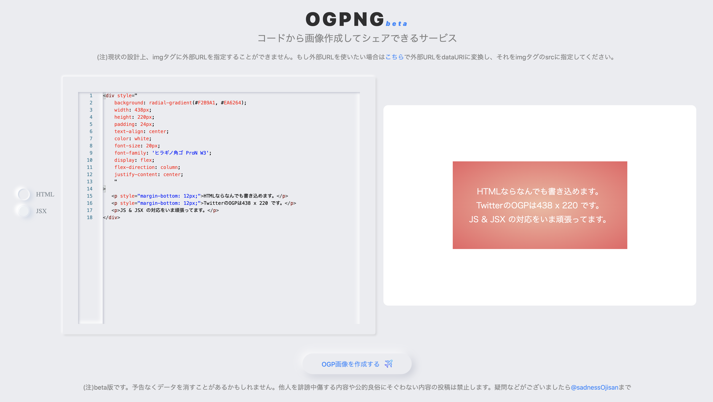

エンジニア向け OGP 画像作成サービスを作りました。
サービスは[これ](https://ogpng.vercel.app/)で、ソースコードは[これ](https://github.com/sadnessOjisan/ogpng)です。



ソースコード(HTML, JSX)から OGP 画像を生成し、それをシェアできるサービスです。
各種ソースコードを HTML に変換、それを DOM 上に埋め込んで展開、 その DOM を画像化して永続化、その永続化パスを OGP 画像として展開という形です。

特徴的なのは OGP の生成は専用 API がないやり方です。
[絶対にお金を払いたくない精神での動的 OGP 生成は辛い](/dynamic-ogp)でいうパターン 1 の場合です。

## 開発の動機

- 普通に自分がほしかった
- ワンチャン一発当てて買収、もしくはこれを作ってる会社に拾われたかった。

## なぜ公開するか

- やる気を失った
- 飽きた

あと、これめちゃくちゃ便利なはずだし、欲しいものだし、マネタイズもできるので誰か引き継いでくれると嬉しいです。
**これから React + Next を始める人にとってもいい教材になりそうだと思ってます。**

## コードの解説

勉強になりそうなところ、詰まりそうなところをピックアップします。
飽きていることもあり手が抜かれてたり汚くなってるところもあります。
**許してください。**

### Editor は react-monaco-editor

ブラウザ上で動く Editor を作る時 monaco editor が便利です。
VSCode のコアになっているエディタです。

```tsx
<MonacoEditor
  language={mode === "HTML" ? "html" : "jsx"}
  // theme="vs"
  value={text}
  options={{ minimap: { enabled: false } }}
  onChange={str => {
    edit(str)
    if (mode === "HTML") {
      setHTML(str)
    } else if (mode === "JSX") {
      try {
        setHTML(convert(str))
      } catch {
        setHTML(str)
      }
    }
  }}
  editorDidMount={() => {
    // @ts-ignore
    window.MonacoEnvironment.getWorkerUrl = (moduleId, label) => {
      if (label === "json") return "/_next/static/json.worker.js"
      if (label === "css") return "/_next/static/css.worker.js"
      if (label === "html") return "/_next/static/html.worker.js"
      if (label === "typescript" || label === "javascript")
        return "/_next/static/ts.worker.js"
      return "/_next/static/editor.worker.js"
    }
  }}
/>
```

#### language

補完やハイライトが聞くようになります。

#### onChange

入力時のハンドリングを行います。
input や textarea のそれと同じです。
中にある `convert` は JSX => HTML のコンパイルです。

#### editorDidMount

mount 時の初期設定です。
monaco は worker を使って補完などを行います。
Editor に対して何言語が描かれるかを教えてあげることでそれに該当する worker を読み込みます。
(LSP が使えるようになるんだと思います(確信はない), TS で monaco 上で補完が効くのは worker が読み込んでる tsserver だった気がする)

ただこの worker はこちらで用意する必要があり、それが次紹介する config です。

ex) /\_next/static/json.worker.js

### MonacoWebpackPlugin

```js
const withCSS = require("@zeit/next-css")
const MonacoWebpackPlugin = require("monaco-editor-webpack-plugin")

module.exports = withCSS({
  webpack: config => {
    config.module.rules.push({
      test: /\.(png|jpg|gif|svg|eot|ttf|woff|woff2)$/,
      use: {
        loader: "url-loader",
        options: {
          limit: 100000,
        },
      },
    })

    config.plugins.push(
      new MonacoWebpackPlugin({
        // Add languages as needed...
        languages: ["javascript", "typescript", "html"],
        filename: "static/[name].worker.js",
      })
    )
    return config
  },
  env: { NEXT_PUBLIC_DEPLOY_ENV: process.env.DEPLOY_ENV },
})
```

#### [MonacoWebpackPlugin](https://github.com/microsoft/monaco-editor-webpack-plugin)

> A plugin to simplify loading the Monaco Editor with webpack.

各種 worker のコードをビルド時に出力してくれます。

### Compile

Monaco に打たれた JSX 文字列(React.Element 文字列)を HTML に変換する処理です。
babel-standalone と `ReactDOMServer.renderToString(el)` を使っています。

詳しくは [ブラウザ上で JSX をコンパイルしてプレビュー環境を作る](https://blog.ojisan.io/jsx-preview) をご覧ください。

### Firebase 周り

storage だけ使っています。

直接ソースコードに APIKEY を埋め込んでいますが、無料プランなので使いすぎる止まります。
ご自身で APIKEY を用意してお試しください。

#### 画像保存

```ts
import Firebase from "../infrastructure/Firebase"
import CLOUD_STORAGE_KEYS from "../constatns/cloudStorageKeys"

export const saveOgp = (imageId: string, image: any): Promise<{ e: any }> => {
  const storage = Firebase.instance.storage
  const storageRef = storage.ref()
  const ogpRef = storageRef.child(`${CLOUD_STORAGE_KEYS.OGP}/${imageId}`)
  return ogpRef
    .put(image)
    .then(snapshot => {
      console.log("snapshot", snapshot)
    })
    .catch(e => {
      console.log("ERROR", e)
      return { e }
    })
}
```

この imageId は適当な変数です。

```ts
export const generateRandomId = () => {
  return Math.random().toString(36).slice(-8)
}
```

といったような関数で生成されています。
画像名の衝突を避けるためのコードです。

#### 画像取得

```ts
export const getOgpUrl = (imageId: string) => {
  const storage = Firebase.instance.storage
  const pathReferenceRef = storage.ref(`${CLOUD_STORAGE_KEYS.OGP}/${imageId}`)
  return pathReferenceRef
    .getDownloadURL()
    .then((url: string) => url)
    .catch(e => console.log("ERROR", e))
}
```

`generateRandomId` で作った ID を指定すると画像を取得できます。
画像 ID は画像保存後にその ID を URL に持って遷移しているため、そこから ID を取り出しこの API を呼び出すと画像 URL を取得できます。

### SSR 時の OGP 展開

NextJS の Dynamic Routing を使って各種詳細ページを作っています。

```tsx
import * as React from "react"
import Head from "next/head"
import Link from "next/link"
import createHostingURL from "../helper/createHostingURL"
import cloudStorageKeys from "../constatns/cloudStorageKeys"
import env from "../helper/env"
import createGcsURL from "../helper/createGcsURL"
import { GetServerSideProps, NextPage } from "next"

export default function Result(props: NextPage & { pid: string }) {
  const [url, setURL] = React.useState("")
  React.useEffect(() => {
    setURL(window.location.href)
  }, [])
  const appEnv = env()
  return (
    <div className="wrapper">
      <Head>
        <title>{"created OGP"}</title>
        <meta
          property="og:image"
          content={`${createGcsURL(appEnv)}/${cloudStorageKeys.OGP}/${
            props.pid
          }`}
        />
        <meta
          property="og:url"
          content={`${createHostingURL(appEnv)}/${props.pid}`}
        />
        <meta property="og:type" content="article" />
        <meta
          property="og:description"
          content={`ogpngは、プログラミングからOGP画像を生成しシェアできるサービスです。`}
        />

        <meta name="twitter:card" content="summary_large_image" />
        <meta
          name="twitter:description"
          content={`ogpngは、プログラミングからOGP画像を生成しシェアできるサービスです。`}
        />
        <meta
          name="twitter:image"
          content={`${createGcsURL(env())}/${cloudStorageKeys.OGP}/${
            props.pid
          }`}
        />
      </Head>
      <h1>生成された画像</h1>
      </img>
      <a href={`https://twitter.com/intent/tweet?text=${url}`}>
        <button>
          OGP画像をシェアする
          </img>
        </button>
      </a>
      <Link href="/">
        <button>←TOPに戻る</button>
      </Link>
    </div>
  )
}

export const getServerSideProps: GetServerSideProps = async context => {
  const { pid } = context.query
  return { props: { pid } }
}
```

#### 記事 ID 取得

```ts
export const getServerSideProps: GetServerSideProps = async context => {
  const { pid } = context.query
  return { props: { pid } }
}
```

### 取得した ID を元に meta タグで OGP 展開

```tsx
<Head>
  <title>{"created OGP"}</title>
  <meta
    property="og:image"
    content={`${createGcsURL(appEnv)}/${cloudStorageKeys.OGP}/${props.pid}`}
  />
  <meta
    property="og:url"
    content={`${createHostingURL(appEnv)}/${props.pid}`}
  />
  <meta property="og:type" content="article" />
  <meta
    property="og:description"
    content={`ogpngは、プログラミングからOGP画像を生成しシェアできるサービスです。`}
  />

  <meta name="twitter:card" content="summary_large_image" />
  <meta
    name="twitter:description"
    content={`ogpngは、プログラミングからOGP画像を生成しシェアできるサービスです。`}
  />
  <meta
    name="twitter:image"
    content={`${createGcsURL(env())}/${cloudStorageKeys.OGP}/${props.pid}`}
  />
</Head>
```

react-helmet を使えば meta タグを書き換えることができます。
事前に記事 ID 名で画像を保存しているので記事 ID さえあれば OGP 画像を取得できます。

## なぜ諦めたのか

実装の過ちにいろいろ気づいたからです。

### JSX のハイライト

```ts
new MonacoWebpackPlugin({
  // Add languages as needed...
  languages: ["javascript", "typescript", "html"],
  filename: "static/[name].worker.js",
})
```

において JSX のサポートを見つけられませんでした。

Issue などを読む限りどうやら monaco-editor をそのまま使う必要があるみたいです。

### スタイリング + ニューモフィズムやりづらい

自業自得なのですがニューモフィズムが辛くなりました。
また monaco にスタイルを当てること自体が難しかったです。
なのにニューモフィズムなんてやろうとしたから辛くなりました。

ニューモフィズムはただ流行っていたし個人アプリを使って練習しようと思って取り入れた感じです。
多分このままやるとしんどくなるのでスタイリング周りを全部消すといいと思います。
styled-jsx を使っているので `<style>`と書いてる箇所を全部消すとスタイルを全部落とせます。

### Canvas 汚染の回避

画像を埋め込みたいニーズをもらったのですが、DOM => canvas 経由で画像化するのでオリジンが違う画像を読み込めない canvas 汚染にはまりました。
これを回避するためには画像をオリジンにおく必要があり、画像アップロード機能が必要です。
とりあえずは暫定対応として base64 に変換する導線を用意はしました。

### ユーザー登録の概念が必要

画像アップロード機能を使うならユーザー登録やログインの概念が必要です。
そしてそのまま firestore なんかも必要になるのではと思っています。

### クライアントサイドでのコンパイルが最適ではない

クライアントサイドでのコンパイルではなく、worker の上でコンパイルしたいです。
出力画像用のコード量が増えると、OGP 画像する際の画面遷移が遅くなりそうです。

## 考えていた勝ち筋(とらぬ狸の皮算用)

万能 Ogp as a Service を目指す。

### ニーズ

#### 記事の OGP は大事

目を引くので欲しいです。実際のところ必須な案件が増えていると思います。
ビジネスサイドでのニーズの高まりも感じています。

#### とはいえ OGP 生成大変

ただ、自由度高く OGP 作るのは難しいです。
node-canvas もありますが canvas 慣れしていない人にとっては難しそうです。

### ソリューション

[vercel/og-image](https://github.com/vercel/og-image) を API 化・エディタ埋め込みできるものを目指します。

#### 自由度の高い画像を生成できるようにする

- HTML + CSS
- JSX
- Vue
- Canvas(node-canvas 含め)
- WebGL(Shader)

とくに node-canvas 以外にもいろんな選択肢で作れるのが欲しいものです。

さらに欲をいうと No Code で作れると嬉しいです。

#### API ベースで画像を作れるようになる

OGP を手軽に作れるようになりたいです。
エンドポイントに文字列を送るだけで画像になるなら嬉しいです。

#### 画像テンプレートを作る

自分の好きな画像と組み合わせたいです。
その画像を複数保存できるようにしておくと良いでしょう。

いわゆる No Code 的なやつですね。

### マネタイズ

運用はタダで動かせるので、ちょっとでも広告費が入れば不労所得になります。
うまい棒くらいは変えると思います。

## 誰か挑戦してみませんか？

Twitter とか Issue で質問を投げてくれると答えられる範囲で答えます。
もし 1 穴当てたらほんの少しのお気持ちで焼肉的なものに連れて行ってくれると嬉しいです。

## 参考資料

- [ogpng(サービス)](https://ogpng.vercel.app/)
- [実装](https://github.com/sadnessOjisan/ogpng)
- [ブラウザ上で JSX をコンパイルしてプレビュー環境を作る](/jsx-preview)
- [絶対にお金を払いたくない精神での動的 OGP 生成は辛い](/dynamic-ogp)
- [vercel/og-image](https://github.com/vercel/og-image)
