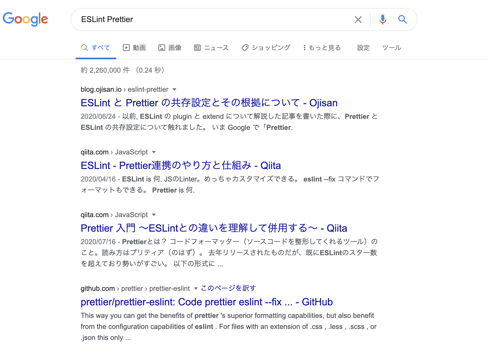
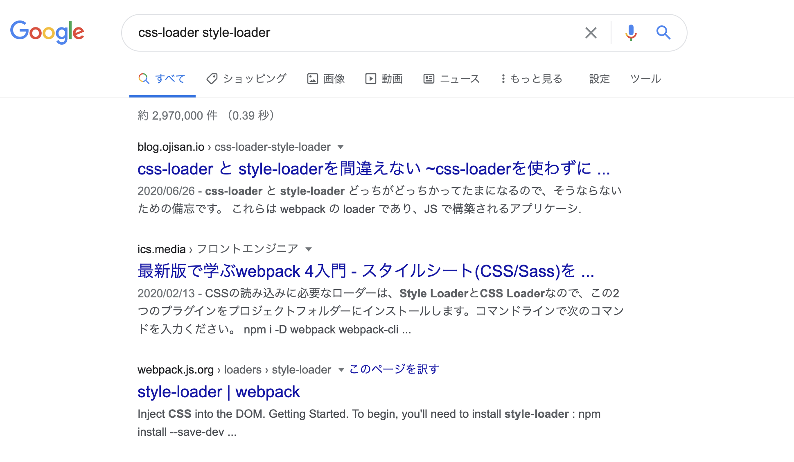

## 何を書いたか

- [Hover 時に他の要素にスタイルを当てたい](https://blog.ojisan.io/hover-next-style)
- [Ajax でコンテンツ取得するとページ内スクロールされなかった話（全面的に俺が悪かった編）](https://blog.ojisan.io/react-next-anchor-link-scroll)
- [ブログの 1 ヶ月を振り返る](https://blog.ojisan.io/blog-one-month)
- [Gatsby 製のブログにタグ機能を追加するための方法を見直してみよう](https://blog.ojisan.io/gatsby-create-tag)
- [ブラウザ上で JSX をコンパイルしてプレビュー環境を作る](https://blog.ojisan.io/jsx-preview)
- [絶対にお金を払いたくない精神での動的 OGP 生成は辛い](https://blog.ojisan.io/dynamic-ogp)
- [Slay the Spire というカジュアルゲームたのしいよ！](https://blog.ojisan.io/slay-the-spire)
- [三項演算子で state を吹っ飛ばした](https://blog.ojisan.io/ternary-operator-bomb)
- [Firebase の存在をフロントエンドから隠蔽するために](https://blog.ojisan.io/fb-nukeru)
- [No-Class CSS フレームワークをいろいろ比較するサイトを作った](https://blog.ojisan.io/no-class-css-fw)
- [ソースコードから OGP を生成しシェアする Ogp as a Service を作った(そして飽きたのでコードを公開する)](https://blog.ojisan.io/share-ogp)

合計 11 つ書いており、3 日に 1 本は書いており頑張ったなという感じです。

## ブログの改善

- 全文検索の追加
- 全文検索の除却

をしており、今現在では機能の変更はありません。

どうして全文検索を導入したか・除却したかについてはいま執筆中です。

## 数字面では？

### UU

- 6 月: 11000
- 7 月: 9358(-1742)

6 月はそれなりにキャッチーな話を書いたこともあり、はてなブックマークからの流入が増え、かなりブログに流入がありました。
一方で 7 月で流入を獲得できた記事は [Firebase の存在をフロントエンドから隠蔽するために](https://blog.ojisan.io/fb-nukeru)だけであり、前月と比較してアクセスを増やすことはできませんでした。

### オーガニック流入

- 6 月: 142
- 7 月: 679(+537)

[ESLint と Prettier の共存設定とその根拠について](https://blog.ojisan.io/eslint-prettier)と[css-loader と style-loader を間違えない ~css-loader を使わずに css を使ってみる~](https://blog.ojisan.io/css-loader-style-loader)からの流入が多くその成果が 7 月に出てきています。
それらは双方とも 「ESLint Prettier」や「css-loader style-loader」といった比較する系のキーワードでトップを取っており、これらの問題に悩んでいる人からの流入を獲得できています。
その上で実際にアクセスされているので著者としては嬉しい限りです。

---

## これから

実際に数字を眺めてみると数字を追いかける楽しさが出てきたので、数字指標を達成する運営も意識していこうと思います。
これまでは [ブログの 1 ヶ月を振り返る](https://blog.ojisan.io/blog-one-month#%E3%83%96%E3%83%AD%E3%82%B0%E3%82%92%E5%A7%8B%E3%82%81%E3%81%9F%E7%90%86%E7%94%B1)にあるように勉強や就活といった目的でやっていたのですが、そこに数字を取るという軸を追加します。

その数字としては **オーガニック流入数** をみようと思います。
これは誰かの問題解決に役立てるブログを運営できているというバロメータになると思っています。
現状のブログのほとんどの流入ははてブ経由だったので、はてブでの見え方を意識したタイトルなどを付けていたのですが、そういうのをやめようと思います。
（本当はセッション時間も見たいのですが、はてブなどでバズると極端に短くなり、そのノイズに引っ張られるのでこれは外します。）

そしてオーガニック流入数を取るために記事の内容も少し変えていきます。
これまではノウハウやまとめといったものを中心に展開していましたが、これからは **単発での問題解決**を扱おうと思います。
いわゆる TIL 的なものです。
ノウハウやまとめ系を書くのはかなり労力使っていたところがあってので、それを少し減らそうという目的もあります。
その結果内容がシンプルになっていくと思うのですが、これまで通り出典やサンプルコードを全部用意した上で投稿するというスタイルは続けていこうと思います。
この作業が自分の実力アップに寄与しているところが大きいからです。
とはいえ、ノウハウやまとめといったものは、これはこれで体系立った情報として有用なので、余裕があったりどうしても書きたい内容があるときはそういった趣旨の記事も書いていこうとは思います。

来月からもよろしくお願いします。
