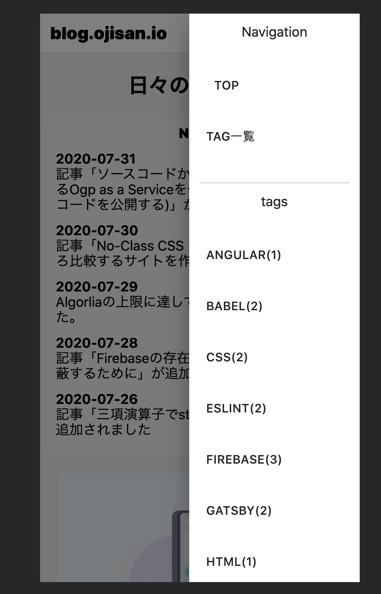

ヘッダーにナビゲーションを付けたくて、SP 対応を考えた結果 Drawer をつけることにしました。
ただアニメーションとか考えるのめんどくさかったのでコンポーネントライブラリを入れることにしました。



## なぜいま material-ui

[material-ui](https://material-ui.com/), この言葉に「えっ、それ採用する？」と思われる方もいると思います。
燃えたくないので material-ui のデメリットについてはここでは言及しませんが、正しく使う限りにおいては自分では何も問題ないと思っています。

採用の決め手はグローバルな CSS を読み込まなくていいので剥がしたい時に剥がせる点です。
正しく import すればバンドルサイズを増やさないのも嬉しい点です。

公式に[Minimizing Bundle Size](https://material-ui.com/guides/minimizing-bundle-size/)というページがあるのですが、

- path imports すること
- 2 階層目までの import にすること(2 階層目までで済むように export してくれている(はず))

に注意すれば開発モード時のビルド時間も気にしなくていいと思っています。
(prduction build しないと treeshaking されないことへの回避)

パフォーマンスの劣化は気にしていたポイントですが、実際には劣化が起きていなさそうなので採用しました。

FYI: [計測したときの PR](https://github.com/sadnessOjisan/blog.ojisan.io/pull/50)

もしパフォーマンスが悪くなったりした時は部分的にそのコンポーネントを剥がすといった対処をしていこうと思います。
全て material-ui に乗らなくても採用できるのは、material-ui の良いところですね。

## Drawer を使う

ヘッダーからサイドバーを出す UI は、Drawer というコンポーネントで対応できます。

```sh
$ yarn add yarn add @material-ui/core
```

これで、

```tsx
import * as React from "react"
import { useStaticQuery, graphql } from "gatsby"
import Drawer from "@material-ui/core/Drawer"
import styles from "./layout.module.css"
import DrawerContents from "./drawer-contents"
e: () => {},
})

const Layout: React.FC = ({ children }) => {
  const [isOpenDrawer, setDrawerState] = React.useState(false)

  return (
    <Drawer
      anchor="right"
      open={isOpenDrawer}
      onClose={() => {
        setDrawerState(false)
      }}
    >
      <DrawerContents></DrawerContents>
    </Drawer>
  )
}

export default Layout
```

として呼び出せます。

どのページからも呼び出せるように共通レイアウトファイルに記述しました。
`anchor` で出す方向、`open`で開閉、`onClose`で close 呼び出しの処理を書きます。
この onClose は背景クリックでも消せるものです。

開閉のフラグ切り替えはヘッダーなどの他の場所からも呼び出したいので、そのハンドラは Context で配信します。

それを全てやったコードがこちらです。

```tsx:title=components/layout.tsx
import * as React from "react"
import { useStaticQuery, graphql } from "gatsby"
import Drawer from "@material-ui/core/Drawer"
import Header from "./header"
import Footer from "./footer"
import styles from "./layout.module.css"
import DrawerContents from "./drawer-contents"

export const DrawerContext = React.createContext<{
  setDrawerState: React.Dispatch<React.SetStateAction<boolean>>
}>({
  setDrawerState: () => {},
})

const Layout: React.FC = ({ children }) => {
  const [isOpenDrawer, setDrawerState] = React.useState(false)
  const data = useStaticQuery(graphql`
    query SiteTitle {
      site {
        siteMetadata {
          title
        }
      }
    }
  `)

  return (
    <DrawerContext.Provider value={{ setDrawerState }}>
      <Header siteTitle={data.site.siteMetadata.title} />
      <div>
        <main className={styles.body}>{children}</main>
        <Footer></Footer>
        <Drawer
          anchor="right"
          open={isOpenDrawer}
          onClose={() => {
            setDrawerState(false)
          }}
        >
          <DrawerContents></DrawerContents>
        </Drawer>
      </div>
    </DrawerContext.Provider>
  )
}

export default Layout
```

```tsx:title=components/header.tsx
import * as React from "react"
import { Link } from "gatsby"
import styles from "./header.module.css"
import { DrawerContext } from "./layout"
import { IconButton } from "@material-ui/core"
import MenuIcon from "@material-ui/icons/Menu"
import GitHubIcon from "@material-ui/icons/GitHub"
import RssFeedIcon from "@material-ui/icons/RssFeed"

interface IProps {
  siteTitle: string
}

const Header: React.FC<IProps> = ({ siteTitle }) => {
  const drawerContext = React.useContext(DrawerContext)
  return (
    <header className={styles.header}>
      <h1 className={styles.title}>
        <Link to="/">blog.ojisan.io</Link>
      </h1>
      <div>
        <a href="/rss.xml" aria-label="rssへのリンク">
          <IconButton aria-label="rssアイコン" color="default">
            <RssFeedIcon />
          </IconButton>
        </a>
        <a
          href="https://github.com/sadnessOjisan/blog.ojisan.io"
          aria-label="githubへのリンク"
        >
          <IconButton aria-label="githubアイコン" color="default">
            <GitHubIcon />
          </IconButton>
        </a>
        <IconButton
          aria-label="delete"
          color="default"
          onClick={() => {
            drawerContext.setDrawerState(true)
          }}
        >
          <MenuIcon />
        </IconButton>
      </div>
    </header>
  )
}

export default Header
```

このヘッダで使うアイコンは material-icons を使っています。

```sh
$ yarn add yarn add @material-ui/icons
```
