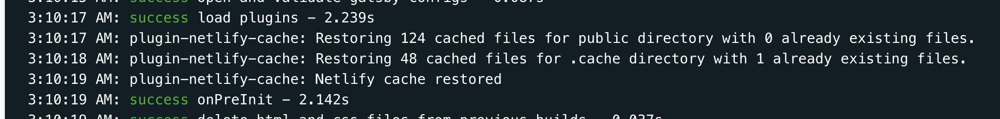

今朝更新した [Gatsby 製サイトを Netlify にデプロイする前に見ておきたい設定 2 つ（ビルドと表示）](/gatsby-meet-netlify)の[ボツ原稿](https://github.com/sadnessOjisan/blog.ojisan.io/pull/61/commits/3a621e73f835bc10be92a13f4f24d70791d4dda5)です。
この記事では Netlify でのビルドキャッシュを使う方法を紹介しました。
そこでは [netlify-plugin-gatsby-cache](https://github.com/jlengstorf/netlify-plugin-gatsby-cache) という Netlify のプラグインを紹介してビルド時間が 10 分 => 1 分 になったことを紹介しましたが、実はこの原稿を書いている時は [gatsby-plugin-netlify-cache](https://www.gatsbyjs.org/packages/gatsby-plugin-netlify-cache/)を使って 10 分 => 9 分 にしか減らなくて「記事書けないどうしよう」となっていました。

ややこしいですが、[netlify-plugin-gatsby-cache](https://github.com/jlengstorf/netlify-plugin-gatsby-cache) と [gatsby-plugin-netlify-cache](https://www.gatsbyjs.org/packages/gatsby-plugin-netlify-cache/)は別物で、[netlify-plugin-gatsby-cache](https://github.com/jlengstorf/netlify-plugin-gatsby-cache)は netlify plugin, [gatsby-plugin-netlify-cache](https://www.gatsbyjs.org/packages/gatsby-plugin-netlify-cache/)は gatsby plugin です。

## gatsby-plugin-netlify-cache とは

[gatsby-plugin-netlify-cache](https://www.gatsbyjs.org/packages/gatsby-plugin-netlify-cache/) は Gatsby 公式の plugin です。

> This plugin caches your build files locally or in the Netlify cache directory. It will massively speed up subsequent builds.

とあり、Netlify 側でキャッシュできるようにしてくれるものです。

Netlify では `/opt/build/cache/` に置かれたファイルはビルドを跨いで使い回すことができるらしく、そこにキャッシュしたいファイルを置くのがこのプラグインです。
このプラグインはデフォルトで `.cache` と `public` を置いてくれます。

しかし説明には

> It automatically restores your cache and caches new files within the Netlify cache folder. This folder is undocumented but works fine. To reset the cache, hit the Clear build cache checkbox in the Netlify app.

とあり、undocumented な機能を使おうとしていて危険な香りはします。

## gatsby-plugin-netlify-cache でキャッシュできない？

とりあえず使ってみましょう。

### plugin を使ってみる

入れて設定ファイルを書くだけでキャッシュされるようになります。

```sh
$ yarn add -D gatsby-plugin-netlify-cache
```

```js:title=gatsby-config.js
plugins: [
  {
    resolve: "gatsby-plugin-netlify-cache",
    options: {
      cachePublic: true,
    },
  },
]
```

### 計測してみよう

この Plugin を入れた次のビルドがこのビルドです。

FYI: https://app.netlify.com/sites/amazing-goodall-59e3b0/deploys/5f2700f1852d670008cdf92b

ビルドに 9 分ほどかかっており、全然時間を節約できていません。



このログの写真にあるように、

```sh
3:10:17 AM: plugin-netlify-cache: Restoring 124 cached files for public directory with 0 already existing files.
3:10:18 AM: plugin-netlify-cache: Restoring 48 cached files for .cache directory with 1 already existing files.
```

といった感じで、全然キャッシュにヒットしていません。
ただキャッシュ自体はできています。

## Issue をみてみる

さすがに Issue になってるでしょと思って調べてみたら案の定ありました。

FYI: https://github.com/axe312ger/gatsby-plugin-netlify-cache/issues/25#issuecomment-623491562

cache の永続化ができないとのことですが、どうやら Gatsby 側の変更が原因のようです。

FYI: [Jobs API v2 breaks caching plugins](https://github.com/gatsbyjs/gatsby/issues/23365)

詳しい原因はわからないものの、

> For what it's worth, Netlify just published a gatsby cache plugin. It does nothing else than persist/restore .cache and /public so it's not really doing much that this plugin.

とあるとおり Netlify がプラグインを出したからそちらを使いなよとのことでそちらを使うことで解消しました。

Gatsby 側に立ってる Issue はまだ解消されていないようかつ、同じバグ報告が複数上がっているので、しばらく Netlify プラグインを使うようにしました。

## まとめ

[gatsby-plugin-netlify-cache](https://www.gatsbyjs.org/packages/gatsby-plugin-netlify-cache/)はいま動かないので[netlify-plugin-gatsby-cache](https://github.com/jlengstorf/netlify-plugin-gatsby-cache)を使いましょう。(もし動かせる方法があるなら DM か Issues などで教えていただけると幸いです。)
