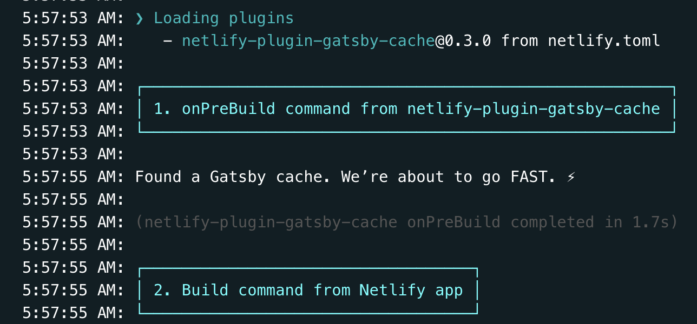
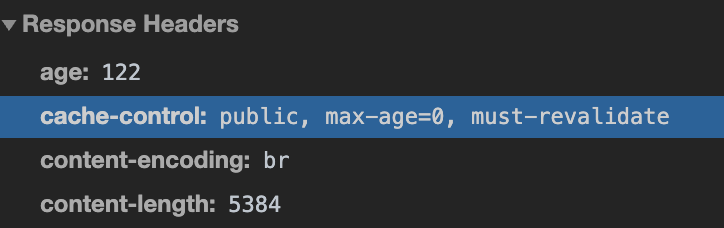

[Netlify](https://www.netlify.com/) にはビルド時のキャッシュと HTTP のキャッシュをユーザー側で設定できる口があります。
このキャッシュの設定をすることで、ビルドや表示が早くなり良いこと尽くしなのでこれを気に見ていきましょう。

## ビルド高速化

Netlify ではビルドを回すとソースコードを見て 0 からビルドします。
そのためキャッシュが使える手元でのビルドに比べて時間がかかります。
特に [gatsby-image](https://www.gatsbyjs.org/packages/gatsby-image/) は致命的で、画像から圧縮・Traced SVG の作成・サムネイル化・各種デバイス向けの最適な画像出力を行うため、画像が絡むサイトのビルド時間はとても長くなります。
このブログもそういった画像をつかったブログですが、現在 20 記事あるサイトでのビルドで約 10 分かかっています。

で、さすがに辛くなってきたので Gatsby の卒業 or Netlify の卒業を考えていました。
Gatsby 自体に [incremental build](https://www.gatsbyjs.org/blog/2020-04-22-announcing-incremental-builds/) があること、そしてそれが[Gatsby Cloud](https://www.gatsbyjs.com/)で使えることは知っていました。
かといって GatsbyCloud はお金がかかると思い込んでいてやる気は起きませんでした。

とまあ途方に暮れていたら、[@nabettu](https://twitter.com/nabettu)さんと[@L_e_k_o](https://twitter.com/L_e_k_o)さんから Netlify でもキャッシュを持ち回れる方法を教えてもらい、やってみることにしました。

(※ 今、[Pricing](https://www.gatsbyjs.com/pricing)見たら無料で使えそうでした。最初からこれ使えばこの記事書かなくてよかったみたいです。けどこの思い出があったから記事を書けるんだとおもうことにして書き進めていきます。)

### キャッシュを使ってビルド高速化

ローカルでビルドされた方はご存知かと思いますが、gatsby ではビルドしたらキャッシュファイルが作成されます。
これを次のビルドで変更されていないところはそのキャッシュを使わないようにすることで、ビルド時間の節約ができます。
Netlify では GitHub での PR に応じて自動でビルド環境が作られるので、これらのキャッシュは使われなかったのですが、それを使ってビルドできるプラグインがあるのでそれを使います。

[netlify-plugin-gatsby-cache](https://github.com/jlengstorf/netlify-plugin-gatsby-cache)がまさしくその Plugin です。
Gatsby の plugin ではなく Netlify の plugin なので注意しましょう。
README.md にあるリンクから Netlify に飛んで有効化、もしくはこの.toml を書くだけで設定が完了します。

```toml:title=netlify.toml
[build]
  publish = "public"

[[plugins]]
  package = "netlify-plugin-gatsby-cache"
```

これを入れてビルドを回してビルドログを見てみると、



という風にキャッシュを使ってビルドをしていることが分かります。

この結果ビルド時間が 10 分から 1 分に短縮されました。
表彰ものですね 😇😇😇

ビルドログはここから見れるはずです。
（当ブログは public プロジェクトです）

FYI: https://app.netlify.com/sites/amazing-goodall-59e3b0/deploys/5f2728a4ff928d7c0bcb9136

## 表示高速化

次に表示に使うキャッシュの設定をします。
ビルドの設定と全く関係がない HTTP キャッシュの話なので頭を切り替えましょう。(最後にビルド時のキャッシュの話も少しだけ関係しますが原理的には全く別のものです。)

### ブラウザの標準機能としてのキャッシュ

ブラウザは標準で HTTP キャッシュ機能を持っており、さまざまなリソースを保存することができます。
しかしなんでもかんでもキャッシュされるとコンテンツの更新に気づかなかったりとかもあるので、サーバー側から「これキャッシュして良いよ」「これキャッシュしないでね」といったことを伝えることができます。
それが[Cache-Control ヘッダー](https://developer.mozilla.org/ja/docs/Web/HTTP/Caching)です。

これは

```sh
cache-control: public, max-age=0, s-maxage=300
```

などの情報をレスポンスヘッダに埋め込んでおくことで実現できます。
キャッシュはキーが URL, 値が設定になっており、どの URL でどういうキャッシュをするかという風に管理されています。
このキーが URL というのが大事になってくるので覚えといてください。

### Netlify でキャッシュを設定する

Netlify ではこのキャッシュヘッダなどをユーザーが自由に設定できる [Custom Header](https://docs.netlify.com/routing/headers/#syntax-for-the-headers-file)という仕組みを持っています。
(※: 「などを」とボカしたのは設定ファイルの種類によってはリダイレクトルールなども設定できるからです。)
\_headers というファイルにそれを書いていきます。

```sh
/*.html
  Cache-Control: public, max-age=0, must-revalidate
```

このようにどういった対象にどういう Cache-Control をするかという設定を書いていきます。
そのように設定したリソースはそのキャッシュが帰ってくるようになります。



### \_headers ファイルを作る

しかしそのビルド対象にコツコツとキャッシュ設定を書いていくことは骨が折れるので、それをビルド時に生成する Gatsby プラグインを利用します。
それが [gatsby-plugin-netlify](https://www.gatsbyjs.org/packages/gatsby-plugin-netlify/)です。

```js:title=gatsby-config.js
plugins: [`gatsby-plugin-netlify`]
```

と書くだけで

> the plugin will add some basic security headers.

とあるとおり基本的なセキュリティに関するものは設定してくれるようですが、Gatsby の推奨ヘッダーではないので書き換えます。

公式に、

```js:title=gatsby-config.js
plugins: [
  {
    resolve: `gatsby-plugin-netlify`,
    options: {
      headers: {},
      allPageHeaders: [],
      mergeSecurityHeaders: true,
      mergeLinkHeaders: true,
      mergeCachingHeaders: true,
      transformHeaders: (headers, path) => headers,
      generateMatchPathRewrites: true,
    },
  },
]
```

といった例があるようにオプションで様々な設定を足せます。
今回はこの header というところに設定を足していきます。

### Gatsby 公式推奨のキャッシュヘッダ設定

Gatsby 公式にある[Caching Static Sites](https://www.gatsbyjs.org/docs/caching/)で推奨設定が書かれています。

それらをざっとまとめると、

- HTML
  - cache-control: public, max-age=0, must-revalidate
- Page data
  - cache-control: public, max-age=0, must-revalidate
- Static files
  - cache-control: public, max-age=31536000, immutable
- JavaScript and CSS
  - cache-control: public, max-age=31536000, immutable
- sw.js
  - cache-control: public, max-age=0, must-revalidate

となります。

で、このうち大きく分けて cache-control: public, max-age=0, must-revalidate か cache-control: public, max-age=31536000, immutable と設定します。

#### cache-control: public, max-age=0, must-revalidate

これは 常に新鮮なものを使えという意味です。
HTML, Page data, sw.js もエントリポイントなので、ここが古い(キャッシュ)だと、新しいデータを取って来れなくなるからです。

#### cache-control: public, max-age=31536000, immutable

これは 1 年間キャッシュしても良いよという意味です。
でもそう考えると「一回読み込んだら一年間更新されないの怖すぎでは」となるかもしれませんが、それは大丈夫です。
Gatsby はビルド時にビルドした時間を含むファイル名を生成します。
そのファイル名でキャッシュされるため次にビルドした時はファイル名が変わるので正しく読み込まれます(キャッシュが使われない。）
ただビルドファイルをキャッシュから読み込むとファイル名は変わっていないので、それはブラウザ側でキャッシュがヒットしやすくなります。
ビルド時のキャッシュも実は表示の高速化に効いてきたりもします。
先ほど述べたキャッシュはファイル名がキーになっているのが大事というのはそういうことです。

**Gatsby では JS(service worker 以外)と静的ファイルは、変更されない限りキャッシュしてもいい** と覚えておきましょう。
なので、そのキャッシュ設定がされるように Netlify に向けて \_header に書いていきます。

### plugin の header 設定に書くべきもの

```js:title=gatsby-config.js
plugins: [
  {
    resolve: `gatsby-plugin-netlify`,
    options: {
      headers: {
        "/*.html": ["Cache-Control: public, max-age=0, must-revalidate"],
        "/page-data/*": ["Cache-Control: public, max-age=0, must-revalidate"],
        "/page-data/app-data.json": [
          "Cache-Control: public, max-age=0, must-revalidate",
        ],
        "/static/*": ["Cache-Control: public, max-age=31536000, immutable"],
        "/sw.js": ["Cache-Control: no-cache"],
        "/**/*.js": ["Cache-Control: public, max-age=31536000, immutable"],
        "/**/*.css": ["Cache-Control: public, max-age=31536000, immutable"],
      },
    },
  },
]
```

### キャッシュがあれば早くなったか？

同一条件での計測が難しかったのでやっていません。（環境 2 つ作るのもめんどくさかった）
あと、正直なところ **元から早い** ので導入してみてからあまり速度向上は感じませんでした。
ただキャッシュが設定されているのはきちんと確認できました。

### これは設定すべき？

正直なところ Gatsby 製のサイトで遅くなることはあまりないはず(遅くなるってことはもはや静的サイトでやる要件じゃないのでは？みたいなのがある)なので、旨味はそこまでないのではと思っています。
むしろキャッシュにまつわる事故はたくさんあるので、それを考えて余程 HTTP キャッシュに自信がない限りは設定しない方が良いのではと思っていたりもします。
プロダクト開発中(まだリリースしていない), キャッシュの扱い完全に理解している 人以外は触らない方が良さそうというのが自分の所感です。
（これは賛否両論あるとおもうので周りの偉い大人の人に聞いてみてください。）

ぶっちゃけ個人ブログは失敗し放題なのでキャッシュの設定をガンガン入れています。
個人ブログはいいぞ 💪💪💪

## まとめ

- Netlify ではビルドのキャッシュを持ち回れてビルド速度をあげれる
- Netlify では Response Header を触れて Gatsby 特化の Cache-Control ヘッダを用意することで表示速度をあげれる
- HTTP の Cache 設定は危険なので自信がないなら触れない方が良いかも
