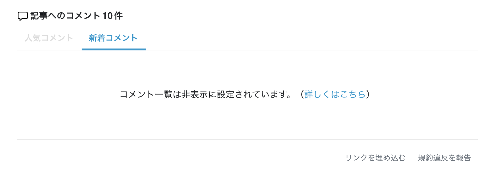
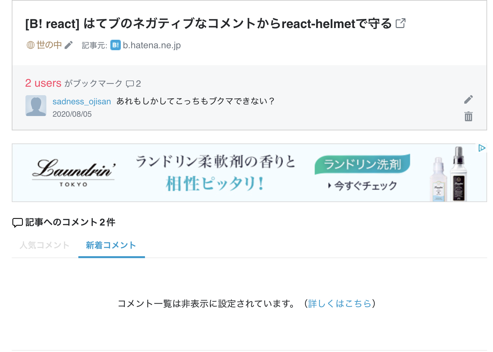

はてブにおけるネガティブなコメントやそれが引き起こす炎上から自分を守るための、そのプロテクト機能をこのブログに実装した話です。

## 燃えたくないけど読まれたい

私はこのブログを運用する上で 「燃えたくないけど読まれたい」という気持ちを持っています。
ブログを書くからにはやっぱり反応は欲しいし、たくさんの人に見られたいというのが率直な感想です。
そのため、燃えるのを防ぐためにも誰かを煽ったり傷つけたりせずに、健全に運営して行こうというのを意識して運営しており、特にその投稿が誰かを傷つけないか・誤った情報を断定的に発信していないかといった自浄的なチェックをしています。
ただ、どうしても燃えやすい話題もあったり、意図せずに燃えるパターンも見たりはしているので、それについてどう言及して行こうかと言うのを悩んでいました。

そこで炎上プロテクト機能をブログに組み込んでみることにしました。

## はてブのコメント欄は非表示にできる

はてブ歴が長い人はご存知だと思いますが、はてブのコメント欄は非表示にできます。



これはページの metatag に

```html
<meta name="Hatena::Bookmark" content="nocomment" />
```

とすることで実現できます。
詳しくは[公式のヘルプ](https://b.hatena.ne.jp/help/entry/nocomment)をご参照ください。

ただメタタグに書くので SPA などの構成だとアプリケーションの全体にその設定が波及してしまいます。
**燃えたくないけど読まれたい**といった考えを持つ私にとっては全部をオフにしたくはないです。
そこで部分的にメタタグを書き換えれる react-helmet を使います。

## 燃えそうな記事だけコメントを非表示にする

### react-helmet とは

> This reusable React component will manage all of your changes to the document head.

FYI: https://github.com/nfl/react-helmet

React アプリケーションで `<head>`タグを書き換えることができるものです。
JSX の中に書くので JS の変数を展開できます。

使い方はシンプルで

```jsx
import React from "react"
import { Helmet } from "react-helmet"

class Application extends React.Component {
  render() {
    return (
      <div className="application">
        <Helmet>
          <meta charSet="utf-8" />
          <title>My Title</title>
          <link rel="canonical" href="http://mysite.com/example" />
        </Helmet>
        ...
      </div>
    )
  }
}
```

のように使います。（公式例）

### 実装例

ではこのブログにも react-helmet を適用していきましょう。

このブログは Gatsby で作られているので SPA ではないのですが、メタタグの埋め込みは react-helmet で行っており、公式の標準構成です。
OGP 画像がセットされているのもこの react-helmet の恩恵であり、すでに利用しているものです。

部分的に helmet を適用させたいので、適用したい記事の frontmatter に

```yml
---
path: /hatebu-helmet
created: "2020-08-05 18:00"
title: はてブの炎上をreact-helmetで守る
visual: "./visual.png"
tags: [React]
userId: sadnessOjisan
isProtect: true
---

```

という風に isProtect というフラグを渡しておき、

記事取得のクエリで

```js
export const pageQuery = graphql`
  query BlogTemplate($path: String!) {
    post: markdownRemark(frontmatter: { path: { eq: $path } }) {
      // 省略
      frontmatter {
        isProtect
      }
    }
  }
`
```

として isProtect のフラグを取得し、記事コンポーネントで

```tsx
post.frontmatter.isProtect && (
  <Helmet
    meta={[
      {
        name: "Hatena::Bookmark",
        content: "nocomment",
      },
    ]}
  />
)
```

としてフラグが true のものだけ Helmet を被せると完了です。

実装としては、

- https://github.com/sadnessOjisan/blog.ojisan.io/blob/master/src/templates/blogTemplate.tsx
- https://raw.githubusercontent.com/sadnessOjisan/blog.ojisan.io/master/src/contents/20200805-hatebu-helmet/index.md

を参照するとイメージがつきやすいかと思います。

## これで燃えないから好き放題言ってオーケー？

とこれで炎上対策できたので、安全圏から好き放題言えそうなのですが、そうではありません。
記事本体は大丈夫だけど、代わりにそのブックマークページや魚拓が炎上しているといったものも見たことがあるので、そもそもその投稿が誰かを傷つけないか・誤った情報を断定的に発信していないかといった自浄的なチェックはどちらにせよ必要です。

更新）ブックマークページへのブックマークも非表示になります。



## あとがき

8/5 から[プロメア](https://www.amazon.co.jp/gp/video/detail/B088TWX2QS/ref=atv_dp_share_cu_r)が Amazon Prime で配信されました。
面白い映画です 🔥🔥🔥
