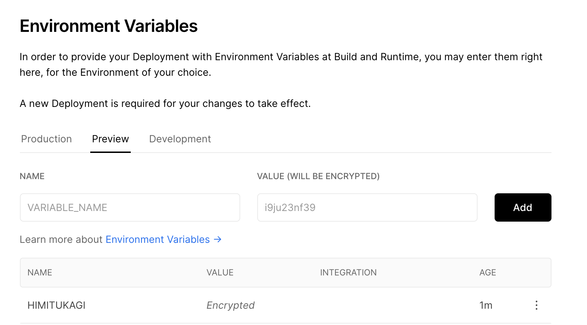

Vercel での環境変数周りでのあれこれ、ずっと苦しみ続けていたので自分なりのプラクティスをメモします。
辛さの原因は Vercel のアップデートのスピードが早く正しい情報にアクセスし辛いことが一因としてあるので、それをなくせたら良いなと思っています。
もしこのドキュメントが古くなっていたら [Issues](https://github.com/sadnessOjisan/blog.ojisan.io/issues) などからお知らせていただけると幸いです。

NextJS を前提とした解説になりますが、 NextJS の環境変数周りについては解説を省きます。
Vercel での環境変数周りがややこしいのは NextJS に起因しているものもあるとは思うのですが、話が長くなるので別の記事にて補足したいと思います。
(ビルド時・サーバー・クライアントで見える・渡せる環境変数や方法が変わる話)

## やりたいこと: フロント側から環境変数別にエンドポイントを切り替える

Vercel は プレビュー環境と本番環境が存在しています。
そしておそらく開発するときのローカル環境もあるでしょう。
このときローカル環境は開発環境 or ローカル環境の API を、プレビュー環境は開発環境の API を本番環境は本番環境の API を呼びたいはずです。
(API と書いていますが、外部環境のことをまとめてそう読んでいます。Firebase のような SDK も含みます。)

例としていま、dev 環境なら `dev.ojisan`, prd 環境なら `prd.ojisan` にアクセスするようにしたいとして、その叩き分けをどう Vercel 環境で実現するかを考えてみましょう。

## 楽に NODE_ENV で識別したいが・・・

一つの案として、NODE_ENV に development か production を渡して、アプリ内で

```ts
export const getEndpoint = () => {
  if (process.env.NODE_ENV === "development") {
    return "https://dev.ojisan.com"
  } else if (process.env.NODE_ENV === "production") {
    return "https://ojisan.com"
  } else {
    throw new Error("unexpected env")
  }
}
```

として叩き分けることを考えましょう。
このやり方は批判的な意見もあるかとは思いますが、開発現場で見ることがたびたびありポピュラーなやり方だと思っているので例としてあげます。

ここで プレビュー環境では dev 向けのエンドポイントを手に入れたいです。
しかしこれは Vercel の上では(一手間加えない限り)できません。

## NODE_ENV で識別することの落とし穴

Vercel と NextJS においては NODE_ENV を扱うことには落とし穴があります。

### Vercel の preview 環境からは production の API に繋がる

**preview ビルドしたときにアプリ側で使う NODE_ENV は"production"です！！！！**
そのため上の例だと preview でビルドされるコードは本番環境を叩いてしまいます。
もし本番側の API がなんらかの IP 制限や CORS をサボっていたらそのまま通信が届いてしまって大変です。 😭😭😭
気をつけましょう。

### NODE_ENV はユーザー側から触れない(ブランチ連携の自動ビルド機能を使っている場合)

では起動時の環境変数に`NODE_ENV=development`を渡せば良いだけだよねとなります。
しかし こちらでデプロイ時に実行するコマンドの指定はできないので、環境変数のハンドリングはできません。
どのブランチでのビルドがどのコマンドを実行するかという制御権があれば、package.json に `start:dev` のようなコマンドを作って環境変数をそれ用にしたものを渡せば良いのですが、それはできません。

### ユーザーから Dev 環境が見える(かもしれない)

イマドキの bundler は production ビルドで [terser](https://github.com/terser/terser) のような mangler/compressor が走るので、入らないことがわかっている条件節のコードを消せ、本番環境のビルドから Dev 環境のエンドポイントが見えることはないです。
そして NextJS は 内部で webpack が使われその内部では terser が実行される([v4.26.0 から terser が使われる](https://github.com/webpack/webpack/releases/tag/v4.26.0))ため大丈夫ですが、仮に NextJS を抜けるときに参照されないコードを消してくれる仕組みが入る保証はないので少し注意しておきましょう。

## 4 月に追加された Environment Variables の UI を使う

と行った風に NODE_ENV で識別してコードを切り替える方式はいくつか落とし穴あるので控えた方が良いと思っています。
そこで最近追加された Environment Variables UI を使い倒すことで解消してみましょう。

### Environment Variables UI

Vercel の Settings には Environment Variables という項目があり、UI 上で環境変数を設定できます。
さらに暗号化もされるので credential 情報を含めることもできます。



ここで登録した環境変数はアプリ側の process.env.HOGE として読むことができます。

### NODE_ENV の上書きをすれば解決では？

Preview 環境の `NODE_ENV` が production になる問題は、この Preview UI で `NODE_ENV` を development にすれば良いと考えるかもしれませんが、それはできません。
ここで渡される環境変数はビルド時の環境変数であり、クライアントで実行されるコードに含まれる変数ではないからです。
つまり next.config.js の中では development ですが、ブラウザで出力したときはこの変数は production になっています。

## preview 用に分岐させる物自体を環境変数にセットしよう

というわけで **NODE_ENV で出し分けるのではなく環境変数自体に分岐対象をセットしましょう**
つまり、`API_ENDPOINT: dev.ojisan` といった環境変数を読み込み、それを `const endpoint = process.env.API_ENDPOINT` などとして読み込みましょう。
preview 用の口に `API_ENDPOINT: dev.ojisan` をセットし、これをクライアント側から読めば解決です。
**ただ NextJS はそのまま process.env から環境変数を読めないので、next.config.js から export しておく必要はあります。**
(もしくは `NEXT_PUBLIC` から始まる環境変数はクライアントサイドのバンドルに含まれることを利用して、`NEXT_PUBLIC` から始まる環境変数を用意しましょう)

```js:title=next.config.js
module.exports = {
  env: {
    // 渡された環境変数かClientで使える環境変数かを識別しやすくするために_FOR_CLIENTをつけています。
    API_ENDPOINT_FOR_CLIENT: process.env.API_ENDPOINT,
  },
}
```

```ts
export const getEndpoint = () => {
  const url = process.env.API_ENDPOINT_FOR_CLIENT
  if (!url) {
    throw new Error("URLが環境変数からセットされていません")
  }
  return url
}
```

## 数が多い時どうするか

Q: Firebase などたくさんの環境変数が必要なものはどうしたらいいでしょうか。まさか手で全部設定しろと？

A: 手で全部やりましょう。8\*3 環境分全部 24 個。ファイト！

こういうときに NODE_ENV で識別できたらコピペして簡単にセットできるので楽なんですよね。

```ts
export const genFirebaseConfig = (env: EnvType): FirebaseConfigType => {
  switch (env) {
    case "development":
      return {
        apiKey: "XXXXXXXXXX",
        authDomain: "XXXXXXXXXX",
        databaseURL: "XXXXXXXXXX",
        projectId: "XXXXXXXXXX",
        storageBucket: "XXXXXXXXXX",
        messagingSenderId: "XXXXXXXXXX",
        appId: "XXXXXXXXXX",
        measurementId: "XXXXXXXXXX",
      }
    case "production":
      return {
        apiKey: "YYYYYYYYY",
        authDomain: "YYYYYYYYY",
        databaseURL: "YYYYYYYYY",
        projectId: "YYYYYYYYY",
        storageBucket: "YYYYYYYYY",
        messagingSenderId: "YYYYYYYYY",
        appId: "YYYYYYYYY",
        measurementId: "YYYYYYYYY",
      }
    default:
      throw new Error("unexpected env")
  }
}
```

とまあセットするのが大変という問題もあるのであらかじめ埋め込んでおいた設定を環境変数で切り替える方法も紹介します。

先ほど、

> Preview 環境の NODE_ENV が production になる問題は、この Preview UI で NODE_ENV を development にすれば良いと考えるかもしれませんが、それはできません。

と書きましたが、個人的にはあまりオススメはしないものの一応やる方法はあります。
自分も個人開発してるときはそのやり方を使っていたり実用性はあるはずです。

（※ Firebase に限っては Admin 以外の情報はクライアントに見えても良いので、あらかじめコードに全ての設定を埋め込んでおき、後述する preview の変数かどうかを無理やり判定する方法を使って識別しても良いです。）

## Vercel で preview を識別して無理やりやる方法

### 案 1: Vercel に DEPLOY_ENV という環境変数を渡す

`DEPLOY_ENV` じゃなくても名前は何でも良いのですが、とりあえずなんらかの preview 用の環境変数を渡します。
その上で next.config.js でそれをクライアント用のなんらかの環境変数に渡します。
ここでは DEPLOY_ENV に 'development' と渡していることにします。

```js:title=next.config.js
module.exports = {
  env: {
    DEPLOY_ENV_FOR_CLIENT: process.env.DEPLOY_ENV,
  },
}
```

そうすればクライアント側で DEPLOY_ENV_FOR_CLIENT という環境変数を読めるようになるので、

```ts
export const getEndpoint = () => {
  if (process.env.DEPLOY_ENV_FOR_CLIENT === "development") {
    return "https://dev.ojisan.com"
  } else if (process.env.DEPLOY_ENV_FOR_CLIENT === "production") {
    return "https://ojisan.com"
  } else {
    throw new Error("unexpected env")
  }
}
```

として出しわけられます。

### 案 2: ブランチで master かどうかを識別する(多分今はできない)

これは今は多分できないのですが、これができなくなったという記述を見つけられないので（誰も言及してなさそうなので）一応紹介だけしておきます。

ビルド時の process.env に どのブランチからビルドされたかということを知ることができます。
ビルド時の環境変数に `NOW_GITHUB_COMMIT_REF` というのがあったのでこれが master かどうかで識別することができました。
しかし `NOW` とある通り Vercel になってからはこの環境変数はなくなったようです。
なくなったことに対する言及は見つけられなかったのですが、このコードに頼っていて動かなくなったコードをどう移行したら良いかみたいな Issue は立っていたので、今はもう使えなくなったやり方みたいです。

このように Vercel の仕組みをハックした出しわけすると Vercel 側のアップデートで動かなくなるのでやめておいた方が良いです。
なのでそういった点ではこれらの preview 用の環境変数を渡す仕組みに頼るのは、長期に運用する可能性のあるコードで使うのは危険だと思っています。

一方で環境変数という仕組みは、概念としては Vercel の仕組みに比べると根本的なものだと思うので、こちらで対応するのが良いと思います。
つまりめんどくさいのですが、**外部環境を指定するものは全て環境変数化しておき、それをコードから読み込んだ方が良い**というのが持論です。

## まとめ

- Vercel は UI から環境変数をセットできるようになったし暗号化もしてくれるので、環境変数の扱いがとても楽になりました。
- NODE_ENV で出し分けるよりも直接環境変数を読み込んだ I/F 設計にしておいた方が良いと思います。

## おまけ話

ワシが若い頃はなぁ Vercel は now っていう名前のサービスで 環境変数は now secrets という仕組みで管理していたのじゃ・・・っていう話です。
もう使わない機能についての記事を書いても誰も嬉しくないとはおもうのですが、どうしても書かないと心が治らないので書かせてください。
今は Environment Variables を UI でセットできるのでただ環境変数をセットするだけで済むようになりましたが、**それがなかったときは何をしていたか、その結果どれだけ情報が錯乱してしまっていたか**という話です。
むしろこれが本編だというくらいの熱量があります。

### now のとき環境変数はどうしていたか

環境変数は now.json の env プロパティで読み込み、credential のような見えてはいけない情報は now secrets という仕組みで管理していました。

FYI: https://docs-git-update-lambda-serverless-function.zeit.now.sh/docs/v2/environment-variables-and-secrets

now secrets という仕組みを使ってユーザーに見えてはいけないタイプの環境変数をセットすることができていました。

これは

```sh
$ now secrets add <secret-name> <secret-value>
```

として使うことができます。

そしてこれをアプリケーション側から読み取るためには

now.json に

```json
{
  "env": {
    "VARIABLE_NAME": "@environment-variable-name"
  }
}
```

として書くことで読み取ることができました。
この`@`がミソでこれをつけることで secrets から読み取れるようになります。

### ここが辛かった now-secrets

ここまでして、さきほど UI で設定したのと同じことになります。
now.json という json ファイルを用意したり、登録したりとめんどくさいですね！
まあめんどくさいだけだったらよくて、実際にはいろいろハックしないといけない場面というのもあったりしました。

#### 全部 CLI

secrets の追加するたびに `now secrets add` を叩く必要があります。
一括で追加はできません。
めんどくさいですね。

#### Secrets が組織や人に紐づく(プロジェクトに紐づかない)

Secrets が組織や人に紐づくので、その環境下では同じ名前は使えません。
個人開発者にとっては同じユーザーに対して全部が紐づくので namespace を考えたりする必要がありました。

ただ、これは今でも secrets 機能が残る理由でもあります。
たとえば企業で組織アカウント運用している場合は複数プロジェクトの鍵の管理としても使えるからです。
個人開発者にとっては不要だったり邪魔になったりする機能なのですが、企業向けとしては良い機能だと思います。

FYI: https://github.com/vercel/vercel/discussions/4065

#### -から始まるものは追加できない

now では環境変数として-から始まるものは登録できないという制約がありました。

```sh
$ now secrets add thing "-wtf"
> Error! Invalid number of arguments. Usage: `now secret add <name> <value>`
```

FYI: https://github.com/vercel/vercel/issues/80

そのため当時はこれを解決するために一旦 base64 に変換し、利用時に戻すことで環境変数をやりとりすることが提案されていました。
しかし、、、

#### 4kb 制限

now の環境変数 では 4kb 以上の文字列は登録できません。
(裏側にある lamda の制約ぽい？)
4kb 制約があるため長い文字列が登録できませんでした。

ここでやっかいになるのが -避けに利用した base64 でエンコードした文字列です。
base64 は 64 種類の英数字のみを使った、マルチバイト文字やバイナリデータを扱うためのエンコード方式です。
そして base64 エンコードするとデータ量は 約 4/3 に増えます。
そのためこの 4kb 制限に引っかかるリスクが高まります。

**そして--から始まるある文字列を base64 に変換するとひっかかるものがありました。**
**GCP の private_key(serviceAccountKey) です。**

### デプロイできない Firebase-Admin

Firebase の Admin API を使うとき、GCP の private_key が必要になります。
そして NextJS の SSR 側では頻繁に Admin を使う機会があるのでどうにかして使いたいです。
しかしこれは -- から始まるので base64 にする必要があります。
そして base64 エンコードした結果 4kb 制限に引っかかります。

```sh
Environment variables must not be greater than 4kb when JSON-stringified (got 4.21KB)
```

FYI: https://github.com/vercel/vercel/issues/749#issuecomment-582682205

そのため構成次第によっては NextJS & Firebase を now 上で実現することができなかった過去があります。
ある危険なことをするまでは、、、

### パフォーマンスを犠牲にとって安全をとるか、危険をとってパフォーマンスを取るか

そこで Firebase を now で使うために少々無茶します。

#### 鍵を圧縮し、利用時に復号する

base64 エンコードした秘密鍵をなんらかのアルゴリズムで圧縮してしまい、それを利用時に解凍します。
しかしこれは API 呼び出しのたびに復号処理が走るのでボトルネックにはなります。

そもそも base64 のエンコード・デコード(atob, btoa)があるので、すでにボトルネックにはなってはいます。

(ちなみにこの atob, btoa も JS では window に含まれているため 、このやり方式を採用すると NodeJS 側での復号で一手間かかるみたいなめんどくさい展開も待っています。)

#### コードに秘密鍵を直書きする

ボトルネックにしたくないですよね。
そこでコードに秘密鍵を直接埋め込んでしまいましょう 😇。
GitHub に直接秘密鍵が上がってしまういますが、Private レポジトリなら安全かもしれませんね 😇！
ただ、**会社でやると本来その権限持ってない人が鍵を知れてしまうので絶対にやっちゃダメです。**
**やるなら自分の責任において自分のレポジトリだけでやってください。**

とまぁ Now で Firebase を使うためにはいろいろ大変だったんですよね。。。

### それが全部 Vercel が解消してくれた

これまでは辛い運用が必要だったのですが、**Vercel の Environment Variables 機能が全て解消してくれました**。
UI から直接環境変数を入れられるし、なんと暗号化までしてくれます。
今では簡単に Firebase との連携ができます。
その結果 NextJS をタダで SSR する唯一の選択肢になり、個人開発や素振りが捗る素晴らしい環境になったと思っています。
ありがとう Vercel、僕の一番好きな hosting サイトです。

(※「タダで SSR する唯一の選択肢」って書いてしまいましたがもし他にタダで SSR できるサービスがありましたら教えて欲しいです。)

## あとがき

※ 序文の「ずっと苦しみ続けている」は比喩のつもりで言ったけど本当にずっと苦しんでそう。。。

FYI: https://twitter.com/search?q=from%3A%40sadnessOjisan%20now&src=typed_query

FYI: https://twitter.com/search?q=from%3A%40sadnessOjisan%20%E7%92%B0%E5%A2%83%E5%A4%89%E6%95%B0&src=typed_query
