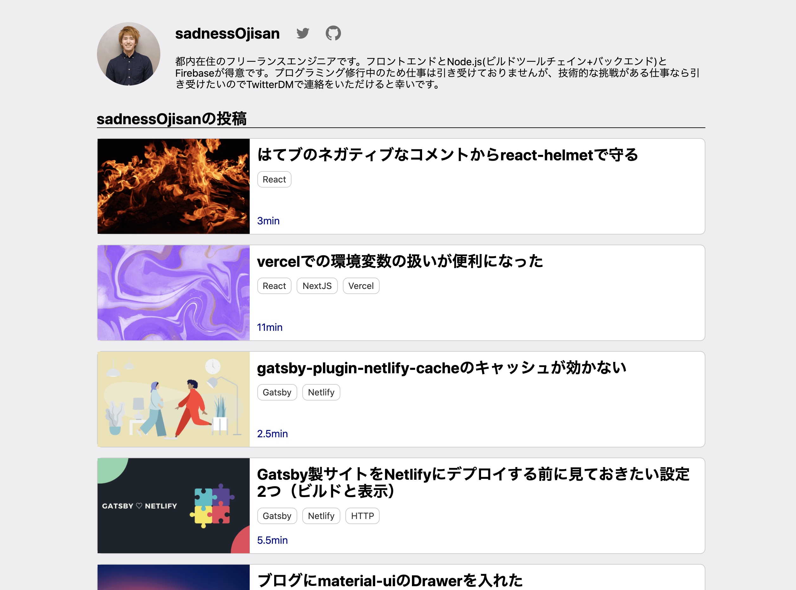

このブログにユーザーという概念を爆誕させました。
記事に著者を紐付けたりユーザーの詳細ページを持てるようにしました。
**静的ブログかつ CMS を使わず入稿している Gatsby 環境でどうやってユーザーを保持し記事を紐付けたか**というのが今回の内容です。

結論からいうと、**「ユーザー情報を yml で管理して、記事に外部キーとして userId を割り振り記事とユーザーを JOIN し、また yml のデータを使って gatsby-node でユーザーページを作成した」**です。

## どういう変更をしたのか

今回の改修により、ブログの上部にこのようなリンクが生まれ


これをクリックすると、



といったユーザーページに遷移するようになりました。
（Follow ボタンは僕の Twitter へ遷移するだけです。）

## ユーザー情報を yml で管理する

ユーザーのページを作るに当たってはどのような構造であれ、gatsby-node から読める形式であればなんでもマスタとして使えます。
そこでユーザー情報を管理する形式として yml で、

```yml
- id: "sadnessOjisan"
  name: "sadnessOjisan"
  image: "sadnessOjisan"
  description: "都内在住のフリーランスエンジニアです。フロントエンドとNode.js(ビルドツールチェイン+バックエンド)とFirebaseが得意です。プログラミング修行中のため仕事は引き受けておりませんが、技術的な挑戦がある仕事なら引き受けたいのでTwitterDMで連絡をいただけると幸いです。"
  twitterId: "sadnessOjisan"
  gitHubId: "sadnessOjisan"
```

といった形式で定義しました。

そしてこれを gatsby-node 内から [js-yml](https://www.npmjs.com/package/js-yaml)で読み込みます。

```js:title=gatsby-node.js
const yaml = require("js-yaml")

const ymlDoc = yaml.safeLoad(
  fs.readFileSync("./src/contents/user.yaml", "utf-8")
)
```

これで、ymlDoc としてユーザー情報の配列を入手しました。
あとはこの配列を回しながら `createPage` を実行すればユーザーページを作成できます。

```js:title=gatsby-node.js
ymlDoc.forEach(element => {
  createPage({
    path: `/users/${element.id}`,
    component: userTemplate,
    context: { userId: element.id, ...element },
  })
})
```

## 記事ページと ユーザー情報を紐づける

各種記事ページでユーザー情報を使うので、記事とユーザーの紐付けを行います。

先ほどの yml の user 情報の中に id を入れてあるので、それを外部キーとして記事側にデータを持たせます。
そのために frontmatter に userId を追加し、これを執筆者とします。

```md
---
path: /user-in-ssg-blog
created: "2020-08-09 09:00"
title: 静的ブログにユーザー概念を作った
visual: "./visual.png"
tags: [Gatsby]
userId: sadnessOjisan
isProtect: false
---
```

ここでの userId は gatsby-node.js を実行するときにビルドシステム側に伝えることができるので、この id を使ってビルド時に user 情報を取得、それを記事に埋め込みます。

```js:title=gatsby-node.js
// 記事ページ生成
contentsResult.data.posts.edges.forEach(({ node }) => {
  // HINT: もしwriteUserが存在しなければ例外が発生してビルドが落ちるはず => 記事とユーザーが紐づいていない。
  const writeUser = ymlDoc.filter(
    item => item.id === node.frontmatter.userId
  )[0]
  createPage({
    path: node.frontmatter.path,
    component: blogPostTemplate,
    context: { userId: writeUser.id, ...writeUser },
  })
})
```

writeUser を作っているところが記事の userId と user yml を突合しているところです。
本当は GraphQL 実行するときに JOIN なんてことができたら良かったのですが、それは調べた限り難しそうだったので、このように filter で無理やり特定して user 情報を取得しています。

取得したユーザー情報は記事情報と JOIN します。
それを行っているのが、

```js:title=gatsby-node.js
createPage({
  path: node.frontmatter.path,
  component: blogPostTemplate,
  context: { userId: writeUser.id, ...writeUser },
})
```

の context です。
context は生成されたページ側で `pageContext` という props 経由で取得できます。
そのためここに描画に必要なユーザー情報を全部含めておけば、記事ページ側で表示できます。

この方式の良いところは **重たい処理は全部ビルド時に行いランタイムでは JOIN が発生しないのでパフォーマンスが犠牲になっていない**ところです。
このように`gatsby-node.js` や `context`を使い倒していきましょう。

## ユーザーページを作る

ユーザーページを作ります。
ユーザー情報だけであれば yml の情報だけで作れるので序盤に紹介した方法のみで済みますが、それに加えてユーザーが投稿した記事の一覧も表示させようと思います。

そのためにユーザーに紐づく記事をクエリで取得しましょう。

```js
export const pageQuery = graphql`
  query AllPostsByUserId($userId: String!) {
    postsByUserId: allMarkdownRemark(
      filter: { frontmatter: { userId: { eq: $userId } } }
    ) {
      nodes {
        timeToRead
        frontmatter {
          title
          path
          visual {
            childImageSharp {
              fluid(maxWidth: 800) {
                ...GatsbyImageSharpFluid
              }
            }
          }
          created(formatString: "YYYY-MM-DD")
          tags
        }
      }
    }
  }
`
```

`$userId` をキーに検索をしています。

これは記事に紐づく userId の変数ですが、これが使えるのは`gatsby-node.js`の`context` で宣言しているからです。
`context: { userId: element.id, ...element },` などとして渡しているものが GraphQL の中で変数として使えます。
そして filter を使ってこの userId に紐づいた記事だけを抽出しました。
その結果記事一覧が手に入ります。

## 何が嬉しいか

僕以外も投稿できます!!!!!!!PR Welcome!!!!!!!!!!!!!!

## ソースコード

このブログのコードを読むとイメージが付くと思います。

- [gatsby-node](https://github.com/sadnessOjisan/blog.ojisan.io/blob/v2.3.0/gatsby-node.js)
- [blogTemplate.tsx](https://github.com/sadnessOjisan/blog.ojisan.io/blob/v2.3.0/src/templates/blogTemplate.tsx)
- [userTemplate.tsx](https://github.com/sadnessOjisan/blog.ojisan.io/blob/v2.3.0/src/templates/userTemplate.tsx)
