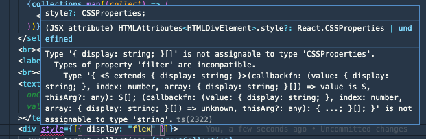

React でコンポーネントのスタイルを上書くことは、ページをコンポーネントに分割していく上で必要になるテクニックです。
コンポーネント自体のスタイリングとレイアウト用のスタイリングを分離し、レイアウトのスタイリングは親側から注入するというようにすることで、子コンポーネントそれ自体の再利用性を高められるからです。

これまでは CSS in JS や CSS Module を使う場合、それを実現するためには親の className を子供に渡して、その className を子供側で展開していました。
しかし React Natve をやり始めるなか inline でスタイリングをすることが増えてきて、inline styling しているときにこの上書きをするにはどうすればいいんだろうと思って調べたことのまとめです。

## React Native では親から Style を受け取って子供の Style 配列に追加する

例を書くと、このようなコードになります。

```ts:title=parent.tsx
import { Child } from "./child"

export function Parent() {
  return (
    <>
      <Child style={{ marginTop: 10 }}></Child>
      <Child style={{ marginTop: 10 }}></Child>
      <Child style={{ marginTop: 10 }}></Child>
      <Child style={{ marginTop: 10 }}></Child>
      <Child style={{ marginTop: 10 }}></Child>
    </>
  )
}
```

```ts:title=child.tsx
export function Child(props: Props) {
  return (
    <>
      <View style={[props.style, { flex: 1 }]}></View>
    </>
  )
}
```

こうすることで親から渡された style 情報を子供にも反映できます。

ただ、ここで僕は疑問に思ったわけです。
style って配列を受け取れました！？

## React Native の style の IF

公式 Doc の[Style](https://reactnative.dev/docs/style)をみてみましょう。

> The style prop can be a plain old JavaScript object. That's what we usually use for example code. You can also pass an array of styles - the last style in the array has precedence, so you can use this to inherit styles.

とあるとおり配列としても渡せ、同名プロパティは後勝ちで上書けるので、スタイルの継承にも使えます。

型定義としては

```ts
style?: StyleProp<ViewStyle>;
```

を持っており、StyleProp は

```ts
export type StyleProp<T> =
  | T
  | RegisteredStyle<T>
  | RecursiveArray<T | RegisteredStyle<T> | Falsy>
  | Falsy
```

となっており、ジェネリクスとして渡されている ViewStyle は

```ts
export interface ViewStyle extends FlexStyle, ShadowStyleIOS, TransformsStyle {
    backfaceVisibility?: 'visible' | 'hidden';
    backgroundColor?: string;
    borderBottomColor?: string;
    borderBottomEndRadius?: number;
    ...
}
```

といったものです。

この ViewStyle は StyleProp として使われたり、RecursiveArray の要素として使われていることから、**オブジェクト・配列のどちらでも渡せる**ことが確認できます。

## React ってこの書き方できたっけ？

ところで React の style ってこの書き方ができたか不安になってきたので調べてみました。
微調整以外で inline style は使わないこともあり記憶が曖昧なのでドキュメントや型をみてみます。

公式 Doc の[style](https://ja.reactjs.org/docs/dom-elements.html#style)には

> style 属性は CSS 文字列ではなく、キャメルケースのプロパティを持った JavaScript オブジェクトを受け取ります。

とあり、どうやら配列で渡せるとは書いてありません。

HTMLAttributes を覗いてみると、

```ts
style?: CSSProperties;
```

とあり、この`CSSProperties` は [CSSType](https://www.npmjs.com/package/csstype) というライブラリが提供している型で、中をみると

```ts
export interface Properties<TLength = string | 0>
  extends StandardProperties<TLength>,
    VendorProperties<TLength>,
    ObsoleteProperties<TLength>,
    SvgProperties<TLength> {}
```

とあり、**配列による I/F は受け付けていなさそう**です。
試しに配列を渡してみましたがエラーが出ます。



**そのため配列でスタイルを上書けるのは React Native のみ**のようです。

## React でコンポーネントのスタイルを上書くためには？

まずそもそもとして、公式 Doc の[style](https://ja.reactjs.org/docs/dom-elements.html#style)に

> このドキュメンテーションにあるいくつかの例では style を便宜上使用していますが、style 属性を要素のスタイリングの主要な手段として使うことは一般的に推奨されません。多くの場合、className を使って外部の CSS スタイルシートに定義された CSS クラスを参照するべきです。

と書かれているとおり、inline での上書きは推奨されていません。

そのため CSS in JS や CSS Modules を使って親の className を渡すことで解決することが主流です。
さらに CSS Modules の場合は複数の classNames を合体させるために [classnames](https://www.npmjs.com/package/classnames)のようなライブラリを使って解決を図ります。
このブログでも、

```tsx
import * as React from "react"
import cn from "classnames"
import styles from "./social.module.css"

...

const Social: React.FC<IProps> = ({ className, path, title, dateYYYYMMDD }) => (
  <div className={cn(className, styles.wrapper)}></div>
)

export default Social
```

として使っています。詳しくは[socials.tsx](https://github.com/sadnessOjisan/blog.ojisan.io/blob/v2.4.0/src/components/article/social/socials.tsx)をご覧ください。

そのため inline style を使わず className を上書く方針でスタイルを上書くのが主流ですが、やり方だけ紹介すると単純にオブジェクトを merge すればいいです。
親から object 形式で style を props として受け取り、それを子コンポーネントで merge します。

```tsx
<div style={Object.assign({}, props.style, { display: "flex" })}>hoge</div>
```

[Object.assign()](https://developer.mozilla.org/ja/docs/Web/JavaScript/Reference/Global_Objects/Object/assign)を使わなくても spread などで merge しても良いです。

## まとめ

- React Native の style は style object の配列を受け取れる。
- 配列の後ろが優先して上書かれるので、スタイルの継承に便利
  - スタイルの継承はスタイリングとレイアウトを分離し、親に依存しない子コンポーネントを書くテクニックとして有用
- React 本体の style は配列を受け取れない
