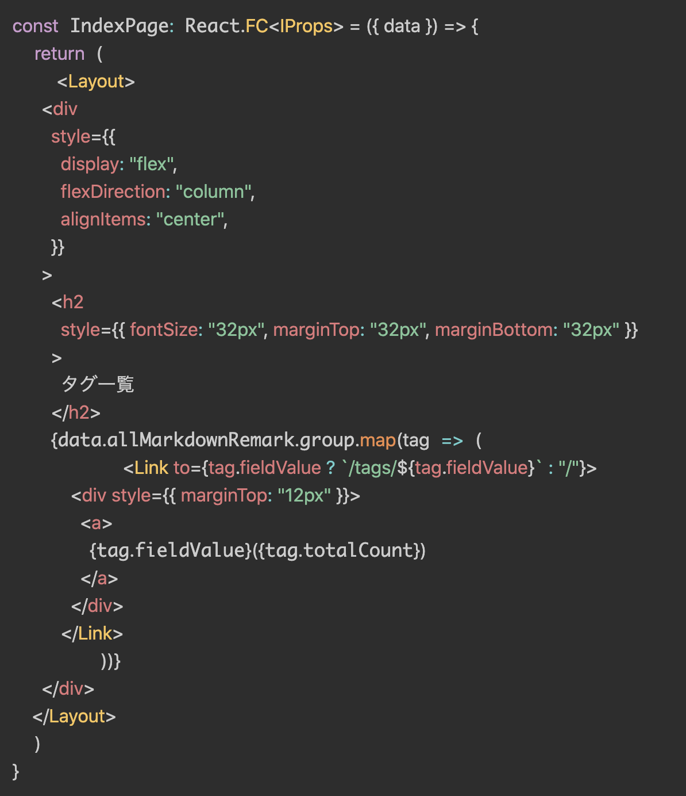
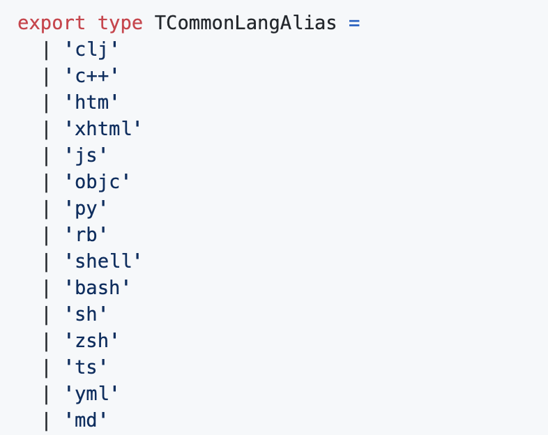
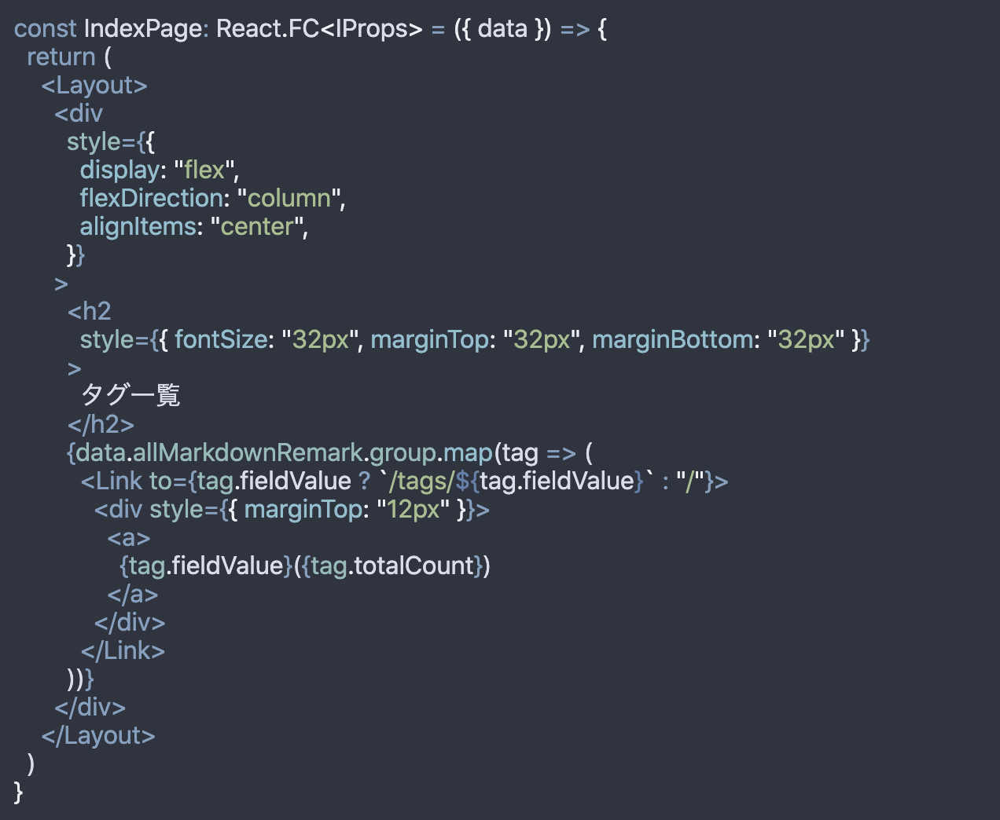

Blog のシンタックスハイライトに関して[Prism.js](https://prismjs.com/)とうまく折り合いを付けられなかったので[shiki](https://shiki.matsu.io/) に乗り換えました。

## Prism.js を採用していた理由

「syntax highlighter といえばこれ」といった印象を持っていたことと、Gatsby に plugin があるのを知っていたことが大きいです。
特に昔から 「Gatsby おすすめプラグイン集」のようなまとめ記事でもたびたび目にしており、syntax hilight をするために特に不安を持たずに入れていたのがきっかけです（ハイライトはどういう仕組みかはよくわかっていなかったけど）。
ただブログを書き続けていると色々合わない点が出てきてしまって切り替えようと思いました。

## Prism.js を剥がすきっかけ

### JSX 対応を乗り越えれなかった

この問題が一番大きいです。
plugin の[公式 HP](https://www.gatsbyjs.com/plugins/gatsby-remark-prismjs/)をみる限り、JSX がサポートされているようなのですが、私の手元ではハイライトはされるもののこのように崩れていました。



Prism.js は拡張性が優れているのでユーザー側で修正を入れていくことができるのですが、plugin でラップしてしまっているので拡張するのが難航しそうで手を出す気になれませんでした。
とはいえ、実際のところ公式で Prism.js 本家でも Gatsby.js でもサポートしていそうなので何かしらのやりようはありそうではあります。

そういった悩みを Twitter で呟いていたら [@\_Ria0130](https://twitter.com/_Ria0130/status/1292507432598384640?s=20)さんから shiki を教えてもらい使ってみることにしました。

### 短縮記法が使えない

JSX 崩れほど決定的な理由ではないのですが、言語名の短縮記法が使えないのもちょっともやっとポイントでした。

GitHub 上のハイライトでは

<pre class="shiki" style="background-color: #2e3440">
<code>
<span style="color: #D8DEE9FF">```sh</span>
<span style="color: #D8DEE9FF">$ cp config/env .env</span>
<span style="color: #D8DEE9FF">```</span>
</code>
</pre>

と書いた際に shellscript のハイライトがされますが、Prism.js はこれが効きません。

<pre class="shiki" style="background-color: #2e3440">
<code>
<span style="color: #D8DEE9FF">```shellscript</span>
<span style="color: #D8DEE9FF">$ cp config/env .env</span>
<span style="color: #D8DEE9FF">```</span>
</code>
</pre>

と書く必要があります。

GitHub で使える書き方が使えないのは markdown file のポータビリティを考えた際にモヤっとした点でした。

一方 shiki では sh といった短縮記法がサポートされているため乗り換えの機運が高まりました。
shiki ではこのように[TCommonLangAlias](https://github.com/shikijs/shiki/blob/master/packages/languages/README.md#literal-values)として短縮記法がサポートされています。



### ユーザーのセンスが問われる

これは自分の問題でもあるのですが、何かダサさがありました。
[公式](https://prismjs.com/)だと入っているテーマが 8 種類しかなく、既存のページのデザインと調和するデザインを選択することが難しかったです。

これは Prism.js の制限というよりかは Gatsby Plugin の制限です。
もちろんサードパーティのテーマを持ってきたり、自分でスタイルシートを拡張すればこの手の問題は解決できるのですが、

- Global に CSS を読み込まないといけない
- サードパーティは公式ほどの充実なサポートが望めなかった

ということもあり、導入は避けていました。

その結果、公式テーマを入れてその上から個別でスタイルを上書いていたのですが、デザインの訓練などは受けていないので手を入れれば入れるほどデザインがおかしくなってしまい苦しんでいました。

一方で shiki は公式がサポートしているスタイルがどれもいい感じだったので入れてみたいなという気持ちになりました。

## Prism.js の除却

では既存の Prism.js を剥がすフローから紹介します。

### plugin の remove

Gatsby の plugin 本体に Prism.js が含まれているので、gatsby-remark-prismjs を remove してしまえば剥がせます。

```sh
yarn remove gatsby-remark-prismjs
```

で node_modules から削除し、それを読み込んでいる gatsby-config.js も修正します。

```javascript:title=gatsby-config.js
{
  "resolve": `gatsby-transformer-remark`,
  "options": {
    "plugins": [
      {
        "resolve": "gatsby-remark-code-titles",
        "options": {}
      },
      // ここを削除
      // {
      //   "resolve": `gatsby-remark-prismjs`,
      //   "options": {
      //     "classPrefix": "language-",
      //     "inlineCodeMarker": null,
      //     "aliases": {},
      //     "showLineNumbers": false,
      //     "noInlineHighlight": false,
      //     "prompt": {
      //       "user": "root",
      //       "host": "localhost",
      //       "global": false
      //     }
      //   }
      // },
      {
        "resolve": `gatsby-remark-autolink-headers`,
        "options": {
          // そこにジャンプした時の上からの余白
          "offsetY": `100`,
          "className": `anchor-link`
        }
      },
      {
        "resolve": `gatsby-remark-images`,
        "options": {
          "maxWidth": 590
        }
      }
    ]
  }
}
```

gatsby-remark-prismjs の役割は gatsby-remark が作るコードブロックのスタイリングなので、このプラグイン設定は gatsby-remark のオプション扱いです。
他のオプションは影響がないのでこのブロックだけを削除します。

### gatsby-browser.js の修正

gatsby-remark-prismjs のスタイリングは、テーマをユーザーに gatsby-browser.js から読み込ませます。
gatsby-browser.js は NextJS の\_app.js のようなもので各ページで必ず呼ばれるものです。
reset.css や tracker を呼び込むエントリポイントとして使うと良いでしょう。

これまではここで tomorrow というテーマを読み込んでいたのでそれを削除します。

```javascript:title=gatsby-browser.js
require("prismjs/themes/prism-tomorrow.css")
```

### Prism.js に向けた上書き CSS を調整

わたしは gatsby-browse.js で css コードブロックやテーマを微調整するファイルを読み込んでいました。

```javascript:title=gatsby-browser.js
require("./src/vendor/css/code.css")
```

この中にある Prism.js 向けの CSS も削除します。

```css:title=vendor/code.css
.gatsby-code-title {
  color: #2c2e31;
  background: rgba(0, 0, 0, 0.1);
  font-size: 0.75rem;
  font-family: SFMono-Regular, Menlo, Monaco, Consolas, "Liberation Mono",
    "Courier New", monospace;
  letter-spacing: 0.075em;
  line-height: 1;
  text-align: left;
  border-radius: 4px 4px 0px 0px;
  padding: 0.25rem 0.5rem;
  display: inline-block;
  margin-left: 1em;
  margin-bottom: 0px !important;
}

pre {
  border-radius: 8px;
}
/* ここが不要
.language-text {
  font-size: 16px !important;
  padding: 0.1em 0.4em !important;
  background: rgba(0, 0, 0, 0.1) !important;
  color: black !important;
  border-radius: 8px;
}

pre[class*="language-"] {
  margin: 0;
} */
```

`class*="language-"` というのは gatsby-remark-prismjs で指定したオプションです。
そのクラス名をコードブロックに付与していたので、別の CSS ファイルから直接スタイルを当てることができていました。

これで除却できたので shiki を導入します。

## shiki の導入

shiki のプラグインは Prism.js のプラグインと違って config それ自体でテーマを設定できるのでライブラリを入れて plugin 登録するだけで使えます。

### plugin の導入と設定

```sh
$ yarn add gatsby-remark-shiki
```

```javascript:title=gatsby-config.js
{
  "resolve": `gatsby-transformer-remark`,
  "options": {
    "plugins": [
      {
        "resolve": "gatsby-remark-code-titles",
        "options": {}
      },
      {
            resolve: `gatsby-remark-shiki`,
            options: {
              theme: "nord",
            },
          },
      {
        "resolve": `gatsby-remark-autolink-headers`,
        "options": {
          "offsetY": `100`,
          "className": `anchor-link`
        }
      },
      {
        "resolve": `gatsby-remark-images`,
        "options": {
          "maxWidth": 590
        }
      }
    ]
  }
}
```

### 微調整

ここでも微調整が必要になりました。
reset.css が pre タグのスタイルを消していたためです。

```css:title=vendor/code.css
pre {
  border-radius: 8px;
  padding: 12px;
  margin-bottom: 12px;
  overflow-x: scroll;
}
```

またファイル名のスタイリングもしたいのでそれ用の CSS も追加します。
（これは Prism.js を使っていた時から存在していた設定で、shiki への移行とは関係がないもの）

```css:title=vendor/code.css
/* gatsby-remark-code-titlesによって追加される要素のスタイリング */
.gatsby-code-title {
  color: #2c2e31;
  background: rgba(0, 0, 0, 0.1);
  font-size: 0.75rem;
  font-family: SFMono-Regular, Menlo, Monaco, Consolas, "Liberation Mono",
    "Courier New", monospace;
  letter-spacing: 0.075em;
  line-height: 1;
  text-align: left;
  border-radius: 4px 4px 0px 0px;
  padding: 0.25rem 0.5rem;
  display: inline-block;
  margin-left: 1em;
  margin-bottom: 0px !important;
}

pre {
  border-radius: 8px;
  padding: 12px;
  margin-bottom: 12px;
  /* SPでみたときに横長のファイルをスクロールでみれるようにするため */
  overflow-x: scroll;
}
```

## 見比べてみると

before...


after...



やったね！

## ソースコード

[この PR](https://github.com/sadnessOjisan/blog.ojisan.io/pull/75)が shiki に乗り換えた PR です。
