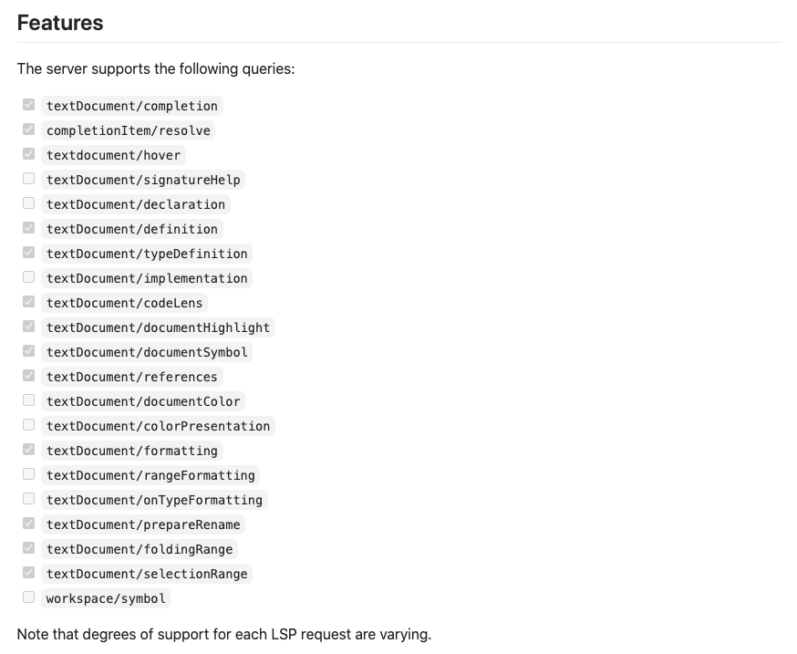
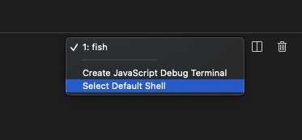
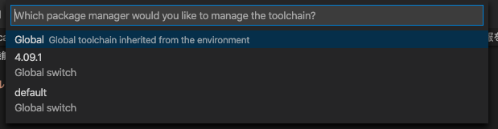

私は OCaml の開発者ではありませんが[プログラミングの基礎](https://www.amazon.co.jp/%E3%83%97%E3%83%AD%E3%82%B0%E3%83%A9%E3%83%9F%E3%83%B3%E3%82%B0%E3%81%AE%E5%9F%BA%E7%A4%8E-Computer-Science-Library-%E6%B5%85%E4%BA%95/dp/4781911609)や大学の講義資料で勉強中でそのサンプルコードとして OCaml を読んでいます。
この記事では、コードリーディングを目的とした補完やフォーマットのための環境構築についてメモします。
（ビルド周りについては触れません）

筆者の環境は MacOS です。

## とりあえず OCaml の環境を作る

たまたま修理に出して新品になった Mac があるので、ここに環境を作っていきます。

まずは OCaml の package manager である[opam](https://opam.ocaml.org/)を入れます。
これはパッケージだけで無く OCaml 本体も入れられので、このコマンドを最初に使えるようにします。

インストール方法は公式である[How to install opam](https://opam.ocaml.org/doc/Install.html)にあるので、参照します。

```sh
$ brew install gpatch
$ brew install opam
```

公式曰く、[GNU patch](https://savannah.gnu.org/projects/patch/) は 依存として必要とのことです。
（なんで必要かは知らないです。）

上記のコマンドを実行すれば、opam を実行できるようになります。

```sh
> opam
usage: opam [--version]
            [--help]
            <command> [<args>]

The most commonly used opam commands are:
    init         Initialize opam state, or set init options.
    list         Display the list of available packages.
    show         Display information about specific packages.
    install      Install a list of packages.
    remove       Remove a list of packages.
    update       Update the list of available packages.
    upgrade      Upgrade the installed package to latest version.
    config       Display configuration options for packages.
    repository   Manage opam repositories.
    switch       Manage multiple installation prefixes.
    pin          Pin a given package to a specific version or source.
    admin        Tools for repository administrators

See 'opam help <command>' for more information on a specific command.
```

では`opam`コマンドで OCaml の環境を作っていきます。

```sh
opam init

# パスを通す
eval $(opam env)
```

これで環境が OCaml の環境が使えるようになりました。
試しに`ocaml`と打つと REPL が起動するはずです。

```sh
> ocaml
        OCaml version 4.09.1
```

## LSP 環境を作る

補完やフォーマットは[LSP](https://microsoft.github.io/language-server-protocol/)経由で行います。
そこで VSCode を LSP Client にするので、それに対応する Launguage Server をインストールします。
それは[ocaml-lsp](https://github.com/ocaml/ocaml-lsp)というもので opam 経由でインストールできます。

```sh
$ opam pin add ocaml-lsp-server https://github.com/ocaml/ocaml-lsp.git
$ opam install ocaml-lsp-server
```

こののちに ocamllsp とターミナルに打ってエラーがでなければ成功です。

## VSCode の設定

VSCode 上での補完やフォーマットには[vscode-ocaml-platform](https://github.com/ocamllabs/vscode-ocaml-platform)というエクステンションを使います。
`textDocument/completion`と`textDocument/formatting`がサポートされているので、LSP 経由で補完もフォーマットもできます。



ただし format に関しては別途 [ocamlformat](https://github.com/ocaml-ppx/ocamlformat) が必要らしいです。
（VSCode 上で format on save をかけると `Unable to find ocamlformat binary. You need to install ocamlformat manually to use the formatting feature.` と表示された。
また、ソースコードを見る限り、formatter は別途入れておく必要がありそう。FYI: https://github.com/ocaml/ocaml-lsp/blob/549ee9e21dda93a152657e138f8e43c8a26e3577/ocaml-lsp-server/src/fmt.ml#L73）

**また、ocamlformat それ自体は format 時に .ocamlformat という設定ファイルが必要です。**
中身は無くても動きますが、このファイルがないとフォーマットされないので project のルートに置いておきましょう。

## 多分うまくいかないと思うのでデバッグするときに役立ちそうな情報を紹介

僕はこの環境を手に入れるのに相当苦労しました。
多分これ通りにやってもうまくいかないと思うのでデバッグに役立つ知識ををつらつらと書いておきます。

### 試行錯誤のために VSCode のリロードを繰り返す

Extension の disaple や設定の修正を行った後は VSCode の再起動が必要となります。
これは `cmd + shift + p` でコマンド入力欄を開いて、「reload window」 と打てばできます。
実際には reload と打つだけで表示されたり、最新の実行順で表示されるので、高速にリロードすることができます。
動かなかったときの試行錯誤をするときに知っておくと便利です。

### opam を入れたときのシェルと VSCode のシェルを揃える

`opam init` するとこのような表示がされます。

```sh
> opam init
...


<><> Fetching repository information ><><><>><><><>  🐫
Processing  1/1: [default: http]
[default] Initialised

<><> Required setup - please read <><><><><><><>><>  🐫

  In normal operation, opam only alters files within ~/.opam.

  However, to best integrate with your system,
  some environment variables should be set.
  If you allow it to, this initialisation step will update
  your fish configuration by adding the following
  line to ~/.config/fish/config.fish:

    source /Users/ojisan/.opam/opam-init/init.fish > /dev/null 2> /dev/null; or true

  Otherwise, every time you want to access your opam installation, you will
  need to run:

    eval $(opam env)

  You can always re-run this setup with 'opam init' later.

Do you want opam to modify ~/.config/fish/config.fish? [N/y/f]
(default is 'no', use 'f' to choose a different file) A hook can be
added to opam's init scripts to ensure that the shell remains
in sync with the opam environment when they are loaded. Set that up? [y/N] y

<><> Creating initial switch (ocaml-base-compiler) ><><>><><>  🐫

<><> Gathering sources ><><><<><><><>  🐫
[ocaml-base-compiler.4.10.0] downloaded from cache at https://opam.ocaml.org/cache

<><> Processing actions <><<><>  🐫
∗ installed base-bigarray.base
∗ installed base-threads.base
∗ installed base-unix.base
```

で、ここで

```sh
your fish configuration by adding the following line to ~/.config/fish/config.fish:

source /Users/ojisan/.opam/opam-init/init.fish > /dev/null 2> /dev/null; or true
```

とある通り環境変数を読み込む処理が fish の設定に書かれています。
（ちなみに僕の fish 環境では `~/.config/fish/config.fish` は設定ファイルではないので、このファイルができたところで環境変数は読まれないし、そもそもこのファイルができていなくて opam 自体も何か不具合がありそう。それはそれはそれで関係話なのですが fish 使っているとこのようなところでもハマるかもなので覚えておこう）

これは bash や zsh で実行したらそれはまた別の設定ファイルになっています。
つまり、opam を実行したときのシェルの種類に依存します。
他のシェルを使う場合は自分で環境変数を読み込まない限りは opam は叩けません。

その結果、VSCode が標準で異なるシェルを立ち上げると opam の資材にアクセスできません。
特に fish だと VSCode で標準サポートされていないので設定で切り替える必要があります。

#### bash/zsh など

VSCode のターミナル機能の GUI から変えることができます。



#### fish など

setting.json から切り替えます。

```json
{
  "terminal.integrated.shell.osx": "/usr/local/bin/fish"
}
```

などとして切り替えられます。

shell の絶対パスを書く必要があるので、 `which fish` などして出てきたものをここに書いてください。

### ocamllsp が VSCode 上からだけ見えない

これ初見で見事にハマったのですが、VSCode の設定次第では VSCode のエクステンション([vscode-ocaml-platform](https://github.com/ocamllabs/vscode-ocaml-platform)) から ocamllsp を使えないといったことがありそうです。
ちなみにこのとき VSCode 内のシェルからは `ocamllsp` を実行できます。
これは `ocaml.select-sandbox` というコマンドで設定を書き換えることで修正できました。

vscode-ocaml-platform は[command](https://github.com/ocamllabs/vscode-ocaml-platform#commands)を提供しており、VSCode 上の cmd + shift + p で実行できます。
このとき `ocaml.select-sandbox` は 利用する opam のバージョンを指定できます。
これで ocamllsp や ocamlformat が入っているバージョンを選択すれば ocamllsp に VSC からアクセスできるようになり補完が聞くようになります。



これは特に `opam switch`で複数バージョンの OCaml を切り替えたりしているとハマる点だと思います。
僕は本や資料のバージョンに合わせて複数バージョン持っていたためこの設定をしていないと動かないという状況になっていました。

## あとがき

OCaml を VSCode でやるとすれば、[OCaml and Reason IDE](https://marketplace.visualstudio.com/items?itemName=freebroccolo.reasonml)の方が圧倒的にスターが多いのでこちらを使ってもいいとは思います。（ただし[vscode-ocaml-platform](https://github.com/ocamllabs/vscode-ocaml-platform)の方が後発で開発も活発なのでいま始めるならこちらに挑戦してみた方が良いとは思います。）
私は ocaml-lsp が動かない時はこちらを使っていたのですが、 merlin という補完に使える開発支援ツール(このツールは ocaml-lsp にも使われている)や ocamlformat/ocp-indent といったフォーマッターを別途入れて、そのパスを通さないと動かない場合があると言った試行錯誤はこちらでも必要なので、注意してください。
