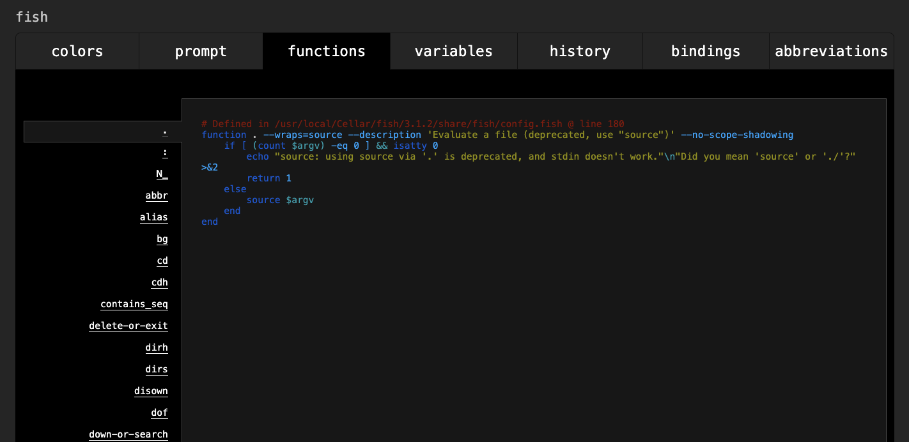

fish(friendly interactive shell)で環境変数をセットする際、[公式](https://fishshell.com/docs/current/tutorial.html#exports-shell-variables)に

> To give a variable to an external command, it needs to be "exported". Unlike other shells, fish does not have an export command. Instead, a variable is exported via an option to set, either --export or just -x.

と書かれており、export コマンドが使えないことが明記されています。
実際 fish で環境変数をセットする方法をネットで調べると「export 使えないから set 使おう」という趣旨の記事がたくさんヒットします。

なのに export が使えてしまったので、その理由を調査しました。

## なんか PATH が通ってるんだけど・・・

新 PC を fish で設定していて、cargo の設定で何気に

```sh
source ~/.cargo/env
```

って書いて「いやいや いま fish だからさすがにこれ通らんやろ」って思ってたら、cargo コマンドが通って「はて？」となりました。

このファイルを覗いてみると

```sh
export PATH="$HOME/.cargo/bin:$PATH"
```

でして、export が使えないはずの fish で export が使えていました。

ちなみに [cargo の Issue](https://github.com/rust-lang/rustup/issues/478) では 「export 使えないから set でやるんだ」っていうコメントがついています。

## cargo 以外もいけるのかなと思って実験した

もしかして cargo 入れる時に裏で魔法のなにかをやってくれたりするのかなと思ったので、普通に手元で export が通るか実験しました。

```sh
$ export PATH="$HOME/aaaaaaaaaaa:$PATH"
```

そして PATH を出力してみます。

```sh
$ echo $PATH
. /Users/ojisan/aaaaaaaaaaa /usr/bin /bin /usr/sbin /sbin /usr/local/bin
```

export がちゃんと実行されていました。

## どうして export が使えるのか

というわけで export コマンドが使える理由を探ってみました。
コマンドが使えるということは fish functions が怪しいので、functions をみてみました。

```sh
# 筆者はCLIが使えないのでVSCodeで調査している
$ code ~/.config/fish
```

fish 配下を `export` で全文検索で漁ってみました。
ここで

```sh
function export
  # no op
end
```

があればそれが犯人です。

ということなので調べてみましたが**ヒットしませんでした。**

## export 関数は定義されているのか関数一覧を調べる

export がコマンドでなく関数なのであれば

```sh
which export
```

などしても場所は出てきません。

関数一覧をみたかったので、`fish_config`をみてみることにしました。

**fish は嬉しいことに設定をブラウザで行えます。**
そのブラウザの設定画面に function 一覧があるので、そこで探してみることにしました。

```sh
$ fish_config
```



そしてこの画面で export を探すとありました！
このような関数として定義されていました。

```sh
# Defined in /usr/local/Cellar/fish/3.1.2/share/fish/functions/export.fish @ line 1
function export --description 'Set env variable. Alias for `set -gx` for bash compatibility.'
    if not set -q argv[1]
        set -x
        return 0
    end
    for arg in $argv
        set -l v (string split -m 1 "=" -- $arg)
        switch (count $v)
            case 1
                set -gx $v $$v
            case 2
                if contains -- $v[1] PATH CDPATH MANPATH
                    set -l colonized_path (string replace -- "$$v[1]" (string join ":" -- $$v[1]) $v[2])
                    set -gx $v[1] (string split ":" -- $colonized_path)
                else
                    true
                    set -gx $v[1] $v[2]
                end
        end
    end
end
```

コードに書いてある通り、set を使って bash compatibility を持った実装にされています。

しかしどうしてこのコマンドが使えるのでしょうか、この関数を使えるようにした覚えはありません。
なので functions の仕組みを調べてみました。

## なぜ export 関数が使えるのか

functions の定義をみてみると /usr/local/Cellar/fish/3.1.2/share/fish/functions/export.fish という位置に入っているようです。
(Cellar がついているのは brew 経由で fish を入れているからです)

share/ にある export は自動で使えるようになっているのでしょうか？
function の読み込みについて調べてみました。

公式 Doc の [autoloading-functions](https://fishshell.com/docs/current/#autoloading-functions)を読んでみると、

> When fish needs to load a function, it searches through any directories in the list variable \$fish_function_path for a file with a name consisting of the name of the function plus the suffix '.fish' and loads the first it finds.

とあり、\$fish_function_path 配下の fish ファイルの関数は自動で読み込まれるとのことです。

なのでこの\$fish_function_path が何なのかみてみましょう。

```sh
$ echo $fish_function_path
> /Users/ojisan/.config/fish/functions
/usr/local/Cellar/fish/3.1.2/etc/fish/functions
/usr/local/Cellar/fish/3.1.2/share/fish/vendor_functions.d
/usr/local/share/fish/vendor_functions.d
/usr/local/Cellar/fish/3.1.2/share/fish/functions
```

ありました、/usr/local/Cellar/fish/3.1.2/share/fish/functions です。
さきほどの export.fish はこのフォルダ配下の関数です。
なのでこの関数がロードされていたから export コマンドが使えるということでした。

## まとめ

- なぜか fish で export コマンドが使える
- 実際には export コマンドでは無く function
- fish は \$fish_function_path 配下の function を自動で読み込む、export function はこの配下にある function なのでコマンドとして使えた。

## 残っている謎

もしご存知でしたら Issues や Twitter などで教えて欲しいです。

### Cargo の Issue はなんだったのか

Git History をみてみるとこの機能は 2014 年からあるようです。
export が使えることが言及されていてもいいのに言及されていないのが気になりました。
もしかしてこの設定が Off になっている環境もあるのでしょうか。
例えば brew 以外の方法で入れたら異なる結果になったり Mac 以外を使った場合などはそうなのでしょうか。

### どうして公式 Doc で言及していないのか

公式が配布している設定なので公式に言及があると思っていました。
むしろ公式には export は使えないから set を使おうとあります。
もしかして僕の設定が ON になっているのは例外的なものなのでしょうか。
世界的に使われているはずのシェルなのに、調べても export が使えることへの言及を見つけられず、むしろ export 使えないという内容の解説しか見つからなくて、気づかないところで何か設定を触ってしまっているのか心配になっています。
