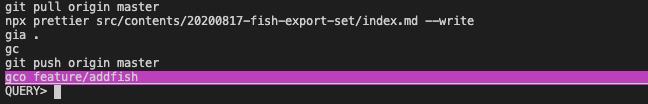

ずっと他のシェルを使っていたのですが fish に切り替えました。
せっかく設定を dotfiles として Git で管理していたのに、設定の依存関係を何も覚えておらず持ち運べない状態になっていたので、いっそのこと全部やめて新しくしようと思ったのが移行のきっかけです。

## fish ってどんなシェル？

[fish](https://fishshell.com/)は Friendly interactive shell というシェルで、friendly さ（+親切さ）があるシェルです。
何も設定を足していない標準の状態でも強力な設定がされているのが魅力の一つです。

### 補完がすごい

他のシェルだとプラグインの設定や関数をたくさん書いて設定していたような補完機能が標準で手に入りました。
たとえばコマンド入力中にこれまでの実行履歴やその階層のファイル一覧を見て、予測変換を出してくれます。


このとき ctrl + f を押すことでその補完で入力でき、入力時間を大幅に短縮できます。

もちろん既存のシェルにある tab で補完候補を出したり、切り替える機能もついています。
これも fish では標準で tab 連打した時に候補にフォーカスを当てることができ、インタラクティブにファイルを選択することができます。


### FW っぽい振る舞いをする

設定ファイルの分割は標準機能として実現できます。
また、そして補完用の設定やコマンド用の設定の分割も標準で行え、関数をコマンドとして定義していけます。
このように設定ファイルの置き場によっていろんな設定が自動でされるので、FW 的な印象も持ちました。
少し使い方を覚えるだけでたくさんの設定ができ、またピンポイントで挙動を制御したいときは script を書いて制御でき、FW が持つ生産性とプリミティブな仕組みが持つコントール性のバランスがよかったです。

とくに functions は感動的で、fish は export や nvm が使えないみたいな問題も、function に export や nvm 関数を定義してコマンドとしてそれを使うみたいなことができたり（標準で設定済みだったり）して、よかったです。

## fish の 導入

Homebrew から手に入れることができます。

```sh
brew install fish
```

インストール後 `fish` と打てば fish が立ち上がります。

```sh
> fish
Welcome to fish, the friendly interactive shell
Type help for instructions on how to use fish
you@hostname ~>
```

毎回打ち直すのはめんどくさいと思うので、ログインシェルを変更するとよいでしょう。
fish はデフォルトシェルではないのでそもそもの設定対象のリストに追加する作業から発生するのでちょっとめんどうです。
ここでは fish 自体の設定について解説したいのでシェルの変更方法については解説しませんが、こちらの記事を参照してください。

FYI: https://www.task-notes.com/entry/20150117/1421482066

### 設定ファイル

fish の設定は ~/.config/fish/ 配下で行います。
zsh や bash のように HOME 配下に rc ファイルがあるわけではないので注意しましょう。
ファイルの拡張子は .fish で ~/.config/fish/config.fish に設定ファイルをかけば設定ができます。

FYI: https://fishshell.com/docs/current/tutorial.html#startup-where-s-bashrc

ただしこのファイル以外の場所に設定を書いても設定を読み込め、その方が設定ファイルの分割をする上で有利なので後に紹介します。

### plugin を使える

fish それ自体には plugin 機構はありませんが、[functions](https://fishshell.com/docs/current/tutorial.html#functions) や [completions](https://fishshell.com/docs/current/index.html#where-to-put-completions) を使って plugin manager として使える外部ツールがあります。
ここでは plugin manager として使える [fisher](https://github.com/jorgebucaran/fisher) を使います。

plugin manager を名乗るツールは複数ありますが結局は fish の機能を呼び出しているだけのようでした。
[公式 Doc](https://github.com/jorgebucaran/fisher#what-is-a-plugin)や実行後の ~/.config/fish/ を読む限りは、functions や conf.d 配下に \*.fish を置くことで設定を足しているようです。
なので、仮に plugin manager を移行するとなってもそこまで影響なさそうだったので、特に理由やこだわりがあるわけでは無く比較的後発で人気がありそうな fisher を選択しました。

## 設定する時に知っておいた方が良いこと

### 設定時は~/.config/fish/ を意識

fish ではいわゆる profile や rc がついたファイル名で設定のエントリポイントは読み取りません。
エントリポイントとしては [~/.config/fish/config.fish](https://fishshell.com/docs/current/index.html#initialization-files)になるとは思いますが、これを使わなくても後述するファイル分割に使うフォルダを使えばエントリポイントを作らなくても動かせます。

functions, fisherfile, conf.d といった設定用のファイル・フォルダはこの直下に置かれます。

### 設定ファイルは分割できる

設定には alias に関するもの、環境変数に関するもの、util 関数に関するものといろいろ増えたり管理したくなるものです。
そこで設定ファイルを分割したくなるわけですが、fish ではこれが簡単にできます。
**fish では~/.config/fish/conf.d/\*.fish は全部設定ファイルとして読み込まれます**(ただし ver2.3.0 以降)。
そのため conf.d 配下に設定を分割していれておけば設定は簡単に分割できます。

FYI: https://fishshell.com/docs/current/index.html#initialization-files

FYI: https://stackoverflow.com/questions/48749443/fish-shell-import-config-into-main-config

zsh/bash などでは

```sh:title=.bashrc
#!/bin/bash -eu

bash_conf=~/.config/bash

. $bash_conf/base.bash
. $bash_conf/alias.bash
. $bash_conf/jump.bash
. $bash_conf/env.bash
```

や

```sh:title=.zshrc
function loadlib(){
    lib=${1:?"You have to specify a library file"}
    if [ -f "$lib" ];then #ファイルの存在を確認
      . "$lib"
    fi
}

loadlib ~/.zsh/load_prezto
loadlib ~/.zsh/zsh_alias
```

などの工夫で設定を分割したりしていたものですが、それをやらなくていいのは嬉しかったです。

### fisher は plugin をテキストファイルで管理できる

調べていると `fisher add` で設定を追加する記事をよく見ましたが、私はそれを使わずに `fishfile` に書いて管理しています。
PC の移行を考え、どんなプラグインを使っているかを dotfiles と Git で管理したいからです。

ただ dotfiles として管理しないのであれば、`fisher add` で直接プラグインを入れてもいいとは思います。
仮に fishfile を使ってなくても、パッケージ管理用のコマンドで自分がどんなファイルを持っているか調べられるので、忘れてもリカバリは容易です。

```sh
# package一覧を取得
fisher ls

# packageを削除
fisher rm XXX
```

こういった今風（っていいのか知らないけど）なパッケージマネージメントができるのは本当に嬉しいです。

## 既存環境を移せないデメリットはある

とまあ fish はとても良いのですが、もちろんデメリットもあります。
実際のところ以前 fish に移行しようとしたときはこれらのデメリットを考えて採用しなかったことがありました。

### nvm が悩みどころ

bash/zsh などで nvm を使っていると、

```sh
export NVM_DIR="$HOME/.nvm"
[ -s "$NVM_DIR/nvm.sh" ] && \. "$NVM_DIR/nvm.sh"
[ -s "$NVM_DIR/bash_completion" ] && \. "$NVM_DIR/bash_completion"
```

のような設定を読み込む必要がありますが、この \$HOME/.nvm/nvm.sh は fish では動きません。
そのため fish では nvm を使うことができず、[fish-nvm](https://github.com/jorgebucaran/nvm.fish) のような別のツールを使うか、[bass](https://github.com/edc/bass) のようなツールで bash の設定を fish に読み込んで nvm コマンドを実行する必要があります。

FYI: https://medium.com/@joshuacrass/nvm-on-mac-for-fish-users-e00af124c540

不用意に依存や設定を複雑にしたくなかったので私はそもそも nvm をやめて、[volta](https://volta.sh/)というツールに移行しました。

## 自分の設定

### alias 設定

alias, env, keybind として設定を分けています。

```sh:title=.config/fish/conf.d/alias.fish
# vim -> nvim
alias vim='nvim'

# GitHubを表示
alias hb="hub browse"

###
### Git系
###
alias g='git'
alias gb='git branch'
alias gbc='git checkout -b'
alias gc='git commit --verbose'
alias gco='git checkout'
alias gia='git add'
alias gm='git merge'
alias gp='git push'
alias gfm='git pull'
```

Git のエイリアスは昔から使っていた prezto の Git モジュールのもののうち、よく使っていたものです。

### plugin 設定

fishfile には

```sh:title=.config/fish/fishfile
rafaelrinaldi/pure
oh-my-fish/plugin-peco
```

をセットしています。

普段は VSCode での作業なのでシェルにそこまでの機能は求めておらず、これだけで間に合っています。

### oh-my-fish/plugin-peco

[plugin-peco](https://github.com/oh-my-fish/plugin-peco) は peco を使ってコマンド履歴を interactive に filter をかけて辿れるツールです。



[peco](https://github.com/peco/peco) は シングルバイナリな interactive filtering tool です。
plugin-peco はこの peco を使ってコマンド履歴をフィルタリングする関数を提供します。
そのため**peco は別途自分でインストールしておく必要**があります。

```sh
brew install peco
```

fish では key bind は fish_user_key_bindings 関数に書いていきます。
plugin-peco によって peco_select_history が使えるようになっているので、この関数を呼び出すキーバインドを設定します。
私は ctrl + r で履歴を絞り込めるようにここに peco_select_history を書いておきます。
(bash/zsh だと このバインドで履歴を検索できたはずなので。)

```sh
function fish_user_key_bindings
  bind \cr 'peco_select_history (commandline -b)'
end
```

### rafaelrinaldi/pure

[Available themes](https://github.com/oh-my-fish/oh-my-fish/blob/master/docs/Themes.md)から好きなテーマを選んで fisher で入れることができます。

- 2 行表示
- フォントのインストール不要
- Git ブランチが表示されて欲しい

というのが好みなので、それで探していました。

その結果いつも通り [pure](https://github.com/rafaelrinaldi/pure) を使うことにしました。
自分が尊敬している人が使っているものなので個人的な思い入れがあったりもします。

## ソースコード

dotfiles そのものは訳があって公開できないのですが、fish 周りだけ切り出してレポジトリを作ったので興味ある方はご覧ください。

FYI: https://github.com/sadnessOjisan/fishconfig
