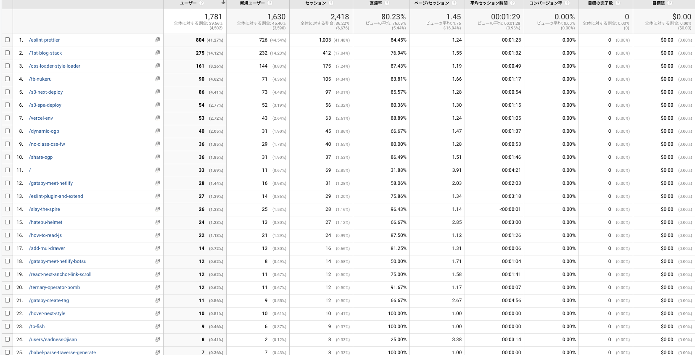
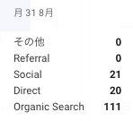

## 何を書いたか

- [ブログに material-ui の Drawer を入れた](/add-mui-drawer)
- [Gatsby 製サイトを Netlify にデプロイする前に見ておきたい設定 2 つ（ビルドと表示）](/gatsby-meet-netlify)
- [gatsby-plugin-netlify-cache のキャッシュが効かない](/gatsby-meet-netlify-botsu)
- [はてブのネガティブなコメントから react-helmet で守る](/hatebu-helmet)
- [vercel での環境変数の扱いが便利になった](/vercel-env)
- [Gastsby 製の静的ブログにユーザー概念を作った](/user-in-ssg-blog)
- [Expo から生成したアプリのヘッダーを消す](/rn-expo-none-header)
- [React (Native)で inline style を上書く方法を調べた](/react-rn-style-overwrite)
- [syntax highlighter を shiki に切り替えた](/use-shiki)
- [AppleCare で 3 年前の PC を郵送修理したらほぼ新品になって戻ってきた](/applecare-is-saikou)
- [OCaml の補完とフォーマットを VSCode 上で実現するための試行錯誤](/ocaml-lsp-vscode)
- [fish にて export で PATH を通せるのは何故か調べた](/fish-export-set)
- [fish を使ってみて分かったメリットや設定のコツ](/to-fish)
- [環境変数 PATH を消すだけなら復活するから大丈夫](/path-del-daijobu)
- [Preact の環境構築 of 2020](/how-to-create-preact-app-2020)
- [cloud storage からのファイル取得を制限したい](/firebase-storage-restrict)

合計 16 つ書いており、先月より+5 ほど書けています。
とはいえ一日に一つはかけるはずだと思っているのでもっとペースを上げていく工夫をしていきたいです。

それはそうとここにたくさん記事を並べるのめんどくさいので、月単位で集約できる graphql と ページを作ろうと思います。

## ブログの改善

ブログのリニューアル（https://github.com/sadnessOjisan/blog.ojisan.io/pull/65）をしました。
デザインが全体的に夏っぽくなったり、またユーザーという概念が登場しました。

## 数字面では？

### UU

- 6 月: 9358
- 7 月: 4502(-4856)

特にバズった記事がなかったのでやはり大幅に下がりました。

### オーガニック流入

- 6 月: 679
- 7 月: 1782(+1103)

6 月に書いた記事がずっと読まれているようです。
ただここ最近書いたもの達も 10 位以降には入っており、執筆数を稼ぐことでそれなりに流入が増やせそうなこともわかります。

## これから

前回の振り返りではオーガニック流入を主眼とすることを述べましたが、それを実践したのが今月です。
バズるような記事を練って書くというよりは、検索されやすい、困りやすい、ハマりやすい内容を書くようにしました。
それらは日頃の開発で山ほど出会うので、そういうのをひたすら言語化した一ヶ月でした。
そのせいかオーガニック流入が 1 日で 100 件を超えたりしてうれしかったです。

来月からもよろしくお願いします。
