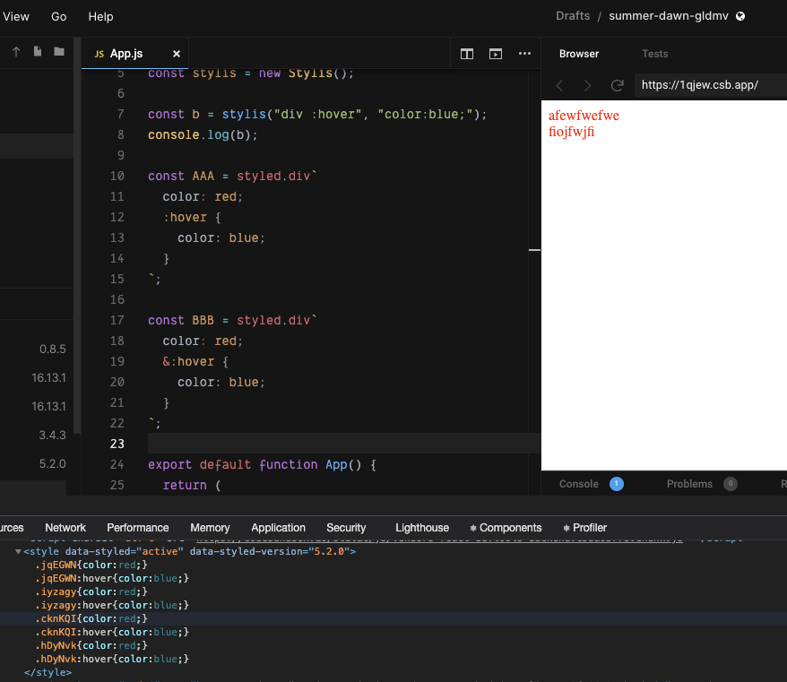

[styled-components](https://styled-components.com/) の 入れ子の中で使う記号(`&>+~`)や、擬似要素 `before/after`, 擬似クラス `hover`, さらには `& &` といった書き方、これがいつも分からなくなるのが最近の悩みです。
きっと CSS を習得するより先に React の勉強を始めた方は同じような悩みを持っているのではないでしょうか。
僕はいつもこの記号がわからなくなるので、ちゃんと調べてメモすることにしました。
その結果、基本的には **styled-components の中で SCSS の記法が使えるだけ**っていう風に覚えておけばいいことがわかりましたが、**一部そうでないものもありました**。
それについて順を追って説明していきます。

(TIPS: >+~についてググるとき直接記号を入れると検索されにくいですが、これらは**隣接セレクタ**と呼ばれておりその言葉で検索すると比較的ヒットします。)

## CSS の復習

初学者にとっては CSS/SCSS の記号運用と styled-components での記号運用を区別がつかないと思いますので、そういったところから包括的に整理していこうと思います。
諸々の実験はここでしているのでご確認ください。

FYI: https://codesandbox.io/s/css-sandbox-1qjew?file=/index.html

### hoge, fuga

`,` は複数のセレクタを対象にします。

```css
h1,
h2 {
  color: red;
}
```

これは h1 と h2 にスタイルを当てています。

### hoge fuga

スペースは子孫要素を表します。

```css
div p {
  color: red;
}
```

この例では div の中の p にスタイルを当てています。
絞り込んでいると考えた方がわかりやすいでしょう。

### el.hoge

要素名に続けてクラス名を指定することで、その要素だけに絞り込めます。

```css
div.hoge {
  color: red;
}
```

ちなみに .class.class のようなことはできません。
気になる方は sandbox でお試しください。

### .hoge #fuga

これは説明する必要ないだろと思うかもしれませんが、ジャンル的には記号なので念のため説明を追加します。
.はクラスのセレクタ, #は id のセレクタです。
そのため

```css
.hoge #fuga {
  color: red;
}
```

は、hoge クラス要素の直下にある hoge id 要素へ color: red を当てるものです。

### hoge > fuga

`>` は直下要素を表します。

```css
div > p {
  color: red;
}
```

直下は 1 階層だけ下という意味であり、

```html
<div>
  <p>スタイル当たる</p>
  <form>
    <p>スタイル当たらない</p>
  </form>
</div>
```

ということです。

### hoge + fuga

\+ は直後の隣接要素を表します。

```css
p + span {
  color: orange;
}
```

```html
<p class="hoge">
  一つ内側(p　.hoge)
  <span>二つ内側(span)</span>
</p>
<span>一つ内側(span)(ここにスタイルが当たる)</span>
<span>一つ内側(span)</span>
<span>一つ内側(span)</span>
```

直後の一つにしか当たらないことに注意しましょう。

### hoge ~ fuga

一方で~ は 後続の隣接要素を表します。
\+ が直後だけだったのに対し、これは後続のもの全てが対象です。

```css
p ~ span {
  color: orange;
}
```

```html
<p class="hoge">
  一つ内側(p　.hoge)
  <span>二つ内側(span)</span>
</p>
<span>一つ内側(span)(ここにスタイルが当たる)</span>
<span>一つ内側(span)(ここにスタイルが当たる)</span>
<span>一つ内側(span)(ここにスタイルが当たる)</span>
```

### hoge:hover

: は擬似クラス(pseudo-class)を表すのに使います。
MDN の説明を借りるなら、擬似クラスは「セレクターに付加するキーワードであり、選択された要素に対して特定の状態を指定します。」です。

FYI: https://developer.mozilla.org/ja/docs/Web/CSS/Pseudo-classes

```css
selector:pseudo-class {
  property: value;
}
```

といった文法で表現でき、pseudo-class は

- hover
- root
- not
- first
- link
- focus
  ...

などたくさんあり、全部書き出すことはできないので、MDN をご参照ください。
ただここで伝えたかったのは **実は擬似クラスと思ってなかったものがあったりして、それが混乱の原因だったかも？**ということで、何が擬似クラスであるかを把握しておくと、記号まみれになる styled-components でも理解を進めていくとができると思います。

### hoge::before

:: は擬似要素(Pseudo-elements)を表すのに使います。
MDN の説明を借りるなら、擬似要素 Pseudo-elements はセレクターに付加するキーワードで、選択された要素の特定の部分にスタイル付けできるようにするものです。

FYI: https://developer.mozilla.org/ja/docs/Web/CSS/Pseudo-elements

```css
selector::pseudo-element {
  property: value;
}
```

といった文法で表現でき、pseudo-element には

- before
- after
- que
- selection
- placeholder

などが入ります。
これも意外と数があるので気になる方は MDN を参照ください。

ここで覚えておきたいことは **before, after 以外にもある**ということと、**: ではなく :: が必要**ということです。
特に **: の数や使い方については後々の混乱の原因にもつながってくる**ので意識しておいてください。

## SCSS の復習

さきほどあげた CSS の記法は SCSS の記法で置き換えられます。
ただ CSS に変換されるだけなので詳しい例はあげませんが、気になる方はデバッグ環境を用意したので適当に値を入れて出力を見てください。

FYI: https://github.com/ojisan-toybox/scss-exec

### スタイルのネスト

子孫要素の指定（絞り込み）は CSS だと、

```css
div p {
  color: red;
}
```

としていましたが、SCSS では

```scss
div {
  p {
    color: red;
  }
}
```

とネストで表現できます。

### >+~をネストと一緒に使う

下層へのスタイルの指定を制御していた >+~(隣接セレクタ) などもネストと組み合わせてすっきりと書けるようになります。（この例ではわかりにくいですが複雑に慣ればなるほど構造化されてすっきりと見えるはずです。）

```css
div > p {
  color: red;
}
```

を

```scss
div {
  > p {
    color: red;
  }
}
```

と、表現できます。

### & を使った親要素参照

SCSS の便利な機能として **& でネストの親のセレクタ名を参照できる**機能があります。

それを使えば、

```css
p {
  color: red;
}

span p {
  color: blue;
}
```

を

```scss
p {
  color: red;

  span & {
    color: blue;
  }
}
```

として書くことができます。
このとき & には親の p が入るとしてみると、`span p`になることがわかると思います。

### &:hover, &::before, &\_\_hoge

段々記号がごちゃごちゃになってきましたね。

この&を使えば、

```css
div:hover {
  color: red;
}
```

を

```scss
div {
  &:hover {
    color: red;
  }
}
```

として書くことができます。
このとき & には親の div が入るとしてみると、`div:hoge`になることがわかると思います。

そして : を 2 つ使うパターンとして擬似要素の指定もでき、

```css
div::before {
  color: red;
}
```

を

```scss
div {
  &::before {
    color: red;
  }
}
```

と書くこともできます。

`&::` は記号 3 連発でややこしいですが、紐どいて考えるとわかりやすいと思います。

そして & を使った興味深いパターンは \_\_ などと組み合わせた CSS 設計論への追従です。

たとえば

```scss
.child {
  color: red;

  &__modifed {
    color: blue;
  }
}
```

は

```css
.child {
  color: red;
}

.child__modifed {
  color: blue;
}
```

としてコンパイルでき、CSS の命名規則のようになりました。
この使われ方はそれなりにみる機会もあり、`__` は いかにもな記号ですが SCSS には何の関係もないので注意しましょう。
命名規則です。
命名規則としては同様に`--`を使うパターンもあったりします。

### & & &

この & を複数使うとどうなるでしょうか。

```scss
div {
  & & & {
    color: blue;
  }
}
```

は

```css
div div div {
  color: blue;
}
```

となります。

これの何が嬉しいかというと**詳細度(スタイルの当たる優先度)を制御**できます。
セレクタの上乗せで調節することはたまに使うこともあるテクニックですが、SCSS では & を複数使うことで実現できます。
記号がたくさん出てきてギョッとしますが一度覚えておくといざというときに読み解けるはずです。

## styled-components の記法

さあようやく styled-components にきました。
なぜここまで CSS/SCSS をくどくど説明したかというと、CSS の記法は SCSS の記法で置き換えられ、**SCSS の記法は styled-component の記法で置き換えられる**からです。
そのため SCSS の書き方を知っていれば styled-components の書き方をほとんど知っているも同然です。

**styled-components は CSS プロセッサに [stylis](https://stylis.js.org/) を利用しており**、SCSS の記法を使うことが可能となっています。
ただしよく読むと scss-like とあるので完全に SCSS というわけではなく、ちょっとした改変もありそうな気がするので検証していきましょう！

> The preprocessor we use, stylis, supports scss-like syntax for automatically nesting styles.

FYI: https://styled-components.com/docs/basics#pseudoelements-pseudoselectors-and-nesting

(注意: 後述しますが実際に使っているのは stylis ではなく@emotion/stylis です。しかしこの微妙な差異がまた大きな混乱(or バグ?)の原因になってそうです。)

### 置き換える方法

template literal の中に SCSS を書くだけで SCSS が適用されます。

```jsx
const Wrapper = styled.div`
  > p {
    color: red;
  }
  &:hover {
    color: blue;
  }
`
```

などといった記法を好き放題にかけます。
このとき `&:hover` は wrapper コンポーネントに対する擬似クラスとして振る舞います。

### :hover と &:hover

しかしやっかいなものがあり、それが :hover と &:hover です。
これは SCSS の記法を考えると `&:hover` が正しいのですが、 `:hover` でも動くのが実情です。

```jsx
const AAA = styled.div`
  &:hover {
    color: blue;
  }
`
const BBB = styled.div`
  :hover {
    color: blue;
  }
`
```

このとき、:hover は SCSS の記法としては間違いなのですが、 このコンポーネントをクライアントで動かした時に inject される CSS は同様です。
`AAA:hover` として出力されます。(実際には AAA には styled-components が出力したクラス名が入る. )

ちなみにこれは SCSS の記法で書くと失敗することは確認できます。

```scss
div {
  &:hover {
    color: red;
  }
  :hover {
    color: red;
  }
}
```

をコンパイルすると

```css
div:hover {
  color: red;
}

div :hover {
  color: red;
}
```

となるからです。

**CSS では要素の後にスペースが開くと擬似クラス CSS は適用されないことに注意しましょう。**

FYI: https://github.com/ojisan-toybox/hover-spacing

ちなみにこれは stylis を実行しても同様の結果が得られます。

```js
import { compile, serialize, stringify } from "stylis"

const css = `
div {
    &:hover {
        color: blue;
    }
    :hover {
        color: blue;
    }
}
`

console.log(serialize(compile(css), stringify))
```

を実行すると

```css
div:hover {
  color: blue;
}
div :hover {
  color: blue;
}
```

となり、div のあとに space が生まれます。

ただ上の実験結果としては SCSS としては動かないものの、styled-components としては `:hover` でも動くのが実情です。

わかりづらいかもしれませんが、空白をつけた hover とそうでない hover を持つ component からは同じ CSS が injection されています。



```jsx
import React from "react"
import styled from "styled-components"

const AAA = styled.div`
  color: red;
  :hover {
    color: blue;
  }
`

const BBB = styled.div`
  color: red;
  &:hover {
    color: blue;
  }
`

export default function App() {
  return (
    <div className="App">
      <AAA>afewfwefwe</AAA>
      <BBB>fiojfwjfi</BBB>
    </div>
  )
}
```

```css
.iyzagy:hover {
  color: blue;
}
.jqEGWN {
  color: red;
}
.jqEGWN:hover {
  color: blue;
}
.iyzagy {
  color: red;
}
```

FYI: https://codesandbox.io/s/schover-gldmv

しかし、 `&:hover`ではなく`:hover` が動くことは styled-components に書かれていなさそうなので、`&:hover`を使った方が良いと筆者は考えています。

### &&& と & & &

同様のスペースの扱いに関しては & & & についても言えます。
これは SCSS の節で紹介した通り、詳細度をコントロールするテクニックです。
このセレクタは & の間にスペースが必要で、実際 &&& として SCSS をコンパイルするとエラーになります。

```scss
div {
  && {
    color: blue;
  }
}
```

```sh
$ npx node-sass index.scss
{
  "status": 1,
  "file": "/scss-exec/index.scss",
  "line": 4,
  "column": 9,
  "message": "Invalid CSS after \"&\": expected \"{\", was \"&\"\n\n\"&\"
  may only be used at the beginning of a compound selector.",
  "formatted": "Error: Invalid CSS after \"&\": expected \"{\", was \"&\"\n\n
  \"&\" may only be used at the beginning of a compound selector.\n
   on line 4 of index.scss\n>>   span && {\n\n   --------^\n"
}
```

しかし styled-components では成功します。

```jsx
const CCC = styled.div`
  && {
    color: blue;
  }
`;
...
<CCC>fiojfwjfi</CCC>
```

```css
.lmbrhy.lmbrhy.lmbrhy {
  color: blue;
}
```

これも SCSS と記法がぶれてる箇所なので注意しましょう。
ここは反対に **styled-components では `&&` ではなく `& &`だとスタイルが当たってくれません**。
公式の例も `&&` と並べて書いています。

FYI: https://styled-components.com/docs/basics#pseudoelements-pseudoselectors-and-nesting

気をつけましょう。

## 個人的勘違いポイント

と、ここまでの話を踏まえて、僕が styled-components 内の記号においてどういうところで混乱していたかを紹介します。

### :+~>& は styled-components 特有の特別な記法ではない

たとえば : は擬似クラス、::は擬似要素で使う CSS にもある記号です。
:hover, ::before のように : の数で混乱しないように意識しましょう。

あと個人的には

```jsx
const Component = styled.div`
  > p {
  }

  & p {
  }
`
```

の使い分けに悩んでいました。
SCSS の記法を意識すればわかりますね。
`div > p` と `div p` の違いです。
直下要素にスタイルを当てるか、複数にスタイルを当てるかという違いです。

### & なしでも子孫の指定ができる

ただし、 上の例に付け加えるなら

```jsx
const Component = styled.div`
  p {
  }
`
```

というパターンもあり得ます。

公式には & なしのパターンと紹介されており、

> If you put selectors in without the ampersand, they will refer to children of the component.

とのことです。

そしてこれは直下だけではなく子を全て対象にとっています。

```jsx
const DDD = styled.div`
  p {
    color: green;
  }
`;

...

<DDD>
  <p>
    aaaaaaa（適用される）
  </p>
  <p>
    aaaaaaa（適用される）
  </p>
  <p>
    aaaaaaa（適用される）
  </p>
  <p>
    aaaaaaa（適用される）
  </p>
</DDD>
```

そして、この場合においては

```jsx
const DDD = styled.div`
  p {
    color: green;
  }
`

const EEE = styled.div`
  & p {
    color: yellow;
  }
`
```

は同じセレクタ(.class p) を出力します。
これも混乱のもとなので気をつけましょう。
&を付けないパターンはなるべく使わないようにすると良いと思います。

### :hover は SCSS の記法では &:hover

:hover の利用は、styled-components では 動きますがやめておいた方が良さそうです。
たとえば、styled-components が利用しているライブラリ(stylis)を直接叩くと white-space が入り、hover できない CSS が出力されることが確認できます。

```js
import { compile, serialize, stringify, tokenize, parse } from "stylis"

const css = `
div {
    &:hover {
        color: blue;
    }
    :hover {
        color: blue;
    }
}
`

console.log(serialize(compile(css), stringify))
```

```sh
$ node index.js
div:hover{color:blue;}div :hover{color:blue;}
```

なのに、styled-components では &無し hover は hover できる CSS として出力されるので **&の役割とは何なのか**と混乱することになりました。

## 個人的な主張

& がなくても動くパターンがありますが、とりあえず SCSS の記法に従って全部 & を付けた書き方をすれば混乱はないと思います。

## 次回予告: なぜ styled-components では結果が異なるのか

そこで気になるのはどうして styled-components には & がなくても hover ができるのかということです。
ざっと読んだ限りでは、答えは内部で使っている stylis にあることがわかりました。
（※ 実際は styled-components は stylis ではなく、@emotion/stylis という stylis を軽量化したものを使っています。）

> switched from stylis to @emotion/stylis (#2640); mostly a bundle size win and a minor performance boost

FYI: https://styled-components.com/releases#v5.0.0-beta.5

これは stylis 互換のはずですが、stylis そのものと I/F が違っており怪しんでいます。
また @emotion/stylis を実行すると styled-components の出力結果と同じものが吐き出されてることが確認できたので、 これが& やスペースの扱いを制御していそうです。(=つまり SCSS に準拠していないものが @emotion/stylis から吐かれている)。
(ここにデバッガを入れて確認した。 https://github.com/styled-components/styled-components/blob/1fde8f09ac77a7a6647b15628b25c774ea42463e/packages/styled-components/src/utils/stylis.js#L93 )
ではここの stylis インスタンスがどういう設定になっているかを読めば解決なのですが、[@emotion/stylis](https://github.com/emotion-js/emotion/tree/master/packages/stylis) がソースそのものが minify されていて読めず明らかにできていないのが現状です。
しかしこのライブラリの影響によるということはデバッグの末に掴んでいるので、次回は styled-components をデバッグする記事を書いて紹介したいと思います。
