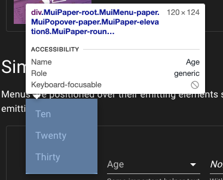
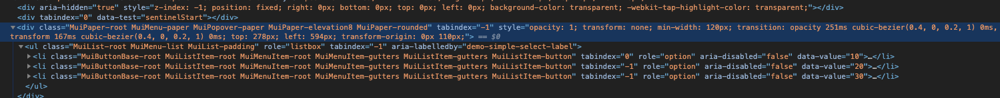
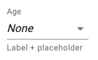
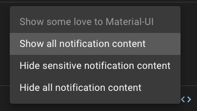

React には material-ui という比較的歴史の長いコンポーネントライブラリがあります。
最近これいいじゃんということで使うようにしていまして(今更!?)、ノウハウやハマりどころを知ったので忘れないように書き留めていきたいと思います。
本当は material-ui のあれこれについて描こうとしたのですが、Select だけでもかなりのボリュームになることがわかったのでまず Select から書いていきます。

## Select コンポーネントの仕組み

普通 select 要素は `<select />` が使われます。
しかし material-ui では select要素を使わずに全て自前で実装しています。

### Divで擬似的に作っている

要素一覧は div で作り各要素は ul と li で作っています。





その結果、普通の Select 要素だとできなかったスタイリングやイベントの監視のようなことができるようになります。
自前でSelectを作ろうとしたら結構大変（例えばをSelectBoxをクリックしたときにでるポップの出現位置の計算など、下でクリックされたら上に出さないといけないなど）なのですが、そういうのを全部やってくれるのでとても便利です。

### native UIも使える

当然、普通の Select 要素バージョンも用意されています。
`native` というプロパティを与えるだけで実現できます。
(正確にはoptionの使用も必要ですが、それについては後述します)

```tsx
<Select native>
  <option value={10}>10</option>
</Select>
```

これは特にモバイルでは強力で、ドラムロールを使って表示させたい場合に使えます。

## 関連するタグについて解説

Select は単体で使うようり他のコンポーネントと使うことが多いです。
そのために全体感を把握しないと使いにくかったりもするのでそのおさらいをしましょう。

よくあるコードはこのようなコードです。
(https://material-ui.com/components/selects/)

```tsx
<FormControl className={classes.formControl}>
        <InputLabel id="demo-simple-select-helper-label">Age</InputLabel>
        <Select
          labelId="demo-simple-select-helper-label"
          id="demo-simple-select-helper"
          value={age}
          onChange={handleChange}
        >
          <MenuItem value="">
            <em>None</em>
          </MenuItem>
          <MenuItem value={10}>Ten</MenuItem>
          <MenuItem value={20}>Twenty</MenuItem>
          <MenuItem value={30}>Thirty</MenuItem>
        </Select>
        <FormHelperText>Some important helper text</FormHelperText>
      </FormControl>
```

Select 意外にもたくさんコンポーネントがあるのでその役割をまず確認していきましょう。

### FormControl

[FormControl](https://material-ui.com/api/form-control/)は、

> Provides context such as filled/focused/error/required for form inputs. Relying on the context provides high flexibility and ensures that the state always stays consistent across the children of the FormControl. 

とあり、フォームのパーツの状態を知らせることができるものです。
わざわざ通知する機能を各コンポーネントから切り出せるようにしているのは、複数のパーツがセットになる場合もあるからで、このFormControlを使えばlabelとinput要素に同時にエラーなどの状態を知らせることができます。

### InputLabel

formのlabelです。
FormControlの配下にあれば、その状態に応じて挙動が変わります。
もちろんFormControlを使わなくても個別で状態をセットすることもできます。

```tsx
<FormControl className={classes.formControl} disabled>
        <InputLabel id="demo-simple-select-disabled-label">Name</InputLabel>
        <Select
          labelId="demo-simple-select-disabled-label"
          id="demo-simple-select-disabled"
          value={age}
          onChange={handleChange}
        >
          <MenuItem value="">
            <em>None</em>
          </MenuItem>
        </Select>
      </FormControl>
```

ちなみに label には htmlFor を書くのが通例ですが、Select側に対応するlabelIdを書いておけばhtmlForは書かなくても、ラベルクリックで要素選択ができます。


### FormHelperText

[FormHelperText](https://material-ui.com/api/form-helper-text/)はSelect下部に表示される補助情報を表示するコンポーネントです。



```tsx
<FormControl className={classes.formControl}>
        <InputLabel shrink id="demo-simple-select-placeholder-label-label">
          Age
        </InputLabel>
        <Select
          labelId="demo-simple-select-placeholder-label-label"
          id="demo-simple-select-placeholder-label"
          value={age}
          onChange={handleChange}
          displayEmpty
          className={classes.selectEmpty}
        >
          <MenuItem value="">
            <em>None</em>
          </MenuItem>
          <MenuItem value={10}>Ten</MenuItem>
          <MenuItem value={20}>Twenty</MenuItem>
          <MenuItem value={30}>Thirty</MenuItem>
        </Select>
        <FormHelperText>Label + placeholder</FormHelperText>
      </FormControl>
```

こちらも FormControlが持つ状態に合わせて振る舞いを変えることができます。

### MenuItem

はメニューとして開く一時的な画面の項目を抽象化したコンポーネントです。
そのためSelect特有のものではありません。

ただのdivかと思いきや様々な便利なAPIが生えており代表的なものだけ紹介します。

#### selected / disabled

このように選択状態と不可状態のUIを作れます。



```tsx
 <Menu
        id="lock-menu"
        anchorEl={anchorEl}
        keepMounted
        open={Boolean(anchorEl)}
        onClose={handleClose}
      >
        {options.map((option, index) => (
          <MenuItem
            key={option}
            disabled={index === 0}
            selected={index === selectedIndex}
            onClick={(event) => handleMenuItemClick(event, index)}
          >
            {option}
          </MenuItem>
        ))}
      </Menu>
```

#### 自由なスタイル上書き

material-ui は hooks を使った style の injection をしたり、 styled-components でラップしてそのまま上書いたりできる口が用意されています。

詳しくは [Customizing components](https://material-ui.com/customization/components/)をご覧ください。
また書き換え可能な要素については、[MenuItem API](https://material-ui.com/api/menu-item/)のCSSの節をご覧ください。

## ハマりやすい点

### labelを中に入れたくない

### すべてを表示したい

### native modeで表示されない

### 項目がdivなら好き放題カスタマイズしたい

### FormControlと各パーツの状態の競合はどちらが優先されるか


