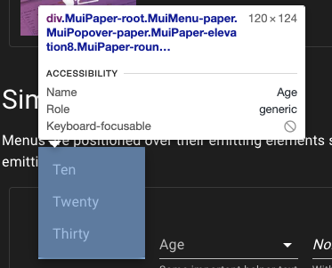
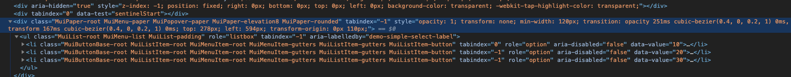
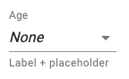
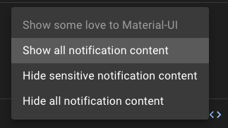
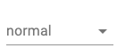
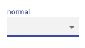

React には [material-ui](https://material-ui.com/) という比較的歴史の長いコンポーネントライブラリがあります。
最近これいいじゃんということで使うようにしていまして(今更!?)、ノウハウやハマりどころを知ったので忘れないように書き留めていきたいと思います。
本当は material-ui のあれこれについて描こうとしたのですが、Select だけでもかなりのボリュームになることがわかったのでまず Select から書いていきます。

## Select コンポーネントの仕組み

普通 select 要素は `<select />` が使われます。
しかし material-ui では select 要素を使わずに全て自前で実装しています。

### Div で擬似的に作っている

要素一覧は div で作り各要素は ul と li で作っています。





その結果、普通の Select 要素だとできなかったスタイリングやイベントの監視のようなことができるようになります。
自前で Select を作ろうとしたら結構大変（例えばを SelectBox をクリックしたときにでるポップの出現位置の計算など、下でクリックされたら上に出さないといけないなど）なのですが、そういうのを全部やってくれるのでとても便利です。

### native UI も使える

当然、普通の Select 要素バージョンも用意されています。
`native` というプロパティを与えるだけで実現できます。
(正確には option の使用も必要ですが、それについては後述します)

```tsx
<Select native>
  <option value={10}>10</option>
</Select>
```

これは特にモバイルでは強力で、ドラムロールを使って表示させたい場合に使えます。

## 関連するタグについて解説

Select は単体で使うようり他のコンポーネントと使うことが多いです。
そのために全体感を把握しないと使いにくかったりもするのでそのおさらいをしましょう。

よくあるコードはこのようなコードです。
(https://material-ui.com/components/selects/)

```tsx
<FormControl className={classes.formControl}>
  <InputLabel id="demo-simple-select-helper-label">Age</InputLabel>
  <Select
    labelId="demo-simple-select-helper-label"
    id="demo-simple-select-helper"
    value={age}
    onChange={handleChange}
  >
    <MenuItem value="">
      <em>None</em>
    </MenuItem>
    <MenuItem value={10}>Ten</MenuItem>
    <MenuItem value={20}>Twenty</MenuItem>
    <MenuItem value={30}>Thirty</MenuItem>
  </Select>
  <FormHelperText>Some important helper text</FormHelperText>
</FormControl>
```

Select 意外にもたくさんコンポーネントがあるのでその役割をまず確認していきましょう。

### FormControl

[FormControl](https://material-ui.com/api/form-control/)は、

> Provides context such as filled/focused/error/required for form inputs. Relying on the context provides high flexibility and ensures that the state always stays consistent across the children of the FormControl.

とあり、フォームのパーツの状態を知らせることができるものです。
わざわざ通知する機能を各コンポーネントから切り出せるようにしているのは、複数のパーツがセットになる場合もあるからで、この FormControl を使えば label と input 要素に同時にエラーなどの状態を知らせることができます。

### InputLabel

form の label です。
FormControl の配下にあれば、その状態に応じて挙動が変わります。
もちろん FormControl を使わなくても個別で状態をセットすることもできます。

```tsx
<FormControl className={classes.formControl} disabled>
  <InputLabel id="demo-simple-select-disabled-label">Name</InputLabel>
  <Select
    labelId="demo-simple-select-disabled-label"
    id="demo-simple-select-disabled"
    value={age}
    onChange={handleChange}
  >
    <MenuItem value="">
      <em>None</em>
    </MenuItem>
  </Select>
</FormControl>
```

ちなみに label には htmlFor を書くのが通例ですが、**Select 側に対応する labelId を書いておけば htmlFor は書かなくても、ラベルクリックで要素選択ができます。**

### FormHelperText

[FormHelperText](https://material-ui.com/api/form-helper-text/)は Select 下部に表示される補助情報を表示するコンポーネントです。



```tsx
<FormControl className={classes.formControl}>
  <InputLabel shrink id="demo-simple-select-placeholder-label-label">
    Age
  </InputLabel>
  <Select
    labelId="demo-simple-select-placeholder-label-label"
    id="demo-simple-select-placeholder-label"
    value={age}
    onChange={handleChange}
    displayEmpty
    className={classes.selectEmpty}
  >
    <MenuItem value="">
      <em>None</em>
    </MenuItem>
    <MenuItem value={10}>Ten</MenuItem>
    <MenuItem value={20}>Twenty</MenuItem>
    <MenuItem value={30}>Thirty</MenuItem>
  </Select>
  <FormHelperText>Label + placeholder</FormHelperText>
</FormControl>
```

こちらも FormControl が持つ状態に合わせて振る舞いを変えることができます。

### MenuItem

[MenuItem](https://material-ui.com/components/menus/)はメニューとして開く一時的な画面の項目を抽象化したコンポーネントです。
そのため Select 特有のものではありません。

とは言っても、ただの div かと思いきや様々な便利な API が生えており代表的なものだけ紹介します。

#### selected / disabled

このように選択状態と不可状態の UI を作れます。



```tsx
<Menu
  id="lock-menu"
  anchorEl={anchorEl}
  keepMounted
  open={Boolean(anchorEl)}
  onClose={handleClose}
>
  {options.map((option, index) => (
    <MenuItem
      key={option}
      disabled={index === 0}
      selected={index === selectedIndex}
      onClick={event => handleMenuItemClick(event, index)}
    >
      {option}
    </MenuItem>
  ))}
</Menu>
```

#### 自由なスタイル上書き

material-ui は hooks を使った style の injection をしたり、 styled-components でラップしてそのまま上書いたりできる口が用意されています。

詳しくは [Customizing components](https://material-ui.com/customization/components/)をご覧ください。
また書き換え可能な要素については、[MenuItem API](https://material-ui.com/api/menu-item/)の CSS の節をご覧ください。

## ハマりやすい点

### label を中に入れたくない

デフォルトでは label が中に入っています。
たとえこのように label を書いたとしても

```tsx
<FormControl className={classes.formControl}>
  <InputLabel id="demo-simple-select-label">normal</InputLabel>
  <Select
    labelId="普通のselect box"
    id="demo-simple-select"
    value={age}
    onChange={handleChange}
  >
    <MenuItem value={10}>Ten</MenuItem>
    <MenuItem value={20}>Twenty</MenuItem>
    <MenuItem value={30}>Thirty</MenuItem>
  </Select>
</FormControl>
```

表示は



となります。

経験上、この状態で PM/PO/Designer などからレビューを受けると、「このデザインはやめてほしい」というフィードバックを受けます。
ラベルを中に入れるより外に出しておいて欲しいとのことです。
この問題に関しては、何らかの focus を select に当てることでラベルが上に上げれるので、それを利用してラベルを付けましょう。



その実現方法として効果的なものが、displayEmpty プロパティと空白要素の選択です。

[displayname](https://material-ui.com/api/select/) は、

> If true, a value is displayed even if no items are selected.In order to display a meaningful value, a function should be passed to the renderValue prop which returns the value to be displayed when no items are selected. You can only use it when the native prop is false (default).

といったもので、選択されていない時に初期値に対応する文言を表示する機能で、これを利用することで select の中に値を入れラベルを上にずらすことができます。

```tsx
<FormControl className={classes.formControl}>
  <InputLabel shrink id="demo-simple-select-placeholder-label-label">
    Age
  </InputLabel>
  <Select
    labelId="demo-simple-select-placeholder-label-label"
    id="demo-simple-select-placeholder-label"
    value={age}
    onChange={handleChange}
    displayEmpty
    className={classes.selectEmpty}
  >
    <MenuItem value="">
      <em>None</em>
    </MenuItem>
    <MenuItem value={10}>Ten</MenuItem>
    <MenuItem value={20}>Twenty</MenuItem>
    <MenuItem value={30}>Thirty</MenuItem>
  </Select>
  <FormHelperText>Label + placeholder</FormHelperText>
</FormControl>
```

つまりこれを用いて初期値もしくは空値を選択させておけばラベルが上に上がってくれます。

### native mode で表示されない

モバイル対応をやっているとドラムロールの対応をしたいと思うので native モードを使いたくなると思います。
これは慣れない頃はよくやりがちなのですが native を付けただけでは動きません。
何かクラッシュするわけでもなくただセレクトボックスが開かなくなるだけなので、ぼくは始め何が原因かよくわからなくなったりしました。

native を使うと select の中は option タグが要求されるので MenuItem コンポーネントが使えなくなります。
MenuItem を使っているとそれらは表示されません。
警告がでなくて気づきにくかったりするので要注意です。

### htmlFor は labelId で代替できる

先ほどもチラッと書きましたので説明は省きますが、labelId で代用できます。
material-ui では label に htmlFor という API は生えていないので注意しましょう。

### FormControl と各パーツの状態の競合はどちらが優先されるか

```tsx
<h1>form controlの状態と各パーツの状態はどっちが優先されるか</h1>
  <FormControl className={classes.formControl} disabled={true}>
      <InputLabel shrink id="demo-simple-select-placeholder-label-label">
          Age
  </InputLabel>
      <Select
          disabled={false}
          labelId="demo-simple-select-placeholder-label-label"
          id="demo-simple-select-placeholder-label"
          value={age}
          onChange={handleChange}
          displayEmpty
          className={classes.selectEmpty}
      >
          <MenuItem value="">
            <em>None</em>
          </MenuItem>
          <MenuItem value={10}>Ten</MenuItem>
          <MenuItem value={20}>Twenty</MenuItem>
          <MenuItem value={30}>Thirty</MenuItem>
      </Select>
      <FormHelperText>Label + placeholder</FormHelperText>
  </FormControl>
```

といったコードを用意します。
ここで注目したいのは FormControl の disable と Select の disable です。
それぞれ true と false と違った値を入れておき矛盾させています。
このときどちらが優先されるかでいうと `Select` です。
おそらく直感にも合っているとは思います。
とはいってもわざわざ矛盾させることの利点はなさそうなのできちんと状態を揃えた運用を心がけましょう！

## おわりに

いかがでしたか。
material-ui の select は独自の使い方を覚えることがあったり最初は大変ですが、とても便利なものなので覚えておくと良いでしょう！

## サンプルコード

サンプルコードはこちらです。

https://github.com/ojisan-toybox/mui-select
