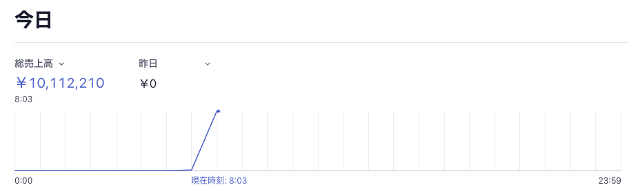
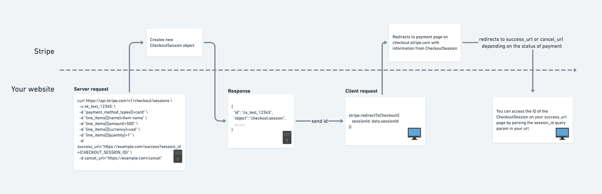
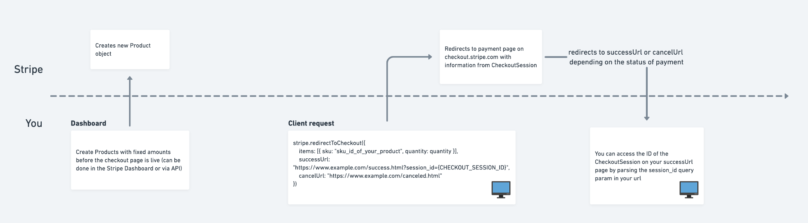

[nabettu](https://twitter.com/nabettu) さんの[stripe のサブスク実装に Firebase の Extension がいい](https://nabettu.com/70975021a95f4f5b97e10a2666e37c77)に便乗して [stripe](https://stripe.com/) について書きます。
stripe は決済機能を簡単に実現できる素晴らしいソリューションですが、自分自身はサブスク機能うんぬんの前に stripe そのものの実装でつまづいていた苦い過去があり、そういうのを払拭すべく stripe そのものの使い方を解説しようと思います。
サンプルに[sadnessOjisan に給料を支払えるサービス](https://react-stripe-example.vercel.app/)を作ったので、このコードを元に解説していきます。

ちなみにそこで決済するとこのように売り上げが見えるようになり楽しいです。



テスト用のクレジットカード情報を載せていますのでそれを使って僕にじゃんじゃん給料を振り込んでください。
**実際のところ自分の市場価値がどれくらいか分かっていないので、それを知りたいっていう目的もあるのでリアルな金額を書き込んで欲しいです。**

Stripe は決済周りの実装を簡単にするソリューションとはいえ、Stripe を使っても決済周りは複雑だったりするわけですが、

- 全体感の把握
- ライブラリの使い分け

を意識すればできるようになりましたので頑張りましょう。

※ 本記事では API サーバーを使うパターンも紹介するため、サーバーを用意・デプロイしやすい NextJS で作っていますが、JS が動けばどの フレームワーク(バニラでも可) を使っても再現可能です。

## stripe は何か

[stripe](https://stripe.com/jp)はオンライン決済プラットフォームで、決済機能を簡単に自分のアプリケーションに組み込める SaaS/PaaS です。
決済を行うための各種エンドポイントが用意されており、その API を利用して決済処理を組み込めます。

## クライアントで完結するのか

Stripe にはクライアントだけで完結するものとサーバーが必要なものがあります。
API を提供するとのことでクライアントだけ書けばいいのかなと初めは思っていたのですが、自前でサーバーを用意しないといけないパターンもあり混乱しました。

### ドロップインソリューション

クライアントだけで完結するパターンとして、[Stripe Checkout](https://stripe.com/jp/payments/checkout)とよばれるドロップインな方法があります。
これは決済画面そのものも Stripe が用意しているため、これを用いるだけで決済機能を実装することができます。
決済の完了(成功・失敗)後のフローは、決済完了後にリダイレクトされるページでその URL に含まれているトークンを利用することで進めることができます。


FYI: https://stripe.com/docs/payments/checkout

そのためこの方法を用いるだけで簡単に決済機能を実現できます。

**ただ動的に金額を決めたり、在庫の金額管理を管理画面側でやる必要があったり、また決済画面のデザインを手元で持てなかったり諸々のデメリットはある**ので、使いどころは限られるかもしれません。



FYI: https://github.com/stripe-samples/checkout-one-time-payments

### サーバーを使ったソリューション

そこでなるべく制御権を持ちたいのでサーバーを建てるソリューションで行います。
サーバーを使う場合のフローはこのようになります。



FYI: https://stripe.com/docs/payments/accept-a-payment

この方式のいいところは決済情報をサーバー →stripe に送り、それをクライアントサイドでユーザーに確認させて決済するため、決済内容を動的に変えられる点です。
サーバー->Stripe のやりとりで決済内容を決めるので、クライアントからの改竄もできないため安全です。
また決済ページは自前で構築できるので、カスタマイズ性も高くこのフローを使いたい時は使いたいです。
ただこのフローは上の図を見ても初見だと単語も概念もよくわからないと思いますので、

- 決済フローの仕組みついて
- 決済ページの作り方

を、全体感を日もどきながら概念について解説したいと思います。

## サーバーから決済機能を使う方法について

### API キーの発行などの下準備

公式のダッシュボードからキーを発行してください。


pk から始まる public なものと、sk から始まるシークレットなものがあります。
シークレットの方はサーバーで使うもので環境変数化するなりして見えないようにしておきましょう。

### コードの全体

先に最小構成の全体感を見せた方が分かりやすいと思いますのでべたっと貼り付けます。

```ts:title=pages/api/pay.tsx
import { NextApiRequest, NextApiResponse } from "next"
// サーバーで使うSDK
import Stripe from "stripe"

const stripe = new Stripe(process.env.STRIPE_SECRET, {
  apiVersion: "2020-08-27",
})

export default async (req: NextApiRequest, res: NextApiResponse) => {
  // 決済する金額を受け取る
  const value = req.body.amount

  // intentは支払いフローを定義するオブジェクト
  const paymentIntent = await stripe.paymentIntents.create({
    amount: value,
    currency: "jpy",
    // Verify your integration in this guide by including this parameter
    metadata: { integration_check: "accept_a_payment" },
  })

  // intentのsecretをクライアントがstripeに送るとintentが実行される
  res.status(200).json({ client_secret: paymentIntent.client_secret })
}
```

```tsx:title=pages/index.tsx
import * as React from "react"
import {
  Elements,
  CardElement,
  useStripe,
  useElements,
} from "@stripe/react-stripe-js"
import { loadStripe } from "@stripe/stripe-js"

const Payment = () => {
  // public key
  const stripeApiKey = "pk_test_51HLU77BUWDS...jJhJ12C"
  const stripePromise = loadStripe(stripeApiKey)

  return (
    <div style={{ padding: 24 }}>
      <h1>sadnessOjisan に年収を払ってくれる御社を探してます！</h1>
      <p>お金欲しい！！！！！！！！！！</p>
      <div style={{ maxWidth: 760 }}>
        <Elements stripe={stripePromise}>
          {" "}
          // 中身はContext
          <CheckoutForm></CheckoutForm>
        </Elements>
      </div>
    </div>
  )
}

const CheckoutForm = () => {
  const stripe = useStripe()
  const elements = useElements()

  const handleSubmit = async event => {
    event.preventDefault()

    // intentを作るエンドポイントに決済したい金額を送る
    const res = await fetch("/api/pay", {
      method: "post",
      body: JSON.stringify({ amount: event.target.amount.value }),
      headers: { "Content-Type": "application/json" },
    })
    const data = await res.json()
    const secret = data.client_secret

    const card = elements.getElement(CardElement) // tokenを使ってintentを実行する

    const result = await stripe.confirmCardPayment(secret, {
      payment_method: {
        // FYI: payment_method (https://stripe.com/docs/api/payment_methods)
        card: card,
        billing_details: {
          name: "user name",
        },
      },
    })

    if (result.error) {
      /**
       * 決済の失敗
       * * api_connection_error
       * * api_error
       * * authentication_error
       * * card_error
       * * and so on...
       */
      console.log(result.error.message)
    } else {
      if (result.paymentIntent.status === "succeeded") {
        /**
         * 決済に成功したときの処理をこのブロックに書く
         */
        alert("payment success!!")
      }
    }
  }

  return (
    <form onSubmit={handleSubmit}>
      <label style={{ marginTop: 10, marginBottom: 10, display: "block" }}>
        年棒（日本円）
      </label>
      <input name="amount" defaultValue={10000000}></input>
      <label style={{ marginTop: 10, marginBottom: 10, display: "block" }}>
        カード情報
        <CardElement />
      </label>
      <p>↓テスト用クレジットカード情報↓</p>
      <ul>
        <li>番号: 4111111111111111</li>
        <li>有効期限: 02/25 (現在より後ならいつでmお)</li>
        <li>CVC: 111 (3桁ならなんでも)</li>
      </ul>
      <button type="submit">支払う</button>
    </form>
  )
}

export default Payment
```

### 支払いのフローを作る

支払いのフローは二つに分かれます。

- 支払いたいという intent を実行するための token をサーバーで作成する
- その token を stripe に送って intent を confirm して決済を実行する

#### stripe オブジェクトを作る

intent を実行するためにも、stripe を叩くメソッドを持ったオブジェクトをクライアント側に作ります。
それが `const stripePromise = loadStripe(stripeApiKey);` です。
このオブジェクトは context.provider などで決済フォームへ渡して、決済に使います。

```tsx
<Elements stripe={stripePromise}>
  <CheckoutForm></CheckoutForm>
</Elements>
```

の Elements の内部実装が`Context.Provider`です。
そのため Elements で括る必要があります。
こうすることで内部で hooks 経由で様々なメソッドを呼べるようにもなります。

#### payment intent を実行できる client_secret を吐き出す API サーバーを用意する

ここからはサーバーでの処理です。
`stripe.paymentIntents.create` を使って client_secret を吐き出します。
このとき stripe オブジェクトは `const stripe = new Stripe(process.env.SECRET, { apiVersion: '2020-08-27' })` として作られ、サーバー側に秘密鍵が必要になるので扱いには注意しましょう。
またここで使うライブラリは `stripe` です。
`@stripe/stripe-js` はクライアント側のライブラリです。
混同に注意しましょう。

intent は

> Use the Payment Intents API to build a payments integration that can handle complexity. This API tracks a payment, from initial creation through the entire checkout process, and triggers additional authentication steps when required.

といったもので、支払いのフローそのものです。

requires_payment_method => requires_confirmation => requires_action => processing => result といったフローで進んでいきます。（全部行う必要はない）
サンプルコードや公式チュートリアルを読むとき、どのフェーズかを意識すると急に読みやすくなりますので意識しておきましょう。

FYI: https://stripe.com/docs/payments/intents

ここで作られる intent オブジェクトに client_secret が含まれるのでこれをクライアントに返しましょう。 `res.status(200).json({ client_secret: paymentIntent.client_secret })`

**クライアント側で intent のフローを実行する時にこのトークンが必要となります。**

#### client_secret を使って stripe で決済する

クライアント側の処理に戻ります。
intent のフローとして、`confirmCardPayment` を呼び出し、client_secret を渡せば決済が行われます。

```tsx
const result = await stripe.confirmCardPayment(secret, {
  payment_method: {
    card: elements.getElement(CardElement),
    billing_details: {
      name: "user name",
    },
  },
})
```

その result の結果を見れば後続処理もかけます。

```tsx
if (result.error) {
  /**
   * 決済の失敗
   * * api_connection_error
   * * api_error
   * * authentication_error
   * * card_error
   * * and so on...
   */
  console.log(result.error.message)
} else {
  if (result.paymentIntent.status === "succeeded") {
    /**
     * 決済に成功したときの処理をこのブロックに書く
     */
    alert("payment success!!")
  }
}
```

例えば成功・失敗後に在庫 DB を更新・キャンセルするといったこともできます。

### UI を作る

CardElement というパーツが公式から配布されておりこれを利用します。

```tsx
<form onSubmit={handleSubmit}>
  <CardElement />
  <button type="submit" disabled={!stripe}>
    Pay
  </button>
</form>
```

これによりクレジットカードの情報のようなセンシティブなものの状態管理は全部 Stripe のライブラリ側に任せることができます。

ただこのコンポーネントのスタイリングはかなり見づらいので拡張します。
CardElement は style option オブジェクトを受け取ることができるのでそれにスタイルを格納して拡張できます。

```tsx
const CARD_OPTIONS = {
  iconStyle: "solid",
  style: {
    base: {
      iconColor: "#c4f0ff",
      color: "#fff",
      fontWeight: 500,
      fontFamily: "Roboto, Open Sans, Segoe UI, sans-serif",
      fontSize: "16px",
      fontSmoothing: "antialiased",
      ":-webkit-autofill": { color: "#fce883" },
      "::placeholder": { color: "#87bbfd" },
    },
    invalid: {
      iconColor: "#ffc7ee",
      color: "#ffc7ee",
    },
  },
}

const CardField = ({ onChange }) => (
  <fieldset className="FormGroup">
    <div className="FormRow">
      <CardElement options={CARD_OPTIONS} onChange={onChange} />
    </div>
  </fieldset>
)
```

またデフォルトでは郵便番号のフォームも表示されますが、多くの場合は不要だと思うので（あまり見ない気がする）、これも消します。
これを消すオプションも提供されています。

```tsx
<CardElement options={{ hidePostalCode: true }} />
```

#### フォームのスタイリングがたりない

ただここの style で指定できるスタイルの範囲は限りがあります。
受け取れる型をみてみると、

```tsx
/**
 * CSS properties supported by Stripe.js.
 */
interface StripeElementCSSProperties {
  backgroundColor?: string
  color?: string
  fontFamily?: string
  fontSize?: string
  fontSmoothing?: string
  fontStyle?: string
  fontVariant?: string
  fontWeight?: string
  iconColor?: string
  lineHeight?: string
  letterSpacing?: string
  textAlign?: string
  padding?: number
  textDecoration?: string
  textShadow?: string
  textTransform?: string
}
```

とのことで**例えば border のスタイリングはできません**。

#### 無理やり stripe のフォームにスタイルを当てる

そこで、このライブラリが .StripeElement というクラス名のスタイルを持っていることを利用して、無理やり style sheet からスタイルを当てます。
同様の質問は stack overflow にも上がっており、同様の解決方法が提示されていました。

FYI: https://stackoverflow.com/questions/43974321/how-can-i-put-border-styling-with-react-stripe-elements-input-component

#### もっと細かく制御したい

もし Element が粒度大きすぎてもっと細かく制御したい場合はそれぞれを、CardNumberElement, CardExpiryElement, CardCvcElement として分割できます。
詳しくは [available-element-components](https://stripe.com/docs/stripe-js/react#available-element-components) を参照してください。

## まとめ

これで Stripe を使った決済ページを作ることができるようになりました。
最後におさらいしましょう。

### 全体感を把握しよう

支払いの intent を進めることで決済がなりたちます。
payment method の作成や confirm はその一部です。
それぞれのフェーズで何をやっているかを抑えておきましょう。

### ライブラリの使い分けに注意しよう

このサンプルアプリでは 3 つのライブラリが登場しました。

- stripe
  - server が使う stripe ライブラリ
- @stripe/react-stripe-js
  - client が使う stripe ライブラリ
- @stripe/stripe-js
  - stripe の入力フォームを作る UI キット

それぞれの役割を抑えておきましょう。

### リクエストの分割に注意しよう

Stripe はクライアントだけで完結するものと勘違いするかもしれません。
特に最近はそういった SaaS, PaaS も増えており混同しがちです。
Stripe はクライアント側から使える機能もありますが、サーバーから使った方が便利なのでサーバーから使う方法を覚えておきましょう。
そのときクライアントサイドだけで完結させる方法と混同しないように注意しましょう。
ちなみにクライアントサイドで完結するドロップインソリューションは、Checkout 機能と呼ばれているものです。
いま見てる情報が Checkout 機能なのかどうかを意識しておきましょう。

## ソースコード

https://github.com/sadnessOjisan/react-stripe-example

## 最後に

[sadnessOjisan に給料を支払えるサービス](https://react-stripe-example.vercel.app/)に給料を振り込んでください！
自分の市場価値がどれくらいか分かっていないので、それを知りたいっていう目的もあるのでリアルな金額を書き込んで欲しいです。！
