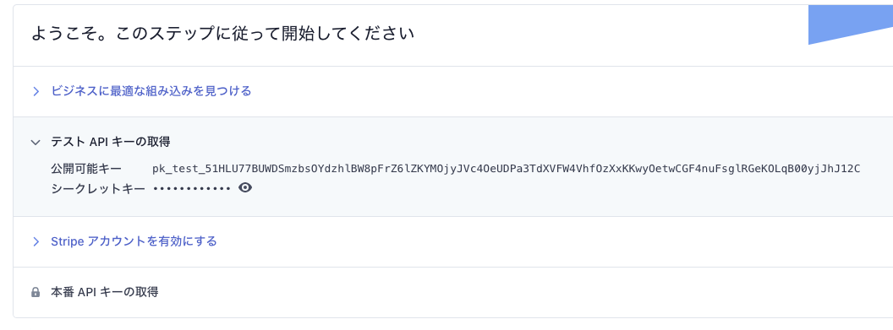

ちょっと前に[stripe のサブスク実装にFirebaseのExtensionがいい](https://nabettu.com/70975021a95f4f5b97e10a2666e37c77)っていう記事が流行りました。
自分自身はサブスク機能の実装以前にstripeそのものの実装でつまづいていた過去があり、stripeそのものの使い方を解説しておいた方がもっと流行ってくれるなと思ったので記事を書きました。
サンプルに[sadnessOjisanに給料を支払えるサービス](https://react-stripe-example.vercel.app/)を作ったので、このコードを元に解説していきます。

そこで決済するとこのように売り上げが見えるようになります。


テスト用のクレジットカード情報を載せていますのでそれを使って僕にじゃんじゃん給料を振り込んでください。
**実際のところ自分の市場価値がどれくらいか分かっていないので、それを知りたいっていう目的もあるのでリアルな金額を書き込んで欲しいです。**

Stripeを使っても決済周りは複雑だったりするのですが、

* 全体感の把握
* ライブラリの使い分け

を意識すればできるようになりましたので頑張りましょう。

※ 本記事ではAPIサーバーを使うパターンも紹介するため、サーバーを用意・デプロイしやすいNextJSで作っていますが、JSが動けばどのFWを使っても再現可能です。

## stripe は何か

[stripe](https://stripe.com/jp)はオンライン決済プラットフォームで、決済機能を簡単に自分のアプリケーションに組み込めるSaaSです。
決済を行うための各種エンドポイントが用意されており、そのAPIを利用して決済処理を組み込めます。

## クライアントで完結するのか

Stripeにはクライアントだけで完結するものとサーバーが必要なものがあります。
APIを提供するとのことでクライアントだけ書けばいいのかなと思っていたのですが、自前でサーバーを用意しないといけないパターンもあり混乱しました。

### ドロップインソリューション

クライアントだけで完結するパターンとして、[Stripe Checkout](https://stripe.com/jp/payments/checkout)とよばれるドロップインな方法があります。
これは決済画面そのものもStripeが用意しているため、これを用いるだけで決済機能を実装することができます。
決済の完了(成功・失敗)後のフローは、決済完了後にリダイレクトされるページでそのURLに含まれているトークンを利用することで進めることができます。
そのためこの方法を用いるだけで簡単に決済機能を実現できます。

ただ動的に金額を決めたり、在庫の金額管理を管理画面側でやる必要があったり、また決済画面のデザインを手元で持てなかったり諸々のデメリットはあるので、使いどころは限られるかもしれません。


### サーバーを使ったソリューション

そこでなるべく制御権を持ちたいのでサーバーを建てるソリューションで行います。
サーバーを使う場合のフローはこのようになります。


この方式のいいところは決済情報をサーバー→stripeに送り、それをクライアントサイドでユーザーに確認させて決済するため、決済内容を動的に変えられる点です。
サーバー->Stripeのやりとりで決済内容を決めるので、クライアントからの改竄もできないため安全です。
また決済ページは自前で構築できるので、カスタマイズ性も高くこのフローを使いたい時は使いたいです。
ただこのフローは初見だとよくわからないと思いますので、

* 決済フローの仕組みついて
* 決済ページの作り方

を解説したいと思います。

## サーバーを使った使い方について

### APIキーの発行などの下準備

公式のダッシュボードからキーを発行してください。



pkから始まるpublicなものと、skから始まるシークレットなものがあります。
シークレットの方は環境変数化するなりして見えないようにしておきましょう。

### コードの全体

```ts:title=pages/api/pay.tsx
import { NextApiRequest, NextApiResponse } from 'next'
import Stripe from 'stripe'

const stripe = new Stripe(process.env.STRIPE_SECRET, { apiVersion: '2020-08-27' })

export default async (req: NextApiRequest, res: NextApiResponse) => {
    const value = req.body.amount
    const paymentIntent = await stripe.paymentIntents.create({
        amount: value,
        currency: 'jpy',
        // Verify your integration in this guide by including this parameter
        metadata: { integration_check: 'accept_a_payment' },
    });
    res.status(200).json({ client_secret: paymentIntent.client_secret })
}
```

```tsx:title=pages/index.tsx
import * as React from 'react'
import { Elements, CardElement, useStripe, useElements } from '@stripe/react-stripe-js';
import { loadStripe } from '@stripe/stripe-js';

const Payment = () => {
    // public key
    const stripeApiKey = 'pk_test_51HLU77BUWDSmzbsOYdzhlBW8pFrZ6lZKYMOjyJVc4OeUDPa3TdXVFW4VhfOzXxKKwyOetwCGF4nuFsglRGeKOLqB00yjJhJ12C'
    const stripePromise = loadStripe(stripeApiKey);

    return <div style={{ padding: 24 }}>
        <h1>sadnessOjisan に年収を払ってくれる御社を探してます！</h1>
        <p>お金欲しい！！！！！！！！！！</p>
        <div style={{ maxWidth: 760 }}>
            <Elements stripe={stripePromise}>
                <CheckoutForm></CheckoutForm>
            </Elements></div>
    </div>
}

const CheckoutForm = () => {
    const stripe = useStripe();
    const elements = useElements();

    const handleSubmit = async (event) => {
        event.preventDefault();

        const res = await fetch('/api/pay', {
            method: 'post',
            body: JSON.stringify({ amount: event.target.amount.value }),
            // これ忘れるとNextJSのPost API Routesが動かない！
            headers: { "Content-Type": "application/json" },
        })
        const data = await res.json()
        const secret = data.client_secret

        const card = elements.getElement(CardElement);
        console.log('card', card);

        // Get a reference to a mounted CardElement. Elements knows how
        // to find your CardElement because there can only ever be one of
        // each type of element.
        const result = await stripe.confirmCardPayment(secret, {
            payment_method: { // FYI: payment_method (https://stripe.com/docs/api/payment_methods)
                /**
                 * Use Element instances to collect sensitive information in your payment forms. 
                 * For a high-level overview of what you can do with elements, 
                 * see the Stripe Elements for the web guide.
                 * To create an Element instance, use elements.create.
                 */
                card: card,
                billing_details: {
                    name: 'user name',
                },
            }
        });

        if (result.error) {
            /**
             * 決済の失敗
             * * api_connection_error
             * * api_error
             * * authentication_error
             * * card_error
             * * and so on...
             */
            console.log(result.error.message);
        } else {
            if (result.paymentIntent.status === 'succeeded') {
                /**
                 * 決済に成功したときの処理をこのブロックに書く
                 */
                alert('payment success!!')
            }
        }
    }

    return (
        <form onSubmit={handleSubmit}>
            <label style={{ marginTop: 10, marginBottom: 10, display: 'block' }}>年棒（日本円）</label>
            <input name="amount" defaultValue={10000000}></input>
            <label style={{ marginTop: 10, marginBottom: 10, display: 'block' }}>カード情報
            {/* A flexible single-line input that collects all necessary card details. */}
                <CardElement options={{
                    style: {
                        base: {
                            padding: 10,
                            backgroundColor: 'rgb(250, 255, 189)',
                            fontSize: '16px',
                            color: '#424770',
                            fontFamily: 'Open Sans, sans-serif',
                            letterSpacing: '0.025em',
                            '::placeholder': {
                                color: '#aab7c4',
                            },
                        },
                        invalid: {
                            color: '#c23d4b',
                        },
                    }, hidePostalCode: true
                }} />
            </label>
            {/* labelの中に入れるとコピーしづらいw */}
            <p>↓テスト用クレジットカード情報↓</p>
            <ul>
                <li>番号: 4111111111111111</li>
                <li>有効期限: 02/25 (現在より後ならいつでmお)</li>
                <li>CVC: 111 (3桁ならなんでも)</li>
            </ul>
            <button type="submit">
                支払う
      </button>
        </form >
    );
}

export default Payment
```

### 処理を作る

支払い情報をサーバーから作りそれを実行するための token を受け取り、そのtokenをstripeに送って決済を実行します。

#### stripe オブジェクトを作る

stripeを叩くメソッドを持ったオブジェクトを作ります。
それが `const stripePromise = loadStripe(stripeApiKey);` です。
このオブジェクトは context.providerなどで決済フォームへ渡して、決済に使います。

#### シークレットを吐き出すAPIサーバーを用意する

決済は、

* 決済内容を受け取ってそれを実行するシークレットを返す
* シークレットを使って実際に決済を行う

の2stepに分割できます。

`stripe.paymentIntents.create` を使ってsecretを吐き出します。
このとき stripe オブジェクトは `const stripe = new Stripe(process.env.SECRET, { apiVersion: '2020-08-27' })` として作られ、サーバー側に秘密鍵が必要になるので扱いには注意しましょう。
ここで作られるintentオブジェクトにsecretが含まれるのでこれをクライアントに返しましょう。
`json({ client_secret: paymentIntent.client_secret })`

#### シークレットを使ってstripeで決済する

confirmCardPaymentを呼び出し、secretを渡せば決済が行われます。

```tsx
const result = await stripe.confirmCardPayment(secret, {
            payment_method: {
                card: elements.getElement(CardElement),
                billing_details: {
                    name: 'user name',
                },
            }
        });
```


### UI を作る

CardElement というパーツが公式から配布されておりこれを利用します。

```tsx
<form onSubmit={handleSubmit}>
            <CardElement />
            <button type="submit" disabled={!stripe}>
                Pay
      </button>
        </form>
```

クレジットカードの情報のようなセンシティブなものの状態管理は全部Stripeのライブラリ側に任せます。

ただこのコンポーネントのスタイリングはかなり見づらいので拡張します。
CardElementはstyle optionオブジェクトを受け取ることができるのでそれにスタイルを格納して拡張できます。

```tsx
const CARD_OPTIONS = {
  iconStyle: 'solid',
  style: {
    base: {
      iconColor: '#c4f0ff',
      color: '#fff',
      fontWeight: 500,
      fontFamily: 'Roboto, Open Sans, Segoe UI, sans-serif',
      fontSize: '16px',
      fontSmoothing: 'antialiased',
      ':-webkit-autofill': {color: '#fce883'},
      '::placeholder': {color: '#87bbfd'},
    },
    invalid: {
      iconColor: '#ffc7ee',
      color: '#ffc7ee',
    },
  },
};

const CardField = ({onChange}) => (
  <fieldset className="FormGroup">
    <div className="FormRow">
      <CardElement options={CARD_OPTIONS} onChange={onChange} />
    </div>
  </fieldset>
);
```

またデフォルトでは郵便番号のフォームも表示されますが、多くの場合は不要だと思うので（あまり見ない気がする）、これも消します。
これを消すオプションも提供されています。

```tsx
<CardElement options={{hidePostalCode: true}} />
```

#### フォームのスタイリングがたりない

ただここのstyleで指定できるスタイルの範囲は限りがあります。
受け取れる型をみてみると、

```tsx
/**
   * CSS properties supported by Stripe.js.
   */
  interface StripeElementCSSProperties {
    backgroundColor?: string;
    color?: string;
    fontFamily?: string;
    fontSize?: string;
    fontSmoothing?: string;
    fontStyle?: string;
    fontVariant?: string;
    fontWeight?: string;
    iconColor?: string;
    lineHeight?: string;
    letterSpacing?: string;
    textAlign?: string;
    padding?: number;
    textDecoration?: string;
    textShadow?: string;
    textTransform?: string;
  }
```

とのことで例えばborderのスタイリングはできません。

#### 無理やりstripeのフォームにスタイルを当てる

このライブラリは .StripeElement というクラス名のスタイルを持っていることを利用して、無理やりstyle sheetからスタイルを当てることもできます。
同様の質問はstack overflowにも上がっており、同様の解決方法が提示されていました。

FYI: https://stackoverflow.com/questions/43974321/how-can-i-put-border-styling-with-react-stripe-elements-input-component

#### もっと細かく制御したい

もし Element が粒度大きすぎてもっと細かく制御したい場合はそれぞれを、CardNumberElement, CardExpiryElement, CardCvcElement として分割できます。
詳しくは [available-element-components](https://stripe.com/docs/stripe-js/react#available-element-components) を参照してください。

## まとめ

### 全体感を把握しよう

intent, payment method, confirm など複数のステップから決済がなりたちます。
それぞれのフェーズで何をやっているかを抑えておきましょう。

###  ライブラリの使い分けに注意しよう

このサンプルアプリでは3つのライブラリが登場しました。

* stripe
* @stripe/react-stripe-js
* @stripe/stripe-js

それぞれの役割を抑えておきましょう。

### リクエストの分割に注意しよう

Stripeはクライアントだけで完結するものと勘違いするかもしれません。
特に最近はそういったSaaS, PaaSも増えており混同しがちです。
Stripeはクライアント側から使える機能もありますが、サーバーから使った方が便利なのでサーバーから使う方法を覚えておきましょう。
そのときクライアントサイドだけで完結させる方法と混同しないように注意しましょう。
ちなみにクライアントサイドで完結するドロップインソリューションは、Checkout機能と呼ばれているものです。
いま見てる情報がCheckout機能なのかどうかを意識しておきましょう。

## ソースコード

https://github.com/sadnessOjisan/react-stripe-example