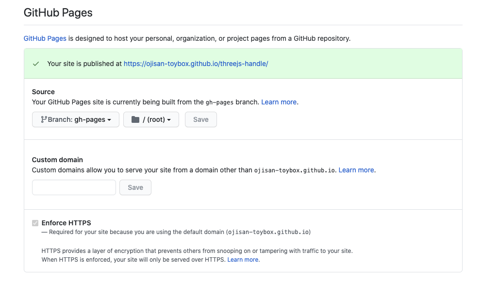

このブログで検証した結果の成果物のデプロイには GitHub Pages を多用しているのですが、それは GitHub Actions から行っており、そのフローがあまりにも便利なので紹介します。
GitHub Actions は GitHub Pages の守備範囲を大きく広げており、とても便利なものになりました。
この組み合わせの何が良いかと言うと **workflow file をレポジトリに含めておくだけで、ビルドが必要なアプリケーションでもホスティング環境が手に入ってしまう**ということです。

例えば webpack を使うプロジェクトであれば、このファイルを /.github/workflows/main.yml として定義するだけでデプロイが完了します。

```yml:title=/.github/workflows/main.yml
name: Deploy

on:
  push:
    branches:
      - "master"
jobs:
  build:
    runs-on: ubuntu-latest
    steps:
      - uses: actions/checkout@v1
      - name: Use Node.js
        uses: actions/setup-node@v1
        with:
          node-version: 12.x
      - name: npm install
        run: |
          npm install
      - name: Build App
        run: npx webpack
      - name: App Deploy
        uses: peaceiris/actions-gh-pages@v3
        with:
          github_token: ${{ secrets.GITHUB_TOKEN }}
          publish_dir: ./dist
```

## GitHub Pages とは

[GitHub Pages](https://docs.github.com/ja/github/working-with-github-pages/about-github-pages) は レポジトリにあるコードを使ってウェブサイトをホスティングできるサービスです。
GitHub の書くレポジトリにある setting 画面から設定できます。



ここでどのブランチのどのフォルダにある資材をデプロイするかを設定できます。
よくある慣習では gh-pages というブランチにあるものをデプロイします。
ここで設定したものは自動でデプロイされ、https://{user名}.github.io/{リポジトリ名}/ としてホスティングされます。

## GitHub Actions とは

[GitHub Actions](https://github.co.jp/features/actions)は GitHub 上でワークフローを作成できる機能です。
Actions を使えば Git 管理下にあるソースコードに対して CI/CD を行えます。
たとえば Webpack + TS でビルドする React プロジェクトでも、ビルド成果物をレポジトリに含めずとも Action 上で src からビルドして作り出しそれをデプロイすることができます。
そのワークフローは /.github/workflows/\*.yml として定義でき、その階層に yml を入れておくだけで良いのでとても便利です。

デプロイするワークフローの action は [actions-gh-pages](https://github.com/peaceiris/actions-gh-pages) が実装されており、**この action を使うことを設定ファイルに書くだけでデプロイのワークフローが完成**してしまいます。

## GitHub Actions から GitHub Pages へデプロイ

これらは組み合わせることができます。
それが先ほど紹介した actions-gh-pages であり、GitHub Actions の設定ファイル に `peaceiris/actions-gh-pages@v3` を使う設定を書くだけで良いです。

```yml
- name: App Deploy
  uses: peaceiris/actions-gh-pages@v3
  with:
    github_token: ${{ secrets.GITHUB_TOKEN }}
    publish_dir: ./dist
```

GITHUB_TOKEN は勝手に設定されているものなのでユーザー側での設定は不要です。
publish_dir ではどのディレクトリをデプロイするかを指定できます。
ここででは前の action が webpack 経由で dist ディレクトリに成果物を吐き出していることを想定しています。
前の action でビルドしているものがあればそれを指定することで GitHub Actions 上でビルドしたものをデプロイできます。

```yml
- name: Build App
  run: npx webpack
- name: App Deploy
  uses: peaceiris/actions-gh-pages@v3
  with:
    github_token: ${{ secrets.GITHUB_TOKEN }}
    publish_dir: ./dist
```

このとき actions-gh-pages の設定次第でデプロイ対象のブランチを指定できます。
GitHub Pages が見てるブランチを指定するようにしましょう。
ただここは gh-pages というブランチに揃えておくのが良いと筆者は考えています。
それは長らくの慣習であるし、この action の標準設定もそうなっているからです。
どうしてもブランチを変えたい場合は `publish_branch` という項目で編集できます。

## 組み合わせると何が嬉しいか

**明確に言えるメリットはビルド(トランスパイルやバンドル)が必要なアプリケーション をデプロイできるようになったと言うことです。**
これまではビルドが必要なアプリケーションをデプロイするためには、事前にビルドしたものを Git の管理下に含める必要があったのですが、GitHub Actions によってそのビルドを GitHub 側で行えるようになったため、ビルド成果物を含めないソースコードを Git で管理しておけばそのまま GitHub Pages にデプロイできるようになりました。

## 注意点

### サービスなどの提供用途では使いづらそう

1 レポジトリにつき 1 環境しか持てないので、dev/stg/prd といった環境を作ることはできません。
そのためサービスの提供として使うのは難しいでしょう。

### 自分のレポジトリしか提供できない

自分が作った organaization でも、それがプライベートリポジトリだと GitHub Pages を作ることができません。
（反対に言えば public であれば可能）
課金すれば可能ですが、組織ごとの課金が必要で、個人プランの課金では賄えないので注意しましょう。

反対に言えば**自分のレポジトリ配下にあるものはプライベートであっても公開できます。**

## まとめ

GitHub Actions と GitHub Pages の組み合わせで書いたコードに yaml を 1 つ加えるだけで簡単にデプロイできるようになりました。
とても便利なのでお試しあれ。
