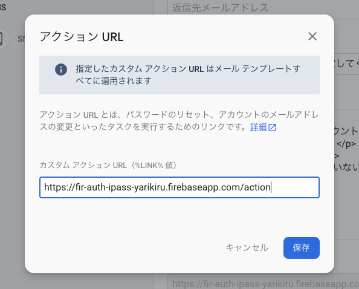

Firebase Authentification は OAuth 2.0 フローにのっとったログイン方法以外にも Email/Password を使ったログイン方法も提供しています。
このログイン形式をちゃんと使おうとすると、これまでは Provider が担ってくれていたパスワードの編集、パスワードの再発行、メールリンクでのログイン、アドレスの本人確認など様々なことを考慮しなければいけません。

この記事ではそういった考慮をした Email / Password ログインに挑戦します。
基本的には[manage-users](https://firebase.google.com/docs/auth/web/manage-users), [password-auth](https://firebase.google.com/docs/auth/web/password-auth), [email-link-auth](https://firebase.google.com/docs/auth/web/email-link-auth)といった公式ドキュメントを読むと IPASS ログインに必要なことは書いてあるのですが、**action URL を自前で用意するフローを採用するとそれらのドキュメントで賄えなくなり試行錯誤をたくさんしなければいけない場面が出てくる**ので、それに対する回避策をまとめてみました。

諸々の機能が試せるページはこちらに用意していますので、気になる機能の挙動とコードを見比べながら読むとイメージがつくかと思います。

サンプルページ: https://fir-auth-ipass-yarikiru.web.app/

ソースコード: https://github.com/ojisan-toybox/firebase-ipass-login


## Email と Password を使ったサインアップ

これは簡単ですね。
`createUserWithEmailAndPassword(email, password)`というメソッドでサインアップできます。
ただ **password が 6 文字未満だと弱すぎるパスワードということで弾かれる**ので、クライアント側でも同様のバリデーションを入れておくなどの配慮をしてあげるとよいでしょう。

```tsx
<form
  onSubmit={async e => {
    e.preventDefault()
    const target = e.target as any
    const email = target.email.value as string
    const password = target.password.value as string
    const auth = firebase.auth()
    try {
      await auth.createUserWithEmailAndPassword(email, password)
    } catch (e) {
      // FIXME: カスタムエラーオブジェクトを作ってinstance of で絞り込もう
      alert(JSON.stringify(e.message))
    }
  }}
  style={{ display: "flex", flexDirection: "column" }}
>
  <label style={{ display: "block" }}>email</label>
  <input name="email" type="email"></input>
  <label style={{ display: "block" }}>
    password(Password should be at least 6 characters)
  </label>
  <input name="password" type="password"></input>
  <label style={{ display: "block" }}>confirm</label>
  {/* firebase関係ないから書いていないけどここでpasswordのconfirmを挟むようにしよう! */}
  <button type="submit">submit</button>
</form>
```

## Email と Password を使ったサインイン

これも簡単ですね。
`signInWithEmailAndPassword(email, password)` とすることでサインインができます。

```tsx
<form
  onSubmit={e => {
    e.preventDefault()
    const target = e.target as any
    const email = target.email.value as string
    const password = target.password.value as string
    firebase
      .auth()
      .signInWithEmailAndPassword(email, password)
      .then(d => {
        console.log("success > d", d)
      })
      .catch(e => {
        alert(e.message)
      })
  }}
  style={{ display: "flex", flexDirection: "column" }}
>
  <label style={{ display: "block" }}>email</label>
  <input name="email" type="email"></input>
  <label style={{ display: "block" }}>password</label>
  <input name="password" type="password"></input>
  <button type="submit">submit</button>
</form>
```

## サインイン情報の表示

サインインしたあとの情報は firebase auth のライブラリが持つ user オブジェクト を通してアクセスできます。

```tsx
<div>
  <h2>## ユーザー状態</h2>
  <p>メールアドレス: {user.email}</p>
  <p>
    メールアドレス確認状態:
    {user.emailVerified ? "メール認証済み" : "アドレス未認証"}
  </p>
</div>
```

他にもどのようなプロパティが生えているかは[ドキュメント](https://firebase.google.com/docs/reference/js/firebase.User)をご確認ください。

ここが null のときは ログインしていないか、SDK の初期化が済んでいないかのどちらかですので、分岐を入れてあげましょう。

サンプル実装では user 情報を取得するために react-firebase-hooks/auth を利用しています。

```tsx
const Session = () => {
  const [user] = useAuthState(firebase.auth());

  return (
    <div>
      {!user && (
        <section>
  ...
}
```

## メールアドレスが本人のものか確認する

登録されたメールアドレスが本人のものかどうかを確認しましょう。
実は**今の状態はそのメールアドレスの所有者でなくても登録できてしまう仕組みになっています。**
そのため先にメールアドレスをとるといった嫌がらせ的な攻撃をうける可能性もあったり、実装次第では他のログインフローでログインしたユーザーのアカウントをのっとったりもできてしまいます。

そこでその登録されたメールアドレスにメールを送ってそこへ送られたリンクをクリックさせることによる本人確認を行いましょう。
そのリンクを送る処理が `user.sendEmailVerification();` です。

これを実行するとユーザーにメールが届きます。


それをクリックすると本人確認が完了します。


## メールリンクでログインする

パスワードでのログインではなく、メールリンクでのログインフローを用意したいこともあると思います。
例えば Slack などはマジックリンクログインが実装されていたり、そういったフローをしたいといった要望をうけるかもしれません。
Firebase にはそれを実現する機能があります。
それが `sendSignInLinkToEmail(email, actionCodeSettings)` です。

コードの全容は下の通りですが、action といった概念やログインフローに関する注意があるので解説します。

```tsx
<form
  onSubmit={e => {
    e.preventDefault()
    const target = e.target as any
    const email = target.email.value as string
    const actionCodeSettings = {
      // Firebase Consoleで予め許可リストに登録したリダイレクトURLを指定する
      url: REDIRECT_URL,
      // 今は必ず true.
      handleCodeInApp: true,
    }
    firebase
      .auth()
      .sendSignInLinkToEmail(email, actionCodeSettings)
      .then(function () {
        window.localStorage.setItem("emailForSignIn", email)
      })
      .catch(function (error) {
        // Some error occurred, you can inspect the code: error.code
      })
  }}
  style={{ display: "flex", flexDirection: "column" }}
>
  <label style={{ display: "block" }}>email</label>
  <input name="email" type="email"></input>
  <button type="submit">submit</button>
</form>
```

### actionCodeSettings とはなにか

sendSignInLinkToEmail をしたときに actionCodeSettings を渡しています。
これは状態・継続 URL を渡す仕組みで、メールで送られれるリンクに何かしらの状態を埋め込めます。
何かしらのリンク先からの復旧先 URL やアプリへのディープリンクを埋め込めます。
またこの設定を渡さなくてもトークンや action の識別子はデフォルトで渡されます。

actionCodeSettings の取りうる値は[メールアクションで状態 / 続行 URL を渡す](https://firebase.google.com/docs/auth/web/passing-state-in-email-actions?hl=ja#passing_statecontinue_url_in_email_actions)を参照してください。
埋め込まれるトークンについては後述のパスワード再設定の節で説明します。（これは大きな混乱ポイントになると思うのですが、Firebase ではメールリンク認証、パスワード再設定などの行為はアクションという単位で抽象化されており、そのアクションを捌く仕組みに同一の機能を用います。）

### メールリンククリック後のログインフローとそのハンドリング

アクションリンクを踏むとトークンを持った状態で継続 URL へと自動でリダイレクトします。
そのリダイレクト先は通常フローでユーザーが来た場合と、メールから来た場合があるのでそれを識別したいです。
それは URL を parse すればわかることなのですが、`auth().isSignInWithEmailLink(url)` というメソッドを実行するだけでも識別できるようになっています。
ここが true であればメールリンクログインをしていくことになるので後続処理を書いていきましょう。
その中でメールリンクログインのために `signInWithEmailLink(email, emailLink)` の email が欲しい(emaillink は window.location.href で手に入る)ので、これを入手します。

```tsx
if (firebase.auth().isSignInWithEmailLink(window.location.href)) {
            // 同一デバイスからのログインであれば事前にセットしたemailを使ってログインできる
            let email = window.localStorage.getItem("emailForSignIn");
            if (!email) {
                // session fixationを防ぐためにメアドの入力必要
                email = window.prompt("Please provide your email for confirmation");
            }
...
```

### email はローカルストレージに持っておくと便利

そしてあらかじめメールを送るときに `window.localStorage.setItem("emailForSignIn", email)` をしていたと思うので、このアドレスを今取り出します。
もしアドレスがない場合に備えて`window.prompt` でその場で入力させることもできます。

```tsx
let email = window.localStorage.getItem("emailForSignIn")
if (!email) {
  // session fixationを防ぐためにメアドの入力必要
  email = window.prompt("Please provide your email for confirmation")
}
```

## ユーザー情報を変更する

メールアドレスとパスワードの変更を試みます。


### メールアドレスの変更

`user.updateEmail(email)` とすれば変更できます。

このとき、新しいアドレスに対して確認メールが流れてきますが、認証機能の内側ではメールアドレスの変更はされています。
そのため変更後に画面を更新するとメールアドレスが変わっていることを確認できるはずです。
ただし、一度メールアドレス確認をしていてもメールアドレスを変更すると確認したか(`user.emailVerified`)は false に戻るので注意しましょう。
これは変更時に送られてきたリンクをクリックして確認すると true に戻せます。

### パスワードの変更

`user.updatePassword(newPassword)` とすることで変更できます。
こちらは確認メールなどもなく、送信するだけで自由に変更できます。

## パスワード忘れへの対応

認証機能を備えるとなると、パスワード忘れのユーザーに対する対応もしなければいけません。
OAuth 2.0 フローにのっとった認証・認可であればこの手続きを provider に丸投げできるのですが、自サイトでパスワード認証をする場合は逃れられないので頑張りましょう。

### ドロップインな設定

`firebase.auth().sendPasswordResetEmail(user.email);` を呼び出すことで、指定したメールアドレスにパスワードの再設定画面を送ることができます。
送られてきたメールを開くとこのような画面が表示されます。


ここで新しいパスワードを入力すると変更ができます。

### カスタマイズした設定画面を使う

ただ上記のやり方は 2 つ問題があります。

- デザインが統一されない
- password の confirm ができない

そこで、再設定画面をカスタマイズします。

再設定画面が決められた画面で表示されたのはその URL が表示されるようにメールに埋め込まれていたからです。
この URL は **アクション URL** と呼ばれ、

- パスワードのリセット
- アカウントのアドレス変更
- マジックリンクログイン

を実行するためのリンクです。
これは Firebase Authentification の設定画面から編集することができます。
そこで独自に作る action ページを /action とすることにして、ここに /action と書きます。



こうすることで自作した /action ページに誘導できます。

次にその action ページを実装します。

先にコードの全容を書くとこうなります。

```tsx:title=src/pages/action.tsx
import { h } from "preact"
import { useState, useEffect } from "preact/hooks"
import firebase from "firebase"

// URLから指定したクエリのバリューを抜き出す関数
const getParameterByName = (name: string) => {
  const url = window.location.href
  name = name.replace(/[\[\]]/g, "\\$&")
  var regex = new RegExp("[?&]" + name + "(=([^&#]*)|&|#|$)"),
    results = regex.exec(url)
  if (!results) return null
  if (!results[2]) return ""
  return decodeURIComponent(results[2].replace(/\+/g, " "))
}

/**
 * 諸々のactionを行うためのページ
 */
const Action = () => {
  const [state, setState] = useState<{
    mode: string
    actionCode: string
  } | null>(null)
  useEffect(() => {
    const mode = getParameterByName("mode")
    const actionCode = getParameterByName("oobCode")
    if (!mode || !actionCode) {
      throw new Error("invalid url")
    }
    setState({
      mode,
      actionCode,
    })
  }, [])

  return (
    <div>
      {state?.mode === "resetPassword" ? (
        <div>
          <form
            onSubmit={e => {
              e.preventDefault()
              const target = e.target as any
              const newPassword = target.password.value as string
              firebase
                .auth()
                .verifyPasswordResetCode(state.actionCode)
                .then(function (email) {
                  firebase
                    .auth()
                    .confirmPasswordReset(state.actionCode, newPassword)
                    .then(async resp => {
                      // ログインページか継続ページに戻すか、このページで直接ログインさせる
                      await firebase
                        .auth()
                        .signInWithEmailAndPassword(email, newPassword)
                      window.location.href = "/"
                      alert("success")
                    })
                    .catch(function (error) {
                      // エラーの原因としてはトークンの有効期限切れ、もしくは弱すぎるパスワード
                      alert(error.message)
                    })
                })
            }}
          >
            <label style={{ display: "block" }}>new password</label>
            <input name="password" type="password"></input>
            <button type="submit">submit</button>
          </form>
        </div>
      ) : state?.mode === "signIn" ? (
        "now singining..."
      ) : (
        <div>error: modeが選択されていない不正なURLです。</div>
      )}
    </div>
  )
}

export default Action
```


たくさんの処理を行っていますが、各ステップを一つずつ解説していきます。

### URL から必要な情報を集める

設定した action URL には mode, oobCode, apiKey, continueUrl が付随してきます。

#### mode

アクション URL はいろんなアクションを受け取る共通な URL です。
メールアドレス変更、パスワード変更、マジックリンクログインでも使われます。
そのためどのアクションから遷移したのかを知れるように URL に mode というのが埋め込まれます。
例えば、

- resetPassword
- signIn
- verifyEmail

が該当します。
いまはパスワード変更なので、`resetPassword` というのが埋め込まれているはずです。

#### oobCode

いわゆるワンタイムパスワードです。
このトークンを使うとパスワードの変更ができるようになり、一度使うと使えなくなるものです。

#### continueUrl

継続 URL と呼ばれるもので、リンク送信時に action setting を渡しているとこの機能が使えます。
これはパスワード変更後にどのページへ戻すかを表しています。
継続 URL と呼ばれているのはパスワードの変更が必ずしも決まった箇所から行われるとは限らないからです。
例えば何か重要な設定をしているときにパスワードが古いことを促してそこで変えさせるといったフローを取らせたいときに、変更後にもともと行っていた作業に戻すときに使えます。

### token を確かめる

[verifyPasswordResetCode](https://firebase.google.com/docs/reference/js/firebase.auth.Auth#verifypasswordresetcode)というメソッドでその token が正しいかを検証します。
もし正しければその token が送られたメールアドレスを得られます。

### 新パスワードを設定する

トークンと設定したいパスワード文字列を `confirmPasswordReset(code, password)` に渡すと新しいパスワードをセットできます。
その後後続処理に続きますが、ここでトークンが間違っていたり、パスワードが弱い(6 文字未満)だと catch 節に入るので注意しましょう。

### 新パスワードでログインする

パスワードの変更に成功しても、まだログインには成功していないので元のページに戻ってもログインはされておらずそこでまたパスワードを打ち込む二度手間になります。
そこでこのページでログインしてから元のページに戻すと体験も良いでしょう。
`verifyPasswordResetCode` の結果としてメールアドレスが取得できているはずなので、`signInWithEmailAndPassword(email, newPassword)`を呼び出してログインします。
ログイン成功後は 元のページへとリダイレクトなりで戻しましょう。

## 実際に作るとハマるであろう落とし穴

### action link は一つしか設定できない

パスワード再設定画面をカスタムしたいとして独自設定画面を作り、そこを action URL としてメールテンプレートを書き換えると、メールリンクログインのアクション URL も書き換わってしまいます。
設定画面にも「カスタムアクション URL はメールテンプレート全てに適用されます」と書かれています。


そのためパスワード再設定画面をカスタムするならば必然的にメールリンクログインの画面もカスタムする必要があります。

今回の場合だとメールリンクログインをする処理を /action に移す必要があります。

```tsx:title=src/pages/action
// magic link を使ったログインフロー
useEffect(() => {
  if (firebase.auth().isSignInWithEmailLink(window.location.href)) {
    // 同一デバイスからのログインであれば事前にセットしたemailを使ってログインできる
    let email = window.localStorage.getItem("emailForSignIn")
    if (!email) {
      // session fixationを防ぐためにメアドの入力必要
      email = window.prompt("Please provide your email for confirmation")
    }
    if (!email) {
      throw new Error("email should be")
    }
    // The client SDK will parse the code from the link for you.
    firebase
      .auth()
      .signInWithEmailLink(email, window.location.href)
      .then(function (result) {
        // 認証成功時の処理
        window.localStorage.removeItem("emailForSignIn")
        window.location.href = "/"
      })
      .catch(function (error) {
        alert("すでに利用されているワンタイムパスワードです。")
        console.error(error)
      })
  }
}, [])
```

```tsx
import { h, render } from "preact"
import { Router, Route } from "preact-router"
import Session from "./pages/session"
import Action from "./pages/action"

const Main = () => {
  return (
    <Router>
      <Route path="/" component={Session}></Route>
      <Route path="/action" component={Action}></Route>
    </Router>
  )
}

render(<Main></Main>, document.body)
```

### アクション画面のカスタマイズが必要になる

ビルトインなアクション画面を使えば actionURL 周りの制御が不要になるのですが、おそらくこの画面は受入れらないはずです。


自社で作ったものと明らかにテイストが異なり怪しさが生まれるので、パスワードのようなものを入れさせるにはユーザーも心理的な戸惑いがあるはずです。
そのため、アクション画面は自作する必要があります。

そのとき自作したアクション画面ではこれまでデフォルト actionURL である /\_\_/auth/action にあった処理がやってくれていた処理を自分で書く必要があります。
それが actionCode(OTP)の検証とそれを使った各種処理の実行です。
**しかしアクション URL は一つしか作られないのでその各種処理は一つの URL で切り替えながら実行する必要があります。**

その処理とは、

- メールリンクログイン
- パスワードの再設定
- メールアドレスの本人確認

です。

実際こういう分岐を書いています。

```tsx
<div>
  {state?.mode === "resetPassword" ? (
    <div>...</div>
  ) : state?.mode === "signIn" ? (
    "now singining..."
  ) : state?.mode === "verifyEmail" ? (
    "now changing..."
  ) : (
    <div>error: modeが選択されていない不正なURLです。</div>
  )}
</div>
```

#### メールアドレスの本人確認

このような処理を書きます。

```tsx
const actionCode = getParameterByName("oobCode")
if (!actionCode) {
  throw new Error("invalid url")
}
firebase
  .auth()
  .applyActionCode(actionCode)
  .then(() => {
    alert("success apply action code")
    window.location.href = "/"
  })
```

そして、`applyActionCode` がミソです。
これを呼び出すことで actionCode でメールアドレスを confirm できます。

action URL をカスタマイズすると公式の [send_a_user_a_verification_email](https://firebase.google.com/docs/auth/web/manage-users?hl=ja#send_a_user_a_verification_email)が使えなくなるので注意しましょう。
applyActionCode はその回避策です。

#### パスワードの再設定

このような処理を書く必要があります。

```tsx
<form
  onSubmit={e => {
    e.preventDefault()
    const target = e.target as any
    const newPassword = target.password.value as string
    firebase
      .auth()
      .verifyPasswordResetCode(state.actionCode)
      .then(function (email) {
        firebase
          .auth()
          .confirmPasswordReset(state.actionCode, newPassword)
          .then(async resp => {
            // ログインページか継続ページに戻すか、このページで直接ログインさせる
            await firebase.auth().signInWithEmailAndPassword(email, newPassword)
            window.location.href = "/"
            alert("success")
          })
          .catch(function (error) {
            // エラーの原因としてはトークンの有効期限切れ、もしくは弱すぎるパスワード
            alert(error.message)
          })
      })
  }}
>
  <label style={{ display: "block" }}>new password</label>
  <input name="password" type="password"></input>
  <button type="submit">submit</button>
</form>
```

この処理を実行するためには actionCode を URL を抜き取る必要があるので、この submit hundler を実行する前に URL から actionCode を抽出しておきます。

```tsx
const getParameterByName = (name: string) => {
    const url = window.location.href;
    name = name.replace(/[\[\]]/g, "\\$&");
    var regex = new RegExp("[?&]" + name + "(=([^&#]*)|&|#|$)"),
        results = regex.exec(url);
    if (!results) return null;
    if (!results[2]) return "";
    return decodeURIComponent(results[2].replace(/\+/g, " "));
};

...

useEffect(() => {
        const mode = getParameterByName("mode");
        const actionCode = getParameterByName("oobCode");
        if (!mode || !actionCode) {
            throw new Error("invalid url");
        }
        setState({
            mode,
            actionCode,
        });
    }, []);
```

#### メールリンクログイン

このような処理を書く必要があります。

```tsx
if (firebase.auth().isSignInWithEmailLink(window.location.href)) {
  // 同一デバイスからのログインであれば事前にセットしたemailを使ってログインできる
  let email = window.localStorage.getItem("emailForSignIn")
  if (!email) {
    // session fixationを防ぐためにメアドの入力必要
    email = window.prompt("Please provide your email for confirmation")
  }
  if (!email) {
    throw new Error("email should be")
  }
  firebase
    .auth()
    .signInWithEmailLink(email, window.location.href)
    .then(function (result) {
      // 認証成功時の処理
      window.localStorage.removeItem("emailForSignIn")
      window.location.href = "/"
    })
    .catch(function (error) {
      alert("すでに利用されているワンタイムパスワードです。")
      console.error(error)
    })
}
```

token から自分でメールアドレスを取り出してそれを使って signInWithEmailLink を呼び出す必要があります。
これも action URL を編集することで、その action URL のページで実装しなければいけなくなった処理です。
ちなみに action URL を編集していなければ ActionCodeSettings オブジェクトの URL に書いた URL でその処理を実装することになります。

### セッションハイジャックへの対策

メールリンクを使ったログインにおいて

```tsx
let email = window.localStorage.getItem("emailForSignIn")
if (!email) {
  // session fixationを防ぐためにメアドの入力必要
  email = window.prompt("Please provide your email for confirmation")
}
```

といった処理を書いています。
これは セッションハイジャックへの対策で URL にメールアドレスを含められないため、後続の`signInWithEmailLink(email, window.location.href)` に必要なメールアドレスを求めています。
ここで localstorage が登場しているのは、ユーザーにメールアドレスを入力させるのは面倒で不自然でもあることから、自動でメールアドレスを取得させるためです。
そのため事前に localstorage にメールアドレスを格納している必要はあり、それはメールリンクを送信するメソッドで行っています。

```tsx
<form
  onSubmit={e => {
    e.preventDefault()
    const target = e.target as any
    const email = target.email.value as string
    const actionCodeSettings = {
      // Firebase Consoleで予め許可リストに登録した
      // リダイレクトURLを指定することで継続URLとして使える
      //（とはいえ今回はサインインページが決まっているので
      // このリンクはactionページでは使わない。）
      url: REDIRECT_URL,
    }
    firebase
      .auth()
      .sendSignInLinkToEmail(email, actionCodeSettings)
      .then(function () {
        window.localStorage.setItem("emailForSignIn", email)
        alert("メールを送信しました")
      })
      .catch(function (error) {
        // Some error occurred, you can inspect the code: error.code
        alert(error.message)
      })
  }}
  style={{ display: "flex", flexDirection: "column" }}
>
  <label style={{ display: "block" }}>email</label>
  <input name="email" type="email"></input>
  <button type="submit">submit</button>
</form>
```

## おわりに

いかがでしたか。
IPASS ログインの実装は Firebase を使ってもちゃんとやりきるとなると意外と大変なのではないでしょうか。
それでも SDK の使い方さえ覚えたら便利な機能が手に入るので頑張って覚えていきましょう。
僕もまだまだ知らない API がたくさんあるのでもっともっと試して経験を積んでいこうと思います！

## 成果物

ソースコード: https://github.com/ojisan-toybox/firebase-ipass-login

実装: https://fir-auth-ipass-yarikiru.web.app/
