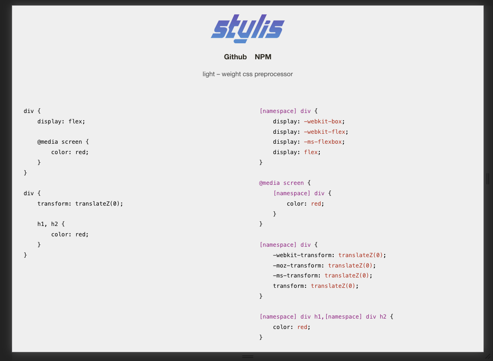

stylis を調べたのでそのメモ書きです。
stylis は styled-components の内部で使われており、styled-components の調査をしてる中で挙動を知る必要が出てきたという理由で読んでいました。

## stylis って何？

[stylis](https://stylis.js.org/) は light – weight css preprocessor です。



上の画像の例にある通り、css preprocessor としてベンダープレフィックスの付与や、SCSS 記法を CSS に変換ができます。

## 内部の構造

```js:title=src/index.js
export * from "./src/Enum.js"
export * from "./src/Utility.js"
export * from "./src/Parser.js"
export * from "./src/Prefixer.js"
export * from "./src/Tokenizer.js"
export * from "./src/Serializer.js"
export * from "./src/Middleware.js"
```

各モジュールの export されてる関数は全て export されています。
そしてほぼ全部の関数が export されているので好き放題に呼び出せるのですが、tokenizer, parser などは内部でしか使わないものなので、ライブラリの利用者が使いそうな関数だけピックアップします。

### compile

stylis は SCSS 記法で書かれた文字列を CSS に変換するライブラリですが、その変換処理そのものです。

```ts
import { compile } from "stylis"

const css = `
div {
    .hoge {
        color: red;
    }
    & .hoge {
        color: blue;
    }
}
`

console.log(compile(css))
```

これを実行するとどうなるでしょうか。
CSS が返ってくるかと思いきや違いました。

```bash
$ node index.js
[
  {
    value: 'div',
    root: null,
    parent: null,
    type: 'rule',
    props: [ 'div' ],
    children: [],
    line: 2,
    column: 6,
    length: 0,
    return: ''
  },
  {
    value: '.hoge',
    root: null,
    parent: {
      value: 'div',
      root: null,
      parent: null,
      type: 'rule',
      props: [Array],
      children: [],
      line: 2,
      column: 6,
      length: 0,
      return: ''
    },
    type: 'rule',
    props: [ 'div .hoge' ],
    children: [ [Object] ],
    line: 3,
    column: 12,
    length: 0,
    return: ''
  },
  {
    value: '&\f .hoge',
    root: null,
    parent: {
      value: 'div',
      root: null,
      parent: null,
      type: 'rule',
      props: [Array],
      children: [],
      line: 2,
      column: 6,
      length: 0,
      return: ''
    },
    type: 'rule',
    props: [ 'div .hoge' ],
    children: [ [Object] ],
    line: 6,
    column: 14,
    length: 0,
    return: ''
  }
]
```

AST っぽいものが帰ってきます。
compile って AST を何らかの generator に入れた最終結果が返ってくるイメージだったのですが、そうはならなかったので個人的にはちょっと詰まりました。

### stringify と serialize

そこで AST を CSS の文字列に変換する処理を挟みます。
その役割を持つのが stringify と serialize です。

公式にも下記のような例があり、これによって CSS を出力できるようです。

```js
serialize(compile(css), stringify)
```

つまり AST => CSS を担う鍵は serialize と stringify にありそうです。
そこでコードを読んでみたり実行したりしてみましょう。

```js:title=src/Serializer.js
export function stringify(element, index, children, callback) {
  switch (element.type) {
    case IMPORT:
    case DECLARATION:
      return (element.return = element.return || element.value)
    case COMMENT:
      return ""
    case RULESET:
      element.value = element.props.join(",")
  }

  return strlen((children = serialize(element.children, callback)))
    ? (element.return = element.value + "{" + children + "}")
    : ""
}

export function serialize(children, callback) {
  var output = ""
  var length = sizeof(children)

  for (var i = 0; i < length; i++)
    output += callback(children[i], i, children, callback) || ""

  return output
}
```

となっています。

ここで注意したいことは、`serialize(compile(css), stringify)` としたとき、serialize の中でコールバックとして stringify が実行されますが、 stringify は内部で serialize を stringify をコールバック関数に指定した状態で呼び出しており、 **serialize と stringify が serialize の for ループが停止するまで呼び出され続けます。**

そして serialize は stringify が繰り返し実行された結果をまとめあげる役割をになっており、stringify は 渡された AST Node の種類に応じて CSS を組み立てます。
組み立てにおける注視すべきポイントは

```js
return strlen((children = serialize(element.children, callback)))
  ? (element.return = element.value + "{" + children + "}")
  : ""
```

です。

上の例で言うと、`element.value` に CSS セレクタ、 `children` に CSS の値を書けると良さそうですね。

#### element.props

CSS セレクタは AST の props に含まれています。

最初に紹介した例を実行した AST はこうです。

```js
;[
  {
    value: "div",
    root: null,
    parent: null,
    type: "rule",
    props: ["div"],
    children: [],
    line: 2,
    column: 6,
    length: 0,
    return: "",
  },
  {
    value: ".hoge",
    root: null,
    parent: {
      value: "div",
      root: null,
      parent: null,
      type: "rule",
      props: [Array],
      children: [],
      line: 2,
      column: 6,
      length: 0,
      return: "",
    },
    type: "rule",
    props: ["div .hoge"],
    children: [[Object]],
    line: 3,
    column: 12,
    length: 0,
    return: "",
  },
  {
    value: "&\f .hoge",
    root: null,
    parent: {
      value: "div",
      root: null,
      parent: null,
      type: "rule",
      props: [Array],
      children: [],
      line: 2,
      column: 6,
      length: 0,
      return: "",
    },
    type: "rule",
    props: ["div .hoge"],
    children: [[Object]],
    line: 6,
    column: 14,
    length: 0,
    return: "",
  },
]
```

props にそれらしきものがあることが確認できるはずです。

そして

```js
case RULESET:
      element.value = element.props.join(",")
```

として取り出せており、セレクタとして設定できることもわかると思います。
しかし、element.value は 本当に selector だけが含まれるのでしょうか？
switch の他の節には

```js
case IMPORT:
    case DECLARATION:
      return (element.return = element.return || element.value)
```

とあり、value は他の用途もありそうです。

#### elemen.value

そこで AST をもっと掘ってみましょう。
今はただ console.log しただけなので Array や Object が潰れていますが、その中身も見てみましょう。
debugger で inspect した部分を下記に貼り付けておきます。

debugger について詳しくは https://blog.ojisan.io/how-to-read-js#debugger-%E3%81%A8-node-inspect 参照.

```js
> console.log(astnode[1].children)
< [
<   {
<     value: 'color:red;',
<     root: {
<       value: '.hoge',
<       root: null,
<       parent: [Object],
<       type: 'rule',
<       props: [Array],
<       children: [Circular],
<       line: 3,
<       column: 12,
<       length: 0,
<       return: ''
<     },
<     parent: {
<       value: '.hoge',
<       root: null,
<       parent: [Object],
<       type: 'rule',
<       props: [Array],
<       children: [Circular],
<       line: 3,
<       column: 12,
<       length: 0,
<       return: ''
<     },
<     type: 'decl',
<     props: 'color',
<     children: 'red',
<     line: 4,
<     column: 20,
<     length: 5,
<     return: ''
<   }
< ]
```

どうやら type に decl を持った CSS の value(ここでは `color:red` )を持っています。
つまり、value はセレクタ専用といい切れず、 `(element.return = element.value + "{" + children + "}")` において value に セレクタが入る保証はこの情報だけでは今のところありません。

ただ読み進めていくと、相互呼び出しの停止条件を満たすことで value にセレクタ以外が入ることがないことを確認できます。
type に decl を持った CSS の children は 値(文字)なので、次の `serialize(element.children, callback))` 呼び出しの `element.children` は undefined となり、

```js
export function serialize(children, callback) {
  var output = ""
  var length = sizeof(children)

  for (var i = 0; i < length; i++)
    output += callback(children[i], i, children, callback) || ""

  return output
}
```

がそのまま `output = ""` が出力されることとなり、

```js
return strlen((children = serialize(element.children, callback)))
  ? (element.return = element.value + "{" + children + "}")
  : ""
```

の三項演算子の false 節に入り相互呼び出しが停止するため、type が rule でなければ true 節に入らず、value に セレクタ以外が入ることはありません。
（もっとも実装からそう読み取れるだけであって、その保証がある訳ではないです。）

なので、この処理で CSS の形の文字列 を組み立てていると言えます。

## 結論

`serialize(compile(css), stringify)` で CSS を出力できる。

```ts
import { compile } from "stylis"

const css = `
div {
    .hoge {
        color: red;
    }
    & .hoge {
        color: blue;
    }
}
`

console.log(serialize(compile(css), stringify))
```

の結果は、

```sh
$ node index.js
div .hoge{color:red;}div .hoge{color:blue;}
```

です。

## ソースコード

https://github.com/ojisan-toybox/exec-stylis

index.js にいろいろ SCSS を食わせて実行するとイメージが着くと思います。
