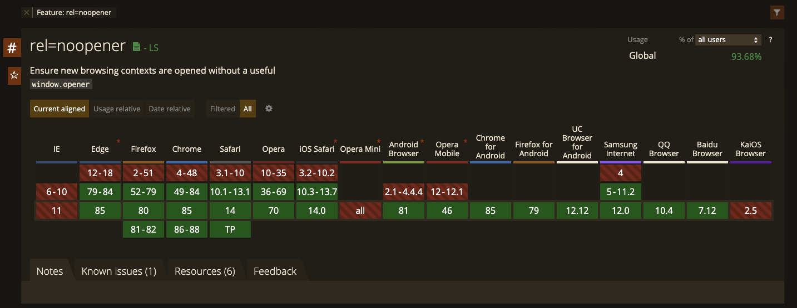
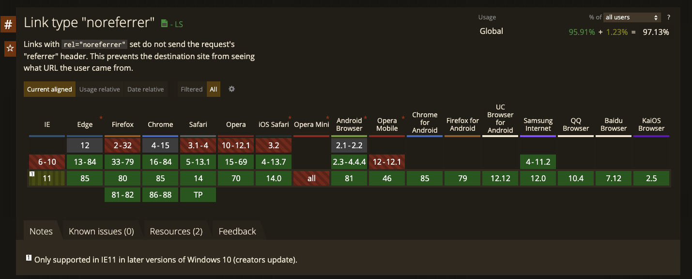

a タグに`target=_blank`をつける時はとりあえず rel 属性に `rel="noopener noreferrer"` と書いておけばいいと思ったのですが、どうして noreferrer だけだとだめなんだろうと気になったので調べてみました。

## 結論

noreferrer だけでも問題はないが、ちょーーーーーーーーーーーーーーーっとだけ問題がある。

## 前回までのあらすじ！

### どうして noopener noreferrer が必要なのか

a タグ には target=\_blank という設定があり、別タブで開かせることができます。

```jsx
<a href="http://example.com" target="_blank">
  アンカーリンク
</a>
```

そこには `rel="noopener noreferrer"` を付けようという話があり、

```jsx
<a href="http://example.com" target="_blank" rel="noopener noreferrer">
  アンカーリンク
</a>
```

とすることが推奨されます。

どうしてでしょうか。

#### 脆弱性対応

良い説明がたくさんあるのでそれらを引用します。

> target="\_blank"で開かれたページは、元のページを window.opener オブジェクトとして持つので、リンク先のページから window.opener.location = "danger site url" のように元ページを操作することが出来てしまうようです。rel="noopener" を使うことで、新しく開いたページから window.opener オブジェクトを使って元ページの操作をできなくできるようです。no・opener ですね。

FYI: https://chaika.hatenablog.com/entry/2018/12/06/110000

#### パフォーマンス

> target="\_blank"で開かれたページは、元ページと JavaScript が同じプロセス・スレッドで動作するようです。なので、target="\_blank"で開かれたページに負荷の高い JavaScript が実行されていると、元ページのパフォーマンス低下など影響がある可能性があるようです。

FYI: https://chaika.hatenablog.com/entry/2018/12/06/110000

#### 古いブラウザへの対応

これらの対応は noopener を使うことで実現できます。
しかし、noopener は古いブラウザ(例えば Chronium 以前の Edge(~79)など)ではサポートされていません。
そこで noreferrer です。
これはリファラを送らないようにする指定であり、**さらに noopener と同様の効果も持ちます。**

そして noreferrer の方がサポートしているブラウザは広いため、noopener を使えない場合のフォールバックとして利用が推奨されています。





### ESLint Plugin の警告が変わっていた

ところでこの rel がついていないコード

```jsx
<a href="http://example.com" target="_blank">
  アンカーリンク
</a>
```

をそのまま JSX に書いて eslint(+[eslint-plugin-react](https://github.com/yannickcr/eslint-plugin-react)) にかけると、

```sh
error  Using target="_blank" without rel="noreferrer" is a security risk:
see https://html.spec.whatwg.org/multipage/links.html#link-type-noopener
react/jsx-no-target-blank
```

のような警告が出ます。

なので、

```jsx
<a href="http://example.com" target="_blank" rel="noreferrer">
  アンカーリンク
</a>
```

とすることで回避できます。

が、ここの警告が昔は

```sh
Using target="_blank" without rel="noopener noreferrer" is a security risk:
see https://mathiasbynens.github.io/rel-noopener/
```

でした。
このときは `rel="noreferrer"` ではなく `rel="noopener noreferrer"` をつけようという話でした。

なのにいつの間にか `rel="noreferrer"` でよくなっているみたいです。

FYI: https://github.com/yannickcr/eslint-plugin-react/commit/b9d2eb58b89eec8645c135e12d0a592951499abf (PR)

どうしてでしょうか？

### noreferrer だけを外したい動機

一方でアフィリエイトサイトに使われる CMS のフォーラムで noreferrer を調べてみると、「noreferrer を外す方法を紹介します・教えてください」といった投稿を目にします。
ESLint の世界では noreferrer を付けようぜという温度感になっていたのにどうしてなんだと思っていくつか読んでいくと、どうやら referrer が取れない = アフィリエイト報酬が計算されない といった問題が起きる場合があるようでした。
そしてそれらは 「noopener があるからセキュリティ的には大丈夫だよ」とのことでプラグインやスクリプトが配布されていたりもして、noreferrer を外したい要望もあることがわかりました。

## パターンの整理

ここまでの流れを整理すると、

- セキュリティへの対応として noopener をつける必要がある
- noopener と同様の効果は noreferer にもある
- noreferer のほうがブラウザのサポートが広い
- ESLint は noreferrer だけを推奨するようになった（両方つけることを非推奨にしているわけではないことに注意）
- 一方で アフィリエイト業界では noopener だけをつけたい要望が上がっている

といったことがわかりました。

ESLint と アフィリエイト の動向が反対なのが気になりますね。
結局何を指定すれば良いのでしょうか。
そこでそれらの組み合わせについて整理していきましょう。

### noopener のみ

[noopener](https://html.spec.whatwg.org/multipage/links.html#link-type-noopener) は spec によると

> The keyword indicates that any newly created top-level browsing context which results from following the hyperlink will not be an auxiliary browsing context. E.g., its window.opener attribute will be null.

とあり、開き元の情報を見えなくする働きを持っています。
つまりこれを使うことで、リンク先のページから元ページの操作を防げます。
ただし、 noreferrer に比べてブラウザのサポートは狭いです。

### noreferrer のみ

[noreferrer](https://html.spec.whatwg.org/multipage/links.html#link-type-noreferrer) は

> It indicates that no referrer information is to be leaked when following the link and also implies the noopener keyword behavior under the same conditions.

とあり、referrer を送らないだけでなく、noopener と同じ効果も持ちます。
つまりこれを使うことで、リンク先のページから元ページの操作も防げます。
そして noopener より広いサポート範囲を持ちます。

ただし referrer が送られなくなるので、トラッキングツールや広告 SDK に影響があるかもしれません。
おそらくアフィリエイトツールが気にしているのはこの辺のことです。
個人的には利用者のセキュリティを第一に考えて欲しい気持ちもありますが、アフィリエイトツールの要件次第では noreferrer と比較してサポート範囲は狭まりますが、せめて noopener だけは付けましょう。

ただし noreferrer でも計測できるものも多いとは思うのでまずは外さずに使ってみると良いでしょう。

### noopener noreferrer の双方

一番安全なパターンです。
しかし

- noreferrer のみでも noopener と同じ効果を得られる
- noreferrer の方がブラウザの守備範囲が広い

はずなのに、双方をつける理由って一体何なのでしょうか。

noopener もつけるメリットとしては先ほど紹介した ESLint が双方を書くような警告をやめた際の PR/Issue に書かれていました。
noreferrer だけがついていると別タブで開かなくなる不具合がある Firefox 33–35 にも対応できるとのことです。

FYI: https://github.com/yannickcr/eslint-plugin-react/issues/2022

(PR には Firefox 33–35 removes opener with rel="noreferrer" とあるのですが、実際 FireFox のリリースノートや IssueTracker をみる限りだと referrer が送られてしまうバグの修正とあり、本当に opener が消えてるのかは確証を持てていないです. )

FYI: https://bugzilla.mozilla.org/show_bug.cgi?id=1031264

ただし Firefox のバージョンは自動で上がるため考慮せず何も rel の指定がなければ noreferrer のみをつけるように警告はするが noopener がついていることに対して警告しないようになったようです。

上記のドキュメントは ESLint のプラグインの話なので、本当はまた違ったメリットもあるのかもしれません。
もしご存知でしたらどなたか教えてください。

と、両方つけるメリットも少しはありそうと書いたのですがそもそも spec には

```sh
<a href="..." rel="noreferrer" target="_blank"> has the same behavior as
<a href="..." rel="noreferrer noopener" target="_blank">.
```

FYI: https://html.spec.whatwg.org/multipage/links.html#link-type-noreferrer

とあるので、noopener をつけなくても問題はなさそうです。
付けても微々たるバンドルサイズ以外の損はなく、救えるブラウザがほんのちょっと増えるという理由で僕は付けていますが・・・
