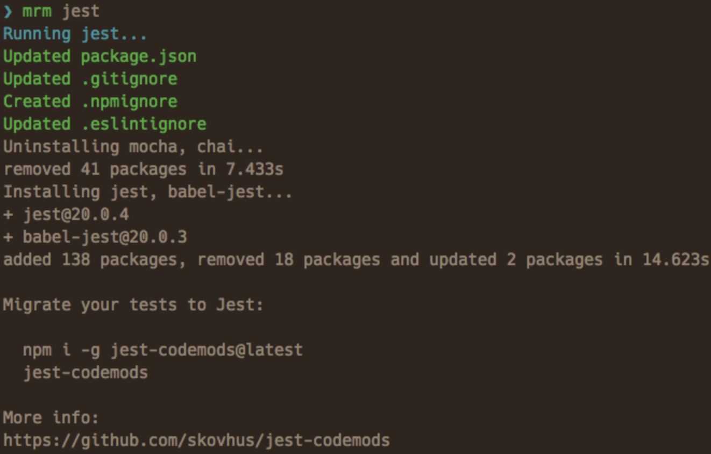

[lint-staged](https://github.com/okonet/lint-staged) の設定をしているとき公式の Installation and setup に

```sh
npx mrm lint-staged
```

とあったのですが、ここは `npm i -D lint-staged` でもよいはずなので、この `mrm` が何なのかを調べてみました。

## mrm とは

[mrm](https://github.com/sapegin/mrm) の公式曰く、

> Command line tool to help you keep configuration (package.json, .gitignore, .eslintrc, etc.) of your open source projects in sync.

とのことで、拙訳すると「いろんな設定ファイルをよしなにしてくれるコマンドラインツール」です。

例えば何かしらのツールを入れるときは package.json に依存を追加するだけでなく、そのツールが要求する設定ファイルを追加したりする必要がありますが、その設定をまるっとまとめて行ってくれるツールです。

この jest の例が分かりやすいでしょう。



実際、`npx mrm jest` を実行すると、

package.json は

```json:title=package.json
{
  ...,
  "scripts": {
    "test:jest": "jest",
    "test:watch": "jest --watch",
    "test:coverage": "jest --coverage",
    "test": "npm run test:jest --"
  },
  "jest": {
    "testPathIgnorePatterns": [
      "/node_modules/",
      "<rootDir>/lib/"
    ],
    "transform": {
      "^.+\\.tsx?$": "<rootDir>/node_modules/ts-jest/preprocessor.js"
    },
    "testRegex": "(/__tests__/.*|(\\.|/)(test|spec))\\.(jsx?|tsx?)$",
    "moduleFileExtensions": [
      "ts",
      "tsx",
      "js",
      "jsx",
      "json"
    ],
    "snapshotSerializers": [
      "enzyme-to-json/serializer"
    ],
    "setupFiles": [
      "./test/jestsetup.js"
    ]
  }
}

```

が追加されます。
`jest:`以降はよく jest.config.json に書いているものです。

.gitignore は

```sh:title=.gitignore
coverage/
```

が追加されます。

そして新しく .eslintignore が作成され

```sh:title=.eslintignore
types/graphql-types.d.ts
coverage/*
```

と設定されます。

そして enzyme の設定が test/jestsetup.js にされます。

```js:title=test/jestsetup.js
import Enzyme from "enzyme"
import Adapter from "enzyme-adapter-react-16"

Enzyme.configure({ adapter: new Adapter() })
```

この設定はおそらく React の既存プロジェクトで実行したからこのような設定になっているのだと思います。

## mrm がサポートしているツール

公式曰く、

- codecov
- contributing
- dependabot
- editorconfig
- eslint
- gitignore
- jest
- license
- lint-staged
- package
- prettier
- readme
- semantic-release
- styleguidist
- stylelint
- travis
- typescript

とのことです。
どうやら NodeJS ツールチェインに関わるものというわけではないようです。

## mrm の挙動を変えたい

mrm はそれぞれ設定されたタスクを行っているだけです。
そのためそのタスクを定義すれば自分の好きな風に挙動を変えることができます。
mrm-core というライブラリがそのタスクのエンジンとなっており、これを使ってタスクファイルを作り、それを ~/.mrm 配下などに置けば実行できます。

詳しくはこちらのガイドをご覧ください。

FYI: https://mrm.js.org/docs/making-tasks

ユーザーとしてはタスクを定義することはないとは思うので（なぜならタスクを定義するならそのタスクを直に実行した方が早いから）、ライブラリ開発者や再利用可能な設定を配布したい人が知るべき機能なのだと思い、自分は読んでいません。

## まとめ

mrm は いろんな設定ファイルをよしなにしてくれるコマンドラインツールです。

```sh
npx mrm lint-staged
```

は、mrm というツールで lint-staged をインストールすると同時に設定していたというわけでした。
