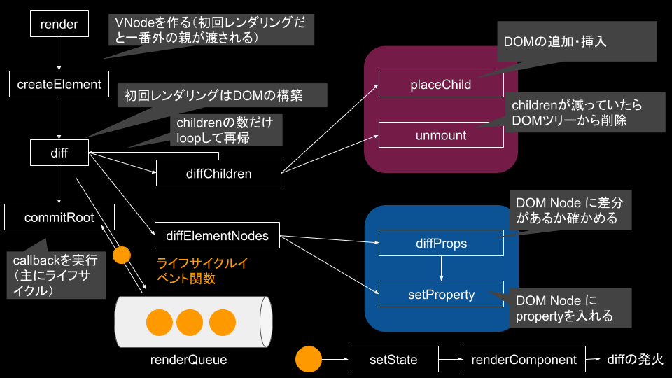
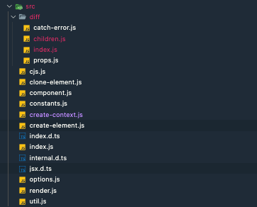

preact なんとなく理解した記念ブログです。
もともと React を読むつもりが挫折したので慣れるために preact を読みました。
おかげで仮想 DOM の悲鳴が聞こえるようになりました。

## preact とは

React の軽量版・サブセットです。

公式では

> Fast 3kB React alternative with the same modern API. Components & Virtual DOM.

と説明されています。

(p)react には、

- 状態を持て、書き換えも可能である
- 状態を書き換えるとそれに対応して HTML が書き換わる

という特徴があります。
それがどのようにして実現されているのかを見ていきましょう。

## 前提となる知識

preact のコードリーディングを進める上では VNode というオブジェクトに慣れる必要があります。
これは JSX を仮想 DOM に変換したものですので、仮想 DOM とは何かという復習から始めましょう。

### 仮想 DOM とは何か

仮想 DOM はこれまでブラウザが持っていたリアル DOM ツリーを、JavaScript のオブジェクトとして表現したものです。

たとえば、

```html
<div>
  <p>hello world</p>
</div>
```

を

```js
{
  type: 'div',
  childrens: [{
    type: "p",
    childrens: [
      {type: null, childrens: ["hello world"]}
    ]
  }]
}
```

のように表現したものです。

このように表現すると、部分的に変更を適用しやすくなり、本物の DOM を操作するときの計算コスト（HTML の解析、DOM ツリーの再構築など）を節約することができます。

仮想 DOM については、[＠bc_rikko](https://twitter.com/bc_rikko)さんの [自作フレームワークをつくって学ぶ 仮想 DOM 実践入門](https://kuroeveryday.blogspot.com/2018/11/how-to-create-virtual-dom-framework.html) にとてもわかりやすくチュートリアル形式でまとまっていますのでこちらを見ると良いでしょう。

### jsx と h 関数

preact もいわゆる仮想 DOM 系のライブラリです。
そのデータ構造は VNode と呼ばれるオブジェクトに従いますが、これを作る関数が h 関数 です。

```js
import { h, render } from "https://unpkg.com/preact?module"

const app = h("h1", null, "Hello World!")

render(app, document.body)
```

これはいわば React でいうところの `createElement` です。
この h という名前は [virtual-dom](https://github.com/Matt-Esch/virtual-dom) というライブラリから来ているらしいです。

ただ h は見辛い点もあるので、そこで使われるのが お馴染みの jsx です。
先ほどのコードは、

```jsx
import { h, render } from "https://unpkg.com/preact?module"

const app = <h1>Hello World!</h1>

render(app, document.body)
```

としても書けます。

そして h 関数の引数は `h(type, props, ...children)` となっており、props を持たせることもできます。
そのため例えば、

```js
h("div", { id: "foo" }, "Hello!")
```

は、

```jsx
<div id="foo">Hello!</div>
```

と同じです。

この挙動は JSX のネストがあっても、イベントハンドラを設定しても同様に動作します。
諸々の実験は[こちら](https://github.com/ojisan-toybox/preact-h-babel)でできるようにしましたので、jsx と h 関数の関係がよくわからない方は試してみてください。

preact の内部では jsx は h 関数に変換されて VNode 形式でデータをやりとりされるので、コードリーディングする上では直接見ることはありません。
しかし props や children の描画や探索をライブラリが行う以上、それらの動きをトレースするためには元々はどういう構造のコードだったかを考えないと読み進めれないと思います。
なので VNode, h, jsx の変換に慣れる必要があると思いますので、自信がない方はもろもろ実験して感覚を掴んでください。

## preact の全体感

コードリーディングを始める前に preact の全体感を解説します。

### ビルド

[microbundle](https://github.com/developit/microbundle) というツールで行われています。
これは rollup のラッパーで作者が preact のビルド設定をデフォルトに設定したものです。
package.json のフィールドをみてビルドをしてくれるため、zero config でビルドできます。

```json:title=package.json
{
  "name": "foo", // your package name
  "source": "src/foo.js", // your source code
  "main": "dist/foo.js", // where to generate the CommonJS/Node bundle
  "module": "dist/foo.module.js", // where to generate the ESM bundle
  "unpkg": "dist/foo.umd.js", // where to generate the UMD bundle (also aliased as "umd:main")
  "scripts": {
    "build": "microbundle", // compiles "source" to "main"/"module"/"unpkg"
    "dev": "microbundle watch" // re-build when source files change
  }
}
```

上の例だと、source から main へビルドしてくれます。

### 言語

preact は JavaScript で実装されています。
TypeScript ではありません。
ただし JSDoc に型情報があり、型を出力しています。

```js
/**
 * Render a Preact virtual node into a DOM element
 * @param {import('./index').ComponentChild} vnode The virtual node to render
 * @param {import('./internal').PreactElement} parentDom The DOM element to
 * render into
 * @param {Element | Text} [replaceNode] Optional: Attempt to re-use an
 * existing DOM tree rooted at `replaceNode`
 */
export function render(vnode, parentDom, replaceNode) {}
```

そのためライブラリの利用者側では型の補完を効かせながら開発できますが、preact 自体には型はついていません。
内部 API は JSDoc の型も間違っていたりもします。

### DOM の情報を持ち回るデータ構造

要素は VNode という形式で回されます。
これは preact 内部での要素表現です。
これを引数にとったり出力したりなどします。

VNode の定義はこうです。

```ts
// preact というname space で定義されている VNode. ユーザー向け.
interface VNode<P = {}> {
  type: ComponentType<P> | string
  props: P & { children: ComponentChildren }
  key: Key
  ref?: Ref<any> | null
  startTime?: number
  endTime?: number
}

// 内部APIで使う VNode
export interface VNode<P = {}> extends preact.VNode<P> {
  type: string | ComponentFactory<P>
  props: P & { children: preact.ComponentChildren }
  _children: Array<VNode<any>> | null
  _parent: VNode | null
  _depth: number | null
  _dom: PreactElement | null
  _nextDom: PreactElement | null
  _component: Component | null
  _hydrating: boolean | null
  constructor: undefined
  _original?: VNode | null
}
```

簡単な例をあげると、

```jsx
<div id="foo">Hello!</div>
```

は、

```js
h("div", { id: "foo" }, "Hello!")
```

となり、h が返す VNode は

```js
const vnode = {
  type: "div"
  props: { id: "foo" }
  _children:  [{...}]
  _parent:  null
  _depth:  null
  _dom:  null
  _nextDom:  null
  _component: null
  _hydrating:  null
  constructor: undefined
}
```

となります。

### preact の仕組み

さて、裏側に VNode がいることがわかれば preact が何をしているのかを理解することは難しくありません。

preact が行っていることは、DOM を VNode で表現しなにかしらの状態変化が起きた時に新旧の VNode に差分があった箇所を検知してその箇所の DOM を書き換えることです。
その新旧 VNode の比較は diff 関数と呼ばれるもので行われます。
この diff 関数は VNode の子要素の差分を調べる関数 diffChildren を呼び出しており、この diffChildren も diff を呼び出すことで、**DOM ツリーに対して再帰的に diff を取っていき、差分があった場所の DOM を書き換えます**。

### 呼出し関係

関数単位で考えるとこのような呼び出し関係になります。



意外とシンプルですね。（デフォルメした図なので・・・）

ファイル自体も多くはなく、大まかな挙動は単純なものです。



## コードリーディング

render から読み進めていきましょう。
目標は、

```jsx
import { h, render, Component } from "preact"

class App extends Component {
  state = {
    age: 19,
  }

  componentDidMount() {
    this.setState({ age: 12 })
  }

  render() {
    return h("h1", null, `${this.state.age}才`)
  }
}

render(h(App, null, null), document.body)
```

がどうして動作するかを理解することです。

つまり、

- state を書き換える方法
- state が書き換わった時に再レンダリングがされること

がどのように実現されているかをみていきます。

### 注意

hydrate, context, ref など上記の目標に関わらないところは説明の都合上読み飛ばします。

### render を起点にする

`index.js` から `render` が export されているのでそこからコードを追っていきます。

render の実装はこうなっています。

```js:title=render.js
import { EMPTY_OBJ, EMPTY_ARR } from "./constants"
import { commitRoot, diff } from "./diff/index"
import { createElement, Fragment } from "./create-element"
import options from "./options"

const IS_HYDRATE = EMPTY_OBJ

export function render(vnode, parentDom, replaceNode) {
  if (options._root) options._root(vnode, parentDom)
  let isHydrating = replaceNode === IS_HYDRATE
  let oldVNode = isHydrating
    ? null
    : (replaceNode && replaceNode._children) || parentDom._children
  vnode = createElement(Fragment, null, [vnode])
  let commitQueue = []
  diff(
    parentDom,
    ((isHydrating ? parentDom : replaceNode || parentDom)._children = vnode),
    oldVNode || EMPTY_OBJ,
    EMPTY_OBJ,
    parentDom.ownerSVGElement !== undefined,
    replaceNode && !isHydrating
      ? [replaceNode]
      : oldVNode
      ? null
      : parentDom.childNodes.length
      ? EMPTY_ARR.slice.call(parentDom.childNodes)
      : null,
    commitQueue,
    replaceNode || EMPTY_OBJ,
    isHydrating
  )

  commitRoot(commitQueue, vnode)
}
```

まず、render はユーザーからは

```js
render(<App />, document.getElement("body"))
```

などのようにして呼ばれます。

render ではこの `<App />` が

```js
vnode = createElement(Fragment, null, [vnode])
```

を通して VNode という形式に変換されます。

そして

```js
diff(
  parentDom,
  ((isHydrating ? parentDom : replaceNode || parentDom)._children = vnode),
  oldVNode || EMPTY_OBJ,
  EMPTY_OBJ,
  parentDom.ownerSVGElement !== undefined,
  replaceNode && !isHydrating
    ? [replaceNode]
    : oldVNode
    ? null
    : parentDom.childNodes.length
    ? EMPTY_ARR.slice.call(parentDom.childNodes)
    : null,
  commitQueue,
  replaceNode || EMPTY_OBJ,
  isHydrating
)
```

で、parentDOM に対して VNode から DOM のツリーを作ります。
この diff 自体は ツリーを作るための関数ではないのですが、差分更新を行った結果ツリーができあがるので初回の render 呼び出しで呼ばれます。

三項演算子や OR でごちゃごちゃしていますが、hydrate がされない初回レンダリングだと、

```js
diff(
  parentDom,
  vnode,
  EMPTY_OBJ,
  EMPTY_OBJ,
  EMPTY_ARR.slice.call(parentDom.childNodes),
  commitQueue,
  EMPTY_OBJ
)
```

として呼ばれます。

そして最後に

```js
commitRoot(commitQueue, vnode)
```

にて、HTML ができたあとに各コンポーネントが持っていた componentDidMount などの関数を実行します。
それらの処理は diff を取る時に commitQueue に詰め込まれているので、それを commitRoot に渡します。

render 自体は diff と commitRoot という関数を呼び出すことが大きな仕事で複雑なものはありません。

### diff で差分を比較していく

diff 関数は次のようになっています。
この関数が根幹の起点になるためかなり長いです。

全体像は[こちら](https://github.com/preactjs/preact/blob/master/src/diff/index.js)ですが、長すぎて追いにくいので大事なところ以外削って、分岐の条件などをみやすくします。
これから読んでいくコードはこのような関数です。

```js:title=diff/index.js
export function diff(
  parentDom,
  newVNode,
  oldVNode,
  globalContext,
  isSvg,
  excessDomChildren,
  commitQueue,
  oldDom,
  isHydrating
) {
  newType = newVNode.type

  try {
    // labelという機能.
    outer: if (typeof newType == "function") {
      // 渡されたVNodeのtypeがコンポーネントの場合
      let c, isNew, oldProps, oldState, snapshot, clearProcessingException
      let newProps = newVNode.props

      if (oldVNode._component) {
        c = newVNode._component = oldVNode._component
        clearProcessingException = c._processingException = c._pendingError
      } else {
        // 渡されたVNodeのtypeがfunctionであればComponentFactoryなので分岐
        // ClassComponent じゃなくて FC の可能性もあるのでその分岐
        if ("prototype" in newType && newType.prototype.render) {
          newVNode._component = c = new newType(newProps, componentContext)
        } else {
          newVNode._component = c = new Component(newProps, componentContext)
          c.constructor = newType
          c.render = doRender
        }

        // 作ったコンポーネントに値を詰め込む
        c.props = newProps
        if (!c.state) c.state = {}
        isNew = c._dirty = true
        c._renderCallbacks = []
      } // この 処理により必ず _nextState はなんらかの値を持つ。c.stateの初期値は {}

      if (c._nextState == null) {
        c._nextState = c.state
      }

      oldProps = c.props
      oldState = c.state

      if (isNew) {
        // 新しく渡ってきたコンポーネントの場合(VNodeがfunctionでないとき)
        if (
          newType.getDerivedStateFromProps == null &&
          c.componentWillMount != null
        ) {
          c.componentWillMount()
        }

        if (c.componentDidMount != null) {
          c._renderCallbacks.push(c.componentDidMount)
        }
      } else {
        // コンポーネントを新しく作らなかった場合(VNodeがfunctionのとき)
        if (
          newType.getDerivedStateFromProps == null &&
          newProps !== oldProps &&
          c.componentWillReceiveProps != null
        ) {
          c.componentWillReceiveProps(newProps, componentContext)
        }

        // 再レンダリング抑制
        if (
          (!c._force &&
            c.shouldComponentUpdate != null &&
            c.shouldComponentUpdate(
              newProps,
              c._nextState,
              componentContext
            ) === false) ||
          newVNode._original === oldVNode._original
        ) {
          if (c._renderCallbacks.length) {
            commitQueue.push(c)
          }

          reorderChildren(newVNode, oldDom, parentDom)
          break outer
        }

        if (c.componentWillUpdate != null) {
          c.componentWillUpdate(newProps, c._nextState, componentContext)
        }

        if (c.componentDidUpdate != null) {
          c._renderCallbacks.push(() => {
            c.componentDidUpdate(oldProps, oldState, snapshot)
          })
        }
      }

      let renderResult = isTopLevelFragment ? tmp.props.children : tmp

      // 子コンポーネントの差分を取る
      diffChildren(
        parentDom,
        Array.isArray(renderResult) ? renderResult : [renderResult],
        newVNode,
        oldVNode,
        globalContext,
        isSvg,
        excessDomChildren,
        commitQueue,
        oldDom,
        isHydrating
      )
    } else if (
      excessDomChildren == null &&
      newVNode._original === oldVNode._original
    ) {
      // typeがfunctionでない && 過剰なchildren(excessDomChildren) がない場合
      newVNode._children = oldVNode._children
      newVNode._dom = oldVNode._dom
    } else {
      // typeがfunctionでない && 過剰なchildren(excessDomChildren) がある場合
      newVNode._dom = diffElementNodes(
        oldVNode._dom,
        newVNode,
        oldVNode,
        globalContext,
        isSvg,
        excessDomChildren,
        commitQueue,
        isHydrating
      )
    }
  } catch (e) {
    // 元に戻す
    newVNode._original = null
    if (isHydrating || excessDomChildren != null) {
      newVNode._dom = oldDom
      newVNode._hydrating = !!isHydrating
      excessDomChildren[excessDomChildren.indexOf(oldDom)] = null
    }
    options._catchError(e, newVNode, oldVNode)
  }

  return newVNode._dom
}
```

では、これらを 1 つ 1 つ見ていきましょう。

#### newType で更新したいコンポーネントのタイプを知る

まず最初に

```js
newType = newVNode.type
```

が定義されます。
この newVNode は差分を取りたい VNode です。

そして VNode は `"div"` や 関数(コンポーネント)を type に持てるのでした。
そのためこの `newType` は `string | ComponentFactory<P>;` を取りうります。
ComponentFactory は JavaScript の世界では function ですが、これは ClassComponent, FunctionComponent であることを示します。

実際 preact の上では

```ts
export type ComponentFactory<P> =
  | preact.ComponentClass<P>
  | FunctionalComponent<P>
```

という型定義になっています。

このタイプによって処理が大きく変わるので最初にフラグとして持っています。

#### 見慣れない label 構文

タイプによる分岐の説明に入る前に

```js
outer: if (typeof newType == 'function') {
```

についてみましょう。

JS でこんな JSON みたいなことを生で書けましたっけ？
これは **label という機能**で、break したときにここに戻すみたいなことができます。

FYI: https://developer.mozilla.org/ja/docs/Web/JavaScript/Reference/Statements/label

goto みたいものなので普段はあまり使われてはいません。

#### diff を取る対象による分岐

その分岐は

```js:title=diff/index.js
if (typeof newType == "function") {
  // no op
} else if (
  excessDomChildren == null &&
  newVNode._original === oldVNode._original
) {
  // no op
} else {
  // no op
}
```

となっており、`typeof newType == "function"` がとても重要です。

これは **diff を取る対象がコンポーネントかどうか** という意味です。

#### diff を取る対象がコンポーネントの場合

VNode にある情報を使ってコンポーネントを作ります。

```js:title=diff/index.js
if (oldVNode._component) {
  c = newVNode._component = oldVNode._component
  clearProcessingException = c._processingException = c._pendingError
} else {
  // 渡されたVNodeのtypeがfunctionであればComponentFactoryなので分岐
  // ClassComponent じゃなくて FC の可能性もあるのでその分岐
  if ("prototype" in newType && newType.prototype.render) {
    newVNode._component = c = new newType(newProps, componentContext)
  } else {
    newVNode._component = c = new Component(newProps, componentContext)
    c.constructor = newType
    c.render = doRender
  }

  // 作ったコンポーネントに値を詰め込む
  c.props = newProps
  if (!c.state) c.state = {}
  c.context = componentContext
  c._globalContext = globalContext
  isNew = c._dirty = true
  c._renderCallbacks = []
} // この 処理により必ず _nextState はなんらかの値を持つ。c.stateの初期値は {}

if (c._nextState == null) {
  c._nextState = c.state
}
```

もしすでにコンポーネントがあるのならばそれを使いまわし、なければ新しく作ります。
たとえば

```js
c = newVNode._component = oldVNode._component
```

にあるように、すでに VNode がコンポーネントを持っていたらそれを使います。
これは**state の変更など同一コンポーネントにおける差分更新をしたいとき**にお世話になります。

新しく作る場合、その新しい VNode の type がコンポーネントかどうかに着目します。
もしそれがコンポーネントならばその constructor を呼び出して使いまわし、そうでなければ Component のインスタンスを作ります。

```js:title=diff/index.js
if ("prototype" in newType && newType.prototype.render) {
  newVNode._component = c = new newType(newProps, componentContext)
} else {
  newVNode._component = c = new Component(newProps, componentContext)
  c.constructor = newType
  c.render = doRender
}
```

diff は render 以外からも呼ばれるので、newType にコンポーネントクラスのコンストラクタが渡されている場合もあるためです。

もし 新しく Component インスタンスを作った場合は必要な値を初期化します。

```js:title=diff/index.js
// 作ったコンポーネントに値を詰め込む
c.props = newProps
if (!c.state) c.state = {}
isNew = c._dirty = true
c._renderCallbacks = []
```

そして、コンポーネントを使いまわした場合 & 新しく作った場合の共通の初期化を行います。

```js:title=diff/index.js
// この 処理により必ず _nextState はなんらかの値を持つ。c.stateの初期値は {}
if (c._nextState == null) {
  c._nextState = c.state
}

oldProps = c.props
oldState = c.state
```

#### 一部ライフサイクルイベントの実行

次にライフサイクルの実行を行います。
ライフサイクルイベントには componentWillReceiveProps など差分更新のタイミングで実行するものもあります。
反対に componentDidMount は diff を取った後に実行するのでここでは実行されません。

```js:title=diff/index.js
if (isNew) {
  // 新しく渡ってきたコンポーネントの場合(VNodeがfunctionでないとき)
  if (
    newType.getDerivedStateFromProps == null &&
    c.componentWillMount != null
  ) {
    c.componentWillMount()
  }

  if (c.componentDidMount != null) {
    c._renderCallbacks.push(c.componentDidMount)
  }
} else {
  // コンポーネントを新しく作らなかった場合(VNodeがfunctionのとき)
  if (
    newType.getDerivedStateFromProps == null &&
    newProps !== oldProps &&
    c.componentWillReceiveProps != null
  ) {
    c.componentWillReceiveProps(newProps, componentContext)
  }

  // 再レンダリング抑制
  if (
    (!c._force &&
      c.shouldComponentUpdate != null &&
      c.shouldComponentUpdate(newProps, c._nextState, componentContext) ===
        false) ||
    newVNode._original === oldVNode._original
  ) {
    if (c._renderCallbacks.length) {
      commitQueue.push(c)
    }

    reorderChildren(newVNode, oldDom, parentDom)
    break outer
  }

  if (c.componentWillUpdate != null) {
    c.componentWillUpdate(newProps, c._nextState, componentContext)
  }

  if (c.componentDidUpdate != null) {
    c._renderCallbacks.push(() => {
      c.componentDidUpdate(oldProps, oldState, snapshot)
    })
  }
}
```

isNew つまりコンポーネントが新規作成ならば、`componentWillMount` と `componentDidMount` を実行します。

ここで注目すべきは `componentDidMount` です。即時実行せずに renderQueue に詰め込んでいます。
これはマウントされた後に実行したいからです。
くわしくは commitRoot の説明でみていきましょう。

このコードブロックで面白いのは、`shouldComponentUpdate` です。
パフォチューの文脈で

- 再レンダリングするとその子もされる
- 再レンダリング抑制すればその子のレンダリングを止められる

という話を聞いたことはないでしょうか。

その挙動をまさしく再現しているのが次のコードです。

```js:title=diff/index.js
// 再レンダリング抑制
if (
  (!c._force &&
    c.shouldComponentUpdate != null &&
    c.shouldComponentUpdate(newProps, c._nextState, componentContext) ===
      false) ||
  newVNode._original === oldVNode._original
) {
  if (c._renderCallbacks.length) {
    commitQueue.push(c)
  }

  reorderChildren(newVNode, oldDom, parentDom)
  break outer
}
```

`shouldComponentUpdate` があればこの時点で break しています。
このブロックの先には diffChildren があるのですが、それを実行しなくて済んでいるわけです。
つまり子の再レンダリングが抑制できています。

#### 子要素の差分を取る

そして大事な処理が

```js
diffChildren(
  parentDom,
  Array.isArray(renderResult) ? renderResult : [renderResult],
  newVNode,
  oldVNode,
  globalContext,
  isSvg,
  excessDomChildren,
  commitQueue,
  oldDom,
  isHydrating
)
```

です。

これは コンポーネントの children に対して diff を取る処理です。
**diff を取る対象がコンポーネント(type=='function'の分岐の場合)の場合、実は diff という関数で diff をとっているのは `diffChildren` を呼び出すことです。**
diff を取る対象がコンポーネントであれば、必ずその子要素がいるからです。

この `diffChildren` は内部で `diff` を呼び（つまり関数を跨いだ再帰をしている）次第に diff を取る対象が primitivie な場合である分岐に入っていきます。
詳しくは diffChildren の説明で解説します。

この diffChildren が実行されると、あとは if の分岐から出て、`return newVNode._dom;` が実行されます。つまり差分をとった後の DOM が返されるわけです。
この newVNode.\_dom が差分をとった DOM になるのは、diff を取る中で引数を破壊的変更していくからなのですが、それについても後から見ていきます。

#### diff を取る対象が primitive の場合

diff を取る対象が primitive の場合のコードブロックは次の通りです。

```js:title=diff/index.js
else if (excessDomChildren == null && newVNode._original === oldVNode._original) {
  // 基本的にはこの分岐には入らないから考えない
  newVNode._children = oldVNode._children
  newVNode._dom = oldVNode._dom
} else {
  // typeがfunctionでない && 過剰なchildren(excessDomChildren) がある場合
  newVNode._dom = diffElementNodes(
    oldVNode._dom,
    newVNode,
    oldVNode,
    globalContext,
    isSvg,
    excessDomChildren,
    commitQueue,
    isHydrating
  )
}
```

この diffElementNodes は一体なんでしょうか。

```js
newVNode._dom = diffElementNodes(
  oldVNode._dom,
  newVNode,
  oldVNode,
  globalContext,
  isSvg,
  excessDomChildren,
  commitQueue,
  isHydrating
)
```

これは vnode の差分を比較し、その差分を反映した dom を返す関数です。
これもあとで詳しく見ていきましょう。

この関数も呼ばれると引数の DOM を改変し、最後に `return newVNode._dom` が実行されて `diff` が終了します。

#### diff が呼び出す関数を読む

お疲れ様です。
ここまでで diff は読めました。
しかし diff 関数自体は diff をとっているわけではなく、`diffChildren` と `diffElementNodes` といった本命が別にいることがわかりました。

これからそれらを読んでいきましょう。
先にいうと、 `diffChildren` は内部で diff を呼び出し続け DOM ツリーを再帰的に辿り、その結果いつかは葉にたどり着くと `diffElementNodes` が呼ばれる分岐に入ります。
そのため差分更新の本丸はこの `diffElementNodes`なのでこちらから見ていきましょう。

### diffElementNodes

`diffElementNodes` は 要素の props を比較して、更新があればそれを DOM に反映する処理の起点となるものです。
`diffElementNodes` の定義はこうなっています。

```js:title=diff/index.js
function diffElementNodes(
  dom,
  newVNode,
  oldVNode,
  globalContext,
  isSvg,
  excessDomChildren,
  commitQueue,
  isHydrating
) {
  let i

  // 比較対象の抽出
  let oldProps = oldVNode.props
  let newProps = newVNode.props

  // svg かどうかで変わる処理があるのでフラグとして持つ
  isSvg = newVNode.type === "svg" || isSvg

  if (excessDomChildren != null) {
    for (i = 0; i < excessDomChildren.length; i++) {
      const child = excessDomChildren[i]
      if (
        child != null &&
        ((newVNode.type === null
          ? child.nodeType === 3
          : child.localName === newVNode.type) ||
          dom == child)
      ) {
        dom = child
        excessDomChildren[i] = null
        break
      }
    }
  }

  // dom がないときは作る
  if (dom == null) {
    if (newVNode.type === null) {
      return document.createTextNode(newProps)
    }

    dom = isSvg
      ? document.createElementNS("http://www.w3.org/2000/svg", newVNode.type)
      : document.createElement(
          newVNode.type,
          newProps.is && { is: newProps.is }
        )
    excessDomChildren = null
    isHydrating = false
  }

  if (newVNode.type === null) {
    if (oldProps !== newProps && (!isHydrating || dom.data !== newProps)) {
      dom.data = newProps
    }
  } else {
    // 更新するVNode typeがなんらかの要素である場合
    if (excessDomChildren != null) {
      excessDomChildren = EMPTY_ARR.slice.call(dom.childNodes)
    }

    oldProps = oldVNode.props || EMPTY_OBJ

    // props の diff を取って DOM に反映する関数. この関数は 実DOM を直接操作する
    diffProps(dom, newProps, oldProps, isSvg, isHydrating)

    i = newVNode.props.children

    // 新propsにchildrenがあるのならばchildrenに対しても差分を取る
    // newVNode.typeが存在する分岐の中にいるので、何かしらのchildren(=i)は持っている
    diffChildren(
      dom,
      Array.isArray(i) ? i : [i],
      newVNode,
      oldVNode,
      globalContext,
      newVNode.type === "foreignObject" ? false : isSvg,
      excessDomChildren,
      commitQueue,
      EMPTY_OBJ,
      isHydrating
    )

    // form周りの扱い. input 要素が value や checked を持っている場合の扱い
    if (
      "value" in newProps &&
      (i = newProps.value) !== undefined &&
      (i !== dom.value || (newVNode.type === "progress" && !i))
    ) {
      setProperty(dom, "value", i, oldProps.value, false)
    }
    if (
      "checked" in newProps &&
      (i = newProps.checked) !== undefined &&
      i !== dom.checked
    ) {
      setProperty(dom, "checked", i, oldProps.checked, false)
    }
  }

  return dom
}
```

それでは一つずつ見ていきましょう。

#### フラグや変数のセット

比較に使う変数を取り出します。

```js:title=diff/index.js
let i

// 比較対象の抽出
let oldProps = oldVNode.props
let newProps = newVNode.props

// svg かどうかで変わる処理があるのでフラグとして持つ
isSvg = newVNode.type === "svg" || isSvg
```

#### 初回レンダリング

反映させるべき DOM がない場合は作ります。
これは主に初回レンダリング、もしくは要素追加による再レンダリングのときの分岐です。

```js:title=diff/index.js
if (dom == null) {
  if (newVNode.type === null) {
    return document.createTextNode(newProps)
  }

  dom = isSvg
    ? document.createElementNS("http://www.w3.org/2000/svg", newVNode.type)
    : document.createElement(newVNode.type, newProps.is && { is: newProps.is })
  excessDomChildren = null
  isHydrating = false
}
```

面白いのは

```js
if (newVNode.type === null) {
  return document.createTextNode(newProps)
}
```

です。

VNode.type が null のときは

```js
h("div", null, [3])
```

のようなもので、JSX でいう

```js
const C = () => {
  return 3
}
```

のようなコンポーネントです。

この場合は `createTextNode` が呼ばれます。
DOM の要素は `Node | Text` で識別ますが、その Text がこれに該当します。

#### 要素のレンダリング

そして、

```js:title=diff/index.js
if (newVNode.type === null) {
  if (oldProps !== newProps && (!isHydrating || dom.data !== newProps)) {
    dom.data = newProps
  }
} else {
  ...
}
```

と続きます。

これは VNode がなんらかの要素を持っていればレンダリングする分岐です。
こ k での newVNode.type は "div" や "h1" などを想定しており、else 節を詳しくみていきましょう。

#### 差分の比較と DOM への反映

```js:title=diff/index.js
oldProps = oldVNode.props || EMPTY_OBJ

// props の diff を取って DOM に反映する関数. この関数は 実DOM を直接操作する
diffProps(dom, newProps, oldProps, isSvg, isHydrating)

i = newVNode.props.children

// 新propsにchildrenがあるのならばchildrenに対しても差分を取る
// newVNode.typeが存在する分岐の中にいるので、何かしらのchildren(=i)は持っている
diffChildren(
  dom,
  Array.isArray(i) ? i : [i],
  newVNode,
  oldVNode,
  globalContext,
  newVNode.type === "foreignObject" ? false : isSvg,
  excessDomChildren,
  commitQueue,
  EMPTY_OBJ,
  isHydrating
)

return dom
```

diffProps で、props の 差分を比較します。
この関数は 後述する `setProperty` をを呼び出すことで実 DOM を直接操作を内部で行っており、**差分があった箇所の DOM を実際に変更する役割をになっています。**

そして続く `diffChildren` で、props に children があればそれを比較します。
ちなみに children は createElement 経由で VNode が作られた場合 props に埋め込まれます。

```js:title=create-element.js
if (children != null) {
  normalizedProps.children = children
}
```

`i = newVNode.props.children`　はその children を取り出しています。

#### form 要素への特別対応

続くコードでは form 要素への対応をします。

```js:title=diff/index.js
// form周りの扱い. input 要素が value や checked を持っている場合の扱い
if (
  "value" in newProps &&
  (i = newProps.value) !== undefined &&
  (i !== dom.value || (newVNode.type === "progress" && !i))
) {
  setProperty(dom, "value", i, oldProps.value, false)
}
if (
  "checked" in newProps &&
  (i = newProps.checked) !== undefined &&
  i !== dom.checked
) {
  setProperty(dom, "checked", i, oldProps.checked, false)
}
```

setProperty でそれぞれの value, checked をピンポイントで渡すようにしています。

このようにして編集した DOM を最終的に return します。
**diffProps などは その呼び出し先の関数の中で修正済み DOM をオブジェクトを破壊的変更することで上書いてくれているので、それらの関数の呼び出し後に DOM を返すだけで、新しい構築済み DOM を返すことができます。**

#### まとめると

いろいろ処理が長かったですが、`diffProps` というのが DOM 更新のための DOM 操作をする関数です。
これを呼び出すことが大きな仕事です。
この関数はその編集後 DOM を return しています。

### 差分の比較と要素の反映をする関数たち

`diffElementNodes` が呼び出していた 差分の比較と要素の反映をする関数たちを見ていきましょう。
これらは `diffElementNodes` 以外からも呼ばれる関数なので覚えておきましょう。

#### diffProps で適切に setProperty を呼び出す

diffProps は 新旧の props を比較して、差分があればその差分を 後述する setProperty を使って上書く関数です。

```js:title=diff/props.js
export function diffProps(dom, newProps, oldProps, isSvg, hydrate) {
  let i

  for (i in oldProps) {
    if (i !== "children" && i !== "key" && !(i in newProps)) {
      setProperty(dom, i, null, oldProps[i], isSvg)
    }
  }

  for (i in newProps) {
    if (
      (!hydrate || typeof newProps[i] == "function") &&
      i !== "children" &&
      i !== "key" &&
      i !== "value" &&
      i !== "checked" &&
      oldProps[i] !== newProps[i]
    ) {
      setProperty(dom, i, newProps[i], oldProps[i], isSvg)
    }
  }
}
```

たとえば key や value といった props の種類に応じては setProperty を読んでいないことが確認できます。

#### setProperty で差分更新を DOM に適用する

その名の通り、props を要素に埋め込む関数です。
**差分更新を適用する直接的な関数です**

```js:title=diff/props.js
export function setProperty(dom, name, value, oldValue, isSvg) {
  let useCapture, nameLower, proxy

  if (isSvg && name == "className") name = "class"

  if (name === "style") {
    if (typeof value == "string") {
      dom.style.cssText = value
    } else {
      if (typeof oldValue == "string") {
        dom.style.cssText = oldValue = ""
      }

      if (oldValue) {
        for (name in oldValue) {
          if (!(value && name in value)) {
            setStyle(dom.style, name, "")
          }
        }
      }

      if (value) {
        for (name in value) {
          if (!oldValue || value[name] !== oldValue[name]) {
            setStyle(dom.style, name, value[name])
          }
        }
      }
    }
  } else if (name[0] === "o" && name[1] === "n") {
    useCapture = name !== (name = name.replace(/Capture$/, ""))
    nameLower = name.toLowerCase()
    if (nameLower in dom) name = nameLower
    name = name.slice(2)

    if (!dom._listeners) dom._listeners = {}
    dom._listeners[name + useCapture] = value

    proxy = useCapture ? eventProxyCapture : eventProxy
    if (value) {
      if (!oldValue) dom.addEventListener(name, proxy, useCapture)
    } else {
      dom.removeEventListener(name, proxy, useCapture)
    }
  } else if (
    name !== "list" &&
    name !== "tagName" &&
    name !== "form" &&
    name !== "type" &&
    name !== "size" &&
    name !== "download" &&
    name !== "href" &&
    !isSvg &&
    name in dom
  ) {
    dom[name] = value == null ? "" : value
  } else if (typeof value != "function" && name !== "dangerouslySetInnerHTML") {
    if (name !== (name = name.replace(/xlink:?/, ""))) {
      if (value == null || value === false) {
        dom.removeAttributeNS(
          "http://www.w3.org/1999/xlink",
          name.toLowerCase()
        )
      } else {
        dom.setAttributeNS(
          "http://www.w3.org/1999/xlink",
          name.toLowerCase(),
          value
        )
      }
    } else if (value == null || (value === false && !/^ar/.test(name))) {
      dom.removeAttribute(name)
    } else {
      dom.setAttribute(name, value)
    }
  }
}
```

ケースの分岐があり、それぞれ DOM の編集方法が書かれているので読みやすいですね。

この関数 `setProperty(dom, name, value, oldValue, isSvg)` は、`diffProps` からは

```js:title=diff/props.js
for (i in newProps) {
  // 新旧propsに差分があるとsetProperty
  if (
    (!hydrate || typeof newProps[i] == "function") &&
    i !== "children" &&
    i !== "key" &&
    i !== "value" &&
    i !== "checked" &&
    oldProps[i] !== newProps[i]
  ) {
    setProperty(dom, i, newProps[i], oldProps[i], isSvg)
  }
}
```

などとして呼ばれます。
DOM を直接書き換えるヘルパーとしても見ていいかもしれません。

ちなみに name は props オブジェクトの key であり、value は props オブジェクトの値です。
それを踏まえた上で読んでみましょう。

#### style への props 適用

`if (name === "style") {` では、`setStyle(dom.style, name, value[name])` が呼ばれています。

この `setStyle` は

```js:title=diff/props.js
function setStyle(style: CSSStyleDeclaration, key, value) {
  if (key[0] === "-") {
    style.setProperty(key, value)
  } else if (value == null) {
    style[key] = ""
  } else if (typeof value != "number" || IS_NON_DIMENSIONAL.test(key)) {
    style[key] = value
  } else {
    style[key] = value + "px"
  }
}
```

といった関数で、`dom.style` に対して CSS のセット（=DOM の更新）をしています。

```jsx
<div style={{ margin: 16 }}></div>
```

のように px を使わなくても動く理由もこのコードから分かって面白いですね。

#### イベントハンドラへの props 適用

`else if (name[0] === "o" && name[1] === "n") {` では、

```js:title=diff/props.js
if (value) {
  if (!oldValue) dom.addEventListener(name, proxy, useCapture)
} else {
  dom.removeEventListener(name, proxy, useCapture)
}
```

と言った風にイベントリスナーの登録が行われています。

`else if (name[0] === "o" && name[1] === "n") {` のような分岐になっているのは `onXXX` をランタイムで見つけ出すときのパフォーマンスが良いかららしいです。

#### name への props 適用

```js:title=diff/props.js
else if (
    name !== "list" &&
    name !== "tagName" &&
    name !== "form" &&
    name !== "type" &&
    name !== "size" &&
    name !== "download" &&
    name !== "href" &&
    !isSvg &&
    name in dom
) {}
```

という分岐では、DOM 組み込み以外の値を更新します。
つまり JSX や VNode における props の更新の分岐です。

#### value がないときへの props 適用

`else if ( value == null ||` の分岐では、`<a href={false}></a>` などが当たります。
この場合

```js
dom.removeAttribute(name)
```

としてその要素は消します。

これはとても嬉しい機能で、例えば

```js
<Hoge data={isData && data} />
```

などとしても `data=false` が渡らないことに役立ってくれます。

#### それ以外への props 適用 (HTML 要素の property 更新)

この場合は DOM 組み込みの値の更新の分岐です。
`href` や `type` などがこれにあたります。
つまり props ではなく HTML 要素の property 更新に使います。

### diffChildren で再帰的に diff を取っていく

`diffChildren`は`diff` や `diffElementNodes` から呼ばれる関数です。
子要素のそれぞれに対して diff を実行して掘っていく役割を持ちます。
全体を示すとこのような感じになります。

```js:title=diff/children.js
export function diffChildren(
  parentDom,
  renderResult,
  newParentVNode,
  oldParentVNode,
  globalContext,
  isSvg,
  excessDomChildren,
  commitQueue,
  oldDom,
  isHydrating
) {
  let i, j, oldVNode, childVNode, newDom, firstChildDom, refs
  let oldChildren = (oldParentVNode && oldParentVNode._children) || EMPTY_ARR

  let oldChildrenLength = oldChildren.length
  if (oldDom == EMPTY_OBJ) {
    if (excessDomChildren != null) {
      oldDom = excessDomChildren[0]
    } else if (oldChildrenLength) {
      oldDom = getDomSibling(oldParentVNode, 0)
    } else {
      oldDom = null
    }
  }

  newParentVNode._children = []
  for (i = 0; i < renderResult.length; i++) {
    // props.children から child を取り出す
    childVNode = renderResult[i]

    if (childVNode == null || typeof childVNode == "boolean") {
      // JSXの中に{null}とか{true}を入れてる場合の挙動
      childVNode = newParentVNode._children[i] = null
    } else if (typeof childVNode == "string" || typeof childVNode == "number") {
      // JSXの中に{1}とか{"1"}を入れてる場合の挙動
      childVNode = newParentVNode._children[i] = createVNode(
        null,
        childVNode,
        null,
        null,
        childVNode
      )
    } else if (Array.isArray(childVNode)) {
      // JSXの中に{[1, <div>hoge</div>]}などを入れてる場合の挙動
      childVNode = newParentVNode._children[i] = createVNode(
        Fragment,
        { children: childVNode },
        null,
        null,
        null
      )
    } else if (childVNode._dom != null || childVNode._component != null) {
      // JSXの中に<div>hoge</div>などコンポーネントを入れ子にしている場合の挙動
      childVNode = newParentVNode._children[i] = createVNode(
        childVNode.type,
        childVNode.props,
        childVNode.key,
        null,
        childVNode._original
      )
    } else {
      childVNode = newParentVNode._children[i] = childVNode
    }

    if (childVNode == null) {
      // loopから抜けて次のloopに移る
      continue
    }

    // 作りだしたVNodeの親が何か記録する
    childVNode._parent = newParentVNode
    childVNode._depth = newParentVNode._depth + 1

    oldVNode = oldChildren[i]

    // oldChildren から oldVNode と一致したものを見つけて削除する(undefinedを代入)
    if (
      oldVNode === null ||
      (oldVNode &&
        childVNode.key == oldVNode.key &&
        childVNode.type === oldVNode.type)
    ) {
      oldChildren[i] = undefined
    } else {
      for (j = 0; j < oldChildrenLength; j++) {
        oldVNode = oldChildren[j]
        // children のうち key と type が一致したものがあれば children の比較をしない (break する)
        if (
          oldVNode &&
          childVNode.key == oldVNode.key &&
          childVNode.type === oldVNode.type
        ) {
          oldChildren[j] = undefined
          break
        }
        oldVNode = null
      }
    }

    // 上の比較で key や type が異なっていた場合は oldVNode は null なので、
    // oldVNode は EMPTY_OBJ として diffを取る.
    // key やtype が一致していれば oldVNode は oldChildren[j] で、この値を使って diff を取る。
    oldVNode = oldVNode || EMPTY_OBJ

    // diffElementNodes が適用された DOM がここに入る
    newDom = diff(
      parentDom,
      childVNode,
      oldVNode,
      globalContext,
      isSvg,
      excessDomChildren,
      commitQueue,
      oldDom,
      isHydrating
    )

    if (newDom != null) {
      if (firstChildDom == null) {
        firstChildDom = newDom
      }

      // DOM操作
      // diff -> diffElementNodes を行った DOM を挿入する
      oldDom = placeChild(
        parentDom,
        childVNode,
        oldVNode,
        oldChildren,
        excessDomChildren,
        newDom,
        oldDom
      )
      if (!isHydrating && newParentVNode.type == "option") {
        parentDom.value = ""
      } else if (typeof newParentVNode.type == "function") {
        newParentVNode._nextDom = oldDom
      }
    } else if (
      oldDom &&
      oldVNode._dom == oldDom &&
      oldDom.parentNode != parentDom
    ) {
      // oldDomはこの後使わないので多分不要（？）
      oldDom = getDomSibling(oldVNode)
    }
  }

  newParentVNode._dom = firstChildDom

  if (excessDomChildren != null && typeof newParentVNode.type != "function") {
    for (i = excessDomChildren.length; i--; ) {
      if (excessDomChildren[i] != null) removeNode(excessDomChildren[i])
    }
  }

  // for ループの中で使用済みのものには undefined が詰め込まれているはず。
  // それでも余っているものをここでunmountする
  for (i = oldChildrenLength; i--; ) {
    if (oldChildren[i] != null) unmount(oldChildren[i], oldChildren[i])
  }
}
```

それでは 1 つずつ見ていきましょう。

#### oldDOM がないときの処理

oldDOM が`{}`のときの初期化処理です。

```js:title=diff/children.js
if (oldDom == EMPTY_OBJ) {
  if (excessDomChildren != null) {
    oldDom = excessDomChildren[0]
  } else if (oldChildrenLength) {
    oldDom = getDomSibling(oldParentVNode, 0)
  } else {
    oldDom = null
  }
}
```

この分岐に入ることがあるのかとは思いますが、`diffChildren` は `diffElementNodes` から呼ばれたときは oldDOM には `EMPTY_OBJ` が渡されています。
`diffElementNodes` はただの value になり、attach される DOM がないからです。

ただそもそも oldDOM が使われるケースは excessDomChildren が生まれている状況くらいでしかないので、読み飛ばしても問題はないです。

#### children の一要素に対する操作

そして次に子要素の配列から一つずつ子要素を取り出して diff を取る処理をします。

```js:title=diff/children.js
for (i = 0; i < renderResult.length; i++) {
  // props.children から child を取り出す
  childVNode = renderResult[i]
  ...
}
```

では、そのループの中を見ていきましょう

#### child から VNode の作成

子要素として入っている childVNode から VNode を作ります。
もともと childVNode という変数であるものの、これはただの 値(createElement に渡される JSON そのもの)であるためです。
そのもともと childVNode に入っていた値によって作るべき VNode が異なるのでこのような分岐になっています。

```js:title=diff/children.js
if (childVNode == null || typeof childVNode == "boolean") {
  // JSXの中に{null}とか{true}を入れてる場合の挙動
  childVNode = newParentVNode._children[i] = null
} else if (typeof childVNode == "string" || typeof childVNode == "number") {
  // JSXの中に{1}とか{"1"}を入れてる場合の挙動
  childVNode = newParentVNode._children[i] = createVNode(
    null,
    childVNode,
    null,
    null,
    childVNode
  )
} else if (Array.isArray(childVNode)) {
  // JSXの中に{[1, <div>hoge</div>]}などを入れてる場合の挙動
  childVNode = newParentVNode._children[i] = createVNode(
    Fragment,
    { children: childVNode },
    null,
    null,
    null
  )
} else if (childVNode._dom != null || childVNode._component != null) {
  // JSXの中に<div>hoge</div>などコンポーネントを入れ子にしている場合の挙動
  childVNode = newParentVNode._children[i] = createVNode(
    childVNode.type,
    childVNode.props,
    childVNode.key,
    null,
    childVNode._original
  )
} else {
  childVNode = newParentVNode._children[i] = childVNode
}
```

#### 子の親を登録

作り出した VNode にその親コンポーネントを登録します。

```js
// 作りだしたVNodeの親が何か記録する
childVNode._parent = newParentVNode
childVNode._depth = newParentVNode._depth + 1
```

これは兄弟要素を辿る時に必要となる情報です。
子が自分の親が持つ children 配列を走査することができるようになります。

#### 比較されなかったコンポーネントを削除する準備

このブロック自体は、oldChildren から oldVNode と一致したものを見つけて削除する(undefined を代入)ものです。
ただそれに加えて、oldVNode と比較されなかったコンポーネントを削除する準備もしています。

```js:title=diff/children.js
oldVNode = oldChildren[i]

if (
  oldVNode === null ||
  (oldVNode &&
    childVNode.key == oldVNode.key &&
    childVNode.type === oldVNode.type)
) {
  oldChildren[i] = undefined
} else {
  for (j = 0; j < oldChildrenLength; j++) {
    oldVNode = oldChildren[j]
    // children のうち key と type が一致したものは children の比較をしない (break する)
    if (
      oldVNode &&
      childVNode.key == oldVNode.key &&
      childVNode.type === oldVNode.type
    ) {
      oldChildren[j] = undefined
      break
    }
    oldVNode = null
  }
}

// 上の比較で key や type が異なっていた場合は oldVNode は null なので、
// oldVNode は EMPTY_OBJ として diffを取る
// key やtype が一致していれば oldVNode は oldChildren[j] で、この値を使って diff を取る。
oldVNode = oldVNode || EMPTY_OBJ
```

`childVNode.key == oldVNode.key` のときに `oldChildren[i] = undefined` が実行されます。　
この処理が大事で、この関数の最後に

```js
for (i = oldChildrenLength; i--; ) {
  if (oldChildren[i] != null) unmount(oldChildren[i], oldChildren[i])
}
```

が呼ばれて、key が一致したコンポーネントのそれ以降の兄弟コンポーネントは全て(undefined が代入されなかったもの) unmount されます。
DOM ツリーの操作が発生するためパフォーマンスは悪化します。
ちゃんと key は割り振りましょう！

#### 子要素に対して diff を取る

oldVNode に対して childVNode との diff を取り、変更を適用した DOM を入手します。

```js:title=diff/children.js
// diffElementNodes が適用された DOM がここに入る
newDom = diff(
  parentDom,
  childVNode,
  oldVNode,
  globalContext,
  isSvg,
  excessDomChildren,
  commitQueue,
  oldDom,
  isHydrating
)
```

そして、DOM があれば `placeChild` でその DOM を DOM ツリーに挿入します。

```js
if (newDom != null) {
  if (firstChildDom == null) {
    firstChildDom = newDom
  }

  // DOM操作
  // diff -> diffElementNodes を行った DOM を挿入する
  oldDom = placeChild(
    parentDom,
    childVNode,
    oldVNode,
    oldChildren,
    excessDomChildren,
    newDom,
    oldDom
  )

  // option tag の場合
  if (!isHydrating && newParentVNode.type == "option") {
    parentDom.value = ""
  } else if (typeof newParentVNode.type == "function") {
    newParentVNode._nextDom = oldDom
  }
} else if (
  oldDom &&
  oldVNode._dom == oldDom &&
  oldDom.parentNode != parentDom
) {
  // no op
}
```

#### 不要な children を削除

関数の最後では 不要な children を削除します。

```js:title=diff/children.js
// excessDomChildren はいまのところない想定なので解説しない
if (excessDomChildren != null && typeof newParentVNode.type != "function") {
  for (i = excessDomChildren.length; i--; ) {
    if (excessDomChildren[i] != null) removeNode(excessDomChildren[i])
  }
}

// for ループの中で使用済みのものには undefined が詰め込まれているはず。
// それでも余っているものをここでunmountする
for (i = oldChildrenLength; i--; ) {
  if (oldChildren[i] != null) unmount(oldChildren[i], oldChildren[i])
}
```

oldChildren には key が一致していた場合にはその一致した child 以降の child に対して undefined が代入されていません。
そのようにして代入されなかったものが unmount されます。
具体的には unmount 時のライフサイクルの実行と DOM ツリーからの削除がされます。

### DOM 操作

diffChildren や diffElementNode では DOM ツリーの操作を行う関数を呼び出していました。
それらが具体的にはどのような操作をしているのかを見ていきましょう。

#### placeChild で要素の追加

newDOM を DOM ツリーに追加する操作、もしくは newDOM を oldDOM の兄弟として置く操作をします。

```js:title=diff/children.js
export function placeChild(
  parentDom,
  childVNode,
  oldVNode,
  oldChildren,
  excessDomChildren,
  newDom,
  oldDom
) {
  let nextDom
  if (childVNode._nextDom !== undefined) {
    nextDom = childVNode._nextDom

    childVNode._nextDom = undefined
  } else if (
    excessDomChildren == oldVNode ||
    newDom != oldDom ||
    newDom.parentNode == null
  ) {
    outer: if (oldDom == null || oldDom.parentNode !== parentDom) {
      parentDom.appendChild(newDom)
      nextDom = null
    } else {
      for (
        let sibDom = oldDom, j = 0;
        (sibDom = sibDom.nextSibling) && j < oldChildren.length;
        j += 2
      ) {
        if (sibDom == newDom) {
          break outer
        }
      }
      parentDom.insertBefore(newDom, oldDom)
      nextDom = oldDom
    }
  }

  if (nextDom !== undefined) {
    oldDom = nextDom
  } else {
    oldDom = newDom.nextSibling
  }

  return oldDom
}
```

大事なのは `if(oldDom == null || oldDom.parentNode !== parentDom)` の分岐です。
この分岐が true であれば兄弟要素を持たないので appendChild, false であれば兄弟要素を持つので `insertBefore` が呼ばれます。

#### getDomSibling で兄弟 DOM を取得

自分の親の子が持つ DOM を順番にみていき、要素があればそれを返します。
つまり自分の兄弟要素を取得し返す関数です。

```js:title=component.js
export function getDomSibling(vnode, childIndex) {
  if (childIndex == null) {
    return vnode._parent
      ? getDomSibling(vnode._parent, vnode._parent._children.indexOf(vnode) + 1)
      : null
  }

  let sibling
  for (; childIndex < vnode._children.length; childIndex++) {
    sibling = vnode._children[childIndex]

    if (sibling != null && sibling._dom != null) {
      return sibling._dom
    }
  }
  return typeof vnode.type == "function" ? getDomSibling(vnode) : null
}
```

#### removeNode で DOM Node を削除

自分自身を自分の親 Node から消す処理です。

```js:title=util.js
export function removeNode(node) {
  let parentNode = node.parentNode
  if (parentNode) parentNode.removeChild(node)
}
```

ここでの node は DOM 要素です。
VNode オブジェクトが持つ `_dom: PreactElement | null;` が渡される想定です。

#### unmount でコンポーネントの unmount 処理

componentWillUnmount があればそれを実行し、removeNode を呼び出して DOM ツリーから vnode.\_dom を消す関数です。

```js:title=diff/index.js
export function unmount(vnode, parentVNode, skipRemove) {
  let r
  if (options.unmount) options.unmount(vnode)

  if ((r = vnode.ref)) {
    if (!r.current || r.current === vnode._dom) applyRef(r, null, parentVNode)
  }

  let dom
  if (!skipRemove && typeof vnode.type != "function") {
    skipRemove = (dom = vnode._dom) != null
  }
  vnode._dom = vnode._nextDom = undefined

  if ((r = vnode._component) != null) {
    if (r.componentWillUnmount) {
      try {
        r.componentWillUnmount()
      } catch (e) {
        options._catchError(e, parentVNode)
      }
    }

    r.base = r._parentDom = null
  }

  if ((r = vnode._children)) {
    for (let i = 0; i < r.length; i++) {
      if (r[i]) unmount(r[i], parentVNode, skipRemove)
    }
  }

  if (dom != null) removeNode(dom)
}
```

注目すべきは

```js
if ((r = vnode._children)) {
  for (let i = 0; i < r.length; i++) {
    if (r[i]) unmount(r[i], parentVNode, skipRemove)
  }
}
```

で、自分の子に対して再帰的に unmount を実行します。
これによりツリー上である要素を unmount すればその子要素は全て unmount されます。

### TIPS: diffElementNode と diffChildren の使い分け

diffChildren が再帰的に diffElementNode を呼び出して差分更新をしかけることはここまでの説明でお分かりいただけると思います。

では視点を変えて呼び出している DOM 操作関数ベースで考えてみましょう。
`diffElementNode` は、`diffProps`, `setProperty` を呼び出しています。
これらは共に DOM の プロパティを書き換える関数です。(というよりそもそも diffProps は setProperty を呼び出している。)

対して `diffChildren` は `placeChild` と `removeNode` を呼び出しています。
これらは共に DOM への追加削除を行うものです。

つまり、**diffElementNode は DOM の Node の値を書き換え、diffChildren は DOM ツリーの構造を変える**と考えると良いでしょう。

### commitRoot で renderQueue の ライフサイクルメソッドを実行する

ここまででライフサイクルイベントを `renderQueue` に詰めた処理をみたと思います。

それを実行するのが commitRoot というもので、たとえば render では diff の後に呼ばれています。

```js
export function commitRoot(commitQueue, root) {
  if (options._commit) options._commit(root, commitQueue)

  commitQueue.some(c => {
    try {
      commitQueue = c._renderCallbacks
      c._renderCallbacks = []
      commitQueue.some(cb => {
        cb.call(c)
      })
    } catch (e) {
      options._catchError(e, c._vnode)
    }
  })
}
```

commitQueue にはコンポーネントが詰め込まれているので、そのコンポーネントが持つ `_renderCallbacks` を実行するのが役目です。
たとえば diff では componentDidMount をこの \_renderCallbacks に詰め込んでいます。

```js:title=diff/index.js
if (c.componentDidMount != null) {
  c._renderCallbacks.push(c.componentDidMount)
}
```

そのため diff の後で呼び出すことで mount 直後のイベント発火が実現できます。

### 状態を書き換えたときの再レンダリングを見て行こう

ここまでで目標であった、

- state を書き換える方法
- state が書き換わった時に再レンダリングがされること

の一部が明らかになりました。

すくなくとも preact においてレンダリングがどのようにされるかが明らかになっています。
ここからはどのようにして状態を書き換えるかを見ていきましょう。

preact では state や props の値が変わるとそれを表示している箇所とその子要素で再レンダリングが発生します。
そして state は なにかしらの外部イベントによって書き換えられ、props の変更はそれを伝搬することで発生します。
その結果起きる再レンダリングをどのように実現しているのかについてです。

#### state を書き換えるトリガー

大きく考えると、イベントハンドラとライフサイクルが考えられます。

イベントハンドラからの書き換えは、

```jsx
class Hoge extends Component {
  constructor() {
    this.state = {
      cnt: 0,
    }
  }

  render() {
    return (
      <div>
        <button
          onClick={() => {
            this.setState(state + 1)
          }}
        >
          add
        </button>
        {this.state.cnt}
      </div>
    )
  }
}
```

こういうコードが考えられます。これは、

```js
class Hoge extends Component {
  constructor() {
    this.state = {
      cnt: 0,
    }
  }

  render() {
    return h(
      "div",
      null,
      h(
        "button",
        {
          onClick: () => {
            this.setState(state + 1)
          },
        },
        "add"
      ),
      this.state.cnt
    )
  }
}
```

のように変換され、

```js
onClick: () => {
  this.setState(state + 1)
}
```

を props として扱います。

そして、 setPropery の

```js
if (name[0] === "o" && name[1] === "n") {
  useCapture = name !== (name = name.replace(/Capture$/, ""))
  nameLower = name.toLowerCase()
  if (nameLower in dom) name = nameLower
  name = name.slice(2)

  if (!dom._listeners) dom._listeners = {}
  dom._listeners[name + useCapture] = value

  proxy = useCapture ? eventProxyCapture : eventProxy
  if (value) {
    if (!oldValue) dom.addEventListener(name, proxy, useCapture)
  } else {
    dom.removeEventListener(name, proxy, useCapture)
  }
}
```

この部分に拾われることで、クリックされたときに `this.setState(this.state + 1)` される仕組みが出来上がります。

また、ライフサイクルを通じて書き換えることもできます。
たとえば、

```jsx
class Hoge extends Component {
  constructor() {
    this.state = {
      cnt: 0,
    }
  }

  componentDidMount() {
    this.setState(this.state + 1)
  }

  render() {
    return <div>{this.state.cnt}</div>
  }
}
```

は

```js
class Hoge extends Component {
  constructor() {
    this.state = {
      cnt: 0,
    }
  }

  componentDidMount() {
    this.setState(this.state + 1)
  }

  render() {
    return h("div", null, this.state.cnt)
  }
}
```

と変換され、 `componentDidMount` が呼ばれるタイミング（preact の内部上では `commitRoot`）で`this.setState(this.state + 1)`を呼び出すことができます。

#### ライフサイクルをどのタイミングで実行するか

ライフサイクルイベントは ユーザーが Component に定義した関数を拾ってライブラリ側が実行します。
たとえば componentDidMount だと

```js
if (c.componentDidMount != null) {
  // 次のstateをここで詰め込む。
  console.log("<diff> c.componentDidMount", c.componentDidMount)
  c._renderCallbacks.push(c.componentDidMount)
}
```

を `diff` 関数の中で実行し、実行したい関数を `c._renderCallbacks` という配列に詰めていきます。
この \_renderCallbacks は `commitRoot` にて実行されます。
commitRoot は render が終わった後に実行されるフェーズなので、componentDidMount からすれば都合が良いためです。

```js:title=diff/index.js
export function commitRoot(commitQueue, root) {
  if (options._commit) options._commit(root, commitQueue)

  commitQueue.some(c => {
    try {
      commitQueue = c._renderCallbacks
      c._renderCallbacks = []
      commitQueue.some(cb => {
        cb.call(c)
      })
    } catch (e) {
      options._catchError(e, c._vnode)
    }
  })
}
```

render の前に実行したいライフサイクルは diff 関数 の中で DOM 反映系の関数を呼び出す前に実行されています。

```js
// Invoke pre-render lifecycle methods
if (isNew) {
  if (
    newType.getDerivedStateFromProps == null &&
    c.componentWillMount != null
  ) {
    c.componentWillMount()
  }

  if (c.componentDidMount != null) {
    c._renderCallbacks.push(c.componentDidMount)
  }
} else {
  if (
    newType.getDerivedStateFromProps == null &&
    newProps !== oldProps &&
    c.componentWillReceiveProps != null
  ) {
    c.componentWillReceiveProps(newProps, componentContext)
  }

  if (c.componentWillUpdate != null) {
    c.componentWillUpdate(newProps, c._nextState, componentContext)
  }

  if (c.componentDidUpdate != null) {
    c._renderCallbacks.push(() => {
      c.componentDidUpdate(oldProps, oldState, snapshot)
    })
  }
}
```

そのためユーザーは Class の定義時にこれらのライフサイクル関数の実装を定義しておけば、あとは preact が実行してくれるというわけです。
この中で this.setState を呼べば、state の変更を呼び出すことができます。

#### setState がなにをやっているか

では、イベントハンドラやライフサイクルメソッドから呼び出せる `setState` は何をしているのかみていきましょう。
`this.setState` は `Component.prototype.setState` です。
それはこのように定義されています。

```js:title=component.js
Component.prototype.setState = function (update, callback) {
  let s
  if (this._nextState != null && this._nextState !== this.state) {
    s = this._nextState
  } else {
    s = this._nextState = assign({}, this.state)
  }

  // 関数渡しに対応するコードは省略

  if (update) {
    assign(s, update)
  }

  if (update == null) return

  if (this._vnode) {
    if (callback) this._renderCallbacks.push(callback)
    enqueueRender(this)
  }
}
```

`setStaet` は `this.setState(2)` などとして渡されるので、`update`に更新対象が入ると考えてください。

大事なのは

```js
s = this._nextState = assign({}, this.state)
```

です。ここで s と this.\_nextState に`assign({}, this.state)` の結果を代入しています
この `assign({}, this.state)` は

```js
export function assign(obj, props) {
  for (let i in props) obj[i] = props[i]
  return /** @type {O & P} */ (obj)
}
```

で、オブジェクトを破壊しつつコピーしてくれるものです。

そのためその下にある

```js
if (update) {
  assign(s, update)
}
```

を実行すると、update 値で s と`this._nextState`を書き換えます。

そして破壊（上書き）された this を持ったまま

```js
if (this._vnode) {
  if (callback) this._renderCallbacks.push(callback)
  enqueueRender(this)
}
```

が実行されます。

#### enqueueRender で再レンダリング

この enqueueRender こそが再レンダリングの入り口です。
引数の c は Compoennt で、\_nextState に次に書き換わる state の値が保持されています。

```js:title=component.js
export function enqueueRender(c) {
  if (
    (!c._dirty &&
      (c._dirty = true) &&
      rerenderQueue.push(c) &&
      !process._rerenderCount++) ||
    prevDebounce !== options.debounceRendering
  ) {
    prevDebounce = options.debounceRendering
    ;(prevDebounce || defer)(process)
  }
}

function process() {
  let queue
  while ((process._rerenderCount = rerenderQueue.length)) {
    queue = rerenderQueue.sort((a, b) => a._vnode._depth - b._vnode._depth)
    rerenderQueue = []
    queue.some(c => {
      if (c._dirty) renderComponent(c)
    })
  }
}
```

`process` が重要でレンダリングの順序を決めています。
\_depth は diff を取る時に加算されていっている値です。

#### renderComponent

この関数は内部で`diff` を呼び出しているので再レンダリングして DOM を書き換えることができます。

```js:title=component.js
function renderComponent(component) {
  let vnode = component._vnode,
    oldDom = vnode._dom,
    parentDom = component._parentDom

  if (parentDom) {
    let commitQueue = []
    const oldVNode = assign({}, vnode)
    oldVNode._original = oldVNode

    let newDom = diff(
      parentDom,
      vnode,
      oldVNode,
      component._globalContext,
      parentDom.ownerSVGElement !== undefined,
      vnode._hydrating != null ? [oldDom] : null,
      commitQueue,
      oldDom == null ? getDomSibling(vnode) : oldDom,
      vnode._hydrating
    )
    commitRoot(commitQueue, vnode)

    if (newDom != oldDom) {
      updateParentDomPointers(vnode)
    }
  }
}
```

このとき、\_nextState はその diff を取った時に diff 関数内部の

```js
c._nextState
```

などのコードから取得できるようになります。

## 目標は達成したのでまとめる

ここまでの知識で、

- state を書き換える方法
- state が書き換わった時に再レンダリングがされること

が分かります。

preact のレンダリングは、ツリーを diff -> diffChildren -> diffElement を再帰的に呼び出していくことで DOM ツリーの追加・編集をすることで実現しています。
state は ライフサイクルなどを通して、ユーザーが setState を発火させて書き換えることができます。
preact はライフサイクル関数を自動で実行してくれるので、ユーザーはクラス定義に処理したい内容を書くだけで良いです。
特に setState がユーザーから呼ばれると次の状態を\_nextState としてコンポーネントに保持され、その状態で renderComponent, diff が実行されて再レンダリングが発火します。

長々と説明しましたが、まとめるとこういった感じになると思います。

## 読む上で出てくるであろう疑問とその答え

説明の流れの都合上で省略したものの大事な概念だったり、疑問に思うであろうことがあるので、それらをまとめます。

### VNode.type が function だとどうなるのか

VNode の定義は、extends を全部分解した上で表現するとこうなります。

```ts
export interface VNode<P = {}> {
  type: string | ComponentFactory<P>
  props: P & { children: preact.ComponentChildren }
  _children: Array<VNode<any>> | null
  _parent: VNode | null
  _depth: number | null
  _dom: PreactElement | null
  _nextDom: PreactElement | null
  _component: Component | null
  _hydrating: boolean | null
  constructor: undefined
  _original?: VNode | null
  key: Key
  ref?: Ref<any> | null
  startTime?: number
  endTime?: number
}
```

そして diff のコード内では、

```js
typeof vnode.type == "function"
```

というコードが何回か出てきました。
これは何をしているのでしょうか。

それは、**vnode がコンポーネントかどうかを判断**しています。
preact の内部では VNode とコンポーネントは別物であることを覚えておいてください。

この vnode.type の型定義は `type: string | ComponentFactory<P>` となっています。

#### type: string の場合

string の場合は `"div"` や `"span"` が入ります。

つまり、

```jsx
<div>hello</div>
```

や

```js
h("div", null, "hello")
```

などのコードは VNode として扱われた時に

```json
{
  "type": "div"
}
```

として string を持ちます。
では、`ComponentFactory<P>`はどういうものでしょうか？

#### type: ComponentFactory<P> の場合

型定義を見てみると、

```ts
export type ComponentFactory<P> =
  | preact.ComponentClass<P>
  | FunctionalComponent<P>
```

として定義されています。

つまりクラスコンポーネント、もしくは 関数コンポーネントを指しています。
そして Component Class は JavaScript 上では関数として作られているので、それに対して `typeof` を取ると `'function'` として扱われます。

#### class コンポーネントと h 関数

では、`ComponentFactory` を VNode として扱うためにはどのようなコードを書く必要があるのでしょうか。
それはずばりこのようなコードです。

```jsx
import { h, Fragment, Component } from "preact"
import { useState } from "preact/compat"

class Hoge extends Component {
  constructor() {
    this.state = {
      cnt: 0,
    }
  }

  render() {
    return <div>{this.state.cnt}</div>
  }
}

const TestComponent = () => {
  const [state, setState] = useState(0)

  return (
    <>
      <div>
        <span>count: </span>
        <span>{state}</span>
      </div>
      3{false}
      {"3"}
      <Hoge></Hoge>
    </>
  )
}
```

この `Hoge` がまさしくそうで、これを h 関数で書き直すとこうなります。

```js
import { h, Fragment, Component } from "preact"
import { useState } from "preact/compat"

class Hoge extends Component {
  constructor() {
    this.state = {
      cnt: 0,
    }
  }

  render() {
    return h("div", null, this.state.cnt)
  }
}

const TestComponent = () => {
  const [state, setState] = useState(0)
  return h(
    Fragment,
    null,
    h("div", null, h("span", null, "count: "), h("span", null, state)),
    "3",
    false,
    "3",
    h(Hoge, null)
  )
}
```

この `h(Hoge, null)` がまさしくそうです。
あきらかに `h("div", null, h("span", null, "count: "), h("span", null, state)),` と様子が違います。
(p)react では Element と Component は明確に区別され、その区別がこのようにして現れています。
`<div>hello</div>`のようなコードは Element であり、 Component ではありません。

そのため、`type: string | ComponentFactory<P>`は Element と Component を分別しているとみることもできます。

### 新コンポーネントを作った後に oldProps = c.props したら意味がないのでは

diff.js における話です。

```js:title=diff/index.js
if (oldVNode._component) {
  c = newVNode._component = oldVNode._component
  clearProcessingException = c._processingException = c._pendingError
} else {
  // Instantiate the new component
  if ("prototype" in newType && newType.prototype.render) {
    newVNode._component = c = new newType(newProps, componentContext)
  } else {
    newVNode._component = c = new Component(newProps, componentContext)
    c.constructor = newType
    c.render = doRender
  }
}

oldProps = c.props
oldState = c.state
```

上のコードにおいて、 `newVNode._component = c = new newType(newProps, componentContext)` や `newVNode._component = c = new Component(newProps, componentContext)`を実行すると c の props には newProps が入ります。
その後に `oldProps = c.props` とすると `oladProps` と `newProps` が同一に見えます。
そんなことして大丈夫なのでしょうか？それを見ていきましょう。

まず oldProps, newProps はこのコードが呼ばれた段階であまり使わなくなります。
唯一使うのは、

```js:title=diff/index.js
if (
  newType.getDerivedStateFromProps == null &&
  newProps !== oldProps &&
  c.componentWillReceiveProps != null
) {
  c.componentWillReceiveProps(newProps, componentContext)
}
```

のタイミングです。このときの比較の条件で使います。
このとき `newProps !== oldProps` が絶対に false になってこの処理が呼ばれないように見えますが、実際には大丈夫です。

そもそも `componentWillReceiveProps` は新規コンポーネント作成に対しては呼ばれないものです。
ループの親を辿れば次のコードが見つかるはずです。

```js:title=diff/index.js
if (isNew) {
  // no op
} else {
  ...
  if (
    newType.getDerivedStateFromProps == null &&
    newProps !== oldProps &&
    c.componentWillReceiveProps != null
  ) {
    c.componentWillReceiveProps(newProps, componentContext)
  }
}
```

そして oldProps = c.props は新規コンポーネント作成でしか呼ばれないためです。
それは isNew のフラグを追ってみましょう。

```js:title=diff/index.js
if (oldVNode._component) {
  c = newVNode._component = oldVNode._component
  clearProcessingException = c._processingException = c._pendingError
} else {
  // 渡されたVNodeのtypeがfunctionであればComponentFactoryなので分岐
  // ClassComponent じゃなくて FC の可能性もあるのでその分岐
  if ("prototype" in newType && newType.prototype.render) {
    newVNode._component = c = new newType(newProps, componentContext)
  } else {
    newVNode._component = c = new Component(newProps, componentContext)
    c.constructor = newType
    c.render = doRender
  }

  isNew = c._dirty = true
}
```

どうやら `if (oldVNode._component)` の else 節でこの flg が立つようです。
そしてそのフラグが立つときは `oldVNode._component` がないとき、つまりコンポーネントの新規作成時のみです。
そのため `newProps !== oldProps` のコードが出る分岐には入らないので、`newProps` と `oldProps` が同一になろうが破壊されようが問題はありません。

### なんで再帰構造になっているのか

木を辿るためです。
呼び出し図を再掲すると、


のように diffChildren を経由して diff が再帰しています。

そして diffChildren を繰り返し呼ぶことで DOM ツリーを操作し、変更対象がコンポーネントを持たないのならば diffElementNode を呼び出すことで DOM Node のプロパティを更新します。

### newVNode.type === null のような分岐になるのはどのようなときか

VNode が null になる場面はどういうときなのでしょうか。

`createVNode` から辿ってみると、diffChildren に該当するコードがあります。

```js:title=children.js
if (childVNode == null || typeof childVNode == "boolean") {
  childVNode = newParentVNode._children[i] = null
} else if (typeof childVNode == "string" || typeof childVNode == "number") {
  childVNode = newParentVNode._children[i] = createVNode(
    null,
    childVNode,
    null,
    null,
    childVNode
  )
} else if (Array.isArray(childVNode)) {
  ...
}
```

つまり、入れ子の要素が Element ではなく string, number のような primitive な場合に作られる VNode です。

たとえば、

```jsx
<>
  {3}
  {"3"}
</>
```

のようなものです。

## おわりに

ContextAPI, Hooks(もしくは compat) の説明をしていないのにこんなに容量が膨らんでびっくりしています。
今回説明したものは preact の core になるもので(ビルドのコマンドも `build:core` になってる！)、ここさえ理解していれば compat はこれらを呼び出す関数群と見れるので、compat の理解も楽だし山場は超えれていると思います。
そのうち compat 周りの記事も書いたり、React 本体のコードリーディングに挑戦したいです！
