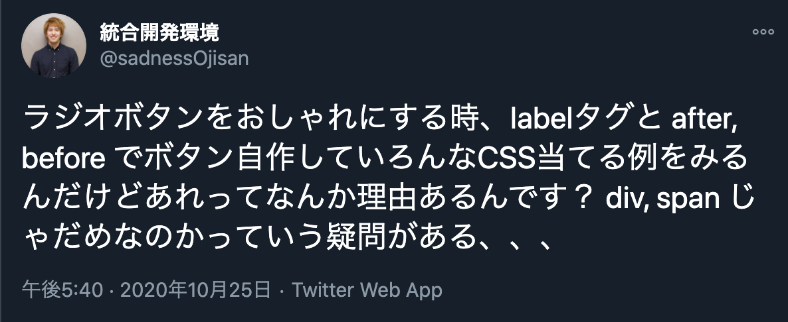
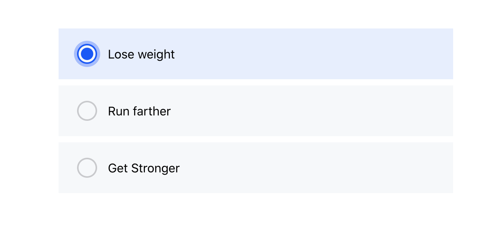
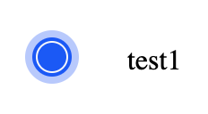

[Aaptiv](https://aaptiv.com/fitness-evaluation) の登録導線のラジオボタンを見てて、「これどうやって実装するんだろう？」って気になったので調べてみた + 実装してみました。


(https://twitter.com/sadnessOjisan/status/1320284047482875904)

こういうラジオボタンを作りたいっていう話です。（アニメーションもつきます）



このようなデザインを実現するにあたっては、ブラウザネイティブなラジオボタンにはスタイルをあてにくいためボタン自体を再実装することになると思うのですが、その辺をどうしたらいいかの注意点について述べます。

## アニメーション

box-shadow を transiton にすると良い感じになります。

```css
&::before {
    position: absolute;
    content: "";
    display: inline-block;
    transition: all 0.2s ease-in;
    height: 22px;
    width: 22px;
    top: 20px;
    left: 24px;
    background-color: #f6f8fa;
    border: 2px solid #c8c9cc;
    border-color: ${props => (props.isSelected ? "#05f" : "#c8c9cc")};
    border-radius: 50%;
    box-shadow: ${props =>
      props.isSelected ? "0 0 0 4px rgba(0,85,255,.32)" : undefined};
  }
```

## ラジオボタンのパーツは label 要素で作る

スタイルを当てる箱を作ればいいので `div` で作ってもいいかもしれませんが、ラベルをクリックしたときでもラジオボタン本体にフォーカスを当てるためにユーザーにクリックさせる要素は label 要素で作ります。
昔からラジオボタンを独自に作る例はよく見かけていて、それらが label で実装されていることはずっと疑問に思っていたのですがどうやらこのような背景があるようです。

```jsx
<label className={props.className} onClick={props.handleClick} id={props.value}>
  {props.value}
</label>
```

（この辺を教えてくださった [@L_e_k_o](https://twitter.com/L_e_k_o)さんありがとうございます。）

## ラジオボタンのデザインは擬似要素で作る

スタイルを当てる箱自体は label の疑似要素で作ります。



この外側の半透明の青色は before, 中の濃い青色は after で作ります。
こうすると選択状態にある時だけ after を付与するだけでボタンの切り替えができます。

```css
&::before {
    position: absolute;
    content: "";
    display: inline-block;
    transition: all 0.2s ease-in;
    height: 22px;
    width: 22px;
    top: 20px;
    left: 24px;
    background-color: #f6f8fa;
    border: 2px solid #c8c9cc;
    border-color: ${props => (props.isSelected ? "#05f" : "#c8c9cc")};
    border-radius: 50%;
    box-shadow: ${props =>
      props.isSelected ? "0 0 0 4px rgba(0,85,255,.32)" : undefined};
  }

  &::after {
    ${props =>
      props.isSelected
        ? `
        content: "";
        height: 16px;
        width: 16px;
        left: 27px;
        top: 23px;
        background-color: #05f;
        border-radius: 50%;
        position: absolute;
        content: "";
        display: inline-block;
    `
        : undefined}
  }
```

このように作れば label 要素の中に選択時のスタイル用 div を入れなくて済みます。
選択状態に応じてそうすれば要素の表出を管理しなくて済むのでアニメーションを付けやすくなります。

たとえば、

```tsx
{
  isSelected && <DivStyleForSelected></DivStyleForSelected>
}
```

みたいなコードだと解除時はアニメーションは付けにくいです。

## input 要素も使う

ここまでで要件を満たせますが、もう一頑張りします。
`label` の中に `<input type='radio' />` を入れます。
こうすることでユーザーにキーボードでの操作を可能にします。
もちろん見えると変なので `opacity: 0` で見えなくします。
ここで注意すべきは **`visibility: hidden`にしない** ことです。
visibility や display を使ってスタイルを見えなくするとキーボード操作はできなくなります。
（この辺を教えてくださった [@ymrl](https://twitter.com/ymrl)さんありがとうございます。）

そして、もうすこし踏み込んで input 要素に name, value, for, label 要素に id も振ります。
こうすることで開発者が独自に作ったラジオボタンであっても スクリーンリーダーでも読ませることができます。

(for は振らなくても手元のスクリーンリーダーでは動くのですが Windows’ Narrator だと完璧に動かないらしい(?)(https://a11y-101.com/development/radio-buttons))

### 余談: (p)react でも label は必要

最初の例で「label が必要なのはラベルクリックでも選択をハンドリングできるようにするため」ということを述べましたが、これは (p)react 環境であれば label は不要です。
なぜなら onClick で選択情報を state に保持できるからです。
しかし、このような a11y を考慮すると label があることでスクリーンリーダーに認識させられるので、label 要素を使って作った方が良いと思います。

## まとめ

ブラウザ にある要素を再実装したくない。

## サンプルコード

というわけでこんな感じで実装しました。

```tsx
import { Fragment, h } from "preact"
import { css, styled } from "goober"

interface PassedProps {
  name: string
  value: string
  isSelected: boolean
  handleClick: () => void
  children?: preact.ComponentChildren
}

interface Props extends PassedProps {
  className?: string
}

const Component = (props: Props) => (
  <Fragment>
    <label
      className={props.className}
      onClick={props.handleClick}
      id={props.value}
    >
      <input
        type="radio"
        name={props.name}
        value={props.value}
        for={props.value}
      ></input>
      {props.value}
    </label>
  </Fragment>
)

const StyledComponent = styled(Component)`
  position: relative;
  display: inline-block;
  padding: 24px 16px 24px 64px;
  width: 100%;
  font-size: 16px;
  & > input {
    opacity: 0;
  }
  &::before {
    position: absolute;
    content: "";
    display: inline-block;
    transition: all 0.2s ease-in;
    height: 22px;
    width: 22px;
    top: 20px;
    left: 24px;
    background-color: #f6f8fa;
    border: 2px solid #c8c9cc;
    border-color: ${props => (props.isSelected ? "#05f" : "#c8c9cc")};
    border-radius: 50%;
    box-shadow: ${props =>
      props.isSelected ? "0 0 0 4px rgba(0,85,255,.32)" : undefined};
  }

  &::after {
    ${props =>
      props.isSelected
        ? `
        content: "";
        height: 16px;
        width: 16px;
        left: 27px;
        top: 23px;
        background-color: #05f;
        border-radius: 50%;
        position: absolute;
        content: "";
        display: inline-block;
    `
        : undefined}
  }
`

const ContainerComponent = (props: PassedProps) => {
  return <StyledComponent {...props}></StyledComponent>
}

export const RadioButton = ContainerComponent
```

https://github.com/ui-impl-training/radio-animation
