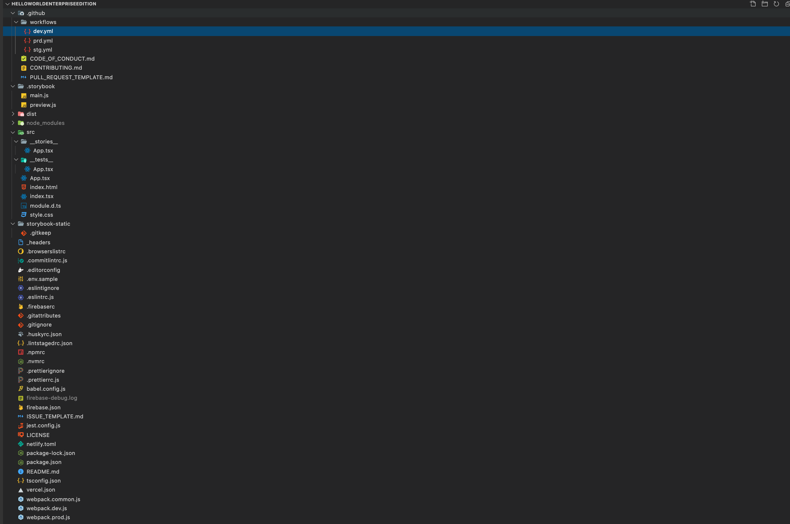
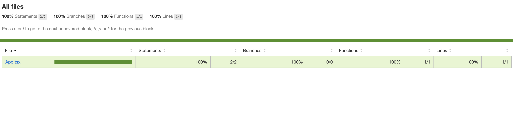
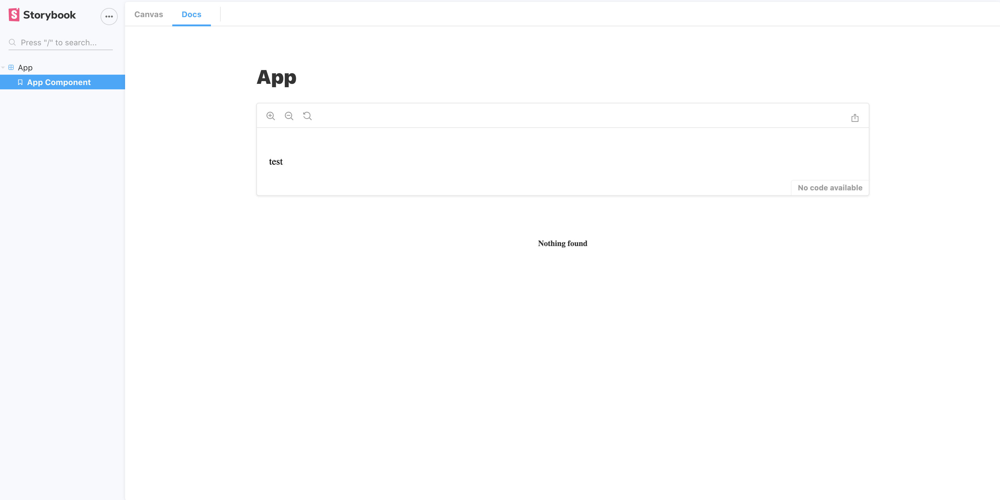

「ハローワールドするためにどこまで複雑にできるか」を目指して HelloWorldEnterpriseEdition というレポジトリを作って遊んでいたのですが、いろいろなエコシステムに触れることができて勉強になるのでそのまとめです。

FYI: https://github.com/sadnessOjisan/HelloWorldEnterpriseEdition

## HelloWorldEnterpriseEdition とは

- 依存する設定やライブラリの数を増やしたい
- しかし無駄なものは入れない

という前提で作っているレポジトリです。


という画面を作るために、だいたいこれくらいのファイル数になります。



一見単純な機能だけど裏側ではとてつもなくめんどくさいことをしているというのが推しポイントです。
これは FizzBuzzEnterpriseEdition というただ FizzBuzz するだけなのに大量のデザインパターンを使って実装しているプロジェクトに影響を受けています。

> FizzBuzz Enterprise Edition is a no-nonsense implementation of FizzBuzz made by serious businessmen for serious business purposes.

FYI: https://github.com/EnterpriseQualityCoding/FizzBuzzEnterpriseEdition

この前提を元に、ブラウザに Hello World を表示する Web ページを作ってみましょう。

## babel の設定

設定を増やしたいので TS + React ベースの SPA で作ります。
ただ tsc を使うと設定が増えないので、babel でビルドします。

TS, react を JS に変換するので、

- @babel/preset-env
- @babel/preset-typescript
- @babel/preset-react

を使いたいです。

しかし、preset は plugin にバラすことができます。
バラした方が設定を複雑にできるのでバラします。

そのため入れるプラグインは、

- @babel/preset-env
- @babel/plugin-typescript
- @babel/plugin-react

です。

設定ファイルは

```js
module.exports = {
  plugins: [
    ["@babel/plugin-transform-typescript", { isTSX: true }],
    "@babel/plugin-transform-react-jsx",
  ],
  presets: ["@babel/env"],
}
```

となります。

FYI: [Babel の Plugin で .tsx をビルドする](https://blog.ojisan.io/babel-plugin-to-tsx)

また preset-env はビルドターゲットを .browserslictrc で制御できるのでその設定ファイルも足します。

```sh:title=.browserslictrc
defaults
not IE 11
not IE_Mob 11
maintained node versions
```

## webpack の設定

babel だけでは React のアプリケーションを動かせないので、webpack でモジュールの依存を解決します。

babel-loader を入れて babel の実行、css-loader, style-loader でスタイルの解決、html-webpack-plugin で HTML への読み込みも行います。
そして設定ファイルを増やすためにファイルは分割します。
分割したものを merge するためには webpack-merge を使います。

```js
const path = require("path")
const HtmlWebpackPlugin = require("html-webpack-plugin")
const outputPath = path.resolve(__dirname, "dist")

exports.outputPath = outputPath

module.exports = {
  entry: "./src/index.tsx",
  output: {
    path: path.resolve(__dirname, "./dist"),
    filename: "build.js",
  },
  module: {
    rules: [
      {
        test: /\.(ts|tsx)$/,
        use: [
          {
            loader: "babel-loader",
          },
        ],
      },
      {
        test: /\.css$/i,
        use: ["style-loader", "css-loader"],
      },
    ],
  },
  resolve: {
    extensions: [".ts", ".css", ".tsx", ".js"],
  },
  plugins: [new HtmlWebpackPlugin({ template: "./src/index.html" })],
}
```

```js
const wm = require("webpack-merge")
const common = require("./webpack.common")
const outputPath = require("./webpack.common").outputPath

module.exports = wm.merge(common, {
  mode: "development",
  devtool: "source-map",
  devServer: {
    contentBase: outputPath,
  },
})
```

```js
const wm = require("webpack-merge")
const common = require("./webpack.common")

module.exports = wm.merge(common, {
  mode: "production",
})
```

このように webpack-merge を使うと分離することができます。
本番だけの設定とかを入れられるので覚えておきましょう。

## ビルド対象を作る

index.tsx, index.html, App.tsx を作るだけです。

```html
<html>
  <head>
    <meta charset="utf-8" />
    <title>Hello World Enterprise Edition</title>
  </head>
  <body>
    <div id="root"></div>
  </body>
</html>
```

```tsx
import * as React from "react"
import * as ReactDOM from "react-dom"

import { App } from "./App"
import "./style.css"

ReactDOM.render(
  <App message="Hello World !"></App>,
  document.getElementById("root")
)
```

```css
body {
  background-color: antiquewhite;
}
```

```tsx
import * as React from "react"

interface Props {
  message: string
}

export const App: React.FC<Props> = props => <p>{props.message}</p>
```

はい、これで HelloWorld できるようになりました。


## Format

Prettier を入れます。

```sh
npm i -D prettier
```

設定ファイルも生成します。（標準に乗りたいから書かないけど）

```sh
touch .prettierrc .prettierignore
```

prettierignore には md ファイルなどを指定しておくと、英数字後に半角スペースが入らないようにできたりします。

## ESLint

ではここから静的に縛っていきましょう。

```sh
npx eslint --init
```

で、TS+React を選択して設定を吐き出します。

```js
module.exports = {
  env: {
    browser: true,
    es2021: true,
  },
  extends: [
    "eslint:recommended",
    "plugin:react/recommended",
    "plugin:@typescript-eslint/recommended",
    "prettier",
  ],
  parser: "@typescript-eslint/parser",
  parserOptions: {
    ecmaFeatures: {
      jsx: true,
    },
    ecmaVersion: 12,
    sourceType: "module",
  },
  plugins: ["react", "@typescript-eslint"],
  rules: { "react/prop-types": "off" },
}
```

初期設定では入っていないのですが、 eslint-prettier-config の設定も足しています。

```js
extends: [
  "eslint:recommended",
  "plugin:react/recommended",
  "plugin:@typescript-eslint/recommended",
  "prettier",
],
```

設定ファイル系は lint 対象から外したいので ignore します。

```sh
dist
babel.config.js
webpack.*.js
.eslintrc.js
jest.config.js
```

## commithook

commit 前に prettier, eslint が実行されるようにします。
そのために、

- lint-staged(staging 領域のコードが触れるようになる)
- husky(commit hook を作れるようになる)

をインストールします。

そして commit message も lint するように commitlint を入れます。
これは `chore: hoge` や `fix: fuga` といった決まった prefix からしか commit できなくするツールです。

### 設定はファイルとして分離できる

eslint, prettier, commitlint, husky, lint-staged の設定は package.json にもかけますが、設定ファイルを増やしたいので分離したファイルにしました。
このように package.json に書く設定は分離できることが多いです。

## test

jest の設定をしていきます。

### UT の環境

jest をいれます。

```sh
npm i -D jest
```

これで jest コマンドが使えます。

設定は

```sh
npx jest --init
```

で生成できます。

いまは babel でコンパイルしているので transformmer の設定は不要です。

FYI: [preset: ts-jest とは](https://blog.ojisan.io/ts-jest)

テストファイルを \_\_tests\_\_ の中に書くとテストを実行できます。

```sh
jest
```

そしてカバレッジレポートも生成します。
これは後にデプロイします。



https://sadnessojisan.github.io/HelloWorldEnterpriseEdition/

### DOM をまたいだ環境

DOM に対してもテストを書きたいので react-testing-library を導入します。

```sh
npm i -D @testing-library/jest-dom @testing-library/react
```

を導入します。

jest-dom は DOM をテストするためのカスタムマッチャです。
「その要素に x が含まれているか」のようなテストがかけます。
@testing-library/react はテスト用の View を作ってくれるライブラリです。
ここから生成した View からは getByText などのメソッドで対象となる要素を取り出すことができ、それをカスタムマッチャに渡すことでテストを行えます。
また、@testing-library/react はイベントの発火もできるので画面の操作をテストすることが可能になります。

```jsx
import "@testing-library/jest-dom"
import React from "react"
import { render, screen } from "@testing-library/react"
import { App } from "../App"

test("shows the children when the checkbox is checked", () => {
  const testMessage = "Test Message"
  render(<App message="Test Message"></App>)
  expect(screen.getByText(testMessage)).toBeInTheDocument()
})
```

## storybook

コンポーネントカタログを作りましょう。

いまは、

```sh
npx sb init
```

とするだけで設定ができあがります。
昔はもっと複雑な設定が必要だったのですがいまは addon なども addon-essentials としてこのコマンドで入るようになってしまいました。
残念。

あとは storyfile を \_\_stories\_\_ の中に格納すればコンポーネントカタログが出来上がります。

```tsx
import * as React from "react"
import { App } from "../App"

export const AppComponent = () => {
  return <App message="test"></App>
}

export default {
  title: "App",
}
```



https://enterprise-storybook.netlify.app/

これも後にデプロイします。

## CI

テストもカタログも書いたので CI workflow も作りましょう。
GitHub Actions を整備します。

このようにブランチを分けながら 3 環境作ります。

```yml
name: DEV

on:
  push:
    branches:
      - "*" # matches every branch that doesn't contain a '/'
      - "*/*" # matches every branch containing a single '/'
      - "**" # matches every branch
      - "!master" # excludes master

jobs:
  release:
    name: check version, add tag and release
    runs-on: ubuntu-latest
    steps:
      - name: checkout
        uses: actions/checkout@v2
      - name: setup Node
        uses: actions/setup-node@v1
        with:
          node-version: 12.x
          registry-url: "https://registry.npmjs.org"
      - name: install
        run: npm install
      - name: typecheck
        run: npm run typecheck
      - name: lint
        run: npm run lint
      - name: format
        run: npm run format
      - name: test
        run: npm run test
      - name: build
        run: npm run build:dev
```

```yml
name: STG

on:
  push:
    branches: ["master"]

jobs:
  release:
    name: check version, add tag and release
    runs-on: ubuntu-latest
    steps:
      - name: checkout
        uses: actions/checkout@v2
      - name: setup Node
        uses: actions/setup-node@v1
        with:
          node-version: 12.x
          registry-url: "https://registry.npmjs.org"
      - name: install
        run: npm install
      - name: typecheck
        run: npm run typecheck
      - name: lint
        run: npm run lint
      - name: format
        run: npm run format
      - name: test
        run: npm run test:cov
      - name: build
        run: npm run build:prd
      - name: Deploy Coverage Report
        uses: peaceiris/actions-gh-pages@v3
        with:
          github_token: ${{ secrets.GITHUB_TOKEN }}
          publish_dir: ./coverage/lcov-report
```

```yml
name: PRD
on:
  push:
    tags:
      - "v*"
jobs:
  release:
    name: check version, add tag and release
    runs-on: ubuntu-latest
    steps:
      - name: checkout
        uses: actions/checkout@v2
      - name: setup Node
        uses: actions/setup-node@v1
        with:
          node-version: 12.x
          registry-url: "https://registry.npmjs.org"
      - name: install
        run: npm install
      - name: Can Publish
        run: npx can-npm-publish --verbose
      - name: typecheck
        run: npm run typecheck
      - name: lint
        run: npm run lint
      - name: format
        run: npm run format
      - name: test
        run: npm run test
      - name: build
        run: npm run build:stg
      - name: Deploy to Firebase
        uses: w9jds/firebase-action@master
        with:
          args: deploy --only hosting
        env:
          FIREBASE_TOKEN: ${{ secrets.FIREBASE_TOKEN }}
```

## デプロイ

デプロイします。

### GitHub Pages

Github Actions から簡単にデプロイできる選択肢として GitHub Pages があります。
ただしこれは 3 環境用意できないので、テストカバレッジのデプロイだけに使います。

```yml
name: Deploy Coverage Report
uses: peaceiris/actions-gh-pages@v3
with:
  github_token: ${{ secrets.GITHUB_TOKEN }}
  publish_dir: ./coverage/lcov-report
```

このような yml を書けばデプロイできます。

peaceiris/actions-gh-pages は github pages にデプロイするタスク、peaceiris/actions-gh-pages は firebase にデプロイするタスクです。

FYI: [GitHub Actions と GitHub Pages で yml をフォルダに入れておくだけのお手軽デプロイ](https://blog.ojisan.io/gha-ghpage)

### firebase

本番は firebase を使います。
作ってるいうものは静的ページな上、firebase は早いためです。

デプロイトークンを取得するために firebase コマンドが必要になります。
依存が増えて嬉しいですね。

```sh
npm i -D firebase-tools
```

これで

```sh
npx firebae init
```

とすると、Hosting の設定ファイルを作れます。

その結果、firebase.json と .firebaserc が生成されます。

```json:title=.firebaserc
{
  "projects": {
    "default": "helloworldenterpriseedition"
  }
}
```

```json:title=firebase.json
{
  "hosting": {
    "public": "dist",
    "ignore": ["firebase.json", "**/.*", "**/node_modules/**"],
    "rewrites": [
      {
        "source": "**",
        "destination": "/index.html"
      }
    ]
  }
}
```

そして Github Actions からデプロイするためのトークンを払い出します。

```sh
npx firebase login:ci
```

認証後にトークンがもらえるので、これを Github Actions で設定してデプロイしましょう。

```yml
- name: Deploy to Firebase
  uses: w9jds/firebase-action@master
  with:
    args: deploy --only hosting
    env:
      FIREBASE_TOKEN: ${{ secrets.FIREBASE_TOKEN }}
```

### Netflify

[Netlify](https://www.netlify.com/) でブランチ連携をするだけでよいです。
ただこれも設定を複雑にしようと思えばできて、\_headers ファイルでキャッシュをレスポンスヘッダをコントロールできます。

```sh:title=_headers
/*
  X-Frame-Options: DENY
  X-XSS-Protection: 1; mode=block
```

ビルドキャッシュの設定も作れます。

```toml:title=netlify.toml
[build]
  publish = "storybook-static"

[[plugins]]
  package = "netlify-plugin-gatsby-cache"
```

そしてビルド環境を固定するために .nvmrc も足しておきましょう。

```
v12.18.4
```

FYI: [Gatsby 製サイトを Netlify にデプロイする前に見ておきたい設定 2 つ（ビルドと表示）](https://blog.ojisan.io/gatsby-meet-netlify)
FYI: [gatsby-plugin-netlify-cache のキャッシュが効かない](https://blog.ojisan.io/gatsby-meet-netlify-botsu)

### Vercel

これも[Vercel](https://vercel.com/) でブランチ連携をするだけでよいです。
そして嬉しいことに Vercel も設定ファイルを足せます。

```json:title=vercel.json
{
  "public": true
}
```

こうすることで /\_src とすればソースコードを確認できます。
もともとソースコードを公開してるプロジェクトなので問題ないです。

## github

もっと複雑にしたいので皆さんからの PR を待っています。
ということで各種テンプレートも入れました。

これはルート直下、もしくは .github 配下に置くことで効果を発揮します。

### CODE OF CONDUCT

このレポジトリの行動指針です。
テンプレートから生成できます。

FYI: https://docs.github.com/ja/free-pro-team@latest/github/building-a-strong-community/adding-a-code-of-conduct-to-your-project

### CONTRIBUTING

コントリビューターのためのガイドラインです。
PR のフローや開発者向けドキュメントのリンクを公開するものです。

FYI: https://docs.github.com/ja/free-pro-team@latest/github/building-a-strong-community/setting-guidelines-for-repository-contributors

### PULL REQUEST TEMPLATE

PR のテンプレートです。

```md
# PR Details

<!--- Provide a general summary of your changes in the Title above -->

## Description

<!--- Describe your changes in detail -->

## Motivation and Context

<!--- Why is this change required? What problem does it solve? -->
```

こういうのを入れておきます。

### ISSUE TEMPLATE

PR 同様、ISSUE のテンプレートです。

## まとめ

何してるんだろ僕...

## おわりに

他にもなにか面白い設定がありましたら、是非とも PR や Issue をいただきたいです。

https://github.com/sadnessOjisan/HelloWorldEnterpriseEdition
