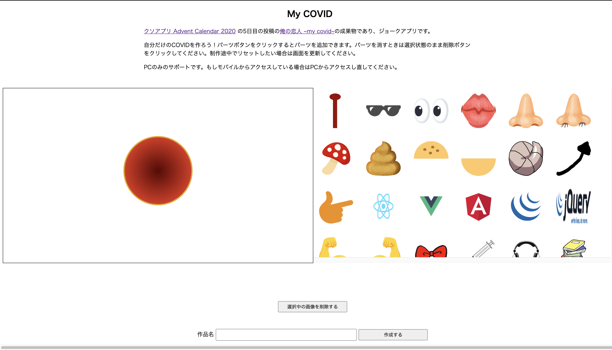

[クソアプリ Advent Calendar 2020](https://qiita.com/advent-calendar/2020/kuso-app) の 5 日目に [俺の恋人 ~my covid~](https://qiita.com/sadnessOjisan/items/45d2c3e6e3f5a38a7f0b) という記事を書きました。

[こちら](https://my-covid.web.app/)がその糞アプリです。



[https://my-covid.web.app/](https://my-covid.web.app/)

これは、自粛の影響で恋人と過ごせない鬱憤を、理想の COVID と過ごすことで気を紛らわせることができるアプリです。(※1)
右側にあるエディタから画像を選んで、コロナウイルス上に配置していって自分のオリジナルコロナを作り、それを画像として保存・シェアできます。
ちなみに「恋人」と「COVID」をかけあわせたネーミングです。ふふっ

(※1: 恋人と過ごせない理由は COVID のせいなのかどうかは諸説あり)

## クソアプリ Advent Calendar について

クソアプリ Advent Calendar は今年で 5 回目の開催で、私は今回を含めて過去 3 回参加しました。

- [俺の恋人 ~my covid~](https://qiita.com/sadnessOjisan/items/45d2c3e6e3f5a38a7f0b)
- [ビルド時に俳句を読めるプラグイン](https://qiita.com/sadnessOjisan/items/98619eaaef1da8d6545a)
- [Marquee タグに詳しくないと攻略できないブロック崩しゲーム](https://qiita.com/sadnessOjisan/items/51bb949466fdd065a5a6)

お察しの通り、こういう技術的にも内容的にも ●● な記事を書いても許されるカレンダーで僕はとても好きです。

ただ今年の記事は技術的にも実装の中身的にも例年以上の本当に ●● な内容なので、記事内でコードの公開や実装方法は紹介していなかったのですが、思いのほか気になるという意見をいただきましたので紹介したいと思います。

ソースコードは[こちら](https://github.com/sadnessOjisan/my-covid)です。
せっかく公開しましたので、もしお手隙でしたら適宜面白い素材画像を追加してくれると助かります。

## 作り方

やっていることは本当にシンプルで [Konva.js](https://konvajs.org/) を Firebase に載せただけです。
そのため技術的に学びになるようなことは少ないとは思いますが、労力を削るためにいろいろ誤魔化しているのでそういう削り方みたいなのは参考になるかもしれません。
また konva にあるサンプルを切りはりしただけなのですが、Konva で一貫して何かを作った例というのもないような気がするので、これから Konva を触る人の助けにはなるのかもしれません。

### 画像のエディタの作り方

#### 初期化周り

konva では stage, layer, object が登場します。

stage に layer を重ねていき、その layer に画像などのオブジェクトを重ねていきます。
階層が分かれているのでそれぞれで検索をかけたり、移動をさせることができます。

```ts
const stage = new Konva.Stage({
  container: "container",
  width: width,
  height: height,
  drawBorder: true,
})
const layer = new Konva.Layer()
```

そしてここではエディタの操作による状態管理をいわゆる super-tenuki global variables で行うので、あらかじめ宣言しておきます。

```ts
const images: KonvaImage[] = []
const selectedImages: Transformer[] = []
```

selectedImages は image に対応する操作オブジェクトの配列として操作します。
ここでは操作できる画像は 1 枚だけという制約(複数操作できない)を加えて実装をシンプルにしています。

#### 画像の追加とドラッグアンドドロップ

画像はたくさん出てくるので画像を Konva に登録し、その画像に操作オブジェクト(Transformer)を紐づける処理を関数化しておきます。
この Transformer はドラックアンドドロップを可能にしバウンディングボックスを表示してくれる Konva の組み込みの機能です。
便利。

```ts
function drawImage(imageObj: HTMLImageElement) {
  const id = Math.random().toString(32).substring(2)
  const loadedImage: KonvaImage = new Konva.Image({
    image: imageObj,
    x: stage.width() / 2 - 200 / 2,
    y: stage.height() / 2 - 137 / 2,
    width: 200,
    height: 137,
    draggable: true,
    name: id,
  })

  // add cursor styling
  loadedImage.on("mouseover", function () {
    document.body.style.cursor = "pointer"
  })
  loadedImage.on("mouseout", function () {
    document.body.style.cursor = "default"
  })
  loadedImage.on("click", () => {
    const tr = new Konva.Transformer({
      nodes: [loadedImage],
      name: id,
    })
    // クリックされたものだけを選択状態にする
    const oldImage = selectedImages.shift()
    if (oldImage) {
      oldImage.destroy()
    }
    selectedImages.push(tr)
    layer.draw()
    layer.add(tr)
  })

  layer.add(loadedImage)
  stage.add(layer)
  images.push(loadedImage)
}
```

#### レイヤを内での検索

KonvaJS では画像オブジェクトと Transformer(操作オブジェクト)は別のものとして扱われます。
そのためどの画像がどの Transformer に紐づくかという紐付けをしなければいけません。
そのため同じ name をそれぞれに持たせて、その name をオブジェクトがマウントされている layer 内から検索して削除や移動などの処理を加えていました。

そうすることで画像を削除された時に Transformer も削除することができます。

```ts
window.del = function del(): void {
  const selectedImage = selectedImages[0]
  if (!selectedImage) {
    alert("画像を選択してください。")
    return
  }
  const name = selectedImage.name()
  selectedImage.destroy()
  const shapes = stage.find(`.${name}`)
  shapes.each(shape => {
    shape.destroy()
  })
  images.shift()
  layer.draw()
}
```

#### レイヤの再描画を忘れるな。

そして削除や追加をしたら layer を更新しましょう。

```ts
layer.draw()
```

オブジェクトを layer から追加・削除しただけでは画面は反映されません。
これを忘れていてめちゃくちゃ時間を溶かしました。
なので正直なところ konva-react みたいなラッパを使った方が良いと思います。

### デプロイ周りの工夫

Firebase Hosting にデプロイするのでビルトインコードを使えてライブラリのインストールやライブラリの初期化周りの手順を省けました。
実際それを狙って Firebase Hosting にデプロイしました。

しかし、そのせいでローカルでの疎通や開発環境・本番環境を跨いだデプロイ周りがめんどくさくなりました。
環境を跨がせるのは firebase.json や デプロイコマンドのオプションで出しわけれますが、この辺りは正直慣れてなくて詰まりました。
なので途中から開発環境を捨てて、全部本番環境に繋ぐようにしました。
糞アプリにデプロイフローも糞もねぇ。

ちなみに [Firebase Hosting は GHA からもデプロイできて](https://github.com/sadnessOjisan/my-covid/blob/main/.github/workflows/dev.yml#L36)、その場合も引数を渡せるので、デプロイ先の分離自体は可能で自分もやっていました。
ただサイト名とプロジェクト名が紐づいてしまったり(そのせいで my-covid-prd.app みたいな URL になったり)、その site name やアプリを Firebase 上から消しても勝手に復活したり謎挙動を踏んだので途中で諦めました。

#### 途中で TypeScript やライブラリを使うのを辞めた

シェアページを作ろうとしたときに webpack を複数のエントリポイントを持たせないといけないようにしたり、出力を分けないといけないようにしないといけないことに気付き、そもそも webpack を使うのを辞めました。
直接 HTML の中に JS を書きました。
知ってましたか？JavaScript って HTML の中に直接書けるんですよ。
超便利！

```html
<!DOCTYPE html>
<html lang="ja">
  <head>
    <meta charset="UTF-8" />
    <meta name="viewport" content="width=device-width, initial-scale=1.0" />
    <script src="/__/firebase/8.1.1/firebase-app.js"></script>
    <script src="/__/firebase/8.1.1/firebase-analytics.js"></script>
    <script src="/__/firebase/8.1.1/firebase-firestore.js"></script>
    <script src="/__/firebase/init.js"></script>
    <title>my covid</title>
    <meta property="og:title" content="my covid" />
    <meta
      property="og:description"
      content="自分でパーツを選んで自分だけのコロナウイルスを作ろう！"
    />
    <meta property="og:url" content="https://my-covid.web.app/" />
    <meta name="twitter:card" content="summary_large_image" />
    <style>
      h1 {
        text-align: center;
      }

      /* ... */
    </style>
  </head>
  <body>
    <h1>Your COVID</h1>
    <div class="wrapper">
      <p class="title" id="documentTitle"></p>
      
      <a href="/"><button class="orange">戻る</button></a>
      <a
        href="https://twitter.com/intent/tweet?text=my covidを作ったよ"
        id="tweetLink"
        ><button class="blue">tweetする</button></a
      >
    </div>
    <script>
      const id = window.location.search
        .split("?id")[1]
        .split("&")[0]
        .split("=")[1]
      console.log(id)
      if (!id) {
        alert("idを指定してください。")
      }
      const db = firebase.firestore()
      db.collection("images")
        .doc(id)
        .get()
        .then(function (doc) {
          const { title, data } = doc.data()
          const titleEl = document.getElementById("documentTitle")
          titleEl.textContent = title

          const imageEl = document.getElementById("covidImage")
          imageEl.src = data

          document.getElementById(
            "tweetLink"
          ).href = `https://twitter.com/intent/tweet?text=${window.location.href}`
        })
        .catch(function (error) {
          console.log("Error getting cached document:", error)
        })
    </script>
  </body>
</html>
```

#### Firestore に直接画像を保存する

Cloud Storage の準備をしていましたが、「Firestore を連携させるのめんどくせー」となって直接 Firestore に保存しました。
もちろんバイナリは保存できないので base64 形式で保存しました。
幸いにも konva.js の `stage.toImage` から出力できる画像は base64 なのでそれを直接 store に入れたらよく、とても楽です。

```ts
window.exportImage = function exportImage(): void {
  const inputEl = document.getElementById("titleInput") as HTMLInputElement
  const buttonEl = document.getElementById("submitbutton") as HTMLInputElement
  buttonEl.textContent = "送信中"
  const title = inputEl.value
  // 送信ボタンを押された時に選択を解除するため
  stage.find("Transformer").each(d => d.destroy())
  stage.toImage({
    callback(img) {
      var db = firebase.firestore()
      db.collection("images")
        .add({
          title: title,
          data: img.src,
        })
        .then((docRef: any) => {
          console.log(docRef.id)
          inputEl.value = ""
          buttonEl.textContent = "作成する"
          window.location.href = `/share.html?id=${docRef.id}`
        })
    },
    pixelRatio: 3,
  })
}
```

おっと、firestore の箇所が `var` を使っていますね。
きっと作者はどこかのソースコードからそのままパクってきたのでしょう。

### その他

#### webpack を通した関数を HTML から呼び出す方法

```ts
funciton add(){
 // no op
}
```

という JS を用意してこれを

```html
<button onclinc="add()">add</button>
```

として HTML から呼ぼうとしたときに、JS 側を webpack で JS をバンドルしてたら動きません。

```ts
window.add = funciton add(){
 // no op
}
```

とする必要があります。

webpack を通した上で JS を HTML から呼び出すのが初めてだったのでこの挙動は単純に知りませんでした。

## おわりに

誰か素材画像を追加して欲しいです。

手順は、

### 1. フォルダに画像を追加

my-covid/src/img/ に画像を追加

### 2. my-covid/src/index.ts で画像を import

```ts
...
import ju from "./img/ju.png";
import taion36 from "./img/taion36.png";
import taion38 from "./img/taion38.png";
```

### 3. my-covid/src/index.html にボタン要素追加

クリックしたら画像が追加されるようにしたいためです。id と onClick の引数名を一致させておいてください。class 名は`imageButton`です。

```html
...
<input id="ju" type="image" onclick="add('ju')" class="imageButton" />
<input id="taion36" type="image" onclick="add('taion36')" class="imageButton" />
<input id="taion38" type="image" onclick="add('taion38')" class="imageButton" />
```

追加したら id 名を覚えておいてください。

### 4. my-covid/src/index.ts で records に追加

先ほど追加要素の id と import した画像要素の名前を組にして record に追加してください。

```ts
const records = [
  ...{ id: "ju", fileName: ju },
  { id: "taion36", fileName: taion36 },
  { id: "taion38", fileName: taion38 },
]
```

追加すると後続の処理が諸々の初期化をしてくれます。
