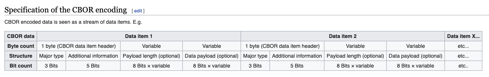
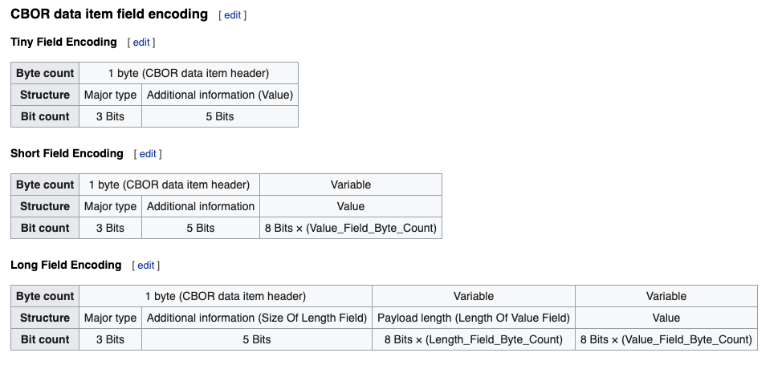

この記事は [Node.js Advent Calendar 2020](https://qiita.com/advent-calendar/2020/nodejs) の 16 日目の投稿です。

今年のゴールデンウィークに CBOR(Concise Binary Object Representation) のエンコーダー・デコーダーを作っていまして、今日はデコーダーの作り方を紹介します。

FYI: https://cbor.io/

CBOR は WebAuthn の Attention Object の検証などで使われている技術ですが、自分が CBOR を勉強した動機はどこかで CBOR を使う機会があったわけではなく、[jxck](https://twitter.com/jxck_) さんがゴールデンウィークに開催してくださった [mozaic bootcamp](https://blog.jxck.io/entries/2019-05-12/mozaic-bootcamp-2019.html) というブートキャンプにおけるワークの一つとして、RFC を読みそれを実装するというものがありそれに挑戦した形です。
初めて RFC を読むトレーニングとしては CBOR, UDP, WebSocket がオススメとのことでしたので、僕は CBOR を選びました。
一緒に受けた他の受講生の方は WebSocket を選んでいたので、ちょっと逆張りしてみました。

（※ 2020 年版では緊急事態宣言真っ只中ということもあり、オンライン環境下で実現できるのかという実験も兼ねてオンラインで開催されました。）

そのときに作った実装は[これ](https://github.com/sadnessOjisan/ts-cbor)なのですが、色々とひどい実装でそろそろ書き直したいなと思って少しずつ調べていて、ある程度は形になりましたのでアドベントカレンダーの題材として選びました。

## CBOR とはなにか

CBOR は [RFC 7049](https://tools.ietf.org/html/rfc7049) に定められた仕様で、

> The Concise Binary Object Representation (CBOR) is a data format
> whose design goals include the possibility of extremely small code
> size, fairly small message size, and extensibility without the need
> for version negotiation.

とあるように、少ないコード・サイズを実現するためのデータフォーマットです。

形式としては微かに JSON が意識されていますが、見た目はかなり異なります。

例えば、`23`という数字は CBOR では`17` と表現され、 `a` という文字は CBOR では `6161` と表現されます。
`[1, [2, 3]` は `8201820203` と表現され、`{ a9: { あ: 1 } }` は `A1626139A163E3818201` と表現されます。

このように表現できるのは CBOR の形式が定まっており、エンコーダー・デコーダーを実装できるからです。

CBOR は 8, 16, 24bit のフレームに、Major type, Additional information, Payload length, payload を詰め込みデータを表現します。
wikipedia のこの図が非常にイメージとして良いものです。



CBOR では`6161`が`a`として表現できる例を挙げると、0x6161 は 16bit で表現すると 0b0110000101100001 となります。
先頭 3bit は Major type と呼ばれデータの型を表し、ここでは 011, つまり 3 でこれは文字列と読み解きます。
続く 5bit は Additional Information と呼ばれ 続く 0b00001 分の長さにデータが格納されていると読み解きます。
残りの bit は 0b01100001 なのでこれが一文字のデータであることを表します。
そしてこれは 0x61 を表すのでこれを文字コード表から探すと a であることが分かります。

FYI: http://ash.jp/code/unitbl21.htm

では その CBOR の解釈方法について詳しく見ていきましょう。

### Major Type

先頭 3bit は Major type と呼ばれるものでいわばデータの型です。
その型には

- Positive integer -> 0
- Negative integer -> 1
- Byte string -> 2
- Text string -> 3
- Array of data items -> 4
- Map of pairs of data items -> 5
- Semantic tag -> 6
- Primitives -> 7

があり、それぞれ 0 - 7 のカテゴリが割り当てられます。
つまり、000 - 111 のビット列で表現されます。

例えば、23 は CBOR では`17`と表現されますが、0x17 は 0b00010111 であり、先頭 3 ビットの 0b000 は 0 なので正の整数であることが分かります。

### Additional information

続く 5bit には Additional information が格納されます。
これは Major Type の種類によって意味は変わってくるのですが、大抵はデータの大きさを表します。
例えば数字の桁数や文字数の長さや配列の長さがここに入ります。

0b00010111(0x17)の Major Type を除いた 5 ビットは 0b10111(23) なので、23 が addditional information であることが分かります。
この場合だと additional information がそのままデータの値となるので、CBOR での 17 は整数 23 であると読み解きます。

### フォーマットを実際に読んでみよう

では、その読み方について紹介します。
CBOR は

- Major type
- Additional information
- Payload length
- payload

から成り立ちますが、Major Type のカテゴリによって、Additional information, Payload length, payload の意味が変わります。

#### Positive Integer

Major Type のカテゴリが Positive Integer のとき、Additional information が 0 - 23(つまり 0b00000 - 0b10111) ならそれがそのままデータの値となります。Additional information が 24(つまり 0b11000) なら続く 1byte がデータの値になります。つまりその場合は 24-255 までの数値を表現できます。さらに Additional information が 25(0b11001)なら続く 2byte(つまり 256-65535)がデータの値となります。そしてここが 26 なら続く 3byte, 27 なら続く 4byte といった風に扱える数が増えていきます。

そのため先ほどの図にあったデータフォーマットとは違ってデータの種類によっては 短く終わります。これも wikipedia の図がわかりやすいと思います。



#### Text string

Major Type のカテゴリが Text string のとき Additional information が 0 - 23(つまり 0b00000 - 0b10111) ならその分だけの長さの文字列が Additional information の直後の bit 以降に格納されています。
当然ここでの文字列は人間が読める文字列ではなく、bit 列です。
この bit 列を 16 進数に変換し、それを UTF-8 の形式でデコードしたものが該当の文字です。

先ほどの例を挙げると、16 進数で「6161」が送られて来ればそれは「a」と表現されます。

詳しくはこのテストコードを読むとイメージが掴めると思います。

FYI: https://github.com/sadnessOjisan/ts-cbor/blob/master/src/decoder/__tests__/StringDecoder.ts

こちらも additioal information が増えると読み方は異なります。
たとえば Additional Information が 24 であれば、続く 8bit は文字列の長さを表します。そのためその 8bit を読んだ先の bit を指定文字数だけ読む必要があります。同様に 25 であれば 続く 16bit が文字列の長さを表し、16bit を読んだ先の bit を指定文字数だけ読む必要があります。

#### Array・Map

Array や Map では Additional information にデータの長さが入ります。
ここでは長さだけわかればよく、なぜならその長さを読んだところに別の CBOR 文字列が入っているのでそれをデコードすれば要素が分かるからです。

### フォーマットをルールにした関数を作るだけでは

このように MajorType と Additional information がデータの読み方を教えてくれるので、そのルールに従う関数を書けば簡単に decode できます。

## 愚直に実装していく

では、実装していきましょう。

先ほども述べたとおり、CBOR では Positive integer, Negative integer, Byte string, Text string, Array of data items, Map of pairs of data items, Semantic tag, Primitives というカテゴリに分けられます。

Positive integer, Negative integer, Byte string, Text string の対応ができれば、Array や Map といったはそれらを組み合わせることで実装できます。
そのため再帰的にデコーダーを呼び出す実装にします。

基本的には Major Type と Additional type を参考に読み進めていって、なにか矛盾が起きたら例外を投げるといった設計にします。

```ts
export class Decoder {
  /**
   * CBOR列からJSのデータ構造に変換する関数
   * @param cborInputString {string} cbor文字列
   * 6161
   * 01
   * @example
   * const result = decode("6161")
   * // a
   * @throws CBOR文字列ではないときに例外を投げる
   */
  static decode(cborInputString: string): any {
    const cbor = toCBOR(cborInputString)
    const { majorType } = cbor
    switch (majorType) {
      case 0:
        // 正の数
        return PositiveNumberDecoder.decode(cbor)
      case 1:
        // 負の数
        return NegativeNumberDecoder.decode(cbor)
      case 2:
        // Byte
        return Byte.decode(cbor)
      case 3:
        // 文字列
        return StringDecoder.decode(cbor)
      case 4:
        // 配列
        return ArrayDecoder.decode(cbor)
      case 5:
        // オブジェクト
        return ObjectDecoder.decode(cbor)
      case 6:
        // tag
        return Tag.decode(cbor)
      case 7:
        return PrimitiveDecoder.decode(cbor)
      default:
        throw new Error("Invalid CBOR Input")
    }
  }
}
```

そして 配列や Map といったなんらかの構造を取りうるデータ構造の Decoder からはこの`Decoder.decode`を呼ぶようにします。
そうすれば配列の要素である数字や文字、さらには入れ子になる配列や Map の decode も行えます。

```ts
export class ArrayDecoder {
  /**
   * 配列であることが保証されたCBOR文字列から配列を作る関数.
   *
   * @param cbor CBOR文字列.
   * ex) 820163E38182 = 82(array(2)) 01(1) 
   63(text(3byte)) E38182(あ) = [12, "あ"]
   * @param dataItemHeader CBOR文字列の先頭1byte. 
   major typeと追加情報が格納されている.
   */
  static decode(cbor: BaseCborType): any[] {
    const result: any[] = []
    const definedToken = detectCborTypeFromBaseCbor(cbor)

    if (cbor.type === "tiny") {
      throw new Error("配列はshort or long. ")
    }
    switch (definedToken.type) {
      case "short": {
        // additinal infoに長さが入っており、次のbyte以降にデータ
        if (definedToken.additionalInformation > 23) {
          throw new Error("not tiny")
        }

        if (definedToken.additionalInformation === 0) {
          return []
        }
        let eating = null
        for (;;) {
          const eatResult = Decoder.decode(eating || definedToken.variable)
          eating = eatResult.restCborString
          result.push(eatResult.decodeResult)
          if (!eatResult.restCborString) {
            // これ以上tokenがないなら抜ける
            break
          }
        }

        if (result.length !== definedToken.additionalInformation) {
          throw new Error("additional informationと配列の数があってない")
        }

        return result
      }

      case "long": {
        let eating_long = null
        for (;;) {
          const eatResult = Decoder.decode(eating_long || definedToken.variable)
          eating_long = eatResult.restCborString
          result.push(eatResult.decodeResult)
          if (eatResult.restCborString === null) {
            break
          }
        }
        return result
      }
    }
    throw new Error("ありえない")
  }
}
```

このように再帰的な構造を用意してやれば、あとは 整数や文字列のデコーダーを作れば、CBOR のデコーダーそのものが完成します。

### 整数のデコーダー

```ts
import {
  separateTokenFromCBOR,
  BaseCborType,
  detectCborTypeFromBaseCbor,
} from "../helper"

/**
 * 正の数のdecoder
 */
export class PositiveNumberDecoder {
  /**
   * 正の数であることが保証されたCBOR文字列からnumberを作る関数.
   *
   * @param cbor CBOR文字列.
   * @param dataItemHeader CBOR文字列の先頭1byte. 
   major typeと追加情報が格納されている.
   * @returns 正の数
   */
  static decode(cbor: BaseCborType): number {
    const definedToken = detectCborTypeFromBaseCbor(cbor)
    if (definedToken.additionalInformation < 24) {
      return definedToken.additionalInformation
    } else {
      const separatedCborObject = separateTokenFromCBOR(definedToken.raw)
      if (!separatedCborObject.rest) {
        throw new Error("読み込む対象が存在しない")
      }
      const hexValue = separatedCborObject.rest
      return parseInt(hexValue, 16)
    }
  }
}
```

### 文字列のデコーダー

```ts
/**
 * 文字列のdecoder
 */
export class StringDecoder {
  /**
   * 文字列であることが保証されたCBOR文字列から文字列を作る関数.
   *
   * @param cbor CBOR文字列. 
   utf-8形式でそのまま連結されている。マルチバイト文字もそのままくっついている.
   * ex) aあ => 6461E38182 (64(string2文字)
    61(a) E38182(あ))
   * @param dataItemHeader CBOR文字列の先頭1byte. major typeと追加情報が格納されている.
   */
  static decode(cbor: BaseCborType): string {
    const definedToken = detectCborTypeFromBaseCbor(cbor)
    switch (definedToken.type) {
      case "short": {
        const cborTokenArray = this.cborValueToArray(definedToken.variable)
        const URI = this.cborTokenArrayToURI(cborTokenArray)
        const decoded = decodeURIComponent(URI)
        const decodedByteLength = encodeURIComponent(decoded).replace(
          /%../g,
          "x"
        ).length
        if (decodedByteLength !== definedToken.additionalInformation) {
          throw new Error("長さあってない")
        }
        return decoded
      }
      case "long": {
        const cborTokenArray = this.cborValueToArray(definedToken.variable)
        const URI = this.cborTokenArrayToURI(cborTokenArray)
        const decoded = decodeURIComponent(URI)
        const decodedByteLength = encodeURIComponent(decoded).replace(
          /%../g,
          "x"
        ).length
        if (decodedByteLength !== definedToken.payloadLength) {
          throw new Error("長さあってない")
        }
        return decoded
      }
    }
    throw new Error("un reach")
  }
  /**
   * cbor文字列のvalue部分を配列に分割する関数.
   * @param cborValue
   * 入力文字列. E38182E38182E38182 などのように 
   0xE3 0x81 0x82 0xE3 0x81 0x82 と16進数表記の文字列が渡される
   *
   */
  private static cborValueToArray(cborValue: string): string[] {
    const res = []
    let trimed = null
    for (;;) {
      trimed = separateTokenFromCBOR(
        trimed ? trimed.rest || cborValue : cborValue
      )
      res.push(trimed.token)
      if (!trimed.rest) {
        break
      }
    }
    return res
  }

  /**
   * 16進数文字列の配列をURIに変換する関数
   * @param hexStringArray 16進数文字列の配列
   * ex) ["e3", "81", 82]
   */
  private static cborTokenArrayToURI(hexStringArray: string[]): string {
    const uri =
      "%" +
      hexStringArray.reduce((acc, value) => {
        return acc + "%" + value
      })
    return uri
  }
}
```

### CBOR の parse

上記のソースコードではなぞのヘルパーを import していますが、それらは parse のために使っている util です。

```ts
/**
 * 1byte(0-255)をdataItemHeaderに分解する。
 * @param input castすると16進数で表現できる文字列
 * @returns DataItemHeader
 */
export const hexToDateitemHeader = (input: number): DataItemHeader => {
  if (input < 0 || input > 255) {
    throw new Error("un expected input")
  }
  const majorType = (input >> 5) as MAJOR_TYPE_IDENTIFIER_TYPE
  const additionalInformation = input & 0b00011111
  if (!majorTypeIdentifiers.includes(majorType)) {
    throw new Error("unexpected major type")
  }
  return { majorType, additionalInformation }
}
```

ここでは Major Type として先頭 3bit を取得するために入力値に 5bit 分のシフト演算して 3bit を取り出したり、additional information を取得するために 5bit 分を`&0b00011111`しています。
このようにビット演算が大活躍するので馴染みのない演算子ですが覚えておくと良いでしょう。

### これでできらぁ！？

とまあできたように見えるのですが、複雑な構造になったり、とてつもない長さの配列を扱うときはその分計算が増える場合に、この再帰を回すのかというと「う〜〜〜〜ん」という気持ちはあります。
CBOR は何らかの構造を持つ以上、そのデコードは何らかの繰り返し表現を使うこととなりますが、再帰で行うとメモリはどんどん消費していったり、パフォーマンスの低下に繋がります。
なんとか良い方法を考えたいです。

## 既存実装から学んだこと

じゃあ既存ライブラリはどうしているのかと思い調べていました。
一応あることにはあって、

- https://github.com/PelionIoT/cbor-sync
- https://github.com/hildjj/node-cbor

があります。

おそらく使うべきは node-cbor で、読んでみたら「あーこの手があったか」という気になりました。

### 非同期版の API を用意する

パフォーマンスが気になるなら非同期に逃す手があります。

```ts
const p = new Promise((resolve, reject) => {
  c.on("data", val => {
    console.log("data val", val)
    v = Decoder.nullcheck(val)
    c.close()
  })
  c.once("end", () => {
    switch (v) {
      case NOT_FOUND:
      default:
        console.log("dend")
        return resolve(v)
    }
  })
})
c.end(input, encod)
return p
```

node-cbor では NodeJS のライブラリによくある命名として Sync を付けたもの・付けてないものが用意されています。

```ts
console.log(Decoder.decodeFirstSync("17"))
Decoder.decodeFirstSync("17").then(decoded => console.log(decoded))
```

### データのやりとりを stream API で行う

オブジェクトや Map といった構造を扱うとき、デコーダーは処理対象の親の情報を持ち、そこに解析したデータを足していかなければいけません。
これをエレガントにかつパフォーマンスに配慮しながら行う方法として stream API を使う方法があります。
node-cbor では Decoder Class は Stream を扱うクラスを継承しておき、デコードするたびに書き込みます。

```ts
_transform(fresh, encoding, cb) {
    this.bs.write(fresh);

    while (this.bs.length >= this.__needed) {
      let ret;
      const chunk =
        this.__needed === null ? undefined : this.bs.read(this.__needed);

      try {
        ret = this.__parser.next(chunk);
      } catch (e) {
        return cb(e);
      }

      if (this.__needed) {
        this.__fresh = false;
      }

      if (!ret.done) {
        this.__needed = ret.value || 0;
      } else {
        this.push(ret.value);
        this.__restart();
      }
    }

    return cb();
  }
```

Stream API を使うことでデータサイズが大きくなっても、一度に大きなサイズのデータをメモリに乗せることを避けられます。
非同期化と組み合わせることでメモリに対して優しくなります。

### Generator の活用

CBOR でなんらかの構造をパースするときは、いま parse しているものの親を知らないといけません。
そのため自分がいまどこまで parse したかという情報を parser とやりとりしないといけませんが、そこで yield が活躍します。
parse した進捗を parser に戻すことで次読むべき文字を知れます。

また generator は value と state を返すので、自然と parser の状態管理もしやすそうです。

```ts
*_parse() {
    let parent = null;
    let depth = 0;
    let val = null;
    while (true) {
      const octet = (yield 1)[0];
      const mt = octet >> 5;
      const ai = octet & 0x1f;
      switch (ai) {
        case NUMBYTES.ONE:
          this.emit("more-bytes", mt, 1, parent_major, parent_length);
          val = (yield 1)[0];
          break;
        case NUMBYTES.TWO:
        case NUMBYTES.FOUR:
        case NUMBYTES.EIGHT:
          const numbytes = 1 << (ai - 24);
          this.emit("more-bytes", mt, numbytes, parent_major, parent_length);
          const buf = yield numbytes;
          val = mt === MT.SIMPLE_FLOAT ? buf : utils.parseCBORint(ai, buf);
          break;
        case 28:
        case 29:
        case 30:
          this.running = false;
          throw new Error("Additional info not implemented: " + ai);
        case NUMBYTES.INDEFINITE:
          switch (mt) {
            case MT.POS_INT:
            case MT.NEG_INT:
            case MT.TAG:
              throw new Error(`Invalid indefinite encoding for MT ${mt}`);
          }
          val = -1;
          break;
        default:
          val = ai;
      }
      ...
    }
  }
```

```ts
const parser = c._parse()
let state = parser.next()
while (!state.done) {
  const b = s.read(state.value)
  if (b == null || b.length !== state.value) {
    throw new Error("Insufficient data")
  }
  state = parser.next(b)
}
```

このように node-cbor はなんか良さそうな感じがします。
ただ、stream を使う以上は NodeJS でしか動かないので、実は僕が作ったものはブラウザ上で動かす方法としては優位性があるのかもしれないです。
まあ意図的に実装をサボっているところがある(date や bignumber のサポートをしていない)ので、限られた場面で僕にしか使えないライブラリになっていますが。。。

## ソースコード

(ここに書き直した軽量版へのリンクを貼る予定でしたが間に合いませんでした！)
