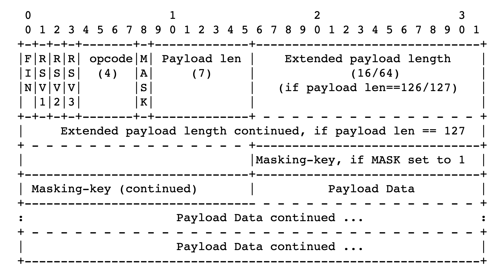

WebSocket は [RFC 6455](https://tools.ietf.org/html/rfc6455) で定められた仕様で、クライアント <-> サーバ間の双方向通信を可能にします。
この WebSocket で通信できるサーバーを、ライブラリを使わずに RFC にある規格をそのままコードに起こして実装してみましょう。（ハッシュ計算などの util ライブラリは使います)

約 8 年ほど前に jxck さんが [WebSocket サーバの実装とプロトコル解説](http://jxck.hatenablog.com/entry/20120725/1343174392)で同様のことをされている（というよりこれを読んで今回やろうと決意した）のですが、それを Rust でもやってみようというのが、この記事でやりたい事です。上記の記事内にある通り Node.js で実装すると標準ライブラリが勝手に行ってくれる部分があるので、あえて Rust で実装します。Rust はほぼ経験がない言語なのでもし滅茶苦茶なことを書いていたら突っ込んでいただけると助かります。（文字列の結合とかもっとうまくやれるだろと言う自覚はあります・・・）

## WebSocket の概観

実装を紹介する前にどのような手続きを書くのかざっくりと紹介します。

### コネクション

WebScokert 自体 は TCP 上に構築されます。
WebSocket としての接続要求はクライアントが HTTP で行い、opening のハンドシェイクがされます。
具体的には Sec-WebSocket-Key というトークンを載せておき、サーバー側でそのトークンを使ってハッシュを作り、それを Sec-WebSocket-Accept に詰めて返すことでハンドシェイクを行います。
これによって HTTP から WebSocket に切り替わるので、Connection: Upgrade というのもヘッダに詰めて返しておきます。

### メッセージのやりとり

Upgrade されたらクライアントは WebSocket 上でメッセージを送れます。送られたメッセージは定めらたデータフレームに格納されるのでサーバーはそれをデコードすることでメッセージを読み取れます。またクライアント側もデータフレームをデコードできるので、サーバーがエンコードした値をデータフレームに詰めて返すと、クライアント側でサーバーからのメッセージを受け取る事ができます。

## 実装

それではさきほどの概観通りに実装をしていきます。

### クライアントの JS を返すエンドポイントを作る

まずはサーバーとしての基本的な機能を作っていきます。

#### クライアントコードを文字列で用意

まずはこのように /websocket に対して websocket のコネクションを張ろうとする JS コードを用意します。

```rust
let clientCode = "function () {
  const ws = new WebSocket('ws://localhost:8080/websocket', ['chat']);
  ws.onopen = function() {
    ws.send('test');
    ws.onmessage = function(message) {
      console.log(message.data);
    };"
```

### クライアント JS を返す口を用意

この JS をブラウザに渡せるエンドポイントを作りましょう。
適当なサーバーを立てます。

```rust
fn main() {
    let listener = TcpListener::bind("127.0.0.1:8080").unwrap();

    // 接続ごとにthreadを作り、その中で処理を行う
    for stream in listener.incoming() {
        thread::spawn(move || {
            let s = stream.unwrap();
            handle_client(&s);
        });
    }
}
```

この handle_client の中で接続に対しての処理を書いていきます。

```rust
let mut buf = [0; 4096];
stream.read(&mut buf).unwrap();
let mut headers = [httparse::EMPTY_HEADER; 16];
let mut req = httparse::Request::new(&mut headers);
let res = req.parse(&buf).unwrap();
req.parse(&buf).unwrap();
let path = req.path.expect("fail");
match path {
  "/" => {
    // クライアントJSを返すための処理
  }
  "/websocket" => {
    // upgrade時の処理
  }
}
```

いまは「クライアント JS を返すための処理」の中で、先ほどの JS を HTTP の body に詰めて、クライアントに返します。

```rust
let mut body =
"<html><head><title>rust web socket</title><script type='text/javascript'>(".to_string()
  + clientCode
  + ")()</script></head><body>hello world!!!!!</body></html>";
let status = "HTTP/1.1 200 OK\r\n".to_string();
let header = status + "Content-Type: text/html; charset=UTF-8\r\n\r\n";
let res = header + &body + "\r\n";
let data = res.as_bytes();
stream.write(data);
```

こうすることでクライアント側で先ほどの JS が実行できます。
ここでは JS を即時関数として埋め込むことで、定義した関数をそのまま実行できるようにしています。

これを読み込んだクライアントは

```js
new WebSocket("ws://localhost:8080/websocket", ["chat"])
```

を実行するので、`/websocket` にコネクション確立のためのリクエストが飛んできます。

### コネクションの確立

今度は 「upgrade 時の処理」 に書いていきます。

#### Sec-WebSocket-Accept の生成

コネクションを確立するためにはクライアントから送られてくる Sec-WebSocket-Key からハッシュをつくりクライアントに返します。
ハッシュは、`258EAFA5-E914-47DA-95CA-C5AB0DC85B11` という定められた文字列を結合し、その値に対して SHA1 を取り、その base64 ダイジェスト値を返さなければいけません。

```rust
let token_bytes = req
                .headers
                .iter()
                .find(|&&x| x.name == "Sec-WebSocket-Key")
                .unwrap()
                .value;
let token_bytes_str = std::str::from_utf8(token_bytes).unwrap();
let joined_token = &*(token_bytes_str.to_string() + key)
```

そして hash をとります。
ここでは Sha1 というクレートを使っています。

```rust
let mut hasher = Sha1::new();
hasher.input(joined_token.as_bytes());
let sha1_string = hasher.result_str();
```

そしてその文字を base64 にします。
この base64 関数は Hex しか取らないので、先ほどの Sha1 を Hex にします。
このとき hex というクレートを使っています。

```rust
let bytes = hex::decode(sha1_string).unwrap();
let sha1_base64 = base64::encode(bytes)
```

本来 Sha1 ライブラリが base64 を吐けばいいのですが、そうはいかないのでこのような手順をふむ必要があります。
NodeJS なら crypto で一発だったので少し苦労しました。
このあたりは [Rust でも require("crypto").createHash("sha1").update(key).digest("base64") したい](https://blog.ojisan.io/rust-buffer-from)に書きました。

#### レスポンスヘッダの作成

先ほど作った Sec-WebSocket-Accept を使ってレスポンスヘッダを作りましょう。

```sh
HTTP/1.1 101 Switching Protocols
Upgrade: websocket
Connection: Upgrade
Sec-WebSocket-Accept: hoge
```

といったヘッダを返すとコネクションを確立できます。

```rust
let header = status
+ "Upgrade: websocket
  Connection: Upgrade
  Sec-WebSocket-Accept: " + &*sha1_base64
+ "Sec-WebSocket-Protocol: chat\r\n\r\n";
```

そして返却します。

```rust
let data = header.as_bytes();
stream.write(data)
```

これで Upgrade が完了し、WebSocket 上でデータを受け取れます。

### クライアントからデータを送る

いまクライアントは

```js
function () {
  const ws = new WebSocket('ws://localhost:8080/websocket', ['chat']);
  ws.onopen = function() {
    ws.send('test');
    ws.onmessage = function(message) {
      console.log(message.data);
    }
 }
```

を実行しました。
コネクションに成功したので、

```js
ws.send("test")
```

が実行されています。
サーバーからこの `test` を読み取ってみましょう。

サーバーで dataframe を待つために

```rust
loop {
  let mut msg_buf = [0; 1024];
  if stream.read(&mut msg_buf).is_ok() {
    // decode
　}
}
```

としてデータを待ち受けます。
こうすることで TCP を何度も貼り直さずにデータを双方向にやりとりできます。

NodeJS で実装するとここは `sever.on('data')` みたいにして自然に待ち受けれるのですが、今はそれがないので無理やり無限ループで待ち受けています。

#### データフレームから opcode をみる

データフレームは、



という形式にしたがいます。

先頭の FIN はこのフレームがデータの最後かどうかを判別します。
いまは最後ではないので 0 です。

そして次の 2-4bit 目は予約済 bit でいまは全部 0 です。
(将来的に何か入るかも？)

そして次に opcode が来ます。
これはデータの種類を表します。

- 0x0 は継続フレームを表す
- 0x1 はテキストフレームを表す
- 0x2 はバイナリフレームを表す
- 0x3 〜 0x7 は追加のデータフレーム用に予約済み
- 0x8 は接続の close を表す
- 0x9 は ping を表す
- 0xA は pong を表す
- 0xB 〜 0xF は追加の制御フレーム用に予約済み

(https://triple-underscore.github.io/RFC6455-ja.html#data-opcode)

この opcode を取り出してみましょう。

```rust
let mut msg_buf = [0; 1024];
let opcode = msg_buf[0] & 0x0f;
```

とすれば取り出せます。
msg_buf は u8[]　なのでその先頭はデータフレームの 8bit が含まれています。そしてそのなかのお尻 4bit が欲しいので、 0b00001111 を AND 演算すると opcode 取り出せます。(本当は 0bit があと 8 つ頭についていますが)

#### text を読み取る

いま 'test' という文字を送っているので、opcode は 1 であるはずです。

```rust
if opcode == 1 {
  let payload_length = (msg_buf[1] % 128) as usize;
  let mask: Vec<u8> = msg_buf[2..=5].to_vec();
  let mut payload = Vec::<u8>::with_capacity(payload_length);
  for i in 0..payload_length {
    payload.push(msg_buf[6 + i] ^ mask[i % 4]);
  }
  let payload = String::from_utf8(payload).unwrap();
  let payload = payload.trim();
}
```

では text の長さを読み取りましょう。
それは 2 つめのデータフレームの先頭 7bit に含まれています。

```rust
let payload_length = (msg_buf[1] & 0b1111110 ) as usize;
```

次の 32bit は masking key で payload の復号に使うので取得しておきます。

```rust
let mask: Vec<u8> = msg_buf[2..=5].to_vec();
```

mask 以降、つまり 6 つ目のデータフレーム以降は全て payload です。
ここから payload の長さ分だけ取得しましょう。
(Extention が含まれる可能性もあるので必要なものだけを先頭から取り出す)

```rust
for i in 0..payload_length {
  // 6は7フレーム目にデータが入っているため
  payload.push(msg_buf[6 + i] ^ mask[i % 4]);
}
```

このとき masking key を使って復号もしておきます。
復号は次のルールに従います。

> Octet i of the transformed data ("transformed-octet-i") is the XOR of
> octet i of the original data ("original-octet-i") with octet at index
> i modulo 4 of the masking key ("masking-key-octet-j"):

```sh
j                   = i MOD 4
transformed-octet-i = original-octet-i XOR masking-key-octet-j
```

つまり、

```
結果のデータ[i] ＝ 元のデータ[i] xor key [i mod 4]
```

とすることでデータを復号できます。先ほどのコードはそれを愚直に表現したものです。

(https://triple-underscore.github.io/RFC6455-ja.html#section-5.3)

そしてそのデータを出力します。

```rust
let payload = String::from_utf8(payload).unwrap();
println!("{}", payload);
```

実際にサーバーを起動してアクセスすると

```rust
cargo run

test
```

と出力されました。

### クライアントにデータを返す

データフレームに文字を詰めてクライアントに返すだけです。
websocket 接続が確立されていたら、ブラウザが勝手にそれを解釈して文字に(というより適切な opcode に)戻してくれます。ただしマスクはしません。

そこで、

- FIN:1
- OPCODE: 1
- MASK: 0
- Payload Length: 5
- Payload: 'hello'

としたフレームを作ります。

（再掲）


#### 1 フレーム目

FIN と OPCODE です。
0b10000001 となるので、 129 です。

#### 2 フレーム目

MASK と Payload len です。
MASK は今は 0 です。
Payload len は 0b0000101 で、5 です。

#### 3 フレーム目以降

文字がそのまま DataFrame に入ります。
それぞれの文字は 文字コード表を照らし合わせてみてみると、Hello は、72 101 108 108 111 です。

FYI: http://www.edu.i.hosei.ac.jp/~sigesada/kyouzai/mojicodehenkan.html

#### 返すべきデータ

つまりそれらをまとめると、
[129, 5, 72, 101, 108, 108, 111]
となります。

つまり、

```rust
stream.write(&[129, 5, 72, 101, 108, 108, 111]).unwrap();
```

とすれば、クライアントに hello と表示されます。

クライアントコードは

```js
function () {
  const ws = new WebSocket('ws://localhost:8080/websocket', ['chat']);
  ws.onopen = function() {
    ws.send('test');
    ws.onmessage = function(message) {
      console.log(message.data);
    };
```

ですので、メッセージを受け取るとコンソールに hello と文字が表示されます。

## まとめ

以上が WebSocket サーバーそのものの実装です。
opcode が 1 の場合しか扱っていないので完成系ではありませんが、基本的な箇所は実装できたと思います。

## ソースコード

https://github.com/sadnessOjisan/orusocket

## 参考にしたもの

- RFC6455
  - https://tools.ietf.org/html/rfc6455
- RFC6455 の和訳. 一部説明をそのまま拝借しました。
  - https://triple-underscore.github.io/RFC6455-ja.html
- WebSocket サーバの実装とプロトコル解説。挑戦するきっかけとなったブログです。
  - http://jxck.hatenablog.com/entry/20120725/1343174392
- [@0918nobita](https://github.com/0918nobita) さんの実装。データフレームの解釈周りのコードを参考にしました。
  - https://github.com/0918nobita/clip-studio-remote
