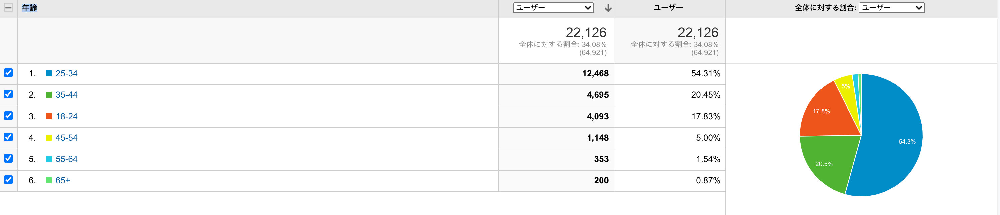

2020/06/10 から始めたこのブログの振り返りを書いていきたいと思います。
以前、毎月やっていたのですが、まあなんかめんどくさかったので辞めていました。
しかし、年が変わり、半年近く更新したという節目でもあるので、再開しようと思います。

## 書き始めた動機と書き続ける動機

もともとは色々な技術を試すためのサンドボックス、就活対策で書いていました。
これも今では変わらずこのような理由で書いています。

それに加えて今では純粋に楽しいからという理由で書いています。
日頃から Google Analytics や Search Console を見たり、はてブや Twitter でエゴサしていて、読者からの反応を見てそれに答える内容を書いて、さらにアクセス数を増やしてブログを育てるという一連のプロセスに楽しみを覚えています。

## 書く時に気をつけていること

根拠を必ず書く、参考リンクを貼り付ける、根拠がないときは根拠がないことを明示しています。

個人的に、

> ここで 設定ファイルに hoge と書きましょう。

だけで終わるような説明や例示だけをするような記事にしないようにしています。

そういう記事を見るとどうしても作者に「それ本当に意味を分かって書いている？」みたいな感情を持ってしまいます。
自分が分からないものを分かるように見せかけて書くことは良くないことだと思っているので、自分はその設定をしたことでなぜ上手くいくのかといった言及まで必ずするようにしています。
また意外と根拠まで踏み込んでいるブログや解説記事は少なく、十分に解説がされているかのように思えるトピックでも書ける内容は見つかります。
なので、積極的にそういったところに踏み込んでブログを書いていました。

また解説だけでなく実装も示すようにしていました。
実装を提示することは本当に動くのかを確かめることができる上に、読者が望んでいるものを提示できるためです。

そしてこの取り組みは 半年続けられたと思います。
サンプル実装やコードリーディングの残骸も気付いたらたくさん貯まりました。

FYI: https://github.com/ojisan-toybox

## 内容はどうしていたのか

### 自分が困ったことを調べて書く

基本のモチベーションはこれです。
ドキュメントの不備を補足したり、ドキュメントを読むための前提知識を補足したり、そういう記事が多かった気がします。

ex)

- [gatsby-plugin-netlify-cache のキャッシュが効かない](https://blog.ojisan.io/gatsby-meet-netlify-botsu)
- [stripe を使った決済機能の実装方法を学ぶ前に知っとくといい全体感](https://blog.ojisan.io/how-to-stripe)
- [NextJS で linaria を動かすために知っておくと良いこと](https://blog.ojisan.io/next-linaria-setup)

他の人にとっては困っていない内容だったりもするので、「なんでこんな内容でブログ書くの？」と言われたこともありますが、それは自分がわからなかったからです。
自分にとっては当たり前ではなかったものはちゃんと記事にして文書化していきたいと思っています。
実際そのような記事が最初から転がっていれば自分が困っていなかったからです。
そういった道を整備することを目的に書いています。

### 内部実装を書く

2020 年は勉強のためにいろんなライブラリを読んでいました。
そのメモや解説としての記事です。

ex)

- [Babel の変換処理と向き合う](https://blog.ojisan.io/babel-parse-traverse-generate)
- [ESLint の Plugin と Extend の違い](https://blog.ojisan.io/eslint-plugin-and-extend)
- [preact コードリーディング](https://blog.ojisan.io/preact-reading)

### 何かのまとめを書く

情報が散らばっていて困ったときはまとめを作るようにしていました。

ex)

- [firebase でのパスワードログイン機能の実装をやりきるための Tips](https://blog.ojisan.io/firebase-auth-ipass-login)
- [React のパフォーマンスチューニングの歴史をまとめてみた](https://blog.ojisan.io/react-re-render-history)

まとめ系を書くと大体アクセス数が増えるのでちょっとした麻薬に感じることもあります。
が、だいたい書くモチベーションは自分が公式ドキュメントを漁って困ったという体験です。
ドキュメントの全体感の解説+各 API を使ったチュートリアルみたいな記事を書いている気がします。

### やってみたを書く

先駆者が少なさそうな内容 + 新規性があれば、やってみたみたいな記事も書いていました。
ここでいう新規性は、ググって出てくるかどうかで判断しています。
また他所での成功事例を自分のところで取り込んでみたといった内容でも書いたりしています。
読者にパクリと思われないような範囲でならなんでも書くようにしています。

ex)

- [Rust で WebSocket サーバーそのものを作ってみた！](https://blog.ojisan.io/rust-websocket)
- [RFC から CBOR のデコーダーを作る](https://blog.ojisan.io/ts-cbor)
- [ブログに CSS in JS 環境下での スタイル分離リファクタリングを施してみた](https://blog.ojisan.io/s-c-refactor)

### その他

簡単な Tips やおふざけ記事などもたまには書いていました。
息抜きに書いていることが多かったです。

ex)

- [Hello World (EnterpriseEdition)](https://blog.ojisan.io/hello-world-enterprise-edition)
- [My COVID っていうクソアプリの作り方](https://blog.ojisan.io/my-covid)

## 実績値

2020/06/10 - 2020/12/31 で、82 記事書きました。

そして全体で 14 万 PV くらいでした。

その内訳を見ていきましょう。

### 読まれた記事ランキング

- [ESLint と Prettier の共存設定とその根拠について](https://blog.ojisan.io/eslint-prettier)
- [会社をやめて約 1 年プログラミングの勉強に費やしたことに対する満足と後悔](https://blog.ojisan.io/not-working-why)
- [Firebase の存在をフロントエンドから隠蔽するために](https://blog.ojisan.io/fb-nukeru)
- [JavaScript ライブラリを読むときのコツ](https://blog.ojisan.io/how-to-read-js)
- [Prettier と ESLint の組み合わせの公式推奨が変わり plugin が不要になった](https://blog.ojisan.io/prettier-eslint-cli)
- [Gatsby + TypeScript で技術ブログを書くための知見](https://blog.ojisan.io/1st-blog-stack)
- [React のコンポーネント周りの用語を整理する](https://blog.ojisan.io/react-component-words)
- [firebase でのパスワードログイン機能の実装をやりきるための Tips](https://blog.ojisan.io/firebase-auth-ipass-login)
- [preact コードリーディング](https://blog.ojisan.io/preact-reading)

懐かしい記事もポロポロ出てきますね。

この辺りは読まれた方から「助かりました」と直接声をいただくこともあり、自分でも頑張って書いたものなので、実態に合ってるなという気持ちです。

詳しい数値はこちらです。

### 読者属性

#### 年齢層

自分と同じ属性の人が一番多かったです。
もしかしたら交友関係が影響しているのかもしれないです。

#### 性別

圧倒的な男女比ですね。
Twitter のフォロワーの男女比（以前は analytics から見れた）はもっと偏っているので、僕の交友関係外の人が検索エンジンやリンク経由で来ているということなのでしょう。

### 検索流入

だいたい合計 20000 人程度の新規ユーザーを検索エンジンから獲得しています。

これは少なくとも 20000 人が何かしらの困った課題があってその解決方法を探しているうちに弊ブログにたどり着いたということですが、何かきちんと価値は提供できたのでしょうか。
気になるところです。

また日ごとに見ていくと、直近だと一日 200 人くらいの検索流入があります。
これが普通の営業日であれば大体 400 人ほど検索流入があります。

検索流入は、困っている人を助けた数だと思っていて、僕はこの数字を一番の重きに置いています。
PV やブクマ数ははてブという外的要因にかなり左右されてしまうので、検索流入数が一番健康的な指標かなと思っています。

### 検索ワード

search console で過去 6 ヶ月の結果を見てみると、

- eslint prettier 1223
- prettier eslint 570
- noopener 544
- gatsby typescript 542
- noreferrer 399
- noopener noreferrer 377
- style-loader 345
- eslint-config-prettier 327
- eslint-plugin-prettier 267
- css-loader 223
- prettier 設定 142
- ts-ignore 126
- slay the spire 123
- gatsby ブログ 123
- preact 118
- fish export 112
- eslint 106
- eslint prettier 競合 106
- vercel 環境変数 102
- @ts-ignore 98
- eslint extends 95
- prettier 92
- prettier-eslint 88
- sadnessojisan 87
- noreferrer noopener 85
- gatsby blog 83
- react form 79
- fish config 67
- eslint plugin 65
- fish 設定 64
- css loader 63
- rel="noopener noreferrer" 63
- masonry css 63
- material ui drawer 62
- next.js s3 60
- css-loader style-loader 56
- ts-jest 55
- prettier eslint 競合 54
- style-loader css-loader 52
- nextjs s3 51
- vercel env 49
- gatsbyjs typescript 47
- eslint prettier/prettier 45
- css masonry 44
- rel=noopener 42
- prettier/@typescript-eslint 42
- material ui select 42
- ts ignore 41

といった結果でした。
なんらかの調べ物をしてそうだなぁと思いました。

「eslint prettier」「gatsby typescript」などのように何らかの組み合わせで困っているようですね。
僕もよく困っているので分かります。

ちなみにこれらの検索キーワードは、読まれた記事ランキングとは異なったものが多いです。
PV の主体は検索以外での流入（特にはてなブックマーク）という背景があるためです。

### リファラ

いろいろな会社の JIRA や Conference から来ています。
**社内でこっそり作っているもののドメインから飛んでこないでください。**
下手したらインサイダー取引になっちゃう！！！！！！！！！！！

### はてなブックマーク

自分のドメインで検索するとブクマされた記事を見れます。

FYI: https://b.hatena.ne.jp/search/text?q=blog.ojisan&users=1

日頃からコメントは読ませていただいております。
意外と攻撃されていなくてちょっと嬉しいです。

## 来年の目標

### 作り直し配信します！

色々ガタがきていたり直したいところがあるのでいっそのこと全部作り直します。
年明けにするのですが、可能であれば配信しようと思います。
配信したことないのでできるか不安ですが挑戦します。
NextJS スタックに置き換えます。

### 検索流入で月 1000 は取りたい

今ある記事も時間が立つにつれて読まれなくなるので、これを満たすにはより皆が困っている内容をテーマに複数書かないといけません。
ただ確度の高い記事を書き続ければ不可能ではないと思うので頑張ります。

## おわりに

自分のドメインで自分だけで執筆するというスタイルで始めたブログですが、数字が伸びるのをみると自分の城が強くなっている感じがして楽しいです。
割と自力だけで半年で 14 万 PV 稼いだのは実はすごいことではないかと思っていたりもします。
また GA やドメイン管理の勉強にもなって良いです。
自ブログ運営がこんなに楽しいとは正直思っていませんでした。
2021 年は皆さんも自ブログ運営に取り組んでみてはどうでしょうか。

（ちなみに、blog.ojisan.io は皆さんも投稿できます。https://blog.ojisan.io/user-in-ssg-blog）
