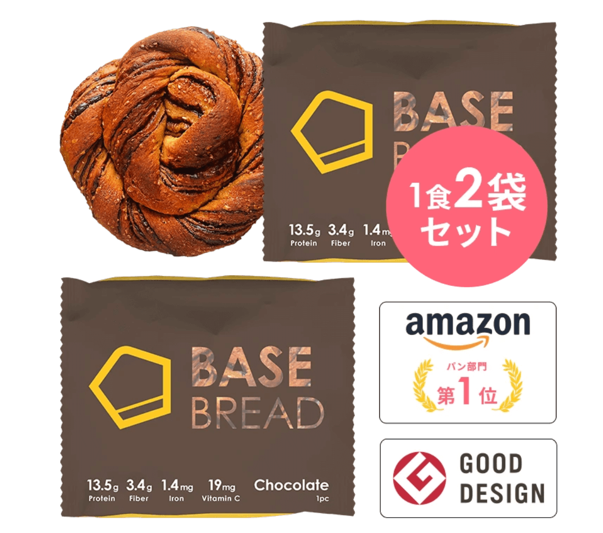
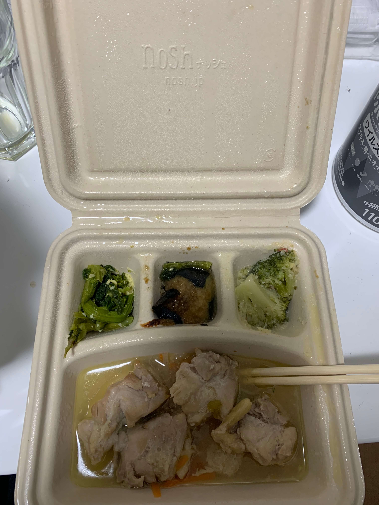

最近は食事を考えることが増えてきていろいろ試してみたので、食事周りのライフハックをまとめてみようと思います。
今年は会社をやめたり自粛で引き篭ったり、さまざまなライフスタイルの変化がありました。
特に会社をやめたことは社食を使えなかったり収入が減ったりで、食生活を見直すきっかけになりました。
ただ**私は家事ができません。**
**家事もできずお金もかけられないが健康的な食事をするためにどういうことをしたかをまとめます。**

## コロナが流行る前

だいたい 1, 2 月くらいは朝はカロリーメイト、昼はコンビニ飯、夜は外食という普通な生活をしていました。

## 緊急事態宣言

ロックダウンどうのこうのの話が出たタイミングで、カップ麺、ライスパックを Amazon で買い溜めました。
流石にそれだけだと健康が心配になったので、Amazon で買える食品を探し買いました。
自炊はできないのでレンジでチンするだけでいいものを探して、ミート 21 にたどり着きました。
マグカップに入れてレンジでチンするだけで美味しく食べれました。

FYI: https://www.amazon.co.jp/%E5%AE%AE%E5%B4%8E%E5%90%8D%E7%89%A9-%E7%84%BC%E3%81%8D%E9%B3%A5-%E9%B6%8F%E3%81%AE%E7%82%AD%E7%81%AB%E7%84%BC-100g%C3%9710%E3%83%91%E3%83%83%E3%82%AF-%E9%B3%A5%E3%81%AE%E7%82%AD%E7%81%AB%E7%84%BC/dp/B07DDC76JK

## 節約してみる

簡単なアルバイト仕事をしていたとはいえ会社をやめているのでちゃんと家計を気にしようとここで思いました。
そのとき知り合いのミニマリスト Youtuber([@y_temp4](https://twitter.com/y_temp4)) が出していたナイトルーティン動画で、カットサラダの上にサバ缶を載せるという食事を紹介していて、「これじゃん」って思ってその生活をしてみました。

値段も安いし健康にも気を使えていいなと思いました。

<iframe width="560" height="315" src="https://www.youtube.com/embed/W8-dncBoxk4" frameborder="0" allow="accelerometer; autoplay; clipboard-write; encrypted-media; gyroscope; picture-in-picture" allowfullscreen></iframe>

## 完全栄養食生活

カットサラダを買いに行くのがめんどくさくなったので、他の代替策を考えていた時に完全栄養食の存在を思い出しました。
COMP と BASE BREAD を使っている人たちが周りに居ましたのでいろいろ話を聞いてみて、とりあえず両方買っていました。

### COMP

グミ、液体、粉末を買いました。

FYI: https://www.comp.jp/

本当に体に大丈夫なのか心配でしたが、主食を COMP で置き換えたりしても特に体に不調はなかったので、COMP 生活をしました。

また、3 食全部 COMP で置き換えた人が知人にいまして、話を聞いてみたところ問題がなさそうだったので、そういう安心感もあって COMP を主食にしたりしました。

FYI: https://togetter.com/li/1247302

ただ上のリンクにある通り、本当に全てを COMP に置き換えると塩に飢えるタイミングが来るので、結局主食は別で取るようにしました。
私は松屋の牛丼のご家庭パックなどを食べていました。

また、はてブ上では「ウンコがどうなったかに関する言及がない」とありますが、私の場合は明確に減りました。
なのでやはり栄養的には少しまずい気がしたので、別で固形物を摂取すべきかなと思います。

### BASE BREAD

COMP と合わせて BASE BREAD も注文していました。

FYI: https://shop.basefood.co.jp/products/basebread

COMP だけでお腹が空いた時などにちびちび齧っていました。
いろいろアレンジができるらしいのですが、アレンジが実質自炊が必要なものだったりもしたので、バターやジャムを塗るくらいのアレンジしかしませんでした。
しかし最終的にはそれすらもめんどくさくてやらなくなりました。
何もなくても美味しく食べられます。

### いまは COMP だけにしている

BASE BREAD と COMP を比較したらどうしても COMP の方に軍配が上がりました。
BASE BREAD は結局はパンなので食べないといけないというめんどくささはあり、その点 COMP は飲むだけなので何か作業をしながらでも食事が取れるので、その辺の手軽さがあります。

また注文のタイプは液体が一番楽だったのですが、ちょうど配達員の負担がどうのこうのと言われ始めていたこともあり、重たいであろう液体はやめることにして、いまでは粉末オンリーで注文しています。

## 自炊生活

10 月くらいに、自分より生活力がないと思っていたフォロワーが「シチュー作った」みたいなツイートをしているのを見てしまって、自炊に対する危機感が湧きました。
そこで自分も自炊をしてみようと思いました。
しかしキッチンがやばいことになああっているので、冷凍食品を使ってご飯を作ってみることにしました。
こんな状態で火を付けれるわけがないですね w

### 冷凍ドリア・ラザニア

電子レンジに入れて温めるだけで美味しいドリアです。
カップに入っているので温めるだけで食べられるのが良いです。

### 冷凍カップピラフ

同じようにコンビニで買えるカップピラフも温めるだけで食べれて良いです。
セブンイレブンのバター香るエビピラフや炒め油香るチャーハンはめちゃくちゃ美味しいです。

### 冷凍チャーハン

セブンのチャーハンにハマったので、大きいチャーハンをスーパーで買うようになりました。
はい、ここで私は大きな過ちを犯しました。
そうです、皿が必要でした。
冷凍食品は確かに調理器具は不要ですが、食器は必要でした。
大急ぎで適当にニトリで皿を買ってきました。
これでチャーハンを作れるようになりました。

凍ったピラフを置いて、チンすれば熱々のピラフを食べられます。

### 冷凍パスタ

さて、皿を手に入れたのでいろいろな自炊バリエーションが生まれるようになりました。
そこで冷凍パスタを買ってみることにしました。

私が買ったのは日清 SPA 王ですが、これがめちゃくちゃよかったです。

美味しいし量も多いし、満足です。
いろいろ冷凍食材を試してこれに落ち着きました。

## 自炊の楽しさと電気調理器

自炊できるようになるとスーパーに行くのが楽しくなってきました。
10 月あたりはいろいろ冷凍食材を買ってそれを試すみたいな生活をしていました。

そんなとき、[無人島に持っていくべき調理家電ナンバーワン 『大同電鍋』](https://note.com/reitanaka/n/nb6d4cef6922a)という記事が流れてきました。
これを見て冷凍食品以外にもキッチンを使わずに自炊する方法があることを調べました。
これを買おうと思っていろいろ調べていたのですが、結局ぼくは siroka の家電を買いました。
いろいろボタンがついてたり、レシピブックがついていたのが決め手です。

ちなみにレシピブックは PDF で公開されています。

FYI: https://www.siroca.co.jp/im/sp-d121_recipe.pdf

食材をいれるだけで料理ができて良いです。
定価 26000 円くらいですが、ブラックフライデーで 12000 円で買えました。
ブラックフライデーが終わった今でも 12000 円くらいで買えそうです。

FYI: https://www.amazon.co.jp/dp/B075L99HWX/ref=sspa_dk_detail_0

こんな料理を作ってみました。

鶏肉

牛豆腐

手羽先

トマトと鶏肉

カレー

シャケ

本当はレシピブックはもっと手が混んでいて、野菜とかも入っているのですが、包丁を持っていないので包丁がいらないものだけで作っています。
野菜を買うと洗う手間もかかったりするので、いまのスタイルでいいかなと思っています。

ちなみに電気調理器で自炊できることを悟ったきっかけは他にもあり、アル中カラカラと呼ばれている Youtuber です。
なんでもかんでも炊飯器で（めちゃくちゃな）ご飯を作っていて、こんな雑いやり方でも大丈夫なのかと知れて、自分でもできそうと思いました。

<iframe width="560" height="315" src="https://www.youtube.com/embed/nhtsNSYuG94" frameborder="0" allow="accelerometer; autoplay; clipboard-write; encrypted-media; gyroscope; picture-in-picture" allowfullscreen></iframe>

あと、調理器を置いたらさらにキッチンが散らかりました。

まな板が未開封なまま置かれているのが趣深いですね。3 年以上この状態です。

## nosh

と、まあ自炊生活を楽しんでいたのですが、siroka での調理には欠点もあり、圧力調理なので全てが柔らかくなって歯応えがなくなってしまうことです。
噛みごたえのあるお肉は食べれません。
また鶏肉も 300g で 500 円近くしたりで、外食とあまり変わらないことに気付き、自炊のメリットがわからなくなりました。

そんなときに nosh を勧められました。

nosh は冷凍のお弁当のサブスクリプションサービスで、低価格で栄養価も高く美味しい冷凍弁当を定期的に届けてくれるサービスです。
解凍するだけ美味しくて栄養のあるご飯を、しかも 500 円程度で取れてこれでいいじゃんとなりました。

nosh のいいところは写真にある通りいかにも健康的なところです。
また、メニューも 70 品目から選べるので飽きないところです。

はい、みなさんも興味が湧いてきましたよね。
ちなみに**このリンクから登録すると私とあなたが 3000 円引きで使える**ので、是非とも使ってみてください。

FYI: https://nosh.jp/c/9ogpi

(うおおおお初めてブログにアフィリエイト貼った！！！！)

## 結局今はどういう生活をしているのか？

朝: クッキー（ハーベスト）

昼: COMP

夜: nosh or 買い出しついでの牛丼チェーン/家系ラーメン

牛丼チェーンや家系ラーメンは深夜でも営業しており、感染リスクを下げて食事もできるというメリットもあり、こういうルーチンにしています。

多分死ぬまでこのルーティンで行けると思います。nosh おいしい！！！！

## おわりに

たのむ！俺のアフィリエイトリンクから nosh に登録してくれ！！！！！！！！！！！！！

https://nosh.jp/c/9ogpi
