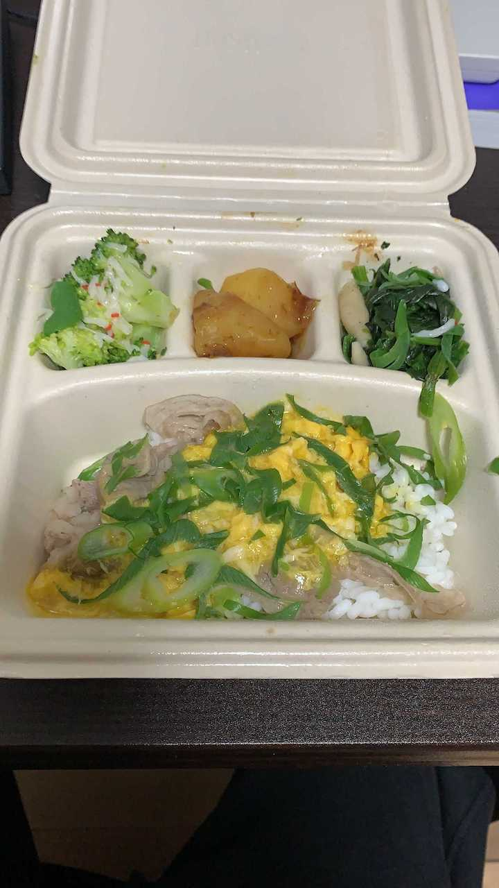
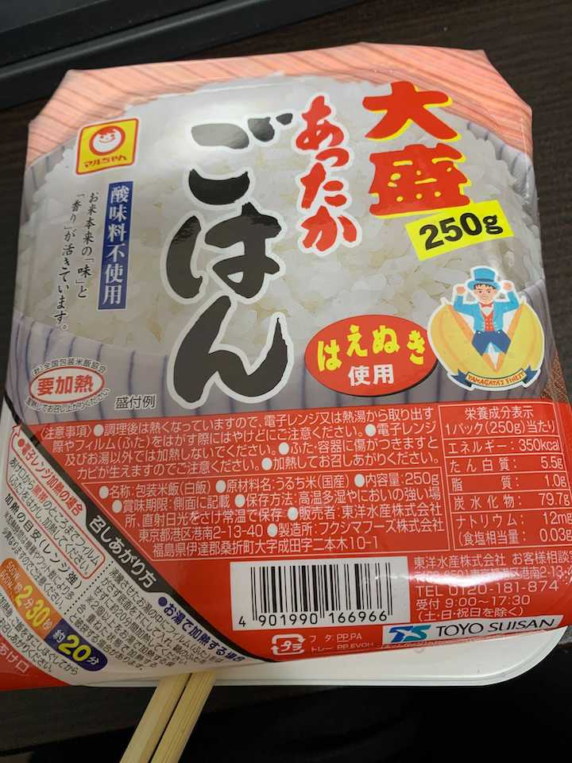

「こいつま〜たブログに友達紹介リンク貼ってやがる」「アフィリエイトの旨味を覚えやがったな」「ブロックしよ」とお思いかとは思いますが、どうか、どうか最後までお読みください。
そういう気持ちがないわけではないのですが、これは正月に一歩も外に出ずに nosh 生活をしてみたところ、そのあまりの QOL の高さに脱帽しその良さを伝えたいという純粋な想いの発露の投稿です。
正月は飲食店の営業やゴミ捨てなどの公共サービスの停止するわけですがその期間に nosh 中心の生活をしてみて、これからくるであろうロックダウン生活のお供に nosh が活躍することを察知したので、緊急投稿です。

という訳で例のリンクはこちらです。

FYI: https://nosh.jp/c/9ogpi

**なんと上のリンクから注文すると紹介キャンペーンで 3000 円引になります！なのでパスパラメータを消さず直接上のリンクからご注文くださいね！**

なんてリンクを貼ってもリテラシーの高い皆さんは買わないと思いますので、買いたくなるようにセールストークをしたいと思います。

自分のように**家事ができなくて食事へのアクセスが難しい人は要注目**です。
（ぼくがいかに家事できないかは[こちら](https://blog.ojisan.io/my-gohan-2020)を参照ください。）
nosh は引きこもりながら美味しくて暖かい食事にありつけることができます。

## nosh とはなにか

オンラインで注文し定期的に配達してくれる冷凍のお弁当です。
クール便で送られてくるので、それを受け取り冷凍、食前にレンジで解凍すれば暖かいご飯を食べられるという優れものです。

さらに 1 食 600 円程度（一番低い会員ランクでこの値段なので実際はもっと安くなっていきます）で外食と比較するとかなりリーズナブルです。
そして食事内容からしても自炊によるコストとあまり変わらない（というより安い）です。

nosh の魅力は旨い・安い以外に楽というメリットもあります。
お弁当形式なのでご家庭に食器がなくても暖かい料理を食べられます。。
なので自炊する道具屋力がない人でも簡単に暖かいご飯を食べられます。

いやぁもうとてもすばらしいですね。
という訳で例のリンクはこちらです。

FYI: https://nosh.jp/c/9ogpi

**なんと上のリンクから注文すると 3000 円引になります！なのでパスパラメータを消すとかせずに直接上のリンクからご注文くださいね！**

とまあ nosh が何かだけの説明だといまいち嬉しい点が分からないですよね。
実際に正月に nosh 生活をしてみて感じた嬉しい点を紹介しようと思います。

## nosh はゴミが臭わない

お正月はゴミ出しができず、12/28 - 1/4 の間ゴミを家に溜めることとなりました。
このとき臭いが出たら嫌だなぁと思っていたのですが nosh はその問題を見事解決してくれました。

nosh の容器はパルプモールドで撥水性があります。
そのため食後の容器の汚れは水だけでも簡単に洗い流せます。
さらにパルプなので切り取ったり折り曲げたりできて、蓋付きゴミ箱に捨てられます。
もっとも私は洗った時点で匂いが出なかったので台所に積み上げていました。
この状態で 3 日以上放置していましたが全く臭いが出ませんでした。

えぇー！こんなにきれいに汚れが落ちるのですか！？
いやぁもうとてもすばらしいですね。
という訳で例のリンクはこちらです。

FYI: https://nosh.jp/c/9ogpi

**なんと上のリンクから注文すると 3000 円引になります！！**

## 食事のラインナップが豊富で健康にも気を遣える

nosh のメニューは約 70 種あります。（といっても晩ご飯として注文するのは 50 種くらいかな）
そのためルーチンとして食べ続けたとしても飽きは来ません。

私は自炊できない身なので昨年の自粛生活はサバ缶・冷凍パスタ・冷凍ピラフなどを通して様々な食事を実践しましたがどれも 2 ヶ月ほどで飽きてしまいました。
一方で nosh は注文ごとにメニューを変えられるので飽きは来ません。

先週食べたものは、このようなものです。

### 牛肉のタイ風オイスター炒め

### 白身魚とケールのとろけるチーズがけ

### 柚子香る鰆の醤油焼き

### わさびソースのチキンソテー

### 牛肉のとろたま丼

### むきえびの黒酢あんかけ



### その他メニュー

全メニューはこちらです。

FYI: https://nosh.jp/menu

食事に飽きないのはもちろん美味しいからといった理由もあります。
それは当然、自分ではなくプロが作っているのですから当然ですよね。

僕はメニューを選ぶときは肉と魚を両方注文するようにして健康に気を使っています。
野菜はどのメニューもついてくるので健康的ですね。

様々な美味しいメニューから健康に気を遣えるのは当然食べたくなりますよね。
という訳で例のリンクはこちらです。

FYI: https://nosh.jp/c/9ogpi

**なんと上のリンクから注文すると 3000 円引になります！！**

## 一方でライスには注意が必要

きっと聡明な皆さんはここまで読んだ時点ですでに注文済みだと思います。
ただ、お手元に注文が届く前に注意しておくべきポイントがあるので共有します。

実は nosh で注文するものは原則としてライスはついてきません。
たまに丼ものはついてきますがそれも少量で、基本的にはおかずのみです。
なので白米は別途用意した方が良いと思います。
ぼくは Amazon でライスパックを買っていました。

そうすることで全ての食事を電子レンジで完結させられます。

## まとめ

nosh は

- 安い！
- 美味い！
- 楽！

の三拍子が揃った食事サービスです。

これから外出の自粛が求められるようになる中、QOL を絶やさず食を守る選択肢としていかがでしょうか。
もし、興味を持たれましたら一度お試しすることをオススメします。

FYI: https://nosh.jp/c/9ogpi
